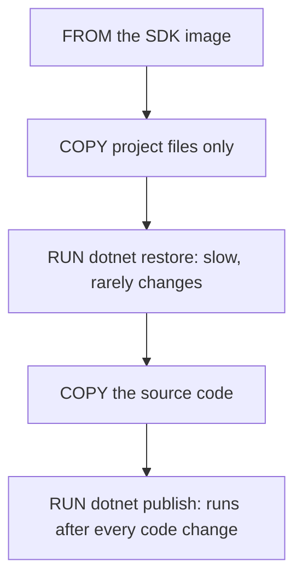

## Bạn cần biết trước

- [[devops.l1.docker-networks]] — bạn biết các container của lab tìm thấy nhau ra sao, và `scripts/up.sh` dựng image của API bằng Compose.
- [[backend.l1.hosting-and-program-cs]] — bạn biết `DonHang.Api` là một app ASP.NET Core khởi động từ `Program.cs`, được build từ một file project `.csproj`.

## Tình huống

Trên laptop, API build được vì bạn đã cài .NET SDK và chạy `dotnet build` trong editor. Image của API thì được dựng ở chỗ khác: bên trong Docker, trên một hệ thống Linux trống trơn, nơi không có gì được cài trừ khi `Dockerfile` mang nó vào. Bạn cũng sửa `Program.cs` hay một controller nhiều lần mỗi ngày, và mỗi lần sửa cần một image mới. Nếu mỗi lần build lại đều phải tải lại toàn bộ thư viện của API, thì mỗi lần sửa một dòng sẽ phải chờ hết đống tải về đó trước khi lab khởi động lại được. `DonHang.Api/Dockerfile` lấy công cụ để build từ đâu, và làm sao nó tránh phải làm lại phần chậm?

## Khái niệm cốt lõi

- .NET SDK — bộ công cụ biên dịch và publish code .NET; image `mcr.microsoft.com/dotnet/sdk:10.0` chứa sẵn chúng.
- `dotnet restore` — tải về các thư viện, gọi là package, mà các file `.csproj` của project liệt kê, với phiên bản lấy từ `Directory.Packages.props`.
- `dotnet publish` — biên dịch các project và gom app cùng các package nó dùng vào một thư mục output, sẵn sàng chạy ở nơi có cài .NET runtime, phần của .NET chạy một chương trình đã được build.

## Cơ chế hoạt động



Biên dịch code .NET cần SDK, nên một `Dockerfile` build API sẽ bắt đầu `FROM` một image có sẵn nó. Microsoft phát hành một image như vậy cho mỗi phiên bản .NET. Chạy app đã xong thì cần ít hơn nhiều: chỉ runtime, phần của .NET chạy một chương trình đã được build, không cần trình biên dịch và công cụ build. Khác biệt đó quan trọng, và bài sau sẽ dùng tới nó; bài này nói về việc build.

Bên trong image, `Dockerfile` chạy đúng các lệnh mà một lập trình viên sẽ gõ: `dotnet restore` để lấy các package, rồi `dotnet publish` để biên dịch và gom output. Kết quả không có gì riêng cho Docker. Với cùng phiên bản SDK và file source như trên máy bạn, image chạy đúng các lệnh bạn sẽ chạy ở đó và build ra cùng một app, và output đó chạy được cả bên ngoài container. Khác biệt là SDK đến từ image, không phải từ thứ được cài sẵn trên máy, nên mọi lần build dùng cùng image đều dùng cùng SDK.

Thứ tự các bước được chọn cho build cache của Docker, từ bài layer: Docker giữ kết quả của từng bước và dùng lại nó khi bước đó và mọi bước trước nó không đổi, và một khi một bước thay đổi, mọi bước sau nó đều chạy lại. Restore package thì chậm, nhưng nó chỉ phụ thuộc vào vài file được chép trước nó, vốn ít khi đổi. Source code thì đổi liên tục. Vì vậy `Dockerfile` chép các file project trước, restore, rồi mới chép phần source còn lại. Một thay đổi ở `Program.cs` làm đổi bước chép phía sau, nên các bước trước đó, kể cả bước restore chậm, được dùng lại từ cache.

## Trong hệ thống Đơn Hàng

Phần build của `DonHang.Api/Dockerfile`:

```dockerfile file=DonHang.Api/Dockerfile tag=stage-1 lines=5-17
FROM mcr.microsoft.com/dotnet/sdk:10.0 AS build
WORKDIR /src

COPY global.json Directory.Packages.props ./
COPY DonHang.Domain/DonHang.Domain.csproj DonHang.Domain/
COPY DonHang.Infrastructure/DonHang.Infrastructure.csproj DonHang.Infrastructure/
COPY DonHang.Api/DonHang.Api.csproj DonHang.Api/
RUN dotnet restore DonHang.Api/DonHang.Api.csproj

COPY DonHang.Domain/ DonHang.Domain/
COPY DonHang.Infrastructure/ DonHang.Infrastructure/
COPY DonHang.Api/ DonHang.Api/
RUN dotnet publish DonHang.Api/DonHang.Api.csproj -c Release -o /app --no-restore
```

Các bước là những instruction `FROM`, `COPY` và `RUN` bạn đã gặp trong bài layer. `FROM mcr.microsoft.com/dotnet/sdk:10.0 AS build` bắt đầu từ image .NET 10 SDK; `AS build` đặt tên cho phần này, và phần còn lại của file dùng tên đó. `WORKDIR /src` biến `/src` thành thư mục mà các bước tiếp theo làm việc trong đó. Bốn dòng `COPY` tiếp theo chỉ mang vào những gì `dotnet restore` cần: `global.json`, cho biết repository chấp nhận những phiên bản SDK nào, `Directory.Packages.props`, chứa phiên bản của mọi package, và ba file `.csproj`. `RUN dotnet restore` sau đó tải các package cho API và hai project nó dùng.

Chỉ sau đó ba dòng `COPY` mới mang các thư mục source vào, và `RUN dotnet publish` biên dịch tất cả: `-c Release` build cấu hình Release, bản đã tối ưu dành để chạy thay vì để debug, `-o /app` đặt output vào `/app`, và `--no-restore` bỏ qua bước restore đã làm rồi. File còn tiếp phía dưới với một `FROM` thứ hai, bài sau sẽ giải thích.

## Người mới hay nghĩ rằng…

- **"Nên dùng chính base image đã biên dịch app để chạy app trên production, vì như vậy bớt được các bước thừa."** → Thực ra image SDK mang theo trình biên dịch và công cụ build, những thứ API đang chạy không bao giờ dùng; image để chạy nó chỉ cần runtime và nhỏ hơn nhiều. Build bằng image này rồi chạy bằng image khác chỉ là một thay đổi nhỏ trong `Dockerfile`. Bạn sẽ nhận ra khi một image được build và chạy trên SDK lớn gấp mấy lần mức cần thiết, và mỗi máy mới đều phải tải toàn bộ nó.
- **"Chép cả cây source trước rồi mới restore package thì đơn giản hơn và build lại cũng nhanh y như vậy."** → Thực ra khi đó mọi thay đổi code đều làm đổi bước chép, và mọi bước sau nó, kể cả bước restore chậm, đều chạy lại. Chỉ chép các file project trước giúp bước restore nằm trong cache cho tới khi một package thật sự thay đổi. Bạn sẽ nhận ra khi một thay đổi một dòng ở `Program.cs` khiến lần build tải lại mọi package.

## Thử ngay (3 phút)

Khi lab đang chạy, từ thư mục gốc của repository, trong một terminal trên chính máy bạn:

1. Chạy `docker compose build api` và xem các bước `build`, đánh số từ `1/11` tới `11/11`.
2. Thêm một dòng trống vào cuối `DonHang.Api/Program.cs` rồi chạy lại `docker compose build api`.
3. Hoàn tác thay đổi bằng `git checkout -- DonHang.Api/Program.cs` rồi chạy `docker compose build api` thêm một lần nữa, để image của lab khớp lại với repository.

Kết quả mong đợi: 1 — vì `scripts/up.sh` đã dựng image này khi lab khởi động, các bước `2/11` tới `11/11` được đánh dấu `CACHED` (ví dụ `=> CACHED [api build  7/11] RUN dotnet restore ...`); bước 1, dòng `FROM`, được dùng lại nhưng không được đánh dấu `CACHED`. Các bước của một phần thứ hai, tên `final`, cũng hiện ra; bài sau sẽ nói về chúng. 2 — các bước tới `9/11`, `COPY DonHang.Infrastructure/ ...`, là `CACHED`, kể cả `dotnet restore`; bước `10/11`, `COPY DonHang.Api/ DonHang.Api/`, và bước `11/11`, `RUN dotnet publish ...`, chạy lại. Bước `final` cuối cùng cũng chạy lại; bài sau sẽ giải thích vì sao. 3 — mọi thứ lại là `CACHED`: Docker vẫn giữ kết quả của lần build đầu, và `Program.cs` giờ khớp lại với lần build đó, nên chúng được dùng lại. Cũng vì lý do đó, nếu bạn làm lại bài tập này, bước 2 có thể cũng hiện mọi thứ là `CACHED`.

Giả sử ở bước 2 bạn thêm một package vào `DonHang.Api/DonHang.Api.csproj` thay vì sửa `Program.cs`. Những bước nào sẽ chạy lại, và vì sao?

<details><summary>Gợi ý đáp án</summary>

Bước `6/11`, `COPY DonHang.Api/DonHang.Api.csproj ...`, sẽ chép một file đã đổi, nên nó trượt cache, và mọi bước sau nó cũng vậy: `dotnet restore` sẽ tải lại package, source sẽ được chép lại và `dotnet publish` sẽ chạy. Các bước 1 tới 5 vẫn được dùng lại. Đó là cái giá của một thay đổi package, và chỉ phải trả khi một file project thật sự thay đổi.

</details>

## Liên hệ

- [[devops.l1.dockerfile-and-layers]] — cache layer mà thứ tự các bước này được thiết kế cho.
- [[devops.l1.multi-stage-builds]] — `FROM` thứ hai, thứ chạy API đã build mà không cần SDK.
- [[backend.l1.hosting-and-program-cs]] — app mà `dotnet publish` biên dịch.

## Tóm tắt 5 dòng

1. Build API cần .NET SDK, nên `Dockerfile` của nó bắt đầu bằng `FROM mcr.microsoft.com/dotnet/sdk:10.0`.
2. Bên trong image, nó chạy đúng những gì lập trình viên sẽ chạy: `dotnet restore`, rồi `dotnet publish -c Release -o /app`.
3. Cùng phiên bản SDK và source sẽ cho ra cùng app như trên máy bạn, và app đó chạy được cả ngoài container.
4. File project được chép và restore trước source, nên thay đổi code dùng lại được bước restore chậm từ cache.
5. Một thay đổi chỉ ở code không bao giờ khiến `dotnet restore` chạy lại; thay đổi một file được chép trước nó thì có.
