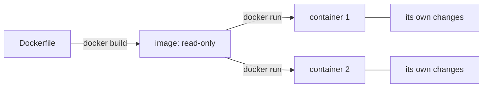

## Before you start

- [[devops.l1.why-not-deploy-by-hand]] — you know a deploy should follow a written definition of what the target needs, and that the lab keeps one in a `Dockerfile`.
- [[foundation.l1.program-to-process]] — you know a program is a file on disk and a process is one run of it, and that two runs of the same file do not see each other's memory.

## The situation

You have been calling them "parts of the lab": the lab box, the database, Caddy, the API, the app. Run `docker ps` and Docker lists them as five running things, each with a name and, next to it, something it calls an image. Two of them, `donhang-web` and `donhang-app-web`, show the same image, `caddy:2.10.0`, yet one forwards `/api/v1/*` to the API on port `8080` and the other serves the Flutter app on `8081`. How can one image be the source of two different running servers, and is the lab box you have been SSH-ing into an image or a container?

## Core concepts

- **image** — a read-only template, a set of files plus a few settings such as which command to start, built once from a `Dockerfile`.
- **container** — one running instance of an image, with its own processes and its own changes on top of the image's files.
- `docker build` and `docker run` — the commands that make an image from a `Dockerfile` and start a container from an image; `docker compose up`, which `scripts/up.sh` runs, builds the images that have a `Dockerfile` in the repository, fetches the ready-made ones, and starts a container for every part of the lab.

## How it works



An **image** is built once, by `docker build` from a `Dockerfile`, and never changes afterwards. It holds a complete set of files, for the lab's images the files of a small Linux system, plus a few settings, such as the command to run when something starts from it. It does not run by itself; it is a template, the way a class is a template and a program file on disk is a template.

A **container** is what you get when you start the image with `docker run`. Docker gives it the image's files to start from, runs the image's command inside it as one or more processes, and keeps any file the container creates or changes as that container's own. The image underneath stays untouched. This is the same relationship as a class and its objects, or a program and its processes: one template, any number of running copies.

So starting the same image twice gives two containers that begin identical and then go their own way. Each has its own processes, its own name and its own changes to files. Nothing one container writes appears in the other, and nothing either of them writes changes the image. Throw a container away and start a new one from the same image, and you are back to the image's files as they were built, except for any folders given to the container from outside, which a later lesson in this module covers.

## In the Đơn Hàng system

The lab box's image comes from `lab/Dockerfile`:

```dockerfile file=lab/Dockerfile tag=stage-0 lines=1-9
# The lab box: the LinuxServer OpenSSH server image plus the handful of
# command-line tools the stage-0 lessons use.
FROM lscr.io/linuxserver/openssh-server:version-10.3_p1-r1

RUN apk add --no-cache \
      openssl \
      git \
      postgresql17-client \
      procps
```

`FROM` names an existing image to start from: a small Linux with an SSH server, published by LinuxServer. `RUN apk add ...` installs the tools the lessons use: `openssl`, `git`, the Postgres client and `procps`.

In a name such as `caddy:2.10.0`, the part before the colon is the image's name and the part after it is the tag, a label that usually marks one version of that image. `docker-compose.yml` tells Compose to build this file into an image named `donhang-lab:stage-0`, and to run one container from it, named `donhang-lab`. That container is the lab box. Every learner builds the image from the same file, on the same base image, named with an exact version in `FROM`, which is the main reason every lesson's script output has matched across machines since stage 0.

The two Caddy containers show the other side. Neither has a `Dockerfile` in the repository: both start from `caddy:2.10.0`, an image Caddy publishes ready-made. `donhang-web` is given the `Caddyfile` and the `www/` folder and forwards the API; `donhang-app-web` is given the built Flutter app and a different start command, `caddy file-server`, on port `8081`. Same image, two containers, each set up differently by `docker-compose.yml`.

## Beginners often think…

- **"An image and a container are two names for the same thing."** → Actually the image is the read-only template and the container is one running copy of it. `donhang-web` and `donhang-app-web` are two containers from one image, doing two different jobs at the same time. You notice this when you remove a container, for example with `docker rm`, and `docker images` still lists its image, ready to start another.
- **"Starting a second container from the same image shares state with the first one, since they came from the same image."** → Actually each container keeps its own changes; the image they share is read-only. A file written in one container does not exist in the other. You notice this when you create a file inside one container and look for it in its sibling, and it is not there.

## Try it (3 minutes)

With the lab running, in a terminal on your own machine (not inside the lab box):

1. Run `docker images` and find `donhang-lab`, `donhang-api` and `caddy`.
2. Run `docker ps --format "{{.Names}}  {{.Image}}"` to list each running container and its image.
3. Run `docker exec donhang-web sh -c "echo hello > /tmp/note.txt"`, which runs a command inside the `donhang-web` container. Then run `docker exec donhang-app-web sh -c "cat /tmp/note.txt"`.

Expected result: 1 — images named `donhang-lab` (tag `stage-0`), `donhang-api` (tag `stage-1`, the API's image, which `scripts/up.sh` builds from `DonHang.Api/Dockerfile`) and `caddy` (tag `2.10.0`), among others. 2 — five containers: `donhang-lab`, `donhang-db`, `donhang-web`, `donhang-api` and `donhang-app-web`, with `donhang-web` and `donhang-app-web` both on `caddy:2.10.0`. 3 — the second command fails: `cat` cannot open `/tmp/note.txt`, "No such file or directory".

Both containers run the same image. Why is the file you wrote in step 3 missing from the second one?

<details><summary>Suggested answer</summary>

Because the file was written into `donhang-web`'s own changes, not into the image. The image is read-only and shared; each container keeps what it writes to itself. `donhang-app-web` started from the same image, so it has the same files the image has, but none of the files another container created later.

</details>

## Connections

- [[foundation.l1.program-to-process]] — the same template-and-running-copy relationship, for a program file and its processes.
- [[devops.l1.dockerfile-and-layers]] — how each line of a `Dockerfile` becomes part of the image.
- [[devops.l1.volumes]] — where a container keeps data that must outlive it.

## Five-line summary

1. An **image** is a read-only template of files and settings, built once from a `Dockerfile`.
2. A **container** is one running instance of an image, with its own processes and its own file changes.
3. Two containers from the same image start identical but never see each other's changes.
4. The lab box is the container `donhang-lab`, running the image built from `lab/Dockerfile`.
5. `donhang-web` and `donhang-app-web` are two containers from one image, `caddy:2.10.0`, set up differently.
