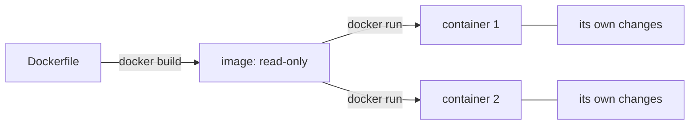

## Bạn cần biết trước

- [[devops.l1.why-not-deploy-by-hand]] — bạn biết một lần deploy nên đi theo một định nghĩa viết ra về những gì máy đích cần, và lab giữ định nghĩa đó trong một `Dockerfile`.
- [[foundation.l1.program-to-process]] — bạn biết chương trình là một file trên đĩa còn process là một lần chạy nó, và hai lần chạy cùng một file không thấy bộ nhớ của nhau.

## Tình huống

Bạn vẫn gọi chúng là "các phần của lab": lab box, database, Caddy, API, app. Chạy `docker ps` thì Docker liệt kê chúng thành năm thứ đang chạy, mỗi thứ có một cái tên và, bên cạnh, một thứ nó gọi là image. Hai trong số đó, `donhang-web` và `donhang-app-web`, hiện cùng một image, `caddy:2.10.0`, vậy mà một cái chuyển `/api/v1/*` sang API trên port `8080`, còn cái kia phục vụ app Flutter trên `8081`. Làm sao một image lại là nguồn của hai server đang chạy khác nhau, và lab box bạn vẫn SSH vào là một image hay một container?

## Khái niệm cốt lõi

- **image** — một khuôn mẫu chỉ đọc, gồm một bộ file cộng vài thiết lập như lệnh nào sẽ được khởi động, dựng một lần từ một `Dockerfile`.
- **container** — một thực thể đang chạy của một image, có các process riêng và các thay đổi riêng chồng lên file của image.
- `docker build` và `docker run` — các lệnh dựng một image từ một `Dockerfile` và khởi động một container từ một image; `docker compose up`, lệnh mà `scripts/up.sh` chạy, dựng các image có `Dockerfile` trong repository, tải về các image dựng sẵn, và khởi động một container cho mỗi phần của lab.

## Cơ chế hoạt động



Một **image** được dựng một lần, bằng `docker build` từ một `Dockerfile`, và không bao giờ thay đổi sau đó. Nó chứa một bộ file đầy đủ, với các image của lab là file của một hệ thống Linux nhỏ, cộng vài thiết lập, như lệnh sẽ chạy khi có thứ gì khởi động từ nó. Nó không tự chạy; nó là một khuôn mẫu, giống như class là một khuôn mẫu và một file chương trình trên đĩa là một khuôn mẫu.

Một **container** là thứ bạn có khi khởi động image bằng `docker run`. Docker đưa cho nó các file của image để bắt đầu, chạy lệnh của image bên trong nó thành một hay nhiều process, và giữ mọi file mà container tạo ra hay sửa đổi làm của riêng container đó. Image bên dưới vẫn nguyên vẹn. Đây là cùng mối quan hệ như giữa class và các object của nó, hay giữa chương trình và các process của nó: một khuôn mẫu, bao nhiêu bản đang chạy cũng được.

Vậy khởi động cùng một image hai lần sẽ cho hai container bắt đầu y hệt nhau rồi mỗi cái đi một đường. Mỗi cái có process riêng, tên riêng và các thay đổi file riêng. Không gì một container ghi ra xuất hiện ở container kia, và không gì chúng ghi ra làm thay đổi image. Bỏ một container đi rồi khởi động một cái mới từ cùng image, bạn quay về đúng các file của image như khi được dựng, trừ những thư mục được đưa vào container từ bên ngoài, thứ mà một bài sau trong module này sẽ nói tới.

## Trong hệ thống Đơn Hàng

Image của lab box đến từ `lab/Dockerfile`:

```dockerfile file=lab/Dockerfile tag=stage-0 lines=1-9
# The lab box: the LinuxServer OpenSSH server image plus the handful of
# command-line tools the stage-0 lessons use.
FROM lscr.io/linuxserver/openssh-server:version-10.3_p1-r1

RUN apk add --no-cache \
      openssl \
      git \
      postgresql17-client \
      procps
```

`FROM` ghi tên một image có sẵn để bắt đầu: một Linux nhỏ có sẵn SSH server, do LinuxServer phát hành. `RUN apk add ...` cài các công cụ mà các bài học dùng: `openssl`, `git`, Postgres client và `procps`.

Trong một cái tên như `caddy:2.10.0`, phần trước dấu hai chấm là tên của image, còn phần sau là tag, một nhãn thường đánh dấu một phiên bản của image đó. `docker-compose.yml` bảo Compose dựng file này thành một image tên `donhang-lab:stage-0`, và chạy một container từ nó, tên `donhang-lab`. Container đó chính là lab box. Mọi người học đều dựng image từ cùng một file, trên cùng một base image, được ghi kèm phiên bản chính xác trong `FROM`, và đó là lý do chính khiến output của các script trong mọi bài học đều khớp nhau giữa các máy từ stage 0.

Hai container Caddy cho thấy mặt còn lại. Không cái nào có `Dockerfile` trong repository: cả hai khởi động từ `caddy:2.10.0`, một image Caddy phát hành dựng sẵn. `donhang-web` được đưa `Caddyfile` và thư mục `www/` và chuyển tiếp API; `donhang-app-web` được đưa app Flutter đã build và một lệnh khởi động khác, `caddy file-server`, trên port `8081`. Cùng một image, hai container, mỗi cái được `docker-compose.yml` thiết lập khác nhau.

## Người mới hay nghĩ rằng…

- **"Image và container là hai cái tên cho cùng một thứ."** → Thực ra image là khuôn mẫu chỉ đọc còn container là một bản đang chạy của nó. `donhang-web` và `donhang-app-web` là hai container từ một image, cùng lúc làm hai việc khác nhau. Bạn sẽ nhận ra khi xóa một container, chẳng hạn bằng `docker rm`, mà `docker images` vẫn liệt kê image của nó, sẵn sàng khởi động một cái khác.
- **"Khởi động container thứ hai từ cùng image sẽ dùng chung trạng thái với container đầu, vì chúng đến từ cùng một image."** → Thực ra mỗi container giữ các thay đổi của riêng nó; image mà chúng dùng chung là chỉ đọc. Một file ghi trong container này không tồn tại trong container kia. Bạn sẽ nhận ra khi tạo một file bên trong một container rồi tìm nó ở container anh em, và nó không có ở đó.

## Thử ngay (3 phút)

Khi lab đang chạy, trong một terminal trên chính máy bạn (không phải bên trong lab box):

1. Chạy `docker images` và tìm `donhang-lab`, `donhang-api` và `caddy`.
2. Chạy `docker ps --format "{{.Names}}  {{.Image}}"` để liệt kê từng container đang chạy cùng image của nó.
3. Chạy `docker exec donhang-web sh -c "echo hello > /tmp/note.txt"`, lệnh này chạy một lệnh bên trong container `donhang-web`. Rồi chạy `docker exec donhang-app-web sh -c "cat /tmp/note.txt"`.

Kết quả mong đợi: 1 — các image tên `donhang-lab` (tag `stage-0`), `donhang-api` (tag `stage-1`, image của API, được `scripts/up.sh` dựng từ `DonHang.Api/Dockerfile`) và `caddy` (tag `2.10.0`), cùng các image khác. 2 — năm container: `donhang-lab`, `donhang-db`, `donhang-web`, `donhang-api` và `donhang-app-web`, trong đó `donhang-web` và `donhang-app-web` cùng chạy `caddy:2.10.0`. 3 — lệnh thứ hai thất bại: `cat` không mở được `/tmp/note.txt`, "No such file or directory".

Hai container chạy cùng một image. Vì sao file bạn ghi ở bước 3 lại không có trong container thứ hai?

<details><summary>Gợi ý đáp án</summary>

Vì file được ghi vào phần thay đổi riêng của `donhang-web`, không phải vào image. Image là chỉ đọc và dùng chung; mỗi container giữ những gì nó ghi cho riêng mình. `donhang-app-web` khởi động từ cùng image, nên nó có đúng các file mà image có, nhưng không có file nào mà container khác tạo ra sau đó.

</details>

## Liên hệ

- [[foundation.l1.program-to-process]] — cùng mối quan hệ khuôn mẫu và bản đang chạy, cho một file chương trình và các process của nó.
- [[devops.l1.dockerfile-and-layers]] — mỗi dòng của một `Dockerfile` trở thành một phần của image ra sao.
- [[devops.l1.volumes]] — nơi container giữ dữ liệu cần sống lâu hơn nó.

## Tóm tắt 5 dòng

1. Một **image** là khuôn mẫu chỉ đọc gồm các file và thiết lập, dựng một lần từ một `Dockerfile`.
2. Một **container** là một thực thể đang chạy của một image, có process riêng và các thay đổi file riêng.
3. Hai container từ cùng một image bắt đầu y hệt nhau nhưng không bao giờ thấy thay đổi của nhau.
4. Lab box là container `donhang-lab`, chạy image dựng từ `lab/Dockerfile`.
5. `donhang-web` và `donhang-app-web` là hai container từ một image, `caddy:2.10.0`, được thiết lập khác nhau.
