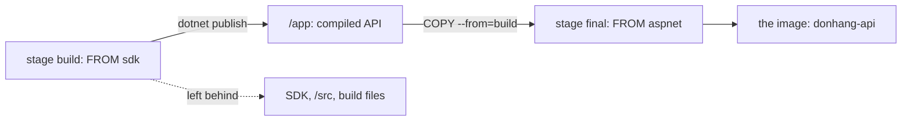

## Before you start

- [[devops.l1.dockerfile-for-dotnet]] — you know the API's `Dockerfile` builds it `FROM` the .NET SDK image with `dotnet restore` and `dotnet publish -o /app`, and that running the app needs only the runtime.

## The situation

The build part of `DonHang.Api/Dockerfile` starts from the SDK image, copies the API's three source folders into `/src`, and compiles the API into `/app`. The SDK image alone is several times larger than the finished API needs. Yet when you look for `/src` or the SDK inside the image the lab actually runs, `donhang-api:stage-1`, neither is there: only the runtime and the compiled app. The file never deletes anything. So how does an image built on the SDK end up without it?

## Core concepts

- **multi-stage build** — a `Dockerfile` with more than one `FROM`; each `FROM` starts a new stage, and by default only the last stage becomes the image.
- stage — one part of a multi-stage `Dockerfile`, from its `FROM` to the next; `AS name` gives it a name.
- `COPY --from=` — a `COPY` that takes files from an earlier stage instead of from your repository.

## How it works



A **multi-stage build** puts more than one `FROM` in the same `Dockerfile`. Each `FROM` starts a new stage from its own base image, with none of the files from the stage before. By default, only the last stage becomes the image you tag and run. Everything an earlier stage created stays behind unless a later stage asks for it.

A later stage asks with `COPY --from=`. It works like any `COPY`, but instead of copying from your repository, it copies from an earlier stage's files. So the first stage can have every heavy tool it needs to build, the last stage can start from a small base that only runs things, and one `COPY --from=` carries the result across.

The final image is smaller, so there is less to store and to download to every machine that runs it. It also has a smaller attack surface: fewer installed programs that an attacker could misuse, and fewer that need security updates. The SDK's compiler and build tools and the full source code are needed while building, but the running API never uses them, so shipping them only adds size and risk.

## In the Đơn Hàng system

The start of `DonHang.Api/Dockerfile`:

```dockerfile file=DonHang.Api/Dockerfile tag=stage-1 lines=1-5
# lesson: devops.l1.dockerfile-for-dotnet
# lesson: devops.l1.multi-stage-builds
# Stage 1 has the SDK and builds the app; stage 2 only copies the result into
# a smaller runtime image. The final image never contains the SDK or source.
FROM mcr.microsoft.com/dotnet/sdk:10.0 AS build
```

The comment says what the file does: stage 1 has the SDK and builds, stage 2 only copies the result. `AS build` names the first stage, so the second can refer to it. After its `RUN dotnet publish`, the file starts again:

```dockerfile file=DonHang.Api/Dockerfile tag=stage-1 lines=19-28
FROM mcr.microsoft.com/dotnet/aspnet:10.0 AS final
WORKDIR /app
# Npgsql probes for Kerberos/GSSAPI support at startup; without this library
# present that probe logs a scary but harmless "cannot open shared object" line.
RUN apt-get update && apt-get install -y --no-install-recommends libgssapi-krb5-2 \
    && rm -rf /var/lib/apt/lists/*
COPY --from=build /app .
EXPOSE 8080
ENV ASPNETCORE_URLS=http://+:8080
ENTRYPOINT ["dotnet", "DonHang.Api.dll"]
```

`FROM mcr.microsoft.com/dotnet/aspnet:10.0 AS final` starts the second stage from the ASP.NET Core runtime image, which can run the API but has no SDK. `WORKDIR /app` makes `/app` the current folder, so the `.` in the `COPY` below means `/app`. The `RUN apt-get ...` line installs the one extra system library from the deploy lesson; its comment only gives that lesson's reason, and its terms do not matter here. Then `COPY --from=build /app .` takes only the published output from the `build` stage. `EXPOSE 8080` records the port the API uses, `ENV ASPNETCORE_URLS=http://+:8080` tells Kestrel to listen there, and `ENTRYPOINT ["dotnet", "DonHang.Api.dll"]` is the command a container from this image starts with.

This is also why, in the last lesson, the final `COPY --from=build` step ran again after a code change: a `COPY` step runs again when the files it copies have changed, and the published output had.

## Beginners often think…

- **"Every FROM in a Dockerfile has to produce its own separate image; there's no way to combine stages into one final result."** → Actually only the last stage becomes the image; the earlier stage is a step on the way, and `COPY --from=` carries its result across. You notice this when `docker images` lists one `donhang-api` image after the build, not one per `FROM`.
- **"The SDK image and the runtime image behave identically, so which one the final container runs from doesn't matter."** → Actually the runtime image can run the API but cannot build anything, and the SDK image contains the runtime too, plus the compiler and build tools on top, which makes it several times larger. Running from the SDK would ship all of that to every machine for nothing. You notice this when `dotnet --list-sdks` inside the API's image prints nothing, because no SDK is there.

## Try it (3 minutes)

With the lab running, in a terminal on your own machine:

1. Run `docker images donhang-api` and note the size.
2. Run `docker run --rm --entrypoint sh donhang-api:stage-1 -c "dotnet --list-sdks; dotnet --list-runtimes"`. This starts a throwaway container from the API's image, running a shell instead of the API.
3. Run `docker run --rm --entrypoint sh donhang-api:stage-1 -c "ls /src; ls /app"`.

Expected result: 1 — one image, `donhang-api` with the tag `stage-1`, a little under 250 MB. 2 — no SDK lines at all, then two runtimes, `Microsoft.AspNetCore.App` and `Microsoft.NETCore.App`, both version `10.0` with a patch number. 3 — `ls` cannot access `/src` ("No such file or directory"), and `/app` lists files such as `DonHang.Api.dll`.

The `build` stage had the SDK and all the source code in `/src`. Where did they go, and what came across into the image?

<details><summary>Suggested answer</summary>

They stayed in the `build` stage, which is not part of the final image: a multi-stage build keeps only the last stage. Nothing was deleted; the `final` stage simply started from the runtime image and never had them. The only thing that crossed over is what `COPY --from=build /app .` copied, the published API in `/app`.

</details>

## Connections

- [[devops.l1.dockerfile-for-dotnet]] — the `build` stage this lesson's `final` stage copies from.
- [[devops.l1.compose-for-the-api]] — how the lab builds this image and runs it next to the database.
- [[devops.l1.why-not-deploy-by-hand]] — the extra system library the `final` stage installs, and why it is written down.

## Five-line summary

1. A **multi-stage build** has several `FROM`s; each starts a new stage, and by default the last becomes the image.
2. `COPY --from=build /app .` copies just the published API from the `build` stage into the `final` stage.
3. The API's image starts from the runtime image, so it has neither the SDK nor the source code.
4. A runtime-only image is smaller to download and has fewer installed programs an attacker could misuse.
5. The `final` stage sets the port, `ASPNETCORE_URLS`, and the start command `dotnet DonHang.Api.dll`.
