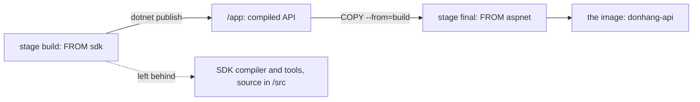

## Bạn cần biết trước

- [[devops.l1.dockerfile-for-dotnet]] — bạn biết `Dockerfile` của API build nó `FROM` image .NET SDK bằng `dotnet restore` và `dotnet publish -o /app`, và chạy app thì chỉ cần runtime.

## Tình huống

Phần build của `DonHang.Api/Dockerfile` bắt đầu từ image SDK, chép ba thư mục source của API vào `/src`, và biên dịch API vào `/app`. Riêng image SDK đã lớn gấp mấy lần mức API hoàn chỉnh cần. Vậy mà khi bạn tìm `/src` hay SDK bên trong image mà lab thực sự chạy, `donhang-api:stage-1`, chẳng thấy cái nào: chỉ có runtime và app đã biên dịch. File này không hề xóa gì. Vậy làm sao một image được dựng trên SDK lại không còn SDK?

## Khái niệm cốt lõi

- **multi-stage build** — một `Dockerfile` có nhiều hơn một `FROM`; mỗi `FROM` bắt đầu một stage mới, và mặc định chỉ stage cuối trở thành image.
- stage — một phần của `Dockerfile` multi-stage, từ `FROM` của nó tới `FROM` kế tiếp; `AS tên` đặt tên cho nó.
- `COPY --from=` — một lệnh `COPY` lấy file từ một stage trước thay vì từ repository của bạn.

## Cơ chế hoạt động



Một **multi-stage build** đặt nhiều hơn một `FROM` trong cùng một `Dockerfile`. Mỗi `FROM` bắt đầu một stage mới từ base image riêng của nó, không mang theo file nào của stage trước. Mặc định, chỉ stage cuối cùng trở thành image mà bạn gắn tag và chạy. Mọi thứ một stage trước tạo ra đều bị bỏ lại, trừ khi một stage sau yêu cầu lấy nó.

Stage sau yêu cầu bằng `COPY --from=`. Nó hoạt động như mọi `COPY`, nhưng thay vì chép từ repository của bạn, nó chép từ file của một stage trước. Vì vậy stage đầu có thể có mọi công cụ nặng nề cần để build, stage cuối có thể bắt đầu từ một base nhỏ chỉ để chạy, và một dòng `COPY --from=` mang kết quả sang.

Image cuối nhỏ hơn, nên ít thứ phải lưu và phải tải về mỗi máy chạy nó. Nó cũng có bề mặt tấn công nhỏ hơn: ít chương trình được cài mà kẻ tấn công có thể lợi dụng, và ít chương trình cần cập nhật bảo mật. Trình biên dịch, công cụ build của SDK và toàn bộ source code đều cần khi build, nhưng API đang chạy không bao giờ dùng tới, nên mang chúng theo chỉ thêm dung lượng và rủi ro.

## Trong hệ thống Đơn Hàng

Phần đầu của `DonHang.Api/Dockerfile`:

```dockerfile file=DonHang.Api/Dockerfile tag=stage-1 lines=1-5
# lesson: devops.l1.dockerfile-for-dotnet
# lesson: devops.l1.multi-stage-builds
# Stage 1 has the SDK and builds the app; stage 2 only copies the result into
# a smaller runtime image. The final image never contains the SDK or source.
FROM mcr.microsoft.com/dotnet/sdk:10.0 AS build
```

Comment nói rõ file làm gì: stage 1 có SDK và build, stage 2 chỉ chép kết quả. `AS build` đặt tên cho stage đầu, để stage thứ hai tham chiếu được. Sau dòng `RUN dotnet publish` của nó, file bắt đầu lại:

```dockerfile file=DonHang.Api/Dockerfile tag=stage-1 lines=19-28
FROM mcr.microsoft.com/dotnet/aspnet:10.0 AS final
WORKDIR /app
# Npgsql probes for Kerberos/GSSAPI support at startup; without this library
# present that probe logs a scary but harmless "cannot open shared object" line.
RUN apt-get update && apt-get install -y --no-install-recommends libgssapi-krb5-2 \
    && rm -rf /var/lib/apt/lists/*
COPY --from=build /app .
EXPOSE 8080
ENV ASPNETCORE_URLS=http://+:8080
ENTRYPOINT ["dotnet", "DonHang.Api.dll"]
```

`FROM mcr.microsoft.com/dotnet/aspnet:10.0 AS final` bắt đầu stage thứ hai từ image ASP.NET Core runtime, image chạy được API nhưng không có SDK. `WORKDIR /app` biến `/app` thành thư mục hiện tại, nên dấu `.` trong `COPY` bên dưới nghĩa là `/app`. Dòng `RUN apt-get ...` cài một thư viện hệ thống bổ sung từ bài deploy; comment của nó chỉ nêu lý do của bài đó, và các thuật ngữ trong đó không quan trọng ở đây. Rồi `COPY --from=build /app .` chỉ lấy output đã publish từ stage `build`. `EXPOSE 8080` ghi lại port mà API dùng, `ENV ASPNETCORE_URLS=http://+:8080` bảo Kestrel lắng nghe ở đó, và `ENTRYPOINT ["dotnet", "DonHang.Api.dll"]` là lệnh mà một container từ image này khởi động.

Đây cũng là lý do, ở bài trước, bước `COPY --from=build` cuối cùng chạy lại sau một thay đổi code: một bước `COPY` chạy lại khi các file nó chép đã thay đổi, và output đã publish thì đã đổi.

## Người mới hay nghĩ rằng…

- **"Mỗi FROM trong Dockerfile đều phải tạo ra một image riêng; không có cách nào gộp các stage thành một kết quả cuối cùng."** → Thực ra chỉ stage cuối trở thành image; stage trước là một bước trên đường đi, và `COPY --from=` mang kết quả của nó sang. Bạn sẽ nhận ra khi `docker images` chỉ liệt kê một image `donhang-api` sau lần build, không phải mỗi `FROM` một image.
- **"Image SDK và image runtime hoạt động y hệt nhau, nên container cuối chạy từ image nào cũng chẳng sao."** → Thực ra image runtime chạy được API nhưng không build được gì, còn image SDK chứa cả runtime, cộng thêm trình biên dịch và công cụ build, khiến nó lớn gấp mấy lần. Chạy từ SDK sẽ mang tất cả những thứ đó tới mọi máy mà chẳng để làm gì. Bạn sẽ nhận ra khi `dotnet --list-sdks` bên trong image của API không in ra gì, vì không có SDK nào ở đó.

## Thử ngay (3 phút)

Khi lab đang chạy, trong một terminal trên chính máy bạn:

1. Chạy `docker images donhang-api` và ghi lại kích thước.
2. Chạy `docker run --rm --entrypoint sh donhang-api:stage-1 -c "dotnet --list-sdks; dotnet --list-runtimes"`. Lệnh này khởi động một container dùng một lần từ image của API, chạy một shell thay vì API.
3. Chạy `docker run --rm --entrypoint sh donhang-api:stage-1 -c "ls /src; ls /app"`.

Kết quả mong đợi: 1 — một image, `donhang-api` với tag `stage-1`, dưới 250 MB một chút. 2 — không có dòng SDK nào, rồi hai runtime, `Microsoft.AspNetCore.App` và `Microsoft.NETCore.App`, cả hai phiên bản `10.0` kèm một số bản vá. 3 — `ls` không truy cập được `/src` ("No such file or directory"), và `/app` liệt kê các file như `DonHang.Api.dll`.

Stage `build` có SDK và toàn bộ source code trong `/src`. Chúng đã đi đâu, và thứ gì đã sang được image?

<details><summary>Gợi ý đáp án</summary>

Chúng ở lại stage `build`, stage không thuộc image cuối: một multi-stage build chỉ giữ stage cuối. Không có gì bị xóa; stage `final` đơn giản là bắt đầu từ image runtime và chưa bao giờ có chúng. Thứ duy nhất sang được là những gì `COPY --from=build /app .` đã chép, tức API đã publish trong `/app`.

</details>

## Liên hệ

- [[devops.l1.dockerfile-for-dotnet]] — stage `build` mà stage `final` của bài này chép từ đó.
- [[devops.l1.compose-for-the-api]] — cách lab dựng image này và chạy nó cạnh database.
- [[devops.l1.why-not-deploy-by-hand]] — thư viện hệ thống bổ sung mà stage `final` cài, và vì sao nó được viết ra.

## Tóm tắt 5 dòng

1. Một **multi-stage build** có nhiều `FROM`; mỗi `FROM` bắt đầu một stage mới, và mặc định stage cuối trở thành image.
2. `COPY --from=build /app .` chỉ chép API đã publish từ stage `build` sang stage `final`.
3. Image của API bắt đầu từ image runtime, nên nó không có cả SDK lẫn source code.
4. Image chỉ có runtime thì nhỏ hơn để tải và có ít chương trình được cài mà kẻ tấn công có thể lợi dụng.
5. Stage `final` đặt port, `ASPNETCORE_URLS`, và lệnh khởi động `dotnet DonHang.Api.dll`.
