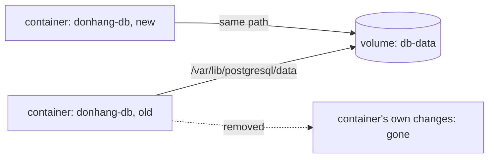

## Before you start

- [[devops.l1.dockerfile-and-layers]] — you know an image is read-only layers, and that a container keeps its own changes on top of them.

## The situation

The lab's database runs in a container, `donhang-db`, and every order you have placed through the app is stored in it. You have also learned that a container's own changes are thrown away when the container is removed, and that a fresh container starts from the image's files. The `postgres` image certainly does not contain your orders. So if someone removes `donhang-db` and Compose starts a new one, the orders should be gone. They are not. Where do they live, if not in the container?

## Core concepts

- **volume** — storage that exists independently of any one container; a container sees it as a folder, and it stays when the container is removed. Making such storage appear at a path inside a container is called mounting it.
- named volume — a volume Docker creates and manages under a name, such as `db-data`; you do not choose where on disk it is kept.
- bind mount — a separate kind of mount: a folder or file from your own machine shown inside a container at a path you choose, such as the repository at `/repo` in the lab box.

## How it works



A container's own changes live with the container. That is fine for temporary files, but not for data that must survive: a database, uploaded files, a certificate a server created for itself. A **volume** is a way to keep such data outside the container. Docker gives the container a folder at a path you choose, and everything written there goes into the volume instead of into the container's own changes.

When the container is removed, the volume stays. Start a new container with the same volume at the same path, and it finds the data exactly where the old one left it. A named volume has its own lifecycle: it is created once, used by whichever container mounts it, and stays until someone removes it.

Docker also has a second kind of mount, the bind mount, which shows a folder or file that already exists on your machine inside the container, at a path you choose. Docker does not call a bind mount a volume: it is a separate type, and `docker volume ls` does not list it. Both keep data outside the container. The difference is that a bind mount points at a path you picked on your machine, while a named volume is found by its name and Docker decides where on disk it is kept.

## In the Đơn Hàng system

The `db` service in `docker-compose.yml`:

```yaml file=docker-compose.yml tag=stage-1 lines=56-69
  db:
    image: postgres:17.6-alpine
    container_name: donhang-db
    hostname: db
    environment:
      POSTGRES_DB: donhang
      POSTGRES_USER: donhang
      POSTGRES_PASSWORD: "${POSTGRES_PASSWORD}"
      TZ: "Asia/Ho_Chi_Minh"
      PGTZ: "Asia/Ho_Chi_Minh"
    volumes:
      - ./db/schema.sql:/docker-entrypoint-initdb.d/10-schema.sql:ro
      - ./db/seed.sql:/docker-entrypoint-initdb.d/20-seed.sql:ro
      - db-data:/var/lib/postgresql/data
```

The last line of `volumes:` is the one that keeps your orders: `db-data:/var/lib/postgresql/data` mounts the named volume `db-data` at the folder where Postgres writes its data files. The two lines above it are read-only (`:ro`) bind mounts of single files, `db/schema.sql` and `db/seed.sql` from the repository, placed where the `postgres` image looks for scripts to run when it starts with an empty data folder. Because `db-data` already holds data after the first start, those scripts do not run again.

Named volumes are declared once at the bottom of the file:

```yaml file=docker-compose.yml tag=stage-1 lines=126-130
volumes:
  db-data:
  caddy-data:
  caddy-config:
  lab-config:
```

Compose creates each one the first time it is needed, prefixed with the name Compose uses for the whole lab, `donhang` (the `name:` at the top of the file), so `db-data` becomes `donhang_db-data` on your machine. The lab box (the `lab` service) uses a bind mount instead: `./:/repo:ro` shows the repository folder on your machine at `/repo`, read-only, which is why the lab box sees the same files your editor does.

## Beginners often think…

- **"Removing a container also deletes any volume it used, the same way removing a variable deletes what it pointed to."** → Actually a named volume has its own lifecycle: removing `donhang-db` leaves `donhang_db-data` in place, and the next `db` container picks up the same data. You notice this when you remove and recreate the database container, and every order is still there.
- **"A volume is just a backup Docker makes automatically; nothing needs to be declared for it to exist."** → Actually a volume is not a copy: it is the only place the data lives, and it exists because `docker-compose.yml` declares it and mounts it. Remove the volume itself, and the data is gone with it. You notice this when a volume is deleted by mistake and the database starts empty, running `schema.sql` and `seed.sql` again as if for the first time.

## Try it (3 minutes)

With the lab running, from the repository root, in a terminal on your own machine:

1. Run `docker exec donhang-db psql -U donhang -d donhang -tAc "select count(*) from orders"` and note the number. (`-tAc` makes `psql` print just the result.)
2. Run `docker compose rm -sf db`, which stops and removes the `donhang-db` container. Then run `docker volume ls`.
3. Run `docker compose up -d --wait db` to start a new database container, and repeat step 1.

Expected result: 1 — a number, the orders placed so far. 2 — `donhang-db` is removed, but `docker volume ls` still lists `donhang_db-data`. 3 — the same number as in step 1.

The container in step 3 is brand new and started from the same `postgres` image. Why does it have your orders, and why did `seed.sql` not run again?

<details><summary>Suggested answer</summary>

The orders were never in the container: Postgres wrote them to `/var/lib/postgresql/data`, which is the `db-data` volume. The new container mounted the same volume at the same path and found the data there. The `postgres` image runs the scripts in its start-up folder only when that data folder is empty, and it was not, so `schema.sql` and `seed.sql` were skipped.

</details>

## Connections

- [[devops.l1.image-vs-container]] — why a container's own changes disappear with it.
- [[devops.l1.docker-networks]] — how `api` finds `db` by name once both are running.
- [[backend.l1.migrations]] — how the schema changes after the first start, since `schema.sql` runs only once.

## Five-line summary

1. A **volume** is storage outside any one container; a container sees it as a folder, and it stays when the container is removed.
2. A named volume is managed by Docker; a bind mount, a separate kind of mount, shows a folder or file from your machine.
3. The `db` service mounts `db-data` where Postgres keeps its data, so removing the container keeps every order.
4. `schema.sql` and `seed.sql` run only when that data folder is empty, which is only on the very first start.
5. The lab box's `./:/repo:ro` is a bind mount: your repository folder, shown read-only inside the container.
