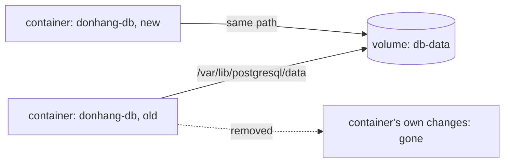

## Bạn cần biết trước

- [[devops.l1.dockerfile-and-layers]] — bạn biết một image là các layer chỉ đọc, và một container giữ các thay đổi riêng của nó chồng lên trên.

## Tình huống

Database của lab chạy trong một container, `donhang-db`, và mọi đơn hàng bạn đã đặt qua app đều được lưu trong đó. Bạn cũng đã học rằng các thay đổi riêng của một container bị vứt bỏ khi container bị xóa, và một container mới bắt đầu từ các file của image. Image `postgres` chắc chắn không chứa đơn hàng của bạn. Vậy nếu ai đó xóa `donhang-db` và Compose khởi động một cái mới, lẽ ra các đơn hàng phải mất. Thế mà không. Chúng sống ở đâu, nếu không phải trong container?

## Khái niệm cốt lõi

- **volume** — bộ nhớ tồn tại độc lập với bất kỳ container nào; container thấy nó như một thư mục, và nó vẫn còn khi container bị xóa. Việc làm cho bộ nhớ như vậy xuất hiện tại một đường dẫn bên trong container được gọi là mount nó.
- named volume — một volume do Docker tạo và quản lý theo một cái tên, như `db-data`; bạn không chọn nó được giữ ở đâu trên đĩa.
- bind mount — một loại mount riêng: một thư mục hay file trên chính máy bạn được hiện ra bên trong container tại một đường dẫn bạn chọn, như repository tại `/repo` trong lab box.

## Cơ chế hoạt động



Các thay đổi riêng của một container sống cùng container đó. Điều này ổn với file tạm, nhưng không ổn với dữ liệu phải sống sót: một database, các file được tải lên, một chứng chỉ mà server tự tạo cho mình. Một **volume** là cách giữ dữ liệu như vậy bên ngoài container. Docker đưa cho container một thư mục tại đường dẫn bạn chọn, và mọi thứ ghi vào đó đi vào volume thay vì vào phần thay đổi riêng của container.

Khi container bị xóa, volume vẫn còn. Khởi động một container mới với cùng volume tại cùng đường dẫn, nó sẽ thấy dữ liệu đúng chỗ container cũ để lại. Một named volume có vòng đời riêng: nó được tạo một lần, được container nào mount nó dùng, và còn đó cho tới khi có người xóa nó.

Docker còn có một loại mount thứ hai, bind mount, hiện một thư mục hay file đã có sẵn trên máy bạn bên trong container, tại một đường dẫn bạn chọn. Docker không gọi bind mount là volume: nó là một loại riêng, và `docker volume ls` không liệt kê nó. Cả hai đều giữ dữ liệu bên ngoài container. Khác biệt là bind mount trỏ tới một đường dẫn bạn chọn trên máy mình, còn named volume được tìm theo tên và Docker tự quyết nó được giữ ở đâu trên đĩa.

## Trong hệ thống Đơn Hàng

Service `db` trong `docker-compose.yml`:

```yaml file=docker-compose.yml tag=stage-1 lines=56-69
  db:
    image: postgres:17.6-alpine
    container_name: donhang-db
    hostname: db
    environment:
      POSTGRES_DB: donhang
      POSTGRES_USER: donhang
      POSTGRES_PASSWORD: "${POSTGRES_PASSWORD}"
      TZ: "Asia/Ho_Chi_Minh"
      PGTZ: "Asia/Ho_Chi_Minh"
    volumes:
      - ./db/schema.sql:/docker-entrypoint-initdb.d/10-schema.sql:ro
      - ./db/seed.sql:/docker-entrypoint-initdb.d/20-seed.sql:ro
      - db-data:/var/lib/postgresql/data
```

Dòng cuối của `volumes:` là dòng giữ đơn hàng của bạn: `db-data:/var/lib/postgresql/data` mount named volume `db-data` vào thư mục nơi Postgres ghi các file dữ liệu. Hai dòng phía trên là bind mount chỉ đọc (`:ro`) của từng file đơn lẻ, `db/schema.sql` và `db/seed.sql` từ repository, đặt vào chỗ mà image `postgres` tìm các script để chạy khi nó khởi động với một thư mục dữ liệu trống. Vì `db-data` đã chứa dữ liệu sau lần khởi động đầu, các script đó không chạy lại nữa.

Các named volume được khai báo một lần ở cuối file:

```yaml file=docker-compose.yml tag=stage-1 lines=126-130
volumes:
  db-data:
  caddy-data:
  caddy-config:
  lab-config:
```

Compose tạo mỗi volume vào lần đầu tiên cần tới, thêm tiền tố là cái tên Compose dùng cho cả lab, `donhang` (dòng `name:` ở đầu file), nên `db-data` trở thành `donhang_db-data` trên máy bạn. Lab box (service `lab`) thì dùng bind mount: `./:/repo:ro` hiện thư mục repository trên máy bạn tại `/repo`, chỉ đọc, đó là lý do lab box thấy đúng các file mà editor của bạn thấy.

## Người mới hay nghĩ rằng…

- **"Xóa một container cũng xóa luôn mọi volume nó đã dùng, giống như xóa một biến là xóa thứ nó trỏ tới."** → Thực ra named volume có vòng đời riêng: xóa `donhang-db` vẫn để nguyên `donhang_db-data`, và container `db` kế tiếp nhận lại đúng dữ liệu đó. Bạn sẽ nhận ra khi xóa rồi tạo lại container database, và mọi đơn hàng vẫn còn nguyên.
- **"Volume chỉ là bản sao lưu Docker tự động tạo; không cần khai báo gì nó cũng tồn tại."** → Thực ra volume không phải bản sao: nó là nơi duy nhất dữ liệu sống, và nó tồn tại vì `docker-compose.yml` khai báo và mount nó. Xóa chính volume đi thì dữ liệu mất theo. Bạn sẽ nhận ra khi một volume bị xóa nhầm và database khởi động trống trơn, chạy lại `schema.sql` và `seed.sql` như thể lần đầu.

## Thử ngay (3 phút)

Khi lab đang chạy, từ thư mục gốc của repository, trong một terminal trên chính máy bạn:

1. Chạy `docker exec donhang-db psql -U donhang -d donhang -tAc "select count(*) from orders"` và ghi lại con số. (`-tAc` khiến `psql` chỉ in ra kết quả.)
2. Chạy `docker compose rm -sf db`, lệnh này dừng và xóa container `donhang-db`. Rồi chạy `docker volume ls`.
3. Chạy `docker compose up -d --wait db` để khởi động một container database mới, rồi lặp lại bước 1.

Kết quả mong đợi: 1 — một con số, số đơn đã đặt tới giờ. 2 — `donhang-db` đã bị xóa, nhưng `docker volume ls` vẫn liệt kê `donhang_db-data`. 3 — đúng con số ở bước 1.

Container ở bước 3 hoàn toàn mới và khởi động từ cùng image `postgres`. Vì sao nó có đơn hàng của bạn, và vì sao `seed.sql` không chạy lại?

<details><summary>Gợi ý đáp án</summary>

Các đơn hàng chưa bao giờ nằm trong container: Postgres ghi chúng vào `/var/lib/postgresql/data`, tức volume `db-data`. Container mới mount cùng volume đó tại cùng đường dẫn và tìm thấy dữ liệu ở đó. Image `postgres` chỉ chạy các script trong thư mục khởi động khi thư mục dữ liệu trống, mà nó không trống, nên `schema.sql` và `seed.sql` bị bỏ qua.

</details>

## Liên hệ

- [[devops.l1.image-vs-container]] — vì sao các thay đổi riêng của container biến mất cùng nó.
- [[devops.l1.docker-networks]] — cách `api` tìm thấy `db` theo tên khi cả hai đang chạy.
- [[backend.l1.migrations]] — schema thay đổi thế nào sau lần khởi động đầu, vì `schema.sql` chỉ chạy một lần.

## Tóm tắt 5 dòng

1. Một **volume** là bộ nhớ nằm ngoài mọi container; container thấy nó như một thư mục, và nó còn lại khi container bị xóa.
2. Named volume do Docker quản lý; bind mount, một loại mount riêng, hiện một thư mục hay file trên máy bạn.
3. Service `db` mount `db-data` vào chỗ Postgres giữ dữ liệu, nên xóa container vẫn giữ được mọi đơn hàng.
4. `schema.sql` và `seed.sql` chỉ chạy khi thư mục dữ liệu đó trống, như ở lần khởi động đầu hoặc sau khi volume bị xóa.
5. `./:/repo:ro` của lab box là một bind mount: thư mục repository của bạn, hiện ra dạng chỉ đọc bên trong container.
