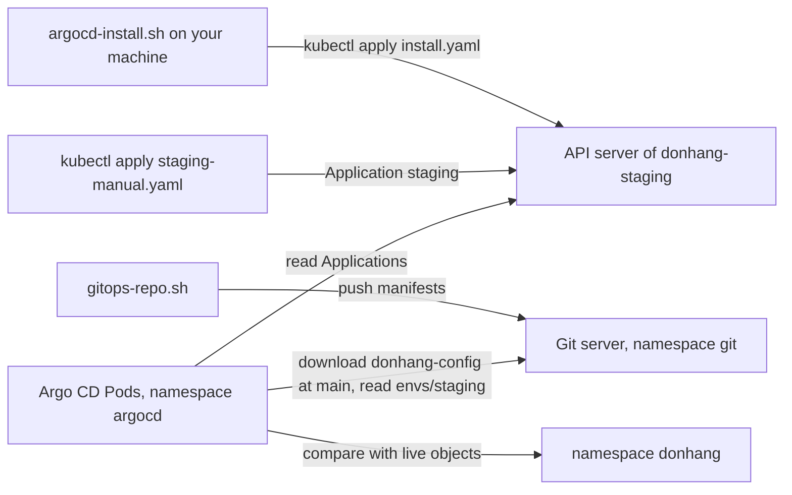

## Before you start

- [[devops.l3.pull-based-deployment]] — you know GitOps runs an agent inside the cluster that pulls the desired state from Git and applies it.
- [[devops.l3.one-state-per-environment]] — you know `tofu-environments.sh` creates the cluster `donhang-staging` with its namespace `donhang`, while production is only planned.
- [[k8s.l1.namespaces]] — you know a namespace groups objects inside one cluster, and that kubectl picks one with `-n`.

## The situation

At stage-3 the cluster `donhang-staging` exists: OpenTofu created it and its namespace `donhang`. The manifests staging should run sit in `deploy/gitops/config-repo/envs/staging`, next to a folder for production. You have chosen pull, so an agent inside the cluster should read them from Git.

Two things are missing. Nothing runs inside `donhang-staging` that could pull. And an agent that could would still need to know which repository to read, which folder of it, and which namespace those files belong in. Pointed at the whole repository, it could not tell staging's files from production's. How does the agent get into the cluster, and where do you write down which folder goes where?

## Core concepts

- **Argo CD** — a GitOps agent that runs as Pods inside a cluster, compares the manifests in a Git repository with the live objects, and applies them; Đơn Hàng runs version 3.1 in the namespace `argocd` of `donhang-staging`.
- **Application (Argo CD)** — an object Argo CD adds to the API server that names a source (a repository URL, a revision such as the branch `main` or a commit, and a folder) and a destination (a cluster and a namespace).
- **config repository** — a Git repository that holds only the manifests saying what each environment runs, kept apart from the application's source code; Đơn Hàng's is `donhang-config`.

## How it works



Start at `argocd-install.sh`. Argo CD cannot be the one that installs itself: before it runs, nothing in the cluster could apply it. So the script does that first step from your machine, the way `deploy.sh` did, with `kubectl apply` on `deploy/argocd/install.yaml`. That file is a copy of the install manifest the Argo CD project publishes, one YAML file holding all of Argo CD's objects, pinned at 3.1.16. To upgrade, you replace the copy and run the script again.

The install manifest creates Argo CD's Pods in `argocd`, the node "Argo CD Pods" in the diagram. It also adds new kinds of objects to the API server: `Application` becomes a kind stored like `Deployment`, so you write one in YAML and `kubectl apply` it. How a new kind gets added belongs to a later module.

Next, `gitops-repo.sh` starts a Git server in the namespace `git` and pushes the config repository to it, so the lab needs no account on an outside service.

In the situation above, "which folder goes where" is written in the Application `staging`, which you create with `kubectl apply` on `staging-manual.yaml`. Its source is `envs/staging` of `donhang-config` on branch `main`. Its destination is the cluster Argo CD runs in, namespace `donhang`. Argo CD's Pods read the Application from the API server, download a copy of the repository at `main` from the Git server, read the manifests in `envs/staging`, and compare them with the live objects in `donhang`.

Whether Argo CD also applies them by itself is set in the Application; `staging-manual.yaml` leaves that out, so for now it only compares. The production folder sits in the same repository, but no Application points at it, so nothing in staging is compared with it.

## In the Đơn Hàng system

The script that puts Argo CD into `donhang-staging`:

```bash file=scripts/devops/argocd-install.sh tag=stage-3 lines=9-28
# lesson: devops.l3.argo-cd-applications
# Argo CD cannot install itself: this script applies it, from the copy of its
# install manifest in deploy/argocd/ (version 3.1.16). Running it again with a
# changed copy is how Argo CD is upgraded.
echo "== Argo CD into the namespace argocd"
kubectl create namespace argocd --dry-run=client -o yaml | kubectl apply -f - -o name
# One line per kind of object, with how many of that kind the manifest holds.
kubectl apply -n argocd -f deploy/argocd/install.yaml -o name | sed -E 's#/.*##' | sort | uniq -c
kubectl rollout status deployment --namespace argocd --timeout=600s >/dev/null
kubectl rollout status statefulset/argocd-application-controller -n argocd --timeout=600s >/dev/null
echo

echo "== what runs it"
kubectl get deployments,statefulsets -n argocd
echo

# Applying it added kinds of objects the API server did not know before;
# kubectl now reads and applies an Application like a Deployment.
echo "== the kinds of objects Argo CD added"
kubectl api-resources --api-group=argoproj.io
```

```text output=true
== Argo CD into the namespace argocd
namespace/argocd
...
      3 customresourcedefinition.apiextensions.k8s.io
      6 deployment.apps
...
== what runs it
NAME                                               READY   UP-TO-DATE   AVAILABLE   AGE
deployment.apps/argocd-applicationset-controller   1/1     1            1           ...
deployment.apps/argocd-dex-server                  1/1     1            1           ...
deployment.apps/argocd-notifications-controller    1/1     1            1           ...
deployment.apps/argocd-redis                       1/1     1            1           ...
deployment.apps/argocd-repo-server                 1/1     1            1           ...
deployment.apps/argocd-server                      1/1     1            1           ...

NAME                                             READY   AGE
statefulset.apps/argocd-application-controller   1/1     ...

== the kinds of objects Argo CD added
NAME              SHORTNAMES         APIVERSION             NAMESPACED   KIND
applications      app,apps           argoproj.io/v1alpha1   true         Application
applicationsets   appset,appsets     argoproj.io/v1alpha1   true         ApplicationSet
appprojects       appproj,appprojs   argoproj.io/v1alpha1   true         AppProject
```

Line 7, above the excerpt, makes every `kubectl` in the script add `--context kind-donhang-staging`, so it reaches `donhang-staging` whatever cluster kubectl currently points at; kind names each cluster's context `kind-` plus the cluster name. Line 14 creates the namespace `argocd` in a way that also succeeds when it already exists. Line 16 is the whole install: one `kubectl apply` of the pinned copy into `argocd`; lines 17–18 wait until its Pods are ready.

The middle of the output is what Argo CD is: six Deployments plus `argocd-application-controller`, which another kind of object (`statefulset`) keeps running the way a Deployment does. Among them, `argocd-repo-server` reads repositories and `argocd-application-controller` compares them with the live objects. The three `customresourcedefinition` objects add the three kinds at the bottom; how belongs to a later module, and this module uses only `Application`.

The Application this lesson applies:

```yaml file=deploy/gitops/lessons/staging-manual.yaml tag=stage-3 lines=1-20
# lesson: devops.l3.argo-cd-applications
# An Argo CD Application: where to read manifests (source) and where to apply
# them (destination). The source is the folder envs/staging of the config
# repository on the Git server inside the cluster, at its newest commit on
# main; the destination is this same cluster, namespace donhang. No sync
# policy: Argo CD only compares, and syncs when someone asks.
apiVersion: argoproj.io/v1alpha1
kind: Application
metadata:
  name: staging
  namespace: argocd
spec:
  project: default
  source:
    repoURL: http://gitea.git.svc:3000/donhang/donhang-config.git
    targetRevision: main
    path: envs/staging
  destination:
    server: https://kubernetes.default.svc
    namespace: donhang
```

Lines 5–6 say no field here makes Argo CD apply the folder's manifests by itself: it only compares, and applies them when someone asks; how to ask comes in a later lesson. Lines 10–11: the Application itself lives in `argocd`, not in `donhang`, because by default Argo CD reads Applications only from its own namespace. Line 13 you leave at `default`, which Argo CD creates for you. Lines 15–17 are the source: the repository at `gitea.git.svc`, the Service `gitea` of the Git server in the namespace `git`, branch `main`, folder `envs/staging`. Lines 19–20 are the destination: `kubernetes.default.svc` is the API server's address seen from inside the cluster, so Argo CD deploys into the cluster it runs in, namespace `donhang`.

Outside these excerpts, `deploy/gitops/git-server.yaml` runs one Git server Pod, whose repositories are deleted with the Pod. `gitops-repo.sh` applies it, then pushes `envs/` and `apps/staging.yaml` (used in a later lesson) from `deploy/gitops/config-repo` as the first commit of `donhang-config`. The repository is public, so Argo CD reads it without credentials. The file list the script prints shows only `.yaml` files: no `src/`, no Dockerfile.

## Seniors often assume…

- **"Argo CD builds the images from the application's source code."** → Actually Argo CD only reads manifests and applies them; images are built and pushed by CI, and a manifest names one by its tag. You notice this when the file list `gitops-repo.sh` prints for `donhang-config` shows only `.yaml` files, whose `image:` lines name images already in a registry, such as the `donhang-api` image CI pushed.
- **"Argo CD runs on the developer's machine and connects to the cluster, like kubectl."** → Actually it runs as Pods inside `donhang-staging`; your machine only applied it once. You notice this when the Application's destination is `kubernetes.default.svc` and its repository is `gitea.git.svc`, names that only resolve from inside the cluster.
- **"An Application is a running program, like a Deployment's Pods."** → Actually it is a record in the API server that Argo CD's own Pods read; nothing runs per Application. You notice this when `kubectl get applications -n argocd` lists `staging` while `kubectl get pods -n argocd` shows no Pod named after it.

## Try it (3 minutes)

In the `don-hang` repository folder, if you have not yet, run `scripts/devops/argocd-install.sh`, then `scripts/devops/gitops-repo.sh`; this setup can take longer than three minutes the first time. Both scripts target `donhang-staging` themselves, so you need not switch context first. Then:

1. Run `kubectl --context kind-donhang-staging apply -f deploy/gitops/lessons/staging-manual.yaml -o name`.
2. Run `kubectl --context kind-donhang-staging get applications -n argocd`, then `kubectl --context kind-donhang-staging get pods -n argocd`.

Expected result: step 1 prints `application.argoproj.io/staging`. In step 2 the first command lists one row named `staging`; ignore its other columns until the next lesson. The second lists only Pods whose names start with `argocd-`, none named `staging`.

## Connections

- [[devops.l3.pull-based-deployment]] — the model this lesson installs: Argo CD is the agent inside the cluster.
- [[devops.l3.remote-state-and-locking]] — the other half of the same cluster: OpenTofu's shared state covers what creates `donhang-staging`, Argo CD what runs inside it.
- [[devops.l2.cutting-a-release]] — where the images come from: a release builds and pushes them, and the config repository only names them.
- [[devops.l3.synced-versus-healthy]] — next: reading what Argo CD reports about the Application `staging`.

## Five-line summary

1. Argo CD runs inside the cluster, and an Application, applied with kubectl, tells it which repository folder goes into which namespace.
2. Argo CD cannot install itself: `argocd-install.sh` applies a pinned copy of its install manifest, and upgrading means changing that copy.
3. Installing Argo CD adds new kinds of objects, such as `Application`, which kubectl reads and applies like a Deployment.
4. `staging-manual.yaml` maps `envs/staging` of the config repository, branch `main`, to the namespace `donhang` of the same cluster.
5. The config repository holds only manifests and lives on a Git server inside `donhang-staging`, so the lab needs no outside account.
