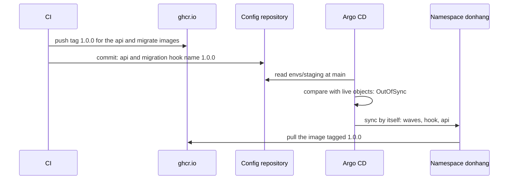

## Before you start

- [[devops.l3.ordering-a-sync]] — you know one sync of `envs/staging` runs the database, then the migration hook, then the api, ordered by sync waves.
- [[devops.l2.tagging-images-by-commit]] — you know each image CI pushes is tagged `sha-` plus its commit id, and that Đơn Hàng never pushes `latest`.
- [[devops.l2.pushing-images-from-ci]] — you know only green commits on `master` reach `ghcr.io`, and that nothing is rebuilt on the way.

## The situation

The images for version `1.0.0` are in `ghcr.io`: `release.yml`, the workflow that runs when a version is released, gave the images CI had already tested a second tag, `1.0.0`. Staging still runs the `sha-` tag written in `envs/staging/api.yaml`. In the k8s track you would edit the manifest and run kubectl yourself.

Here Argo CD applies the folder, but the Application from `staging-manual.yaml` has no sync policy. Once someone commits the new tag to `envs/staging`, it reports `OutOfSync` and waits until someone asks for a sync, which again means a command against the cluster, run with credentials that can change it. How does `1.0.0` reach staging without anyone running a command against the cluster?

## Core concepts

- **automated sync (Argo CD)** — a sync policy, written as `syncPolicy.automated` in an Application, under which Argo CD starts a sync by itself when a change in Git, such as a new commit, leaves the manifests different from the live objects, instead of waiting for someone to ask.
- Sync policy — the field `spec.syncPolicy` of an Application; without it, as in `staging-manual.yaml`, Argo CD only compares and reports.
- Deploy commit — a commit to the config repository that changes the image tag a manifest names; in this lesson it is the only step that changes what staging runs.

## How it works



CI pushes the `1.0.0` tag first (`release.yml` adds it to images already in `ghcr.io`), so the tag exists in `ghcr.io` before anything names it. That push changes nothing in staging: Argo CD compares the config repository with the live objects and does not watch the registry.

The second arrow is the deploy. A commit to `envs/staging` changes the image tag in two files, the api in `api.yaml` and the migration hook in `migrate-hook.yaml`, so the migration that runs belongs to the same version as the api. The config repository has its own branch, `main`, separate from the source repository's `master`. At work, the CI job that pushed the image would make this commit as its last step. In the lab, `gitops-deploy.sh` makes it from your machine, because the Git server runs inside your `donhang-staging` cluster, which CI on GitHub's runners cannot reach.

Argo CD rereads the folder on its own at a regular interval, or at once when asked to refresh; a refresh only rereads Git and compares, it does not sync. Its manifests at `main` now name `1.0.0` while the live Deployment names the `sha-` tag, so the Application is `OutOfSync`. With automated sync, a difference that comes from a new commit starts a sync; no person and no pipeline asks for it. The sync is the one you know: wave 0, the migration hook with the new migrate image in wave 1, then the api in wave 2, whose rolling update starts Pods that pull `1.0.0` from `ghcr.io`.

In the situation above, the only change between staging running the `sha-` tag and staging running `1.0.0` is a commit. CI needs the right to push to the config repository, not credentials for the cluster.

## In the Đơn Hàng system

The Application with automated sync turned on:

```yaml file=deploy/gitops/lessons/staging-auto.yaml tag=stage-3 lines=1-24
# The Application of staging-manual.yaml with one addition. It has the same
# name, so applying it changes that Application instead of adding one.
apiVersion: argoproj.io/v1alpha1
kind: Application
metadata:
  name: staging
  namespace: argocd
spec:
  project: default
  source:
    repoURL: http://gitea.git.svc:3000/donhang/donhang-config.git
    targetRevision: main
    path: envs/staging
  destination:
    server: https://kubernetes.default.svc
    namespace: donhang
  # lesson: devops.l3.deploying-by-commit
  # Sync by itself whenever the folder in Git differs from the cluster, such
  # as after a commit. Changes made in the cluster are left alone (no
  # selfHeal), and objects removed from Git are left running (no prune).
  syncPolicy:
    automated:
      selfHeal: false
      prune: false
```

Lines 1–2 explain why applying this file changes the existing Application `staging` rather than adding a second one. Lines 3–16 match `staging-manual.yaml`; lines 21–24 are the addition. `automated` turns on automated sync. With `selfHeal: false` it leaves changes made in the cluster alone, and with `prune: false` it leaves running the objects removed from Git, as lines 18–20 say.

The script that deploys `1.0.0`:

```bash file=scripts/devops/gitops-deploy.sh tag=stage-3 lines=13-35
echo "== automated sync, from deploy/gitops/lessons/staging-auto.yaml"
kubectl apply -f deploy/gitops/lessons/staging-auto.yaml -o name
echo

# lesson: devops.l3.deploying-by-commit
# What CI would do after pushing the image: change the tag in the config
# repository, for the api and the migration hook alike, and push the
# commit. Argo CD sees the folder differ from the cluster and syncs.
echo "== deploy $to: one commit to envs/staging"
perl -pi -e "s/:\Q$from\E\$/:$to/" "$config_repo/envs/staging/api.yaml" "$config_repo/envs/staging/migrate-hook.yaml"
git -C "$config_repo" diff --stat
config_commit gitops-deploy.sh "Deploy api $to to staging"
app_refresh
app_wait_sync "$(config_head --verify)" >/dev/null
app_wait Synced Healthy "$(config_head --verify)"
kubectl rollout status deployment/api -n donhang --timeout=300s >/dev/null
kubectl get pods -n donhang -l app=api -o jsonpath='{range .items[*]}{.spec.containers[0].image}{"\n"}{end}' | sort | uniq -c
echo

# The cluster pulls a new tag only when a commit names it; the repository's
# history is the list of what staging was given, when, and by whom.
echo "== git log -- envs/staging"
git -C "$config_repo" log --format='%h %ad %an: %s' --date=format:'%Y-%m-%d %H:%M' -- envs/staging
```

```text output=true
== automated sync, from deploy/gitops/lessons/staging-auto.yaml
application.argoproj.io/staging

== deploy 1.0.0: one commit to envs/staging
 envs/staging/api.yaml          | 2 +-
 envs/staging/migrate-hook.yaml | 2 +-
 2 files changed, 2 insertions(+), 2 deletions(-)
staging: Synced, Healthy
      2 ghcr.io/duyan11110/donhang-api:1.0.0

== git log -- envs/staging
... ... gitops-deploy.sh: Deploy api 1.0.0 to staging
... ... gitops-repo.sh: Staging and production as Đơn Hàng runs them
```

Line 14 is the script's only `kubectl apply`, and it changes the Application, not the api. Turning on automated sync is done once; every deploy after it is only a commit, as the rest of the script shows. Line 22 replaces the `sha-` tag with `1.0.0` in both files, and line 24 commits and pushes through a helper in `scripts/lib/gitops.sh`, outside the excerpt.

Line 25 only asks Argo CD to compare now instead of at its next interval. `config_head --verify` gives the id of the commit just pushed, so lines 26–27 wait for the sync of that commit, which Argo CD starts by itself, to end `Synced` and `Healthy`. Line 28 waits for the rolling update to finish; line 29 prints each api Pod's image and counts identical lines, hence the `2`.

The last block is staging's deploy history, newest first; the first `...` hides a short commit id and the second a date and time, which change on every run. The author column holds the name each commit was made under, here the script's name, which the helper sets. Git does not check that name, so whoever can push to `envs/staging` decides what staging runs, and the repository needs the protection you would give the cluster.

## Seniors often assume…

- **"Argo CD notices a new image in the registry and deploys it by itself."** → Actually Argo CD compares the config repository with the live objects, so an image pushed under a new tag changes nothing it compares, because no manifest names that tag yet. You notice this when CI pushes a new `sha-` image after a merge and staging stays `Synced` on the old tag until a commit names the new one.
- **"GitOps still needs `kubectl apply`, only run by the pipeline instead of a person."** → Actually the pipeline's last step is a commit to the config repository, and Argo CD, inside the cluster, applies it, because automated sync starts a sync whenever a new commit leaves the Application `OutOfSync`. You notice this in `gitops-deploy.sh`: its one `kubectl apply` changes the Application, yet the api changes only after the commit.
- **"Pointing staging at `latest` would save writing a commit for every deploy."** → Actually with `latest` the manifest stays the same when a new image is pushed, so Argo CD finds nothing to sync, and `git log` no longer says which version staging was given. Pods already running keep their image; a Pod started later may get a different build, depending on what its node already has and on the pull policy. You notice this as an Application that shows `Synced` while its api Pods run different builds.

## Try it (3 minutes)

If you have not run `scripts/devops/gitops-first-sync.sh` in an earlier lesson, run it first. Then, in the `don-hang` repository folder:

1. Run `scripts/devops/gitops-deploy.sh`. The sync runs the migration hook and rolls out new api Pods, so it can take a few minutes beyond the 3 in the heading.
2. Read the block under `== git log -- envs/staging`.

Expected result: the script reports `2 files changed`, then `staging: Synced, Healthy` and `2 ghcr.io/duyan11110/donhang-api:1.0.0`. The top line of the log ends with `gitops-deploy.sh: Deploy api 1.0.0 to staging`, above the commit `gitops-repo.sh` made when it created the repository.

## Connections

- [[devops.l3.ordering-a-sync]] — prerequisite: the ordered sync that automated sync now starts by itself after a deploy commit.
- [[k8s.l1.deploying-an-image-tag]] — the same change of image tag, applied there by kubectl from your machine; here a commit carries it.
- [[devops.l2.tagging-images-by-commit]] — the `sha-` tags a deploy commit names, and the reason `latest` is never one of them.
- [[devops.l2.deployment-environments]] — the opposite approach: there staging is a throwaway copy a CI job starts on its own runner; here CI only writes to Git.
- [[devops.l3.self-heal]] — next: what automated sync does when the cluster, not Git, is changed.
- [[devops.l3.rollback-by-revert]] — going back to the previous version is another commit, one that reverts this one.

## Five-line summary

1. A new version reaches staging through a commit that changes the image tag in the config repository; automated sync applies it without any command.
2. With `syncPolicy.automated`, Argo CD starts a sync by itself whenever a new commit leaves the Application `OutOfSync`.
3. The commit changes the tag of the api and of the migration hook to one CI has already pushed to `ghcr.io`.
4. Argo CD ignores the registry: a pushed image runs only once a commit names its tag, which is why Đơn Hàng never deploys `latest`.
5. `git log` of `envs/staging` is the deploy history, so whoever can push there controls staging; protect that repository like the cluster.
