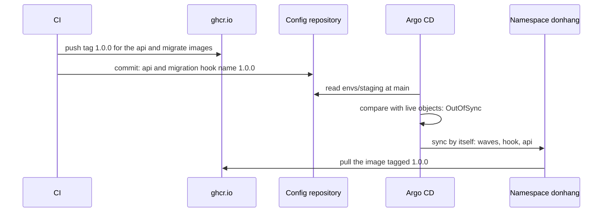

## Bạn cần biết trước

- [[devops.l3.ordering-a-sync]] — bạn biết một lần sync `envs/staging` chạy database trước, rồi tới migration hook, rồi tới api, theo thứ tự của các sync wave.
- [[devops.l2.tagging-images-by-commit]] — bạn biết mỗi image CI push lên đều mang tag `sha-` cộng id của commit, và Đơn Hàng không bao giờ push `latest`.
- [[devops.l2.pushing-images-from-ci]] — bạn biết chỉ commit xanh trên `master` mới lên `ghcr.io`, và không gì bị build lại trên đường đi.

## Tình huống

Các image của phiên bản `1.0.0` đã nằm trên `ghcr.io`: `release.yml`, workflow chạy khi một phiên bản được phát hành, đã gắn thêm tag thứ hai, `1.0.0`, cho những image CI đã test. Staging vẫn chạy tag `sha-` ghi trong `envs/staging/api.yaml`. Ở track k8s, bạn sẽ tự sửa manifest rồi chạy kubectl.

Ở đây Argo CD apply thư mục đó, nhưng Application tạo từ `staging-manual.yaml` không có sync policy. Khi ai đó commit tag mới vào `envs/staging`, nó báo `OutOfSync` rồi chờ tới khi có người yêu cầu sync. Mà yêu cầu sync lại là một lệnh chạy vào cluster, bằng thông tin đăng nhập có quyền thay đổi cluster. Làm sao để `1.0.0` tới staging mà không ai phải chạy lệnh nào vào cluster?

## Khái niệm cốt lõi

- **sync tự động** (automated sync, Argo CD) — một sync policy, viết là `syncPolicy.automated` trong Application. Với nó, Argo CD tự bắt đầu sync khi một thay đổi trong Git, chẳng hạn một commit mới, làm manifest khác với các object đang chạy, thay vì chờ ai đó yêu cầu.
- Sync policy — trường `spec.syncPolicy` của Application. Khi không có trường này, như trong `staging-manual.yaml`, Argo CD chỉ so sánh và báo cáo.
- Commit deploy — một commit vào repo cấu hình để đổi tag image mà một manifest ghi. Trong bài này, đó là bước duy nhất thay đổi thứ staging đang chạy.

## Cơ chế hoạt động



CI push tag `1.0.0` trước (`release.yml` gắn nó cho các image đã có trên `ghcr.io`), nên tag đã tồn tại trên `ghcr.io` trước khi bất cứ thứ gì ghi tên nó. Lần push đó không đổi gì ở staging: Argo CD so repo cấu hình với các object đang chạy, chứ không theo dõi registry.

Mũi tên thứ hai mới là lần deploy. Một commit vào `envs/staging` đổi tag image trong hai file: api trong `api.yaml` và migration hook trong `migrate-hook.yaml`, để migration được chạy thuộc cùng phiên bản với api. Repo cấu hình có branch riêng, `main`, tách khỏi `master` của repo mã nguồn. Ở công ty, job CI đã push image sẽ tạo commit này ở bước cuối. Trong lab, `gitops-deploy.sh` tạo nó từ máy bạn, vì Git server chạy bên trong cluster `donhang-staging` của bạn, nơi CI trên runner của GitHub không với tới được.

Argo CD tự đọc lại thư mục theo một chu kỳ đều đặn, hoặc đọc ngay khi được yêu cầu refresh. Refresh chỉ đọc lại Git và so sánh, không sync. Lúc này manifest ở `main` ghi `1.0.0` còn Deployment đang chạy ghi tag `sha-`, nên Application ở trạng thái `OutOfSync`. Với sync tự động, một khác biệt đến từ commit mới sẽ khởi động sync, không cần người hay pipeline nào yêu cầu. Lần sync này chính là lần sync bạn đã biết: wave 0, migration hook với image migrate mới ở wave 1, rồi api ở wave 2, nơi rolling update khởi động các Pod pull `1.0.0` từ `ghcr.io`.

Trong tình huống trên, giữa lúc staging chạy tag `sha-` và lúc staging chạy `1.0.0`, thứ duy nhất thay đổi là một commit. CI cần quyền push vào repo cấu hình, chứ không cần thông tin đăng nhập vào cluster.

## Trong hệ thống Đơn Hàng

Application đã bật sync tự động:

```yaml file=deploy/gitops/lessons/staging-auto.yaml tag=stage-3 lines=1-24
# The Application of staging-manual.yaml with one addition. It has the same
# name, so applying it changes that Application instead of adding one.
apiVersion: argoproj.io/v1alpha1
kind: Application
metadata:
  name: staging
  namespace: argocd
spec:
  project: default
  source:
    repoURL: http://gitea.git.svc:3000/donhang/donhang-config.git
    targetRevision: main
    path: envs/staging
  destination:
    server: https://kubernetes.default.svc
    namespace: donhang
  # lesson: devops.l3.deploying-by-commit
  # Sync by itself whenever the folder in Git differs from the cluster, such
  # as after a commit. Changes made in the cluster are left alone (no
  # selfHeal), and objects removed from Git are left running (no prune).
  syncPolicy:
    automated:
      selfHeal: false
      prune: false
```

Dòng 1–2 giải thích vì sao apply file này sẽ thay đổi Application `staging` đang có, thay vì thêm một Application thứ hai. Dòng 3–16 giống `staging-manual.yaml`, còn dòng 21–24 là phần thêm vào. `automated` bật sync tự động. Với `selfHeal: false`, nó để yên những thay đổi làm trực tiếp trong cluster, và với `prune: false`, nó để các object đã bị xóa khỏi Git tiếp tục chạy, như dòng 18–20 ghi.

Script deploy `1.0.0`:

```bash file=scripts/devops/gitops-deploy.sh tag=stage-3 lines=13-35
echo "== automated sync, from deploy/gitops/lessons/staging-auto.yaml"
kubectl apply -f deploy/gitops/lessons/staging-auto.yaml -o name
echo

# lesson: devops.l3.deploying-by-commit
# What CI would do after pushing the image: change the tag in the config
# repository, for the api and the migration hook alike, and push the
# commit. Argo CD sees the folder differ from the cluster and syncs.
echo "== deploy $to: one commit to envs/staging"
perl -pi -e "s/:\Q$from\E\$/:$to/" "$config_repo/envs/staging/api.yaml" "$config_repo/envs/staging/migrate-hook.yaml"
git -C "$config_repo" diff --stat
config_commit gitops-deploy.sh "Deploy api $to to staging"
app_refresh
app_wait_sync "$(config_head --verify)" >/dev/null
app_wait Synced Healthy "$(config_head --verify)"
kubectl rollout status deployment/api -n donhang --timeout=300s >/dev/null
kubectl get pods -n donhang -l app=api -o jsonpath='{range .items[*]}{.spec.containers[0].image}{"\n"}{end}' | sort | uniq -c
echo

# The cluster pulls a new tag only when a commit names it; the repository's
# history is the list of what staging was given, when, and by whom.
echo "== git log -- envs/staging"
git -C "$config_repo" log --format='%h %ad %an: %s' --date=format:'%Y-%m-%d %H:%M' -- envs/staging
```

```text output=true
== automated sync, from deploy/gitops/lessons/staging-auto.yaml
application.argoproj.io/staging

== deploy 1.0.0: one commit to envs/staging
 envs/staging/api.yaml          | 2 +-
 envs/staging/migrate-hook.yaml | 2 +-
 2 files changed, 2 insertions(+), 2 deletions(-)
staging: Synced, Healthy
      2 ghcr.io/duyan11110/donhang-api:1.0.0

== git log -- envs/staging
... ... gitops-deploy.sh: Deploy api 1.0.0 to staging
... ... gitops-repo.sh: Staging and production as Đơn Hàng runs them
```

Dòng 14 là lệnh `kubectl apply` duy nhất của script, và nó thay đổi Application, không phải api. Bật sync tự động chỉ làm một lần. Mọi lần deploy sau đó chỉ là một commit, như phần còn lại của script cho thấy. Dòng 22 thay tag `sha-` bằng `1.0.0` trong cả hai file, và dòng 24 commit rồi push qua một hàm hỗ trợ trong `scripts/lib/gitops.sh`, nằm ngoài đoạn trích.

Dòng 25 chỉ yêu cầu Argo CD so sánh ngay bây giờ thay vì đợi tới chu kỳ kế tiếp. `config_head --verify` trả về id của commit vừa push, nên dòng 26–27 chờ lần sync của commit đó, lần sync Argo CD tự khởi động, kết thúc ở `Synced` và `Healthy`. Dòng 28 chờ rolling update xong. Dòng 29 in image của từng Pod api và đếm các dòng giống nhau, vì thế có số `2`.

Khối cuối là lịch sử deploy của staging, mới nhất ở trên. Dấu `...` thứ nhất che id commit dạng ngắn, dấu thứ hai che ngày giờ, vì chúng đổi sau mỗi lần chạy. Cột tác giả chứa tên mà mỗi commit được tạo dưới đó, ở đây là tên script, do hàm hỗ trợ đặt. Git không kiểm tra tên này, nên ai push được vào `envs/staging` thì người đó quyết định staging chạy gì, và repo cần được bảo vệ như bạn bảo vệ cluster.

## Senior hay nhầm rằng…

- **"Argo CD thấy image mới trên registry và tự deploy nó."** → Thực ra Argo CD so repo cấu hình với các object đang chạy, nên một image push dưới tag mới không đổi gì trong những thứ nó so sánh, vì chưa manifest nào ghi tag đó. Bạn sẽ nhận ra khi CI push một image `sha-` mới sau khi merge mà staging vẫn `Synced` ở tag cũ, cho tới khi có commit ghi tag mới.
- **"GitOps vẫn cần `kubectl apply`, chỉ là pipeline chạy thay cho người."** → Thực ra bước cuối của pipeline là một commit vào repo cấu hình, và Argo CD, nằm bên trong cluster, apply nó, vì sync tự động khởi động sync mỗi khi một commit mới làm Application `OutOfSync`. Bạn sẽ nhận ra khi đọc `gitops-deploy.sh`: lệnh `kubectl apply` duy nhất của nó đổi Application, vậy mà api chỉ đổi sau commit.
- **"Cho staging trỏ vào `latest` sẽ đỡ phải viết commit cho mỗi lần deploy."** → Thực ra với `latest`, manifest vẫn y nguyên khi một image mới được push, nên Argo CD không thấy gì để sync, và `git log` không còn cho biết staging đã được giao phiên bản nào. Các Pod đang chạy giữ image cũ. Một Pod khởi động sau có thể nhận một bản build khác, tùy vào thứ node của nó đã có sẵn và vào pull policy. Bạn sẽ nhận ra khi một Application hiện `Synced` trong khi các Pod api của nó chạy những bản build khác nhau.

## Thử ngay (3 phút)

Nếu bạn chưa chạy `scripts/devops/gitops-first-sync.sh` ở bài trước, hãy chạy nó trước. Sau đó, trong thư mục repository `don-hang`:

1. Chạy `scripts/devops/gitops-deploy.sh`. Lần sync chạy migration hook và đưa các Pod api mới lên, nên có thể mất thêm vài phút ngoài 3 phút ở tiêu đề.
2. Đọc khối dưới `== git log -- envs/staging`.

Kết quả mong đợi: script báo `2 files changed`, rồi `staging: Synced, Healthy` và `2 ghcr.io/duyan11110/donhang-api:1.0.0`. Dòng trên cùng của log kết thúc bằng `gitops-deploy.sh: Deploy api 1.0.0 to staging`, nằm trên commit mà `gitops-repo.sh` tạo khi dựng repository.

## Liên hệ

- [[devops.l3.ordering-a-sync]] — điều kiện tiên quyết: lần sync có thứ tự mà giờ sync tự động tự khởi động sau mỗi commit deploy.
- [[k8s.l1.deploying-an-image-tag]] — cùng thay đổi tag image đó, nhưng ở đó do kubectl apply từ máy bạn, còn ở đây một commit mang nó đi.
- [[devops.l2.tagging-images-by-commit]] — các tag `sha-` mà commit deploy ghi, và lý do `latest` không bao giờ là một trong số đó.
- [[devops.l2.deployment-environments]] — cách làm ngược lại: ở đó staging là bản sao dùng xong bỏ, do một job CI dựng trên runner của chính nó, còn ở đây CI chỉ ghi vào Git.
- [[devops.l3.self-heal]] — bài kế: sync tự động làm gì khi thứ bị thay đổi là cluster chứ không phải Git.
- [[devops.l3.rollback-by-revert]] — quay về phiên bản trước cũng là một commit, commit revert commit này.

## Tóm tắt 5 dòng

1. Phiên bản mới tới staging qua một commit đổi tag image trong repo cấu hình, và sync tự động apply nó mà không cần lệnh nào.
2. Với `syncPolicy.automated`, Argo CD tự bắt đầu sync mỗi khi một commit mới làm Application `OutOfSync`.
3. Commit đổi tag của api và của migration hook sang một tag CI đã push lên `ghcr.io`.
4. Argo CD không nhìn registry: image đã push chỉ chạy khi có commit ghi tag của nó, đó là lý do Đơn Hàng không bao giờ deploy `latest`.
5. `git log` của `envs/staging` là lịch sử deploy, nên ai push được vào đó thì điều khiển staging, hãy bảo vệ repository đó như bảo vệ cluster.
