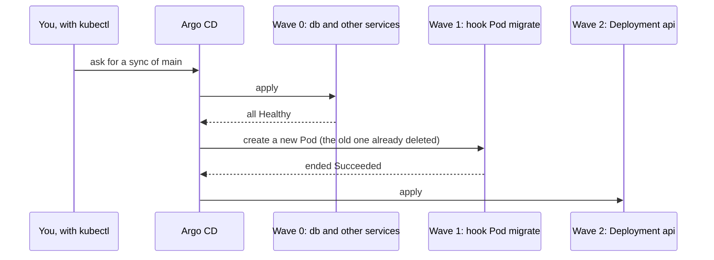

## Before you start

- [[devops.l3.synced-versus-healthy]] — you know a sync applies `envs/staging` to the namespace `donhang`, and that Argo CD calls a Deployment `Healthy` only once its Pods are ready.
- [[devops.l2.migrations-in-the-pipeline]] — you know the migration bundle applies only the migrations a database lacks, and that `Program.cs` no longer migrates at startup.
- [[k8s.l1.deploying-don-hang]] — you know `deploy.sh` runs a `migrate` Pod with `restartPolicy: Never` and applies the api only after that Pod succeeds.

## The situation

In the k8s track, `deploy.sh` brought the backend up in order. It applied the database, waited until `deployment/db` was available, ran the `migrate` Pod, waited for it to end, and applied the api only if the Pod ended `Succeeded`. The order lived in the waits between kubectl commands.

In staging, no script runs. One sync applies the whole folder `envs/staging`, and listed by name, `api.yaml` comes before `db.yaml` and `migrate-hook.yaml`. An api applied before its migration would run new code against old tables. What makes Argo CD bring up the database, run the migration, and only then apply the api?

## Core concepts

An annotation is a key and value under an object's `metadata.annotations`; unlike a label, it selects nothing, and tools such as Argo CD read it as an instruction.

- **sync wave (Argo CD)** — a number written on an object in the annotation `argocd.argoproj.io/sync-wave`; within a sync, Argo CD applies lower waves first and moves to the next wave only once the current one is healthy, and an object without the annotation is in wave 0.
- **hook (Argo CD)** — an object carrying the annotation `argocd.argoproj.io/hook`, which Argo CD creates during a sync to run a task instead of keeping it in place like the other objects; it may be of any kind, and in Đơn Hàng it is the migration Pod.
- Hook deletion policy — the annotation `argocd.argoproj.io/hook-delete-policy`, which says when Argo CD deletes a hook; `BeforeHookCreation` deletes the previous one just before the next sync creates it again.

## How it works



A sync of `main` sorts every object by phase, then by sync wave, lowest first, then by kind, then by name; the file an object came from plays no part. A phase says when a hook runs, for example before, with or after the objects. Đơn Hàng's hook uses `Sync`, the phase in which every object without a hook annotation is applied too, so they all share one phase and the sync wave orders them.

In `envs/staging`, the database, Redis, Keycloak, Mailpit, their Services, the ConfigMaps and every other object without the annotation are in wave 0, the migration hook in wave 1 and the Deployment `api` in wave 2. Inside one wave Argo CD does not wait between objects; it waits until every object is healthy only before starting the next wave. That is why the hook needs its own wave after the database, whose readiness probe must pass first.

In wave 1, Argo CD does not compare the hook with a live copy; it creates it new, after `BeforeHookCreation` deletes the previous `migrate` Pod, since two Pods in one namespace cannot share a name. Argo CD waits for the new Pod to end rather than to be ready. If it ends `Succeeded`, Argo CD applies wave 2, the api. If it ends `Failed`, the sync fails there and the Deployment `api` stays as it was.

Every sync of the whole Application runs the hook again, whatever changed. A sync whose only change is the api's replicas still creates a new `migrate` Pod. That is safe because the bundle skips migrations the database has recorded and ends `Succeeded`.

## In the Đơn Hàng system

The migration as a hook, from the staging folder:

```yaml file=deploy/gitops/config-repo/envs/staging/migrate-hook.yaml tag=stage-3 lines=7-22
apiVersion: v1
kind: Pod
metadata:
  name: migrate
  namespace: donhang
  annotations:
    argocd.argoproj.io/hook: Sync
    argocd.argoproj.io/sync-wave: "1"
    argocd.argoproj.io/hook-delete-policy: BeforeHookCreation
spec:
  restartPolicy: Never
  containers:
    - name: migrate
      # Always the same tag as the api in api.yaml.
      image: ghcr.io/duyan11110/donhang-migrate:sha-bb184243e4cafed6ae833ca61710608366214aa5
      args: ["--connection", "$(ConnectionStrings__Default)"]
```

Lines 12–15 hold the whole ordering. Line 13 makes the Pod a hook in the `Sync` phase, line 14 puts it in wave 1, and line 15 deletes the previous `migrate` Pod before a new one is created. Line 17 keeps a failed migration from restarting, so the Pod ends `Failed` and the sync stops.

The end of the script that shows the order:

```bash file=scripts/devops/gitops-order.sh tag=stage-3 lines=41-62
# When each step happened, read back from the objects themselves, then put
# in the order it happened (the times sort as text).
when() { kubectl get "$1" -n donhang -o jsonpath="$2"; }
{
  echo "$(when deployment/db '{.status.conditions[?(@.type=="Available")].lastTransitionTime}') wave 0: Deployment db available"
  echo "$(when deployment/keycloak '{.status.conditions[?(@.type=="Available")].lastTransitionTime}') wave 0: Deployment keycloak available"
  echo "$(when pod/migrate '{.status.containerStatuses[0].state.terminated.startedAt}') wave 1: hook Pod migrate started"
  echo "$(when pod/migrate '{.status.containerStatuses[0].state.terminated.finishedAt}') wave 1: hook Pod migrate ended $(when pod/migrate '{.status.phase}')"
  echo "$(when deployment/api '{.metadata.creationTimestamp}') wave 2: Deployment api created"
} | sort -s -k1,1 | cut -d' ' -f2- | nl -w1 -s'. '
echo

# lesson: devops.l3.ordering-a-sync
# The hook runs on every sync, also when nothing changed: a new migrate Pod
# (BeforeHookCreation deleted the old one), and a bundle that skips the
# migrations the database has recorded.
echo "== one more sync, with nothing changed"
before=$(when pod/migrate '{.metadata.uid}')
sync_now
after=$(when pod/migrate '{.metadata.uid}')
[ "$before" != "$after" ] && echo "a new Pod migrate ran: $(when pod/migrate '{.status.phase}')"
kubectl logs pod/migrate -n donhang | grep -v "^Acquiring"
```

```text output=true
== sync waves and hooks in envs/staging
envs/staging/api.yaml: argocd.argoproj.io/sync-wave: "2"
envs/staging/db.yaml: argocd.argoproj.io/sync-wave: "0"
envs/staging/migrate-hook.yaml: argocd.argoproj.io/hook: Sync
envs/staging/migrate-hook.yaml: argocd.argoproj.io/sync-wave: "1"
envs/staging/migrate-hook.yaml: argocd.argoproj.io/hook-delete-policy: BeforeHookCreation

== emptying donhang
No resources found in donhang namespace.

== sync
sync: Succeeded
staging: Synced, Healthy

1. wave 0: Deployment db available
2. wave 0: Deployment keycloak available
3. wave 1: hook Pod migrate started
4. wave 1: hook Pod migrate ended Succeeded
5. wave 2: Deployment api created

== one more sync, with nothing changed
sync: Succeeded
a new Pod migrate ran: Succeeded
No migrations were applied. The database is already up to date.
Done.
```

Read the output top to bottom. Script lines 23–25, outside the excerpt, print every wave and hook annotation, with `api.yaml` first. Script lines 30–38, also outside, empty `donhang` and sync it from nothing. Script lines 43–50 read when each step happened and sort the times: the Deployment `api` comes last.

Script lines 57–62 sync once more with nothing changed. Line 59 calls `sync_now`, defined earlier in the script, and line 62 prints the Pod's log without the bundle's line starting with `Acquiring`. The Pod's identifier differs, so a new `migrate` Pod ran, and the bundle found no migration to apply.

## Seniors often assume…

- **"Argo CD applies the files in the order they are listed in the folder."** → Actually it sorts the objects by phase, sync wave, kind and name, because it reads the folder as one set of manifests, not as a list of steps. You notice this when `gitops-order.sh` lists `api.yaml` first among the annotations, yet the Deployment `api` is created last.
- **"A hook runs only when its own manifest changed."** → Actually Argo CD creates the hook again in every sync of the whole Application, because a hook is not kept in place and compared like the other objects. You notice this when the second sync in `gitops-order.sh`, with nothing changed, runs a new `migrate` Pod whose log says no migrations were applied.
- **"Now that no script orders the steps, each api replica should migrate at startup."** → Actually the hook gives the order without a script. When more than one replica runs, one migration before the api is applied is safer than every replica migrating as it starts: EF Core's documentation prefers a separate migration step when the rollout must be coordinated or the app must stay up, since an app reading the database while another migrates it can break. For a single copy of an app in local development, migrating at startup remains a simple choice. You notice this in the script's output: the hook Pod ended before the Deployment `api` was created, so none of its Pods met an unmigrated database.

## Try it (3 minutes)

If you have not done the previous lesson's Try it, do that first, so staging has had its first sync. Then, in the `don-hang` repository folder:

1. Run `scripts/devops/gitops-order.sh`. It deletes the objects in `donhang` and syncs them from nothing, so it can take several minutes beyond the 3 in the heading.
2. Read the numbered list and the last four lines. The list appears only after the sync from nothing finishes, so a long wait before it is expected, not a hang.

Expected result: the list starts with the two wave 0 lines for `db` and `keycloak`, in either order, then the hook Pod `migrate` started and ended `Succeeded`, then the Deployment `api` created. The last lines show `sync: Succeeded`, `a new Pod migrate ran: Succeeded`, the bundle's message that no migrations were applied, and `Done.`

## Connections

- [[devops.l3.synced-versus-healthy]] — prerequisite: the health status each sync wave waits for before the next one starts.
- [[k8s.l1.deploying-don-hang]] — the same order written as waits in `deploy.sh`; here annotations in the manifests carry it.
- [[devops.l2.migrations-in-the-pipeline]] — the same idea in Compose: `api` starts only after `migrate` has completed successfully.
- [[k8s.l1.health-endpoints]] — `/health/ready`, which checks PostgreSQL, decides when the api's Pods count as ready once wave 2 is applied.
- [[devops.l3.deploying-by-commit]] — next: a commit that changes the image tag leads to the sync this lesson orders.
- [[devops.l3.rollback-by-revert]] — where reverting a commit meets a migration that has already run.

## Five-line summary

1. With no script waiting between steps, sync waves and a hook written into the manifests order the database, the migration and the api.
2. A sync sorts objects by phase, then sync wave (lowest first, 0 by default), then kind and name, never by file order.
3. Argo CD starts the next wave only once every object in the current one is healthy; a failed hook stops the sync.
4. Đơn Hàng's staging puts the database and other services in wave 0, the migration hook Pod in wave 1 and the api in wave 2.
5. The hook runs on every sync of the whole Application after `BeforeHookCreation` deletes the old Pod, so the bundle must skip migrations already recorded.
