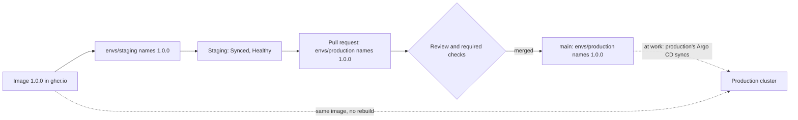

## Before you start

- [[devops.l3.rollback-by-revert]] — you know that a change to staging, forward or back, is a commit to `envs/staging` that Argo CD syncs.
- [[devops.l3.one-state-per-environment]] — you know staging and production each get their own OpenTofu folder, differing in the values they pass.
- [[devops.l2.cutting-a-release]] — you know `1.0.0` is a commit's `sha-` image pushed again under a version tag, with nothing rebuilt.

## The situation

Staging has run the api `1.0.0` since the revert: the Application is `Synced` and `Healthy`, and the team has checked the version there. The config repository has a second folder, `envs/production`, for a production cluster. Its `api.yaml` still names an older `sha-…` tag and asks for 3 replicas, where staging asks for 2. Your lead asks you to put `1.0.0` into production. You could run the release workflow again, copy the whole staging folder over, or edit the tag. Which change gives production exactly what staging checked, at a moment the team has agreed to?

## Core concepts

- **promotion (between environments)** — moving the exact version one environment has checked, here staging's `1.0.0`, to the next environment by naming the same image, without building it again.
- Environment folder — `envs/staging` or `envs/production` in the config repository: a full set of manifests for one environment, read by that environment's Application.
- Promotion pull request — the promotion commit offered for review instead of pushed straight to `main`, so that its merge is the moment production changes.
- Forgotten copy — a change made in one environment's folder but not in the other's, leaving the two different without anyone choosing it.

## How it works



`envs/staging` and `envs/production` each hold a full set of manifests: the api, its migration hook, the database and the other services. They differ in values, such as the api's replicas, 2 in staging and 3 in production, and the image tag. Only staging's folder also holds its Secrets, encrypted by `scripts/devops/seal-secrets.sh`; how that works is the next module's subject. Production's folder has none.

Promotion is a commit to `envs/production` that sets the tag staging already runs. The api and the migration hook both change to `1.0.0`, an image in `ghcr.io`, the container registry CI pushes to. Nothing is built, so production pulls the image staging checked, as long as nobody pushes another image under `1.0.0`.

When the team wants production to change only after a second person has looked, you open that commit as a pull request instead of pushing it to `main`. Review and required checks then decide when production changes. In CI, a protection rule such as required reviewers gates a job that references a deployment environment; a pull request does the same for the config repository, where a commit is the deploy. Once it is merged, production's Argo CD would sync `envs/production` from `main`.

A full copy per environment has a cost. A change meant for both, such as a new probe, must be made in both folders. Forget one, and the environments differ without anyone deciding they should; staging then checks something production does not run.

In the lab nothing syncs production. OpenTofu only plans that cluster, and no Application reads `envs/production`. So the commit and its diff are the whole promotion here.

## In the Đơn Hàng system

Production's `api.yaml`, at the replica count:

```yaml file=deploy/gitops/config-repo/envs/production/api.yaml tag=stage-3 lines=16-20
spec:
  # lesson: devops.l3.promoting-between-environments
  # What differs between envs/staging and envs/production: the number of
  # replicas here and the image tag below.
  replicas: 3
```

Lines 18–19 are the repository's own note on what differs. Staging's `api.yaml` has the same lines with `replicas: 2`. The rest of the two files is the same, apart from the tag and the header comment that names the environment.

The promotion script, from line 9:

```bash file=scripts/devops/gitops-promote.sh tag=stage-3 lines=9-27
tag_in() { sed -nE 's#^ *image: ghcr.io/duyan11110/donhang-api:(.*)$#\1#p' "$config_repo/envs/$1/api.yaml"; }

# The two folders hold full sets of manifests that differ only in values.
echo "== envs/staging and envs/production differ in"
diff "$config_repo/envs/staging" "$config_repo/envs/production" | grep '^[<>]' | grep -v -e '^. # ' || true
echo

# lesson: devops.l3.promoting-between-environments
# Promotion: set production's tags to the ones staging runs and checked,
# the same images, not rebuilt. At work this commit would be a pull request,
# so review and required checks decide when production changes.
staging_tag=$(tag_in staging)
production_tag=$(tag_in production)
echo "== promote api $staging_tag (production runs $production_tag)"
perl -pi -e "s/:\Q$production_tag\E\$/:$staging_tag/" \
  "$config_repo/envs/production/api.yaml" "$config_repo/envs/production/migrate-hook.yaml"
config_commit gitops-promote.sh "Promote api $staging_tag to production"
git -C "$config_repo" show --stat --format='%h %an: %s' HEAD
git -C "$config_repo" show --format= HEAD
```

```text output=true
== envs/staging and envs/production differ in
<   replicas: 2
>   replicas: 3
<           image: ghcr.io/duyan11110/donhang-api:1.0.0
>           image: ghcr.io/duyan11110/donhang-api:sha-bb184243e4cafed6ae833ca61710608366214aa5
<       image: ghcr.io/duyan11110/donhang-migrate:1.0.0
>       image: ghcr.io/duyan11110/donhang-migrate:sha-bb184243e4cafed6ae833ca61710608366214aa5

== promote api 1.0.0 (production runs sha-bb184243e4cafed6ae833ca61710608366214aa5)
... gitops-promote.sh: Promote api 1.0.0 to production

 envs/production/api.yaml          | 2 +-
 envs/production/migrate-hook.yaml | 2 +-
 2 files changed, 2 insertions(+), 2 deletions(-)
diff --git a/envs/production/api.yaml b/envs/production/api.yaml
index f7e4225..56ab902 100644
--- a/envs/production/api.yaml
+++ b/envs/production/api.yaml
@@ -39,7 +39,7 @@ spec:
           # lesson: devops.l3.rollback-by-revert
           # A deploy is a commit that changes this tag, and the migration
           # hook's, to one CI has pushed to ghcr.io.
-          image: ghcr.io/duyan11110/donhang-api:sha-bb184243e4cafed6ae833ca61710608366214aa5
+          image: ghcr.io/duyan11110/donhang-api:1.0.0
           ports:
             - containerPort: 8080
           envFrom:
diff --git a/envs/production/migrate-hook.yaml b/envs/production/migrate-hook.yaml
index a810213..eac7065 100644
--- a/envs/production/migrate-hook.yaml
+++ b/envs/production/migrate-hook.yaml
@@ -18,7 +18,7 @@ spec:
   containers:
     - name: migrate
       # Always the same tag as the api in api.yaml.
-      image: ghcr.io/duyan11110/donhang-migrate:sha-bb184243e4cafed6ae833ca61710608366214aa5
+      image: ghcr.io/duyan11110/donhang-migrate:1.0.0
       args: ["--connection", "$(ConnectionStrings__Default)"]
       env:
         - name: ConnectionStrings__Default

== Applications that read envs/production
none
```

Line 9 (`tag_in`) reads the api's tag from one folder's `api.yaml`. Line 13 (`diff`) compares the two folders and keeps only the lines that differ, leaving out the comment lines at the top of each file. Lines 20–21 (`staging_tag=`, `production_tag=`) read both tags, and lines 23–24 (`perl`) replace production's tag with staging's in `api.yaml` and `migrate-hook.yaml`. Line 25 (`config_commit`) commits through a helper in `scripts/lib/gitops.sh`, outside the excerpt; lines 26–27 (`git`) print that commit's file list and diff.

In the output, the first block shows the three lines that differ: replicas and the two image tags. The commit changes two files, one line each; the captured output shows `...` where the commit hash would differ between runs. The last block comes from lines after the excerpt, which ask the cluster for Applications reading `envs/production`: `none`.

## Seniors often assume…

- **"Promoting to production means building the image again from the tagged commit."** → Actually promotion names the tag staging already runs, so production pulls the image staging checked, as long as nobody pushes another image under that tag. A second build is a new image staging never ran; even from the same commit, what the build pulls in at that moment can differ, such as a newer image behind the tag in `FROM`. You notice this when both environments show the same version but different image digests, and a fault appears only in production.
- **"Each environment needs its own long-lived branch, and promoting means merging one branch into the next."** → Actually a merge carries every change on the branch, including values meant to stay different, such as staging's 2 replicas. With one folder per environment on `main`, the promotion commit touches only production's files. A branch per environment can work when environments differ only in how far behind each other they are; once they must differ for good, every merge has to dodge those values. You notice this when a merge from the staging branch brings `replicas: 2` into production.
- **"Staging and production may share one folder as long as they run in different clusters."** → Actually both clusters' Argo CD would then apply the same manifests, so every commit reaches both, and there is no place for production's own replicas or its older tag. Promotion needs a folder that can name a version staging has already passed. You notice this when a commit meant for staging changes production at its next sync.

## Try it (3 minutes)

With staging back on `1.0.0` after `scripts/devops/gitops-revert.sh`, in the `don-hang` repository folder:

1. Run `scripts/devops/gitops-promote.sh`.
2. Read the block after `== promote api`, then the last line.

Expected result: `== promote api 1.0.0 (production runs sha-bb184243e4cafed6ae833ca61710608366214aa5)`, a commit `Promote api 1.0.0 to production` that changes only `envs/production/api.yaml` and `envs/production/migrate-hook.yaml`, one line each, and `none` under `== Applications that read envs/production`. A second run finds production already on `1.0.0`, prints `== promote api 1.0.0 (production runs 1.0.0)` and stops, because there is nothing to commit.

## Connections

- [[devops.l3.rollback-by-revert]] — the same kind of commit one environment earlier: there it took staging back, here it takes production forward.
- [[devops.l2.cutting-a-release]] — where `1.0.0` was made without a rebuild; promotion keeps that promise up to production.
- [[devops.l3.one-state-per-environment]] — the same split one layer down: one folder per environment for OpenTofu, here for the manifests Argo CD applies.
- [[devops.l2.deployment-environments]] — where a protection rule gated a job; here a pull request on the config repository plays that role.
- [[management.l1.code-review-basics]] — the review that now decides when production changes.

## Five-line summary

1. Promoting is a commit to `envs/production` naming staging's tag, so production gets the image staging checked, unless someone re-pushes that tag.
2. `envs/staging` and `envs/production` hold full sets of manifests differing in values such as replicas and tag; only staging's holds encrypted Secrets.
3. Opened as a pull request, the promotion lets review and required checks decide when production changes.
4. With a full copy per environment, a shared change such as a new probe is made twice; a forgotten copy leaves them different by accident.
5. In the lab no Application reads `envs/production`, so `gitops-promote.sh` shows the commit and its diff, not a rollout.
