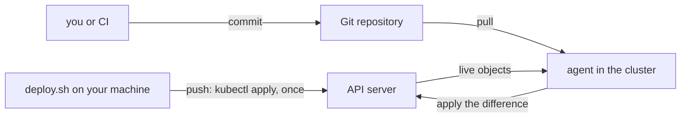

## Before you start

- [[devops.l3.configuration-drift]] — you know drift is a change made outside the files, and that OpenTofu finds it only when someone runs a plan.
- [[k8s.l1.deploying-don-hang]] — you know `scripts/k8s/deploy.sh` applies `deploy/k8s/` to the cluster in order, the migration before the api.
- [[k8s.l1.control-plane-components]] — you know a control loop compares the desired state with what runs and acts on the difference.
- [[devops.l2.deployment-environments]] — you know the `staging` job in `ci.yml` runs a throwaway copy on its own runner, not a cluster that stays up.

## The situation

At stage-2 you deploy Đơn Hàng by running `scripts/k8s/deploy.sh` on your own machine, against the local cluster there. A teammate wants deploys to happen without you: a job in `ci.yml` that runs `deploy.sh` after `publish`. That job would need a kubeconfig for the cluster stored in GitHub, and GitHub's runners cannot reach the cluster on your laptop anyway. Meanwhile someone ran `kubectl scale` on `api` to try something: `kubectl get deployment api -n donhang` shows one replica, `deploy/k8s/api.yaml` in Git still says two, and nobody was told. Who should make the cluster match `deploy/k8s/`, and when?

## Core concepts

- **GitOps** — keeping a cluster's desired state in a Git repository and letting an agent pull it and apply it, so that deploying means making a commit. In this course the agent runs inside the cluster it deploys to.
- **pull-based deployment** — deploying by having that agent read the desired state and change its own cluster, again and again, instead of a tool outside the cluster pushing the change in.
- Push deployment — what `deploy.sh` does: a program outside the cluster sends the manifests to the API server once, each time someone runs it.
- Agent — a program running as Pods in the cluster that reads the repository and talks to the API server of that same cluster.

## How it works



Follow the top edge. `deploy.sh` runs wherever you start it, and `kubectl` sends each manifest to the API server with the credentials in your kubeconfig. Whoever runs it, you or a CI job, must hold credentials that can create Secrets and delete Pods in `donhang`: it builds the Secrets from `.env` and deletes the old `migrate` Pod.

`kubectl scale` changed the desired state the cluster keeps, so the Deployment now keeps one Pod; only `api.yaml` in Git still says two, and nothing in the cluster reads that file. Once the script ends, nothing is watching.

The bottom path is GitOps as this course sets it up: the repository holds the desired state, and an agent inside the cluster reads it and applies it through its own API server. To deploy a new version, you, or a CI job, change `image:` in `api.yaml` and push the commit; nobody runs a command against the cluster. The agent is a control loop, like kube-scheduler: it compares the repository with the live objects it reads from the API server, again and again. That hand-made `kubectl scale` shows up as a difference without anyone running a plan, unlike OpenTofu drift. So the agent keeps finding where the cluster disagrees with Git; whether it also changes it back is a choice covered later.

Pull also moves the credentials. The agent opens the connection, from inside the cluster to the repository, so nothing outside has to reach the cluster. CI needs permission to write to the repository, not access to the cluster. The cost is one more component to install, upgrade and watch. For one small cluster that one person deploys, a push script run from CI can be enough. Once several people deploy, or CI cannot reach the cluster, pull starts to pay for that component.

## In the Đơn Hàng system

The top of the script you run today:

```bash file=scripts/k8s/deploy.sh tag=stage-2 lines=1-11
#!/usr/bin/env bash
# Deploy the Đơn Hàng backend to the kind cluster, in order: namespace, Secrets, ConfigMaps, PostgreSQL, Redis, Keycloak, Mailpit, the migration, then the api.
# Runs on the host, like every script in scripts/k8s/: it reads .env and db/ here and kubectl talks to the kind cluster from here.
set -euo pipefail
cd "$(dirname "$0")/../.."

# lesson: k8s.l1.deploying-don-hang
# Every step can run again: apply leaves what is already there unchanged.
# -o name prints each object once, whether it was created or not.
echo "== namespace"
kubectl apply -f deploy/k8s/namespace.yaml -o name
```

Line 3 states the push model in one sentence: the script runs on the host, and `kubectl` talks to the cluster from there. Line 8 says every step can run again, which makes it safe to repeat, but only when someone repeats it. Line 11 is the first push: the namespace exists because this machine sent it. No part of the script keeps comparing the cluster with `deploy/k8s/` after it exits.

What CI holds today, in the job that publishes images:

```yaml file=.github/workflows/ci.yml tag=stage-2 lines=130-152
  # lesson: devops.l2.pushing-images-from-ci
  # Only master's green commits reach the registry. The job logs in with the
  # GITHUB_TOKEN GitHub creates for this run, which may push packages only
  # because `permissions:` says so. It pushes the images the tests passed
  # with: loaded from the artifact, never rebuilt.
  publish:
    if: github.event_name == 'push' && github.ref == 'refs/heads/master'
    needs: [test, image]
    runs-on: ubuntu-24.04
    permissions:
      packages: write
    steps:
      - uses: actions/download-artifact@v4
        with:
          name: images

      - name: Load the images
        run: docker load --input images.tar

      - name: Log in to GitHub Container Registry
        env:
          GITHUB_TOKEN: ${{ secrets.GITHUB_TOKEN }}
        run: echo "$GITHUB_TOKEN" | docker login ghcr.io --username "$GITHUB_ACTOR" --password-stdin
```

`permissions: packages: write` is the only power this job asks for: it can put images in the registry. No job in `ci.yml` deploys to a cluster that stays up; another job in `ci.yml`, `k8s`, creates its own throwaway cluster on the runner and deletes it at the end.

A push deploy added after `publish` would need a kubeconfig with rights over the real cluster, kept as a GitHub secret. With pull, the extra step would be a commit that changes `image:` in `api.yaml` to the tag of the image `publish` just pushed. CI would need permission to write to the repository, and CI would no longer hold the cluster's credentials.

## Seniors often assume…

- **"GitOps just means keeping the Kubernetes manifests in Git, which Đơn Hàng already does."** → Actually Git gives `deploy/k8s/` history and review, but only `deploy.sh` reads those files, and only while it runs. GitOps adds an agent in the cluster that keeps comparing them with the live objects. You notice this when `kubectl get deployment api -n donhang` shows a replica count that differs from `api.yaml`, and no tool ever reported it.
- **"A CI job that runs `kubectl apply` after every merge is GitOps."** → Actually that is still push: it acts only when the pipeline runs, CI holds credentials for the cluster, and the cluster must be reachable from CI's runners. Between merges, nothing compares. You notice this when a hand-made change stays in the cluster until the next merge happens to apply over it.
- **"'Pull' refers to the nodes pulling images from the registry."** → Actually the kubelet pulls images in both models: `deploy.sh` pushes manifests, and each node still pulls `ghcr.io/duyan11110/donhang-api:1.0.0` itself. "Pull" names who fetches the desired state: an agent in the cluster, from Git. You notice this when `kubectl describe pod`, run shortly after a deploy plainly pushed with `deploy.sh`, lists under `Events`, the Pod's record of what has happened to it, the image being pulled for an `api` Pod that was the first to run it on its node.

## Try it (3 minutes)

With the cluster running and `deploy.sh` finished, in the `don-hang` repository folder, in the shell you use for `kubectl`:

1. Run `kubectl scale deployment/api -n donhang --replicas=1`.
2. Wait a minute, then run `kubectl get deployment api -n donhang` and `grep -n "replicas:" deploy/k8s/api.yaml`.
3. Run `kubectl apply -f deploy/k8s/api.yaml` to put the file's value back.

Expected result: in step 2 the `READY` column shows `1/1`, and `grep` prints `11:  replicas: 2`. Nothing in the cluster acted on the difference; only your own `kubectl apply` in step 3 brings `api` back to two replicas.

## Connections

- [[k8s.l1.manifests-and-kubectl-apply]] — the push step itself: `kubectl apply` makes objects match a manifest once, when someone runs it.
- [[devops.l3.infrastructure-as-code]] — the same problem one layer down: a file in Git that nothing compares with what exists.
- [[devops.l3.configuration-drift]] — the opposite timing: OpenTofu finds drift only when someone runs a plan, while a pull agent keeps looking.
- [[k8s.l1.control-plane-components]] — the same kind of control loop the agent runs, there run by kube-scheduler.
- [[devops.l3.argo-cd-applications]] — next: installing such an agent in staging and telling it which folder of which repository to read.

## Five-line summary

1. GitOps keeps a cluster's desired state in Git and lets an agent inside the cluster pull and apply it, so a deploy is a commit.
2. `deploy.sh` pushes manifests with `kubectl` from your machine, so whoever runs it holds credentials that can change the cluster.
3. Manifests in Git are not GitOps on their own: after the script exits, nothing compares the cluster with `deploy/k8s/`.
4. A pull agent is a control loop that compares Git with the live objects again and again, so drift shows up without a plan.
5. Pull gives CI write access to the repository instead of the cluster, at the cost of one more component to run.
