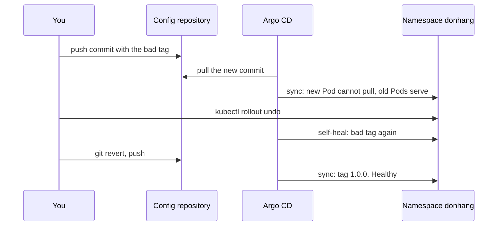

## Before you start

- [[devops.l3.self-heal]] — you know that with self-heal on, Argo CD undoes a change made by hand to what Git names, so only a commit changes staging for good.
- [[k8s.l1.rollbacks]] — you know `kubectl rollout undo` makes a Deployment's previous revision current again, and that a missing tag leaves the new Pod unable to pull its image.
- [[foundation.l2.git-history-and-recovery]] — you know `git revert` adds a commit that reverses another, while `git reset` moves a branch name.

## The situation

Staging runs the api `1.0.0` under `apps/staging.yaml`, with automated sync and self-heal on. A commit to `envs/staging` changes only `api.yaml`. It sets the api's tag to one CI never pushed. Whoever wrote it mistyped the commit hash that CI's `sha-…` tags carry. Argo CD syncs it. The new api Pod cannot pull its image, the two old Pods keep serving, and the Application shows `Synced` but not `Healthy`.

You do what the Kubernetes track taught you: `kubectl rollout undo deployment/api -n donhang`. kubectl answers `rolled back`. Moments later the Deployment names the bad tag again. When Argo CD keeps putting the bad version back, how do you return staging to the last good version so that it stays there?

## Core concepts

- Rollback in the cluster — `kubectl rollout undo` makes the Deployment's previous revision current again; it changes only the live object, not the manifest in Git.
- Argo CD's own rollback — a request to sync the Application to a revision from its list of earlier syncs instead of the commit Git names now; Argo CD refuses it while automated sync is on.
- Revert commit — the new commit `git revert` adds, whose changes undo those of an earlier commit, so the history keeps both the mistake and its fix.
- Schema change — a change to the database's tables made by a migration; Git records the migration, but the change itself lives in the database.

## How it works



In the situation above, the bad commit is synced like any other. Argo CD compares manifests with live objects; it does not ask whether an image exists. So the Application is `Synced`, and the missing image shows up only in health: at first the api is `Progressing`, not `Healthy`.

Your `kubectl rollout undo` works for a moment. It changes the live Deployment back to `1.0.0`, but Git still names the bad tag. With self-heal on, that difference is a reason to sync, and Argo CD applies the bad tag again shortly after.

Argo CD has a rollback of its own: it can sync an earlier revision from its sync history. While automated sync is on, Argo CD refuses it. So the way back goes through the repository.

`git revert` adds a commit whose change sets the tag back to `1.0.0`. Once it is pushed, automated sync applies it like any deploy. The history now holds the bad commit and the revert: the record of what staging ran.

A revert restores files, not data. Suppose the reverted version had also brought a migration. Its hook ran during that sync and changed the schema, and the database is not in Git, so the schema stays. Going back past a schema change therefore needs the older api to work with the newer schema. If it does not, a revert is the wrong way back; commit the tag of an image that fixes the bug and works with the new schema, and let automated sync deploy it.

## In the Đơn Hàng system

The first part of the script, starting at line 21:

```bash file=scripts/devops/gitops-revert.sh tag=stage-3 lines=21-41
# lesson: devops.l3.rollback-by-revert
# A commit naming a tag no image has: synced like any other. The new Pod
# cannot pull its image; the two old Pods keep serving.
echo "== a commit that sets the api's tag to $bad"
perl -pi -e "s/donhang-api:\Q$good\E\$/donhang-api:$bad/" "$config_repo/envs/staging/api.yaml"
config_commit gitops-revert.sh "Deploy api $bad to staging"
app_refresh
app_wait_sync "$(config_head --verify)" >/dev/null
app_wait Synced Progressing "$(config_head --verify)"
for _ in $(seq 120); do api_images | grep -q -e ErrImagePull -e ImagePullBackOff && break; sleep 1; done
api_images
echo

# lesson: devops.l3.rollback-by-revert
# Rolling back in the cluster does not last: the live Deployment no longer
# matches Git, and self-heal applies the bad tag again.
echo "== kubectl rollout undo"
kubectl rollout undo deployment/api -n donhang
echo "right after: the Deployment names $(deployed_tag)"
for _ in $(seq 120); do [ "$(deployed_tag)" = "$bad" ] && break; sleep 1; done
echo "shortly after: the Deployment names $(deployed_tag)"
```

Lines 9–10, above the excerpt, set `good` to the tag the clone names, `1.0.0` here, and `bad` to a tag of zeros. Line 25 replaces the api's tag in the working clone (the script's own local copy of the config repository, with its full history). Only `api.yaml` changes; the migration hook's tag stays as it was, so the bad commit brings no new migration. Line 26 commits and pushes; lines 27–29 ask Argo CD to compare now and wait for the sync. Line 30 waits for the new Pod to report an image pull error, and line 31 prints the Pods grouped as: count, tag, ready, reason. Line 38 is the rollback in the cluster, and line 40 checks up to 120 times, a second apart, for the bad tag to come back.

The end of the script:

```bash file=scripts/devops/gitops-revert.sh tag=stage-3 lines=44-57
# lesson: devops.l3.rollback-by-revert
# The way back goes through the repository: a new commit that undoes the bad
# one. The history keeps both.
echo "== git revert"
git -C "$config_repo" -c user.name=gitops-revert.sh -c user.email=lab@donhang.example revert --no-edit HEAD >/dev/null
config_commit_pushed=$(config_head --verify)
git_server_open
git_auth -C "$config_repo" push -q "$git_server/$repo_path" main
app_refresh
app_wait_sync "$config_commit_pushed" >/dev/null
app_wait Synced Healthy "$config_commit_pushed"
kubectl rollout status deployment/api -n donhang --timeout=300s >/dev/null
api_images
git -C "$config_repo" log --format='%h %an: %s' -n 3
```

```text output=true
== a commit that sets the api's tag to sha-0000000000000000000000000000000000000000
staging: Synced, Progressing
      2 1.0.0 true 
      1 sha-0000000000000000000000000000000000000000 false ErrImagePull

== kubectl rollout undo
Warning: would violate PodSecurity "restricted:latest": allowPrivilegeEscalation != false (container "api" must set securityContext.allowPrivilegeEscalation=false), unrestricted capabilities (container "api" must set securityContext.capabilities.drop=["ALL"]), runAsNonRoot != true (pod or container "api" must set securityContext.runAsNonRoot=true), seccompProfile (pod or container "api" must set securityContext.seccompProfile.type to "RuntimeDefault" or "Localhost")
deployment.apps/api rolled back
right after: the Deployment names 1.0.0
shortly after: the Deployment names sha-0000000000000000000000000000000000000000

== git revert
staging: Synced, Healthy
      2 1.0.0 true 
... gitops-revert.sh: Revert "Deploy api sha-0000000000000000000000000000000000000000 to staging"
... gitops-revert.sh: Deploy api sha-0000000000000000000000000000000000000000 to staging
... gitops-self-heal.sh: Remove the ConfigMap prune-demo
```

Line 48 reverts the newest commit: `-C` runs Git in the working clone, `-c` sets the author name the history shows, and `--no-edit` keeps Git's default message, `Revert "…"`. Line 49 keeps the revert's commit id, which lines 53–54 wait for. Lines 50–51 push it, line 52 asks Argo CD to compare, and lines 53–55 wait until the sync is done and the api's Pods are ready. Line 56 prints the Pods as line 31 did; line 57 prints the last three commits; the captured output shows `...` where a commit hash would differ between runs.

In the output, the first block shows one Pod waiting with `ErrImagePull` beside two ready `1.0.0` Pods. The second shows the undo lasting until self-heal applied the bad tag again. Its `Warning` line comes from a check this lesson does not cover; it does not stop the undo, which prints `rolled back` next. The third shows only `1.0.0` Pods, and a history that keeps the mistake under its revert.

## Seniors often assume…

- **"`kubectl rollout undo` is still the quickest safe fix when Argo CD manages the Deployment."** → Actually it changes only the live Deployment, and Git still names the bad tag; with self-heal on, Argo CD applies that tag again shortly after. You notice this when the Deployment names `1.0.0` right after the undo and the bad tag a moment later.
- **"The cleanest rollback is resetting the branch to the last good commit and force-pushing."** → Actually force-pushing makes the server's branch point where yours does, even if commits on the server are dropped. Argo CD would follow the reset branch just as well, so staging gains nothing over a revert. What you lose is the record: the history no longer shows the bad version. Teammates' local copies of `main` still hold the bad commit under their new one. The server's `main` now holds nothing theirs lacks, so Git accepts their ordinary push without a force, and the bad commit is back on the server. You notice this when a teammate who pulled the bad commit pushes their next commit and the bad tag is back.
- **"Reverting the deploy commit also rolls the database back."** → Actually a revert changes manifests in Git; migrations a hook already applied stay in the database. You notice this when the older api, running again after a revert, fails on a query because a column it expects was changed by the migration you thought you had undone.

## Try it (3 minutes)

With the cluster and Argo CD from the previous lessons still running, run `scripts/devops/gitops-self-heal.sh` first if you have not. Then, in the `don-hang` repository folder:

1. Run `scripts/devops/gitops-revert.sh`. It waits for syncs and for the api's Pods, so it can take a few minutes beyond the 3 in the heading.
2. Compare the line after `right after:` with the one after `shortly after:`, then read the last three lines.

Expected result: `right after: the Deployment names 1.0.0`, then `shortly after:` names the tag of zeros. After `== git revert`, the Application is `staging: Synced, Healthy` with two `1.0.0` Pods, and the newest commit is `Revert "Deploy api sha-0000000000000000000000000000000000000000 to staging"`.

## Connections

- [[devops.l3.self-heal]] — the reason for this lesson: self-heal undoes a change made by hand to what Git names, including a rollback.
- [[k8s.l1.rollbacks]] — the same goal one layer down: there `kubectl rollout undo` was the fix, and Git had to catch up later.
- [[foundation.l2.git-history-and-recovery]] — where `revert` and `reset` were compared; here that choice decides what the deploy history keeps.
- [[devops.l3.ordering-a-sync]] — the migration hook whose changes a revert cannot take back.
- [[devops.l3.promoting-between-environments]] — next: moving a tag staging has run on to production, also by commit.

## Five-line summary

1. With GitOps, staging goes back to a good version through a `git revert` commit, not through a command run against the cluster.
2. A commit setting only the api's tag to a missing one is synced like any other: `Synced`, not `Healthy`, old Pods serving.
3. With self-heal on, `kubectl rollout undo` lasts only until Argo CD applies the tag Git still names.
4. Argo CD refuses its own rollback while automated sync is on; a revert commit is synced like any deploy and keeps the history.
5. A revert restores manifests, not data: schema changes a hook applied stay, so the older api must work with them.
