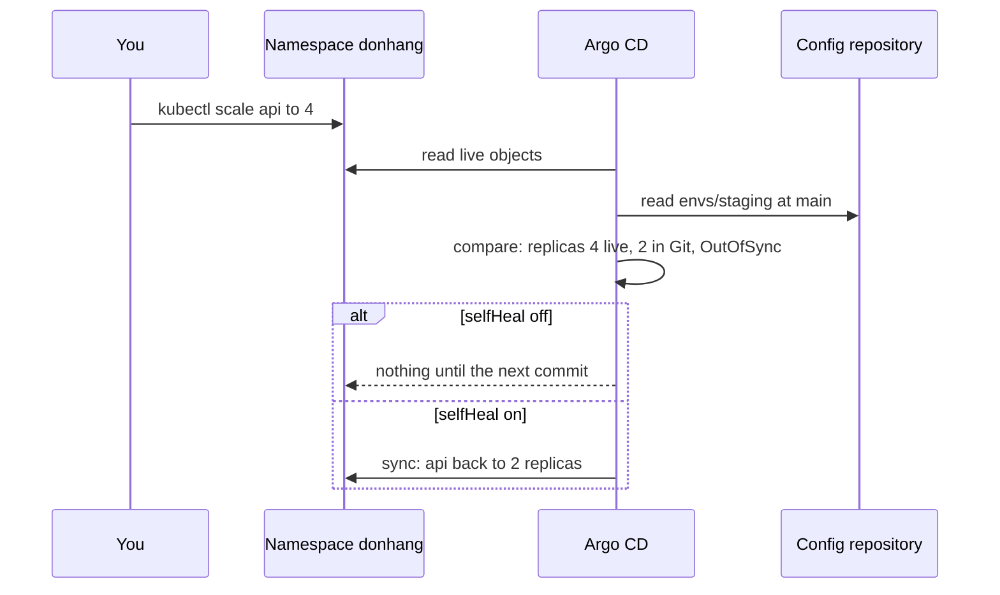

## Before you start

- [[devops.l3.deploying-by-commit]] — you know automated sync makes Argo CD start a sync by itself when a new commit leaves the Application `OutOfSync`.
- [[devops.l3.configuration-drift]] — you know drift is a change made outside the tool that owns the configuration, and that OpenTofu finds it only when a plan runs.
- [[devops.l3.tofu-state]] — you know OpenTofu compares its files with what it recorded and read, and does nothing between commands.
- [[k8s.l1.deployments]] — you know `replicas` in a Deployment sets how many Pods run, and that changing only `replicas` scales the same ReplicaSet.

## The situation

Staging runs the api from `envs/staging`, deployed by a commit, with automated sync on. While the team sends heavy test traffic to staging, a teammate runs `kubectl scale deployment api -n donhang --replicas=4`, because two Pods are not enough. Thirty seconds later there are still 4 replicas, and the Application shows `OutOfSync`.

Nobody commits anything. Later that day an unrelated commit reaches staging, and the api is back to 2 replicas in the middle of the test. Who decides how many api Pods staging runs: the config repository or whoever last ran kubectl, and how do you make that answer the same every time?

## Core concepts

- **self-heal (Argo CD)** — an option of automated sync, written `selfHeal: true` under `syncPolicy.automated`, under which Argo CD also starts a sync when the live objects are changed away from Git, not only when Git changes; without it, automated sync starts only for an `OutOfSync` caused by a new commit, not by a change in the cluster.
- Prune — the option `prune: true` beside it, under which a sync deletes an object of the Application whose manifest has left the folder in Git.
- Requires pruning — the mark Argo CD puts on such an object while prune is off: the object is still running, and the Application is `OutOfSync` because of it.

## How it works



In the situation above, the first arrow is the teammate's command. It changes the live Deployment; `envs/staging` still says `replicas: 2`.

Argo CD keeps comparing the live objects of the Application with the manifests in Git; it does not wait for a command, as OpenTofu waits for a plan. On its own it rereads Git every few minutes and follows the live objects as they change. So it sees the difference and marks the Application `OutOfSync`.

What happens next depends on the policy. Automated sync on its own reacts to a change in Git, so Argo CD leaves the 4 replicas running. A sync applies every object of the Application, not only the files the commit changed; Argo CD can be set to apply only the differing objects, but Đơn Hàng does not use that setting. So the unrelated commit set the api back to the 2 replicas Git declares.

With self-heal on, a difference that comes from the cluster also starts a sync, and the api returns to 2 replicas shortly after, without any commit. To keep 4 replicas, write 4 into Git. Some teams leave self-heal off so that hand-made changes stay visible as `OutOfSync`; the cost is a cluster that runs, for a while, what nobody committed.

The same question arises when a manifest leaves the folder. Without `prune: true`, the object keeps running, marked as requiring pruning. Not even the automated sync for that commit deletes it while `prune` is off. With prune on, the automated sync of that commit deletes the object.

## In the Đơn Hàng system

The Application Đơn Hàng keeps for staging:

```yaml file=deploy/gitops/config-repo/apps/staging.yaml tag=stage-3 lines=1-25
# The Application Đơn Hàng keeps for staging: staging-auto.yaml with
# self-heal and prune turned on. scripts/devops/gitops-self-heal.sh applies
# it; scripts/devops/dr-drill.sh applies it to a rebuilt cluster.
apiVersion: argoproj.io/v1alpha1
kind: Application
metadata:
  name: staging
  namespace: argocd
spec:
  project: default
  source:
    repoURL: http://gitea.git.svc:3000/donhang/donhang-config.git
    targetRevision: main
    path: envs/staging
  destination:
    server: https://kubernetes.default.svc
    namespace: donhang
  # lesson: devops.l3.self-heal
  # selfHeal: also sync when the live objects drift from Git, such as after
  # kubectl scale. prune: delete an object whose manifest left the folder.
  # The objects in donhang that came from envs/staging follow Git both ways.
  syncPolicy:
    automated:
      selfHeal: true
      prune: true
```

Lines 4–17 are the same Application as `staging-auto.yaml` from the previous lesson (the Application with automated sync on, and `selfHeal` and `prune` set to `false`): the folder `envs/staging` at `main`, applied to the namespace `donhang`. Apart from the comments, only lines 24–25 differ. Together they make the objects that came from `envs/staging` follow Git both ways: a change made in the cluster is undone, and an object whose manifest left Git is deleted. Objects in `donhang` that never came from the folder are not part of the Application, and these options leave them alone.

The end of the script that shows both; the excerpt starts at line 40:

```bash file=scripts/devops/gitops-self-heal.sh tag=stage-3 lines=40-57
app_wait OutOfSync Healthy "$(config_head --verify)" >/dev/null
kubectl get configmap prune-demo -n donhang -o name
kubectl get application staging -n argocd \
  -o jsonpath='{range .status.resources[?(@.name=="prune-demo")]}{.kind}/{.name}: requiresPruning={.requiresPruning}{"\n"}{end}'
echo

# lesson: devops.l3.self-heal
# apps/staging.yaml turns on selfHeal and prune: the ConfigMap no longer in
# Git is deleted, and a hand-made scale lasts only until Argo CD notices it.
echo "== self-heal and prune, from config-repo/apps/staging.yaml"
kubectl apply -f "$config_repo/apps/staging.yaml" -o name
app_wait Synced Healthy
kubectl get configmap prune-demo -n donhang -o name 2>&1 || true
kubectl scale deployment api -n donhang --replicas=4
for _ in $(seq 120); do [ "$(replicas)" = 2 ] && break; sleep 1; done
app_wait Synced Healthy >/dev/null
kubectl rollout status deployment/api -n donhang --timeout=300s >/dev/null
echo "shortly after: $(replicas) replicas, $(sync_status)"
```

```text output=true
== kubectl scale api to 4, with automated sync but no self-heal
deployment.apps/api scaled
30 s later: 4 replicas, OutOfSync

== a ConfigMap added in Git, then removed from Git, without prune
after the sync of that commit: 2 replicas
configmap/prune-demo
ConfigMap/prune-demo: requiresPruning=true

== self-heal and prune, from config-repo/apps/staging.yaml
application.argoproj.io/staging
staging: Synced, Healthy
Error from server (NotFound): configmaps "prune-demo" not found
deployment.apps/api scaled
shortly after: 2 replicas, Synced
```

Before the excerpt, the script scales the api to 4 under `staging-auto.yaml`, asks Argo CD to compare, and waits 30 seconds: the api stays at 4 and the Application is `OutOfSync`. It then commits a ConfigMap, `prune-demo`, to `envs/staging`; the sync of that commit applies the whole folder, which is why the api is back to 2. Lines 36–38 then remove that manifest, push the commit with `config_commit`, and ask Argo CD to compare now with `app_refresh`.

In the output, the first block and the first two lines of the second come from those earlier lines. The last two lines of the second come from lines 41–43, and the third block from lines 49–57.

Line 40 waits until Argo CD reports `OutOfSync` at the commit just pushed. `config_commit`, `app_refresh`, `config_head` and `app_wait` come from `scripts/lib/gitops.sh`, and `replicas` and `sync_status` from lines 9–10 of the script; all are outside the excerpt. Line 41 shows the ConfigMap still exists, and lines 42–43 ask kubectl to print just the Application's entry for `prune-demo`: `requiresPruning=true`.

Line 50 replaces the policy with `apps/staging.yaml`. No commit is pushed: the Application is still `OutOfSync` because of `prune-demo`, and with self-heal on that difference is enough to start a sync, which now deletes the ConfigMap. Once the sync settles, line 52 finds it gone. Line 53 scales the api to 4 again, and line 54 waits up to 120 seconds for it to return to 2, with no commit and without asking Argo CD to compare. Line 56 only waits until the api's Pods are ready.

## Seniors often assume…

- **"Automated sync already reverts any change made with kubectl."** → Actually automated sync alone reacts to changes in Git; a change made in the cluster only makes the Application `OutOfSync`, and the cluster keeps running as changed. You notice this when `kubectl get deployment api -n donhang` shows 4 replicas while Argo CD shows `OutOfSync` and does nothing.
- **"Deleting a file from the config repository deletes its object from the cluster in every case."** → Actually without `prune: true` the object keeps running and is only marked as requiring pruning, because deleting is a separate choice of the policy. You notice this when a ConfigMap whose manifest you removed still answers `kubectl get`, and the Application stays `OutOfSync`.
- **"Self-heal makes emergency fixes with kubectl safe, since Git can catch up later."** → Actually with self-heal on the fix is undone shortly after Argo CD notices it, usually before anyone writes it into Git. Even with self-heal off, the next sync, which by default applies the whole folder, removes it. You notice this when the api drops back to 2 replicas while the test traffic that needed 4 is still there. A fix that must last is a commit.

## Try it (3 minutes)

If you have not run `scripts/devops/gitops-deploy.sh` in the previous lesson, run it first. Then, in the `don-hang` repository folder:

1. Run `scripts/devops/gitops-self-heal.sh`. It waits for syncs and for the api to settle, so it can take a few minutes beyond the 3 in the heading.
2. Compare the replica count after `30 s later:` with the one after `shortly after:`.

Expected result: `30 s later: 4 replicas, OutOfSync` under automated sync alone, then `ConfigMap/prune-demo: requiresPruning=true`. After `apps/staging.yaml` is applied, the ConfigMap is `NotFound` and the last line reads `shortly after: 2 replicas, Synced`.

## Connections

- [[devops.l3.deploying-by-commit]] — prerequisite: automated sync for changes in Git; self-heal extends it to changes in the cluster.
- [[devops.l3.configuration-drift]] — the same drift seen by OpenTofu, which finds it only when a plan runs; Argo CD keeps comparing and, with self-heal, undoes it.
- [[k8s.l1.manifests-and-kubectl-apply]] — the opposite way of working: there kubectl from your machine changes the cluster, and here such a change no longer lasts.
- [[devops.l3.rollback-by-revert]] — next: why `kubectl rollout undo` does not last under self-heal, and what to do instead.

## Five-line summary

1. With self-heal on, Argo CD undoes changes made to the cluster by hand, so only a commit changes staging for good.
2. Automated sync alone reacts to Git; `kubectl scale` leaves the Application `OutOfSync` and the api running as changed.
3. The next sync, which by default applies the whole folder, puts the api back to 2 replicas even without self-heal.
4. A manifest removed from Git deletes its object only with `prune: true`; without it the object is marked as requiring pruning.
5. `apps/staging.yaml` turns on self-heal and prune, so the objects from `envs/staging` follow Git both ways.
