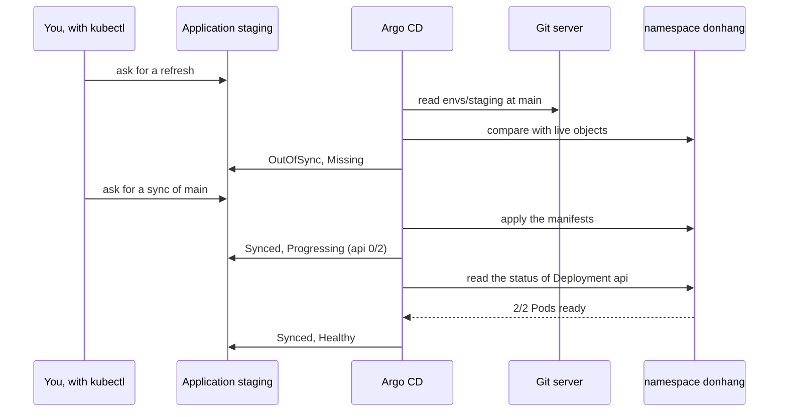

## Before you start

- [[devops.l3.argo-cd-applications]] — you know the Application `staging` maps `envs/staging` of the config repository to the namespace `donhang`, and that without a sync policy Argo CD only compares.
- [[k8s.l1.readiness-probes]] — you know a Pod counts as ready only once its readiness probe passes, and that the api's probe calls `/health/ready`.
- [[k8s.l1.rolling-updates]] — you know a Deployment's rollout is finished only when its new Pods are available, which `kubectl rollout status` waits for.

## The situation

In the last lesson you applied the Application `staging`, and Argo CD can now read `envs/staging` from the config repository. You expected the api, the database and the other services to start in the namespace `donhang`. Nothing starts. `kubectl get applications -n argocd` shows `staging` with two columns: one says `OutOfSync`, the other `Missing`.

A colleague starts a sync, and when it finishes the first column reads `Synced`. They tell the team staging is up. Yet `kubectl get deployment api -n donhang` shows `0/2` ready: no api Pod can take a request yet. What does each column tell you, and which one says staging actually works?

## Core concepts

- **sync status (Argo CD)** — Argo CD's verdict after comparing the manifests at the Application's revision (for `staging`, the branch `main`) with the live objects: `Synced` when every object matches, `OutOfSync` when any object differs or is missing.
- **sync (Argo CD)** — one run in which Argo CD applies the manifests at that revision to the cluster so the live objects match them. A sync policy is the part of an Application that lets Argo CD start syncs by itself; with none, as in `staging-manual.yaml`, a sync runs only when someone asks.
- **health status (Argo CD)** — Argo CD's separate judgement of whether the objects actually work, such as `Missing` when an object does not exist in the cluster yet, `Progressing` while a Deployment's Pods are not yet ready and `Healthy` once they are.

## How it works



Argo CD rereads the repository on an interval, not at the moment you look. A refresh asks it to read the repository and compare now. This lesson's script, `gitops-first-sync.sh` (the "You" in the diagram), asks for one: Argo CD reads `envs/staging` at `main` and compares each manifest with the live object of the same kind and name in `donhang`. None of them exists yet, so the sync status is `OutOfSync` and the health status is `Missing`.

Here Argo CD stops. `staging-manual.yaml` has no sync policy, so Argo CD reports the difference and waits. The script then asks for a sync: Argo CD applies the folder's manifests, much as `kubectl apply` would. Once the live objects match Git, the sync status turns `Synced`.

Matching Git says nothing about whether the api runs. The Deployment `api` now exists, but its Pods have not passed their readiness probe yet. Argo CD reports the Deployment, and with it the Application, as `Progressing`, and `Healthy` only once the Pods are ready.

The Application's health is the worst health among the objects it manages: if any object is not `Healthy`, neither is the Application. One api Pod that never passes its readiness probe keeps it there while the sync status stays `Synced`.

Argo CD looks only at the objects whose manifests are in its folder and the live objects it has marked as its own: during a sync it writes a mark on each object it applies, so "its own" means created or updated by one of its syncs. The namespace `donhang` is neither: OpenTofu created it when it set up the cluster, so Argo CD neither reports it missing nor changes it.

## In the Đơn Hàng system

The middle of the script that runs the first sync:

```bash file=scripts/devops/gitops-first-sync.sh tag=stage-3 lines=18-42
# lesson: devops.l3.synced-versus-healthy
# Argo CD rereads the repository on an interval; a refresh asks it to
# compare now. With no sync policy it only reports what differs.
app_refresh
app_wait OutOfSync Missing "" 120
echo
resources
echo

# lesson: devops.l3.synced-versus-healthy
# A sync applies the folder's manifests. Without the argocd CLI, kubectl asks
# for one by writing an operation into the Application.
echo "== sync"
kubectl patch application staging -n argocd --type merge \
  -p '{"operation":{"initiatedBy":{"username":"gitops-first-sync.sh"},"sync":{"revision":"main"}}}' -o name
for _ in $(seq 900); do
  phase=$(kubectl get application staging -n argocd -o jsonpath='{.status.operationState.phase}')
  [ "$phase" = Succeeded ] || [ "$phase" = Failed ] || [ "$phase" = Error ] && break
  sleep 1
done
echo "sync: $phase"
# Right after the sync: every object matches Git, the api's new Pods are
# not ready yet.
kubectl get application staging -n argocd
kubectl get deployment api -n donhang
```

```text output=true
== the Application, from deploy/gitops/lessons/staging-manual.yaml
application.argoproj.io/staging
staging: OutOfSync, Missing

ConfigMap/api               OutOfSync  
...
Service/redis               OutOfSync  

== sync
application.argoproj.io/staging
sync: Succeeded
NAME      SYNC STATUS   HEALTH STATUS
staging   Synced        Progressing
NAME   READY   UP-TO-DATE   AVAILABLE   AGE
api    0/2     2            0           ...

staging: Synced, Healthy
NAME      SYNC STATUS   HEALTH STATUS
staging   Synced        Healthy
NAME   READY   UP-TO-DATE   AVAILABLE   AGE
api    2/2     2            2           ...
...
== is the namespace donhang among the Application's objects?
no
```

Line 21 is the refresh: `app_refresh`, a helper from `scripts/lib/gitops.sh`, marks the Application with a request to compare now. Line 22 waits up to 120 seconds, at any commit (the empty `""`), until it shows `OutOfSync` and `Missing`, the health of objects that do not exist yet. Line 24 prints each object Argo CD manages with its sync status, and every row is `OutOfSync`.

Lines 31–32 ask for the sync without Argo CD's own command-line tool: `kubectl patch` writes a sync request for `main` into the Application, and Argo CD carries it out. Lines 33–37 wait until the Application records that this sync run has ended, and line 38 prints `sync: Succeeded`, yet lines 41–42 show `Synced` with `Progressing` and the api at `0/2`: the sync finished applying, and the Pods were still starting.

Outside the excerpt, line 44 waits for `Synced` and `Healthy`, and the api then shows `2/2`. Lines 53–55 check whether a `Namespace` is among the Application's objects; the answer is `no`.

What decides `Healthy` for the api:

```yaml file=deploy/gitops/config-repo/envs/staging/api.yaml tag=stage-3 lines=54-64
          # lesson: devops.l3.synced-versus-healthy
          # Argo CD reports the Deployment Healthy only once its Pods pass this
          # probe; until then the Application is Synced but Progressing.
          livenessProbe:
            httpGet:
              path: /health/live
              port: 8080
          readinessProbe:
            httpGet:
              path: /health/ready
              port: 8080
```

Lines 61–64, not the liveness probe above them, are the readiness probe you met in the k8s track: a Pod counts as ready only when `/health/ready` answers. Argo CD does not call `/health/ready` itself. It reads the Deployment's status, which counts ready Pods, and reports `Healthy` once the rollout is complete. An api that cannot reach PostgreSQL therefore leaves the Application `Synced` but never `Healthy`.

## Seniors often assume…

- **"`Synced` means the new version is up and serving requests."** → Actually `Synced` only says the live objects match Git; whether the api's Pods are ready is the health status. You notice this when `gitops-first-sync.sh` prints `Synced` and `Progressing` while the Deployment `api` shows `0/2` ready.
- **"Argo CD deploys whatever it finds in the repository as soon as it is installed."** → Actually it compares only folders an Application names, and an Application with no sync policy only reports what differs. You notice this when, after applying `staging-manual.yaml`, the Application shows `OutOfSync` and `Missing` and nothing in `donhang` starts until the script asks for a sync.
- **"Argo CD will delete the namespace `donhang` because it is not in Git."** → Actually Argo CD manages only objects whose manifests are in its folder; OpenTofu created the namespace when it set up the cluster, so it is neither reported missing nor changed. You notice this when the Application is `Synced` although `envs/staging` holds no namespace, and the script's last check prints `no`.

## Try it (3 minutes)

If you have not done the previous lesson's Try it, do that first, so the Application `staging` exists. Then, in the `don-hang` repository folder:

1. Run `kubectl --context kind-donhang-staging get application staging -n argocd`.
2. Run `scripts/devops/gitops-first-sync.sh`; the first sync can take several minutes beyond the 3 in the heading while images download; the script prints a status line each time it reaches a point it waits for, and stays quiet in between.
3. Run the command from step 1 again.

Expected result: step 1 shows `OutOfSync` under `SYNC STATUS` and `Missing` under `HEALTH STATUS`; if you have run the script before, it already shows `Synced` and `Healthy`. Step 2 prints `sync: Succeeded`, then `Synced` with `Progressing` and the api at `0/2`, then `Synced` with `Healthy` and `2/2`, and ends with `no`. Step 3 shows `Synced` and `Healthy`.

## Connections

- [[devops.l3.argo-cd-applications]] — prerequisite: the Application whose two statuses this lesson reads.
- [[k8s.l1.readiness-probes]] — the check behind `Healthy`: Argo CD's health of the api follows its readiness probe.
- [[k8s.l1.deploying-don-hang]] — the same backend applied by hand with `deploy.sh`; here Argo CD applies it and reports whether it matches and works.
- [[devops.l3.ordering-a-sync]] — next: in what order a sync applies the database, the migration and the api.
- [[devops.l3.deploying-by-commit]] — where a sync starts by itself after a commit, instead of by request.

## Five-line summary

1. `Synced` means the live objects match Git; `Healthy` means they actually work, and Argo CD reports the two separately.
2. Argo CD compares the manifests at the Application's revision with the live objects; any difference or missing object makes it `OutOfSync`.
3. A sync applies the folder's manifests; with no sync policy, Argo CD only reports `OutOfSync` and waits for someone to start one.
4. Right after a sync the api is `Synced` but `Progressing` until its Pods pass the readiness probe; one unready object keeps the Application from `Healthy`.
5. Argo CD rereads Git on an interval, compares at once on refresh, and leaves objects outside its folder, like the namespace `donhang`, alone.
