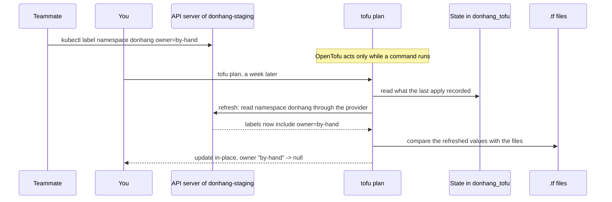

## Before you start

- [[devops.l3.remote-state-and-locking]] — you know a layer here is one folder under `deploy/tofu/envs/<environment>/` with its own state, that staging's platform layer keeps it in the `pg` backend, and that `scripts/devops/tofu-env.sh` runs `tofu` in one such folder.
- [[k8s.l1.control-plane-components]] — you know a control loop keeps comparing the state the API server holds with what runs, and acts on the difference.
- [[k8s.l1.labels]] — you know a label is a key–value pair under `metadata.labels`, and that `kubectl` can add one to an object.

## The situation

At stage-3, staging's platform layer is applied, and its plan has shown no changes since. While chasing a problem, a teammate marks the namespace with `kubectl label namespace donhang owner=by-hand`, so others know who is looking at it. A week later you run `tofu plan` on the platform layer, expecting no changes. The plan says the namespace `will be updated in-place`, and the update removes `owner`. `git log` shows no commit touching `deploy/tofu` in that week. Where does a change come from that nobody wrote in the files, and how do you catch one before an apply erases it?

## Core concepts

- **drift (configuration drift)** — a difference between real infrastructure and its configuration that was made outside OpenTofu; in the situation above, the `owner` label added with `kubectl label`.
- Refresh — by default, the first step of `tofu plan`: for each resource in the state, OpenTofu asks its provider to read the real object's current attributes.
- Refresh-only mode — `-refresh-only` on `plan` or `apply`: compare what the state recorded with what the refresh read, and leave every real object as it is.
- Detailed exit code — `-detailed-exitcode` on `tofu plan`: the exit code, the number a command hands back to the shell when it finishes, also says whether the plan has changes.

## How it works



In the situation above, the label is drift: your teammate changed the namespace through the API server, and OpenTofu took no part in it. The files still declare only the namespace's own labels, and the state still records what the last apply left.

By default, `tofu plan` begins with a refresh: it reads the state, which lists the objects to refresh, and the `kubernetes` provider reads namespace `donhang` from the cluster, finding `owner=by-hand`. OpenTofu then compares the refreshed values with the configuration. The files have no `owner` label, so the plan proposes to remove it, as an update in place. The plan does not know who made a difference; it shows only what an apply would do to make the object match the files.

`-refresh-only` makes a different comparison: what the state recorded against what the refresh read, leaving the files out. `tofu plan -refresh-only` lists each object that `has changed` outside OpenTofu and proposes no action on it. `tofu apply -refresh-only` writes those read values into the state and changes no real object.

OpenTofu reads and changes infrastructure only while you run a command such as `plan` or `apply`. A Kubernetes control loop keeps comparing and acting, which is how a Deployment gets a deleted Pod back. With OpenTofu, drift stays until someone runs a command. Any plain `tofu apply` of this layer, even one made for an unrelated change, would also remove the label.

`-detailed-exitcode` makes the check usable without reading: `tofu plan` exits with 0 when the plan has no changes, 2 when it has some, and 1 on error. A script run on a schedule can report drift from that number alone.

## In the Đơn Hàng system

Staging's platform layer gets everything it manages from one module call. The two `sealing_` lines pass in a key pair and do not matter here:

```hcl file=deploy/tofu/envs/staging/platform/main.tf tag=stage-3 lines=26-37
# lesson: devops.l3.configuration-drift
# The namespace donhang and the sealing key, from files outside Git: the key
# pair scripts/dev-secrets.sh creates in secrets/ at the repository's root.
module "platform" {
  source              = "../../../modules/donhang-platform"
  sealing_certificate = file("${path.root}/../../../../../secrets/sealing.crt")
  sealing_private_key = file("${path.root}/../../../../../secrets/sealing.key")

  # PostgreSQL, RabbitMQ, Keycloak, Redis and Mailpit run their images as
  # they are and pass baseline, not restricted (k8s.l3.pod-security-admission).
  pod_security_enforce = "baseline"
}
```

`module "platform"` creates both objects this layer manages: the namespace `donhang` and the Secret `sealing-key`. Inside the module, in `deploy/tofu/modules/donhang-platform/main.tf` (outside this excerpt), the namespace's labels are exactly three, with keys starting `pod-security.kubernetes.io/`; `pod_security_enforce` sets the value of one of them. Those labels belong to a later lesson; here it matters only that `owner` is not one of them, so an `owner` label on the real namespace is drift.

`scripts/devops/tofu-drift.sh` makes that drift and looks for it. `tofu_platform`, defined above the excerpt, runs `scripts/devops/tofu-env.sh staging platform` with the given arguments:

```bash file=scripts/devops/tofu-drift.sh tag=stage-3 lines=8-27
# lesson: devops.l3.configuration-drift
# A change made outside OpenTofu: nothing happens until someone plans.
echo "== kubectl label namespace donhang owner=by-hand"
kubectl --context kind-donhang-staging label namespace donhang owner=by-hand
echo

# plan refreshes first, so the label shows up as something it would undo.
# -detailed-exitcode: 2 when the plan has changes, 0 when it has none.
echo "== tofu plan -detailed-exitcode"
status=0
tofu_platform plan -detailed-exitcode -no-color > "${TMPDIR:-/tmp}/drift-plan.txt" || status=$?
sed -n '/^  # /,/^Plan:/p' "${TMPDIR:-/tmp}/drift-plan.txt"
rm -f "${TMPDIR:-/tmp}/drift-plan.txt"
echo "exit code: $status"
echo

# lesson: devops.l3.configuration-drift
# -refresh-only lists only what changed outside OpenTofu.
echo "== tofu plan -refresh-only"
tofu_platform plan -refresh-only -no-color | sed -n '/^  # /,/^    }$/p' 
```

```text output=true
== kubectl label namespace donhang owner=by-hand
namespace/donhang labeled

== tofu plan -detailed-exitcode
  # module.platform.kubernetes_namespace_v1.donhang will be updated in-place
...
              - "owner"                              = "by-hand" -> null
...
Plan: 0 to add, 1 to change, 0 to destroy.
exit code: 2

== tofu plan -refresh-only
  # module.platform.kubernetes_namespace_v1.donhang has changed
...
              + "owner"                              = "by-hand"
...
  # module.platform.kubernetes_secret_v1.sealing_key has changed
...
== tofu apply
Apply complete! Resources: 0 added, 1 changed, 0 destroyed.
labels now: {"kubernetes.io/metadata.name":"donhang","pod-security.kubernetes.io/audit":"restricted","pod-security.kubernetes.io/enforce":"baseline","pod-security.kubernetes.io/warn":"restricted"}
tofu plan -detailed-exitcode: exit code 0
```

The script starts with `set -euo pipefail` (above the excerpt); its `-e` stops the script at the first command that exits with a nonzero code, unless that command is part of a `||` list. So `status=0` and `|| status=$?` keep the 2 without stopping it. The `sed` lines keep only each plan's resource entries, and `...` marks output lines the lesson left out. The plain plan marks `owner` with `-` and `-> null`: the apply would remove it. The refresh-only plan shows the same label with `+` under `has changed`: it was added outside OpenTofu.

That plan also lists the Secret `sealing-key`. Annotations are another key–value map under `metadata`, like labels; the refresh read an empty `annotations` map where the state had none. The script never touches that Secret, so read every entry instead of taking each one for a hand edit.

The script's last lines, outside the excerpt, run `tofu apply -auto-approve`, which applies without waiting for `yes`: the label is gone and the next plan exits with 0. A comment there says that if the label were right, the fix would be to add it in `deploy/tofu/modules/donhang-platform` instead.

## Seniors often assume…

- **"Once OpenTofu has applied a change, it keeps the infrastructure that way, like Kubernetes keeps a Deployment's Pods running."** → Actually OpenTofu reads and changes infrastructure only while you run a command such as `plan` or `apply`, so a hand-made label stays until someone plans or applies. You notice this when a change made by hand weeks ago first shows up in the plan of someone's unrelated change.
- **"`tofu apply -refresh-only` puts the infrastructure back the way the files describe it."** → Actually it works in the other direction: it copies the real values into the state and changes no object. The label stays on the namespace, and because the files still lack it, the next plain plan still proposes to remove it. You notice this when `tofu plan -refresh-only` reports nothing after such an apply, yet `tofu plan` still shows the update.
- **"If `tofu plan` shows a change nobody wrote, someone must have edited the `.tf` files."** → Actually the plan compares the files with the refreshed real objects, so a change made with `kubectl` or any other tool shows up the same way. `tofu plan -refresh-only` names the objects that changed outside OpenTofu. You notice this when `git log -- deploy/tofu` shows no recent commit, yet the plan proposes an update.

## Try it (3 minutes)

At the root of Đơn Hàng at stage-3, with `scripts/up.sh` and `scripts/devops/tofu-environments.sh` already run as in the remote-state lesson, in Git Bash:

1. Run `scripts/devops/tofu-drift.sh`.
2. Compare the sign in front of `"owner"` in the first plan with the one in the refresh-only plan, and compare the two exit codes.
3. Think: the team decides the `owner` label is right and should stay. What do you change so that the next `tofu plan` exits with 0 and the label stays?

Expected result: the first plan removes `owner` (`-` and `-> null`) and exits with 2; the refresh-only plan shows `+ "owner"` under `has changed`; after the apply, `labels now:` has no `owner`, and the last plan exits with 0.

<details><summary>Suggested answer</summary>

Write the label into the files: add `owner` with the value `by-hand` to the namespace's labels in `deploy/tofu/modules/donhang-platform/main.tf`, and commit it. The refreshed namespace and the files then agree, so the plan has no changes and exits with 0. Production's platform layer calls the same module, so its namespace would get the label on its next apply too. Applying the unchanged files would remove the label again. `tofu apply -refresh-only` alone would not help either: the state would record the label, but the files still would not have it.

</details>

## Connections

- [[devops.l3.plan-and-apply]] — the plan's `will be updated in-place` header, here produced by a change nobody made in the files.
- [[devops.l3.remote-state-and-locking]] — prerequisite: the shared state that refresh compares with and `apply -refresh-only` writes.
- [[k8s.l1.control-plane-components]] — the opposite behaviour: a control loop corrects differences on its own, while OpenTofu waits for a command.
- [[k8s.l1.manifests-and-kubectl-apply]] — the same split one tool over: manifests in Git declare the desired state, and a change made only in the cluster is one Git does not record.
- [[devops.l3.pull-based-deployment]] — next module: a tool inside the cluster that keeps comparing it with Git, instead of waiting for someone to run a plan.

## Five-line summary

1. Drift is a difference between real infrastructure and its files made outside OpenTofu, such as a label added with `kubectl label`.
2. `tofu plan` refreshes first, reading each object through its provider, so a hand-made label shows up as a change it would undo.
3. `tofu plan -refresh-only` lists only what changed outside OpenTofu; `tofu apply -refresh-only` records it in the state and changes no object.
4. OpenTofu acts only while a command runs: drift stays until a plan finds it, and `-detailed-exitcode` exits with 2 when there are changes.
5. When the hand-made change was right, write it into the files; applying the unchanged files removes it.
