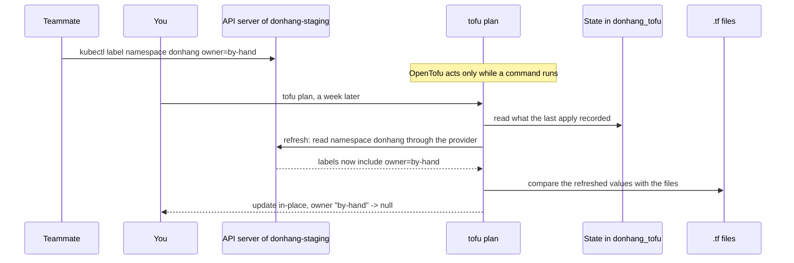

## Bạn cần biết trước

- [[devops.l3.remote-state-and-locking]] — bạn biết mỗi tầng ở đây là một thư mục dưới `deploy/tofu/envs/<environment>/` với state riêng, tầng platform của staging giữ state trong backend `pg`, và `scripts/devops/tofu-env.sh` chạy `tofu` trong một thư mục như thế.
- [[k8s.l1.control-plane-components]] — bạn biết một vòng điều khiển liên tục so trạng thái API server đang giữ với thứ đang chạy, rồi xử lý phần chênh lệch.
- [[k8s.l1.labels]] — bạn biết label là một cặp khóa–giá trị nằm dưới `metadata.labels`, và `kubectl` có thể thêm label vào một object.

## Tình huống

Ở stage-3, tầng platform của staging đã được apply, và plan của nó từ đó tới giờ không báo thay đổi nào. Trong lúc dò một lỗi, một đồng nghiệp đánh dấu namespace bằng `kubectl label namespace donhang owner=by-hand` để người khác biết ai đang xem nó. Một tuần sau, bạn chạy `tofu plan` cho tầng platform và chờ kết quả không có thay đổi. Plan lại báo namespace `will be updated in-place`, và lần cập nhật đó xóa `owner`. `git log` cho thấy cả tuần không có commit nào đụng tới `deploy/tofu`. Thay đổi mà không ai viết vào file thì từ đâu ra, và làm sao bắt được nó trước khi một lần apply xóa mất?

## Khái niệm cốt lõi

- **drift (configuration drift)** (khác biệt giữa hạ tầng thật và cấu hình của nó do thay đổi làm ngoài công cụ IaC, vd sửa bằng tay) — ở đây, công cụ đó là OpenTofu. Trong tình huống trên, đó là label `owner` thêm bằng `kubectl label`.
- Refresh — mặc định là bước đầu tiên của `tofu plan`: với mỗi resource trong state, OpenTofu nhờ provider của nó đọc các thuộc tính hiện tại của object thật.
- Chế độ refresh-only — `-refresh-only` trên `plan` hoặc `apply`: so thứ state đã ghi với thứ refresh vừa đọc, và để nguyên mọi object thật.
- Mã thoát chi tiết — `-detailed-exitcode` trên `tofu plan`: mã thoát, con số một lệnh trả về cho shell khi kết thúc, còn cho biết plan có thay đổi hay không.

## Cơ chế hoạt động



Trong tình huống trên, label đó là drift: đồng nghiệp của bạn sửa namespace qua API server, và OpenTofu không hề tham gia. File vẫn chỉ khai báo các label riêng của namespace, còn state vẫn ghi lại những gì lần apply cuối để lại.

Mặc định, `tofu plan` bắt đầu bằng refresh: nó đọc state để biết cần refresh những object nào, rồi provider `kubernetes` đọc namespace `donhang` từ cluster và thấy `owner=by-hand`. Sau đó OpenTofu so các giá trị vừa refresh với cấu hình. File không có label `owner`, nên plan đề xuất xóa nó bằng một lần cập nhật tại chỗ. Plan không biết ai tạo ra chênh lệch. Nó chỉ cho thấy một lần apply sẽ làm gì để object khớp với file.

`-refresh-only` so theo cách khác: thứ state đã ghi với thứ refresh vừa đọc, không tính tới file. `tofu plan -refresh-only` liệt kê từng object `has changed` ở ngoài OpenTofu và không đề xuất hành động nào với nó. `tofu apply -refresh-only` ghi các giá trị đọc được đó vào state và không đổi object thật nào.

OpenTofu chỉ đọc và thay đổi hạ tầng trong lúc bạn chạy một lệnh như `plan` hay `apply`. Một vòng điều khiển của Kubernetes thì liên tục so và xử lý, nhờ vậy Deployment lấy lại được Pod bị xóa. Với OpenTofu, drift nằm yên cho tới khi có người chạy lệnh. Bất kỳ lần `tofu apply` thông thường nào cho tầng này, kể cả lần apply vì một thay đổi không liên quan, cũng sẽ xóa label đó.

`-detailed-exitcode` giúp kiểm tra mà không cần đọc output: `tofu plan` thoát với 0 khi plan không có thay đổi, 2 khi có, và 1 khi lỗi. Một script chạy theo lịch có thể báo drift chỉ dựa vào con số đó.

## Trong hệ thống Đơn Hàng

Tầng platform của staging lấy mọi thứ nó quản lý từ một lần gọi module. Hai dòng `sealing_` truyền vào một cặp khóa và không quan trọng ở đây:

```hcl file=deploy/tofu/envs/staging/platform/main.tf tag=stage-3 lines=26-37
# lesson: devops.l3.configuration-drift
# The namespace donhang and the sealing key, from files outside Git: the key
# pair scripts/dev-secrets.sh creates in secrets/ at the repository's root.
module "platform" {
  source              = "../../../modules/donhang-platform"
  sealing_certificate = file("${path.root}/../../../../../secrets/sealing.crt")
  sealing_private_key = file("${path.root}/../../../../../secrets/sealing.key")

  # PostgreSQL, RabbitMQ, Keycloak, Redis and Mailpit run their images as
  # they are and pass baseline, not restricted (k8s.l3.pod-security-admission).
  pod_security_enforce = "baseline"
}
```

`module "platform"` tạo cả hai object mà tầng này quản lý: namespace `donhang` và Secret `sealing-key`. Bên trong module, ở `deploy/tofu/modules/donhang-platform/main.tf` (ngoài đoạn trích), namespace có đúng ba label, khóa đều bắt đầu bằng `pod-security.kubernetes.io/`; `pod_security_enforce` đặt giá trị cho một trong số đó. Các label này thuộc về một bài sau. Ở đây chỉ cần biết `owner` không nằm trong số đó, nên label `owner` trên namespace thật là drift.

`scripts/devops/tofu-drift.sh` tạo ra drift đó rồi đi tìm nó. `tofu_platform`, định nghĩa phía trên đoạn trích, chạy `scripts/devops/tofu-env.sh staging platform` với các tham số được truyền vào:

```bash file=scripts/devops/tofu-drift.sh tag=stage-3 lines=8-27
# lesson: devops.l3.configuration-drift
# A change made outside OpenTofu: nothing happens until someone plans.
echo "== kubectl label namespace donhang owner=by-hand"
kubectl --context kind-donhang-staging label namespace donhang owner=by-hand
echo

# plan refreshes first, so the label shows up as something it would undo.
# -detailed-exitcode: 2 when the plan has changes, 0 when it has none.
echo "== tofu plan -detailed-exitcode"
status=0
tofu_platform plan -detailed-exitcode -no-color > "${TMPDIR:-/tmp}/drift-plan.txt" || status=$?
sed -n '/^  # /,/^Plan:/p' "${TMPDIR:-/tmp}/drift-plan.txt"
rm -f "${TMPDIR:-/tmp}/drift-plan.txt"
echo "exit code: $status"
echo

# lesson: devops.l3.configuration-drift
# -refresh-only lists only what changed outside OpenTofu.
echo "== tofu plan -refresh-only"
tofu_platform plan -refresh-only -no-color | sed -n '/^  # /,/^    }$/p' 
```

```text output=true
== kubectl label namespace donhang owner=by-hand
namespace/donhang labeled

== tofu plan -detailed-exitcode
  # module.platform.kubernetes_namespace_v1.donhang will be updated in-place
...
              - "owner"                              = "by-hand" -> null
...
Plan: 0 to add, 1 to change, 0 to destroy.
exit code: 2

== tofu plan -refresh-only
  # module.platform.kubernetes_namespace_v1.donhang has changed
...
              + "owner"                              = "by-hand"
...
  # module.platform.kubernetes_secret_v1.sealing_key has changed
...
== tofu apply
Apply complete! Resources: 0 added, 1 changed, 0 destroyed.
labels now: {"kubernetes.io/metadata.name":"donhang","pod-security.kubernetes.io/audit":"restricted","pod-security.kubernetes.io/enforce":"baseline","pod-security.kubernetes.io/warn":"restricted"}
tofu plan -detailed-exitcode: exit code 0
```

Script bắt đầu bằng `set -euo pipefail` (phía trên đoạn trích). `-e` trong đó dừng script ở lệnh đầu tiên thoát với mã khác 0, trừ khi lệnh đó nằm trong một chuỗi `||`. Vì thế `status=0` và `|| status=$?` giữ lại số 2 mà không làm script dừng. Các dòng `sed` chỉ giữ phần mục resource của mỗi plan, còn `...` đánh dấu những dòng output bài đã lược bỏ. Plan thường đánh dấu `owner` bằng `-` và `-> null`: lần apply sẽ xóa nó. Plan refresh-only hiện cùng label đó với `+` dưới `has changed`: nó được thêm ở ngoài OpenTofu.

Plan đó còn liệt kê Secret `sealing-key`. Annotation là một map khóa–giá trị khác dưới `metadata`, giống label. Lần refresh đọc được một map `annotations` rỗng, trong khi state không có map nào. Script không hề đụng tới Secret đó, nên hãy đọc từng mục, đừng coi mục nào cũng là một lần sửa tay.

Mấy dòng cuối của script, ngoài đoạn trích, chạy `tofu apply -auto-approve`, tức apply mà không chờ gõ `yes`: label biến mất và plan kế tiếp thoát với 0. Một comment ở đó ghi rằng nếu label là đúng thì cách sửa là thêm nó vào `deploy/tofu/modules/donhang-platform`.

## Senior hay nhầm rằng…

- **"Khi OpenTofu đã apply một thay đổi, nó giữ hạ tầng y như thế, giống Kubernetes giữ các Pod của một Deployment luôn chạy."** → Thực ra OpenTofu chỉ đọc và thay đổi hạ tầng trong lúc bạn chạy một lệnh như `plan` hay `apply`, vì thế label thêm bằng tay nằm nguyên cho tới khi có người plan hoặc apply. Bạn sẽ nhận ra khi một thay đổi làm bằng tay từ nhiều tuần trước lần đầu hiện ra trong plan của một thay đổi chẳng liên quan của ai đó.
- **"`tofu apply -refresh-only` đưa hạ tầng về đúng như file mô tả."** → Thực ra nó đi theo chiều ngược lại: nó chép giá trị thật vào state và không đổi object nào. Label vẫn nằm trên namespace, và vì file vẫn không có nó, plan thường kế tiếp vẫn đề xuất xóa. Bạn sẽ nhận ra khi `tofu plan -refresh-only` không báo gì sau lần apply như thế, nhưng `tofu plan` vẫn hiện lần cập nhật.
- **"Nếu `tofu plan` hiện một thay đổi không ai viết, chắc có người đã sửa file `.tf`."** → Thực ra plan so file với các object thật vừa refresh, vì thế một thay đổi làm bằng `kubectl` hay công cụ nào khác cũng hiện ra y như vậy. `tofu plan -refresh-only` chỉ ra những object đã đổi ở ngoài OpenTofu. Bạn sẽ nhận ra khi `git log -- deploy/tofu` không có commit nào gần đây, nhưng plan vẫn đề xuất cập nhật.

## Thử ngay (3 phút)

Ở thư mục gốc của Đơn Hàng tại stage-3, đã chạy `scripts/up.sh` và `scripts/devops/tofu-environments.sh` như trong bài remote state, mở Git Bash:

1. Chạy `scripts/devops/tofu-drift.sh`.
2. So dấu đứng trước `"owner"` trong plan đầu tiên với dấu trong plan refresh-only, và so hai mã thoát.
3. Suy nghĩ: nhóm quyết định label `owner` là đúng và cần giữ lại. Bạn đổi gì để lần `tofu plan` kế tiếp thoát với 0 mà label vẫn còn?

Kết quả mong đợi: plan đầu tiên xóa `owner` (`-` và `-> null`) và thoát với 2. Plan refresh-only hiện `+ "owner"` dưới `has changed`. Sau lần apply, `labels now:` không còn `owner`, và plan cuối thoát với 0.

<details><summary>Gợi ý đáp án</summary>

Viết label vào file: thêm `owner` với giá trị `by-hand` vào các label của namespace trong `deploy/tofu/modules/donhang-platform/main.tf`, rồi commit. Khi đó namespace vừa refresh và file khớp nhau, nên plan không có thay đổi và thoát với 0. Tầng platform của production gọi cùng module này, nên namespace bên đó cũng sẽ có label ở lần apply kế tiếp. Apply file chưa sửa sẽ lại xóa label. Chỉ chạy `tofu apply -refresh-only` cũng không giúp được: state sẽ ghi lại label, nhưng file vẫn không có nó.

</details>

## Liên hệ

- [[devops.l3.plan-and-apply]] — tiêu đề `will be updated in-place` của plan, ở đây sinh ra từ một thay đổi không ai viết vào file.
- [[devops.l3.remote-state-and-locking]] — điều kiện tiên quyết: state dùng chung mà refresh đem ra so, và `apply -refresh-only` ghi vào.
- [[k8s.l1.control-plane-components]] — cách làm ngược lại: vòng điều khiển tự sửa chênh lệch, còn OpenTofu chờ có lệnh.
- [[k8s.l1.manifests-and-kubectl-apply]] — cùng sự tách bạch đó ở một công cụ khác: manifest trong Git khai báo trạng thái mong muốn, còn thay đổi chỉ làm trong cluster thì Git không ghi lại.
- [[devops.l3.pull-based-deployment]] — module kế tiếp: một công cụ nằm trong cluster liên tục so cluster với Git, thay vì chờ ai đó chạy plan.

## Tóm tắt 5 dòng

1. Drift là khác biệt giữa hạ tầng thật và file của nó, tạo ra ở ngoài OpenTofu, như một label thêm bằng `kubectl label`.
2. `tofu plan` refresh trước, đọc từng object qua provider của nó, nên label thêm bằng tay hiện ra thành một thay đổi plan sẽ hoàn tác.
3. `tofu plan -refresh-only` chỉ liệt kê những gì đã đổi ở ngoài OpenTofu. `tofu apply -refresh-only` ghi nó vào state và không đổi object nào.
4. OpenTofu chỉ hành động trong lúc một lệnh chạy: drift nằm yên tới khi một plan tìm ra, và `-detailed-exitcode` thoát với 2 khi có thay đổi.
5. Khi thay đổi làm bằng tay là đúng, hãy viết nó vào file. Apply file chưa sửa sẽ xóa nó.
