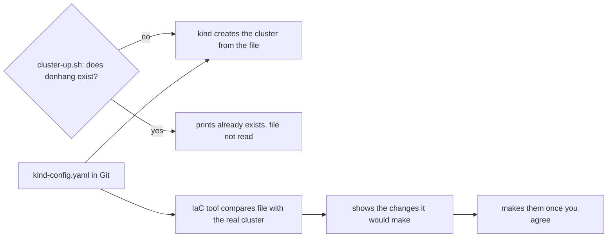

## Before you start

- [[k8s.l1.manifests-and-kubectl-apply]] — you know a manifest declares what should exist and `kubectl apply` makes the cluster's objects match it.
- [[k8s.l1.cluster-nodes-and-control-plane]] — you know `deploy/k8s/kind-config.yaml` lists the nodes and `scripts/k8s/cluster-up.sh` creates the cluster `donhang` from it.
- [[k8s.l1.deploying-don-hang]] — you know `scripts/k8s/deploy.sh` puts the backend into that cluster, with the database keeping its data only as long as its Pod.
- [[devops.l1.why-not-deploy-by-hand]] — you know why the target's needs and the steps should be written down for a program to follow.

## The situation

A pull request adds a third worker node to `deploy/k8s/kind-config.yaml`. It is reviewed and merged, and you pull it. You run `scripts/k8s/cluster-up.sh`, as you always do. It prints `The cluster donhang already exists.` and finishes without an error.

`kubectl get nodes` still lists three nodes: one control plane, two workers. The file in Git now says four. Nothing failed and nobody was warned. If the file that describes the cluster can say one thing while the cluster is another, what would it take for the file to actually decide what the cluster looks like?

## Core concepts

- **infrastructure as code (IaC)** — describing the machines, clusters and services a system runs on in files kept in Git, and letting a tool create or change them from those files instead of by hand.
- Create-once script — a script that makes something only when it is missing, like `cluster-up.sh`; it is safe to run twice, but it never looks at what the existing thing contains.
- Comparison with what exists — reading the real cluster and listing every way it differs from the file, such as a worker node the file has and the cluster lacks.
- Preview of changes — the list of changes a tool shows before it makes any of them, so you can check it like a diff in a pull request.

## How it works



In the situation above, follow the path that starts at `cluster-up.sh`. It asks kind one question: is there a cluster named `donhang`? On the first day the answer is no, so the script hands `kind-config.yaml` to `kind create cluster`, and the cluster gets exactly the nodes the file lists. From then on the answer is yes, and the script skips the file: it only switches `kubectl` to the cluster. An edit to the file reaches nothing.

kind's documentation uses the node list only when `kind create cluster --config` makes a new cluster. So the only scripted way in Đơn Hàng at `stage-2` to make the cluster follow an edited node list is `scripts/k8s/cluster-down.sh`, then `cluster-up.sh`. Deleting the cluster deletes every node container and every object that ran inside, database data included. You then run `deploy.sh` again from the start.

The path through the IaC tool is what infrastructure as code adds. A tool like the one this module uses next reads the file kept in Git, then reads what really exists, and compares the two. Before changing anything, it shows you the list of changes. The part of that tool which handles kind cannot change an existing kind cluster, so for this edit the list shows one worker more by replacing the whole cluster. As with `cluster-down.sh`, every object inside is lost; the gain is that the list tells you so before anything is deleted, and you check it before letting the tool act. Run it again with nothing edited, and the list is empty.

## In the Đơn Hàng system

The check in `cluster-up.sh`:

```bash file=scripts/k8s/cluster-up.sh tag=stage-2 lines=7-17
# lesson: k8s.l1.cluster-nodes-and-control-plane
# Nothing to do when the cluster already exists; scripts/k8s/cluster-down.sh
# deletes it. --wait: return only once the control plane is ready.
if kind get clusters 2>/dev/null | grep -qx donhang; then
  echo "The cluster donhang already exists."
  kubectl config use-context kind-donhang
else
  # kind ends with a greeting it picks at random; awk stops printing before it.
  kind create cluster --name donhang --config deploy/k8s/kind-config.yaml --wait 180s 2>&1 \
    | awk '!done { print } /^kubectl cluster-info/ { done = 1 }'
fi
```

The `if` line is the whole check: `kind get clusters` prints one cluster name per line (`2>/dev/null` keeps kind's error messages off the screen), and `grep -qx donhang` succeeds when a line is exactly `donhang`. Only the `else` branch passes `kind-config.yaml` to kind. The `if` branch switches `kubectl` to the existing cluster and moves on. It compares no node, no image and no role.

The file that branch ignores, from its first non-comment line:

```yaml file=deploy/k8s/kind-config.yaml tag=stage-2 lines=6-14
kind: Cluster
apiVersion: kind.x-k8s.io/v1alpha4
nodes:
  - role: control-plane
    image: kindest/node:v1.34.11@sha256:44e222ee2132dab25ff87301682f89eb82c7880ea3a1bf543bfe9708fd08d67d
  - role: worker
    image: kindest/node:v1.34.11@sha256:44e222ee2132dab25ff87301682f89eb82c7880ea3a1bf543bfe9708fd08d67d
  - role: worker
    image: kindest/node:v1.34.11@sha256:44e222ee2132dab25ff87301682f89eb82c7880ea3a1bf543bfe9708fd08d67d
```

Three entries under `nodes`, each with a role and the same node image pinned by its digest. The file holds no steps; it only says what the cluster should be. It has the fields `kind` and `apiVersion` like a manifest, but only the kind tool reads it; `deploy.sh` never passes it to `kubectl`. What Đơn Hàng lacks at `stage-2` is a tool that reads it on every run and compares it with the cluster.

## Seniors often assume…

- **"A setup script that is idempotent, safe to run twice, is already infrastructure as code."** → Actually `cluster-up.sh` is idempotent only about whether the cluster exists; it checks a name, not the contents the file describes. Infrastructure as code compares what the file describes with what exists and changes the difference. You notice this when an edit to `kind-config.yaml` is merged and `cluster-up.sh` still prints `already exists` and exits without an error.
- **"`kind-config.yaml` is in Git, so the running cluster always matches it."** → Actually Git keeps the file's history; nothing reads the file after the first day. You notice this when `kubectl get nodes` lists a different number of nodes than the file has entries under `nodes`, and no command ever reported it.
- **"`kubectl apply` already makes the cluster match the files in Git, so there is nothing left for another tool to describe."** → Actually `kubectl apply` makes objects match their files only inside a cluster that must already exist. The cluster itself, its nodes and their node image, is in none of the Kubernetes manifests `deploy.sh` applies; only `kind-config.yaml` describes it, and only kind reads that file. You notice this when `deploy.sh` succeeds against a cluster that still has the node count of the old file.

## Try it (3 minutes)

With the `donhang` cluster running, in the `don-hang` repository folder, in the shell you use for `kubectl`:

1. In `deploy/k8s/kind-config.yaml`, delete the second `- role: worker` line and the `image:` line under it, the last two lines of the file.
2. Run `scripts/k8s/cluster-up.sh`, then `kubectl get nodes`.
3. Run `git checkout deploy/k8s/kind-config.yaml` to undo the edit.

Expected result: step 2 prints `The cluster donhang already exists.` and finishes without an error. `kubectl get nodes` still lists three nodes, two of them workers, while the file you edited declares two nodes, only one of them a worker.

## Connections

- [[k8s.l1.cluster-nodes-and-control-plane]] — the file and script examined here, seen there only on the day the cluster is created.
- [[k8s.l1.control-plane-components]] — the same idea one layer down: control loops compare the desired state stored in the cluster's objects with what runs, and act on the difference.
- [[devops.l1.why-not-deploy-by-hand]] — the same argument as there, applied to the cluster instead of the deploy steps.
- [[devops.l2.deployment-environments]] — each environment needs its own infrastructure; describing it in files is how a second one can be made like the first.
- [[devops.l3.opentofu-resources]] — next: the tool this module uses, and how one of its files declares a single object.

## Five-line summary

1. Infrastructure as code keeps infrastructure in files in Git and lets a tool compare them with what exists and change the difference.
2. `cluster-up.sh` creates the cluster `donhang` from `kind-config.yaml` only when no cluster of that name exists.
3. After that, edits to `kind-config.yaml` change nothing, and the cluster can disagree with the file without any warning.
4. At `stage-2` the only scripted way to apply such an edit is `cluster-down.sh` then `cluster-up.sh`, losing every object in the cluster.
5. A tool like the next lesson's shows the changes it would make before making them, and none when the file and reality agree.
