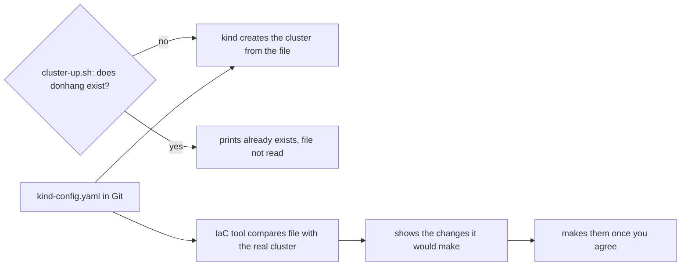

## Bạn cần biết trước

- [[k8s.l1.manifests-and-kubectl-apply]] — bạn biết manifest khai báo những gì phải tồn tại, và `kubectl apply` làm cho các object trong cluster khớp với nó.
- [[k8s.l1.cluster-nodes-and-control-plane]] — bạn biết `deploy/k8s/kind-config.yaml` liệt kê các node, và `scripts/k8s/cluster-up.sh` tạo cluster `donhang` từ file đó.
- [[k8s.l1.deploying-don-hang]] — bạn biết `scripts/k8s/deploy.sh` đưa backend vào cluster đó, còn database chỉ giữ dữ liệu chừng nào Pod của nó còn sống.
- [[devops.l1.why-not-deploy-by-hand]] — bạn biết vì sao nhu cầu của môi trường đích và các bước phải được ghi ra để một chương trình làm theo.

## Tình huống

Một pull request thêm worker node thứ ba vào `deploy/k8s/kind-config.yaml`. Nó được review, được merge, và bạn pull về. Bạn chạy `scripts/k8s/cluster-up.sh` như mọi lần. Script in ra `The cluster donhang already exists.` rồi kết thúc, không báo lỗi.

`kubectl get nodes` vẫn liệt kê ba node: một control plane, hai worker. File trong Git giờ ghi bốn. Không có gì thất bại, cũng không ai được cảnh báo. Nếu file mô tả cluster có thể nói một đằng trong khi cluster là một nẻo, thì cần gì để file thật sự quyết định cluster trông ra sao?

## Khái niệm cốt lõi

- **infrastructure as code (IaC)** (mô tả máy, cluster, dịch vụ trong file lưu ở Git để một công cụ tạo và thay đổi chúng theo file, không làm bằng tay) — mô tả máy, cluster và dịch vụ mà hệ thống chạy trên đó bằng các file giữ trong Git, rồi để một công cụ tạo hoặc thay đổi chúng theo các file ấy thay vì làm tay.
- Script tạo một lần — script chỉ tạo một thứ khi thứ đó chưa có, như `cluster-up.sh`. Chạy hai lần vẫn an toàn, nhưng nó không bao giờ nhìn vào bên trong thứ đã có.
- So với cái đang tồn tại — đọc cluster thật rồi liệt kê mọi chỗ nó khác với file, chẳng hạn một worker node có trong file mà cluster không có.
- Xem trước thay đổi — danh sách thay đổi mà công cụ đưa ra trước khi làm bất kỳ thay đổi nào, để bạn kiểm tra như xem diff trong một pull request.

## Cơ chế hoạt động



Với tình huống trên, hãy đi theo nhánh bắt đầu từ `cluster-up.sh`. Script hỏi kind đúng một câu: đã có cluster tên `donhang` chưa? Ngày đầu tiên câu trả lời là chưa, nên script đưa `kind-config.yaml` cho `kind create cluster`, và cluster có đúng các node mà file liệt kê. Từ đó trở đi câu trả lời là có rồi, và script bỏ qua file: nó chỉ chuyển `kubectl` sang cluster đó. Sửa file không tác động tới đâu cả.

Theo tài liệu của kind, danh sách node chỉ được dùng khi `kind create cluster --config` tạo một cluster mới. Vì vậy ở `stage-2`, cách duy nhất có sẵn script trong Đơn Hàng để cluster theo danh sách node đã sửa là chạy `scripts/k8s/cluster-down.sh`, rồi `cluster-up.sh`. Xóa cluster là xóa mọi container node và mọi object chạy bên trong, kể cả dữ liệu database. Sau đó bạn phải chạy lại `deploy.sh` từ đầu.

Nhánh đi qua công cụ IaC chính là phần infrastructure as code mang lại. Một công cụ như công cụ module này dùng ở bài sau sẽ đọc file giữ trong Git, đọc cái đang thật sự tồn tại, rồi so hai bên. Trước khi đổi bất cứ thứ gì, nó cho bạn xem danh sách thay đổi. Phần của công cụ đó lo về kind không sửa được một cluster kind đang có, nên với lần sửa này, danh sách cho thấy thêm một worker bằng cách thay cả cluster. Giống `cluster-down.sh`, mọi object bên trong đều mất. Cái được là danh sách báo cho bạn biết điều đó trước khi có gì bị xóa, và bạn kiểm tra nó trước khi cho công cụ làm. Chạy lại khi không sửa gì, danh sách sẽ trống.

## Trong hệ thống Đơn Hàng

Phần kiểm tra trong `cluster-up.sh`:

```bash file=scripts/k8s/cluster-up.sh tag=stage-2 lines=7-17
# lesson: k8s.l1.cluster-nodes-and-control-plane
# Nothing to do when the cluster already exists; scripts/k8s/cluster-down.sh
# deletes it. --wait: return only once the control plane is ready.
if kind get clusters 2>/dev/null | grep -qx donhang; then
  echo "The cluster donhang already exists."
  kubectl config use-context kind-donhang
else
  # kind ends with a greeting it picks at random; awk stops printing before it.
  kind create cluster --name donhang --config deploy/k8s/kind-config.yaml --wait 180s 2>&1 \
    | awk '!done { print } /^kubectl cluster-info/ { done = 1 }'
fi
```

Dòng `if` là toàn bộ phần kiểm tra: `kind get clusters` in tên mỗi cluster trên một dòng (`2>/dev/null` giữ các thông báo lỗi của kind khỏi màn hình), và `grep -qx donhang` thành công khi có một dòng đúng bằng `donhang`. Chỉ nhánh `else` mới đưa `kind-config.yaml` cho kind. Nhánh `if` chuyển `kubectl` sang cluster đang có rồi đi tiếp. Nó không so node nào, image nào hay role nào.

File mà nhánh đó bỏ qua, tính từ dòng đầu tiên không phải comment:

```yaml file=deploy/k8s/kind-config.yaml tag=stage-2 lines=6-14
kind: Cluster
apiVersion: kind.x-k8s.io/v1alpha4
nodes:
  - role: control-plane
    image: kindest/node:v1.34.11@sha256:44e222ee2132dab25ff87301682f89eb82c7880ea3a1bf543bfe9708fd08d67d
  - role: worker
    image: kindest/node:v1.34.11@sha256:44e222ee2132dab25ff87301682f89eb82c7880ea3a1bf543bfe9708fd08d67d
  - role: worker
    image: kindest/node:v1.34.11@sha256:44e222ee2132dab25ff87301682f89eb82c7880ea3a1bf543bfe9708fd08d67d
```

Ba mục dưới `nodes`, mỗi mục có một role và cùng một node image được ghim bằng digest. File không chứa bước nào, nó chỉ nói cluster phải như thế nào. File có trường `kind` và `apiVersion` giống một manifest, nhưng chỉ công cụ kind đọc nó. `deploy.sh` không bao giờ đưa nó cho `kubectl`. Thứ Đơn Hàng còn thiếu ở `stage-2` là một công cụ đọc file này mỗi lần chạy và so nó với cluster.

## Senior hay nhầm rằng…

- **"Một script cài đặt idempotent, chạy hai lần vẫn an toàn, thì đã là infrastructure as code."** → Thực ra `cluster-up.sh` chỉ idempotent ở chỗ cluster có tồn tại hay không. Nó kiểm tra một cái tên, không kiểm tra nội dung mà file mô tả. Infrastructure as code so thứ file mô tả với thứ đang tồn tại, rồi thay đổi phần chênh lệch. Bạn sẽ nhận ra khi một chỉnh sửa `kind-config.yaml` được merge mà `cluster-up.sh` vẫn in `already exists` rồi thoát, không báo lỗi.
- **"`kind-config.yaml` nằm trong Git, nên cluster đang chạy luôn khớp với nó."** → Thực ra Git giữ lịch sử của file, còn sau ngày đầu tiên không có gì đọc file nữa. Bạn sẽ nhận ra khi `kubectl get nodes` liệt kê số node khác với số mục dưới `nodes` trong file, và chưa lệnh nào từng báo điều đó.
- **"`kubectl apply` đã làm cluster khớp với các file trong Git, nên chẳng còn gì cho một công cụ khác mô tả."** → Thực ra `kubectl apply` chỉ làm các object khớp với file của chúng bên trong một cluster phải có sẵn. Bản thân cluster, gồm các node và node image của chúng, không nằm trong manifest Kubernetes nào mà `deploy.sh` apply. Chỉ `kind-config.yaml` mô tả nó, và chỉ kind đọc file đó. Bạn sẽ nhận ra khi `deploy.sh` chạy thành công trên một cluster vẫn mang số node của file cũ.

## Thử ngay (3 phút)

Khi cluster `donhang` đang chạy, trong thư mục repo `don-hang`, ở shell bạn dùng cho `kubectl`:

1. Trong `deploy/k8s/kind-config.yaml`, xóa dòng `- role: worker` thứ hai và dòng `image:` bên dưới nó, tức hai dòng cuối của file.
2. Chạy `scripts/k8s/cluster-up.sh`, rồi `kubectl get nodes`.
3. Chạy `git checkout deploy/k8s/kind-config.yaml` để hoàn tác chỉnh sửa.

Kết quả mong đợi: bước 2 in `The cluster donhang already exists.` và kết thúc không lỗi. `kubectl get nodes` vẫn liệt kê ba node, hai trong số đó là worker, trong khi file bạn vừa sửa khai báo hai node, chỉ một là worker.

## Liên hệ

- [[k8s.l1.cluster-nodes-and-control-plane]] — file và script xem xét ở đây, mà bài đó chỉ nhìn vào ngày cluster được tạo.
- [[k8s.l1.control-plane-components]] — cùng ý tưởng ở tầng thấp hơn: các vòng điều khiển so trạng thái mong muốn lưu trong object của cluster với thứ đang chạy, rồi xử lý phần chênh lệch.
- [[devops.l1.why-not-deploy-by-hand]] — cùng lập luận như bài đó, nhưng áp dụng cho cluster thay vì các bước deploy.
- [[devops.l2.deployment-environments]] — mỗi môi trường cần hạ tầng riêng, và mô tả nó trong file là cách để tạo môi trường thứ hai giống hệt môi trường thứ nhất.
- [[devops.l3.opentofu-resources]] — bài tiếp theo: công cụ module này dùng, và cách một file của nó khai báo một object.

## Tóm tắt 5 dòng

1. Infrastructure as code giữ hạ tầng trong file ở Git, để một công cụ so file với thứ đang tồn tại và thay đổi phần chênh lệch.
2. `cluster-up.sh` tạo cluster `donhang` từ `kind-config.yaml` chỉ khi chưa có cluster nào tên đó.
3. Sau đó, sửa `kind-config.yaml` không thay đổi gì, và cluster có thể lệch với file mà không có cảnh báo nào.
4. Ở `stage-2`, cách duy nhất có sẵn script để áp dụng chỉnh sửa như vậy là `cluster-down.sh` rồi `cluster-up.sh`, mất mọi object trong cluster.
5. Một công cụ như công cụ ở bài sau cho xem các thay đổi nó sẽ làm trước khi làm, và không có thay đổi nào khi file và thực tế khớp nhau.
