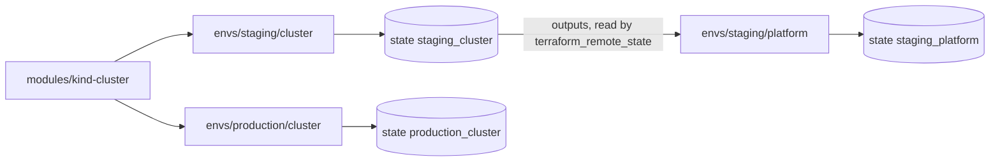

## Before you start

- [[devops.l3.tofu-modules]] — you know how a configuration calls the `kind-cluster` module with its own values and reads its outputs as `module.<name>.<output>`.
- [[devops.l2.deployment-environments]] — you know staging and production as separate targets a change reaches one after the other.
- [[k8s.l1.namespaces]] — you know Đơn Hàng's objects live in the namespace `donhang`, declared before anything is deployed into it.
- [[k8s.l1.secrets]] — you know a Kubernetes Secret is an object in the cluster that something has to create.

## The situation

Đơn Hàng now needs two lasting clusters: staging, where changes are tried first, and production, for customers, each with the namespace `donhang` inside before anything is deployed. A teammate suggests the short way: add a second `module "cluster"` call to the folder that already creates a cluster, one for each environment. One folder, one state, never out of step. Then picture the next change meant only for staging, such as a different number of nodes. Every plan in that folder would also check production's cluster, and any change to it would share staging's apply, one wrong answer away. How can both environments come from the same code while an apply for staging cannot even list production?

## Core concepts

- Environment folder — a folder such as `deploy/tofu/envs/staging/cluster` that is a configuration of its own, with its own state; OpenTofu plans and applies one folder at a time.
- Cluster layer and platform layer — each environment is split into two folders: `cluster` creates the kind cluster, `platform` creates what must exist inside it before anything is deployed, here the namespace `donhang`.
- `terraform_remote_state` — a `data` block, which only reads something that already exists instead of declaring an object to create; this one reads another configuration's output values from that configuration's state.
- **workspace (OpenTofu)** — one of several named states OpenTofu keeps for the same configuration folder; `tofu workspace select <name>` chooses which one the next plan and apply use.

## How it works



Both environments still come from one piece of code: the `kind-cluster` module. Staging's folder calls it with `workers = 0`, a single node holding the control plane; production's calls it with `workers = 2`, two more nodes, called workers, beside the control plane. Only the values differ.

Each folder is a separate configuration with a separate state, such as `staging_cluster` in the diagram. A plan works from one folder's files and that folder's state only, and checks only the real objects that state records. Production's cluster is recorded in neither the files nor the state of `envs/staging/cluster`, so no plan or apply run there can list it for change or destruction.

Each environment is also split in two. The Kubernetes provider needs the cluster's address and credentials to connect. In one folder, those would be known only after the same apply that creates the cluster, and OpenTofu's documentation asks that a provider's settings use only values known before apply. So the `platform` folder, with its own state, is applied afterwards and reads the cluster layer's outputs, such as `endpoint`, through `terraform_remote_state`.

A workspace is the other way: one folder holds several named states, and you switch between them. Every workspace uses the same files, so environments can differ only through values chosen per workspace, such as variable values. They also share the folder's `backend.tf`, the file that says where state is kept. Separate folders let environments differ in anything, even that: each folder's `backend.tf` names its own place, a schema such as `staging_cluster`, in a PostgreSQL database shown below. Đơn Hàng uses folders and no workspaces.

## In the Đơn Hàng system

Production's cluster layer, the whole configuration apart from its outputs:

```hcl file=deploy/tofu/envs/production/cluster/main.tf tag=stage-3 lines=1-13
# lesson: devops.l3.one-state-per-environment
# Production's cluster: the same kind-cluster module as staging, with a
# control plane and two workers. scripts/devops/tofu-environments.sh only
# plans it: in the lab nothing runs production.
terraform {
  required_version = "~> 1.10.0"
}

module "cluster" {
  source  = "../../../modules/kind-cluster"
  name    = "donhang-production"
  workers = 2
}
```

`source` points at the shared module; only `name` and `workers` belong to production. Staging's `deploy/tofu/envs/staging/cluster/main.tf`, outside this excerpt, has the same `source` with `name = "donhang-staging"`, `workers = 0`. The folder holds no copy of the cluster's description: the only other `.tf` file next to `main.tf` is `backend.tf`, which names where this folder's state is kept.

Staging's platform layer, reading the cluster layer:

```hcl file=deploy/tofu/envs/staging/platform/main.tf tag=stage-3 lines=9-24
# lesson: devops.l3.one-state-per-environment
# The cluster layer's outputs, read from its own state in donhang_tofu
# (the pg backend takes the connection string from PG_CONN_STR here too).
data "terraform_remote_state" "cluster" {
  backend = "pg"
  config = {
    schema_name = "staging_cluster"
  }
}

provider "kubernetes" {
  host                   = data.terraform_remote_state.cluster.outputs.endpoint
  cluster_ca_certificate = data.terraform_remote_state.cluster.outputs.cluster_ca_certificate
  client_certificate     = data.terraform_remote_state.cluster.outputs.client_certificate
  client_key             = data.terraform_remote_state.cluster.outputs.client_key
}
```

`schema_name = "staging_cluster"` names the state to read: staging's cluster layer, not production's. Each state is kept under such a name in a database, `donhang_tofu`, in the PostgreSQL that `scripts/up.sh` starts; a later lesson explains how. Each provider setting comes from an output the cluster layer declares, read as `data.terraform_remote_state.cluster.outputs.<name>`; the certificates and key are the credentials a kubeconfig holds for kubectl. The platform layer can read those outputs but never writes to that state. Its own resources, the namespace `donhang` and one Secret in `kube-system` that a later module explains, are recorded in its own state.

`scripts/devops/tofu-environments.sh` puts it together. It applies staging's cluster layer, then staging's platform layer, then only plans production's cluster layer and runs `kind get clusters`, which lists the kind clusters on your machine. Production's platform folder, reading `production_cluster`, is left out of the diagram because the script never runs it.

## Seniors often assume…

- **"Keeping staging and production alike means putting both in one configuration with one state."** → Actually what keeps them alike is the shared module; one state only makes every plan cover both. Separate folders call the same `kind-cluster` and still differ only where a call says so. You notice this when a plan meant for staging shows a change to production's cluster.
- **"A folder per environment means copying all the `.tf` code into each one."** → Actually each environment's `cluster` folder holds a `main.tf` with a short `module` call and its outputs, plus a `backend.tf`; the cluster's description lives once, in `deploy/tofu/modules/kind-cluster`. You notice this when a change to the module shows up in the plans of both environments, with nothing to edit twice.
- **"Splitting the state only makes plans faster; it does not change what one mistake can break."** → Actually a plan and an apply reach only what their own folder's state and files describe. A wrong value applied in `envs/staging/cluster` can replace staging's cluster, and production's cluster never appears in its plan. You notice this when you read a plan run in a staging folder: production's resources do not appear in it at all.

## Try it (3 minutes)

At the root of your Đơn Hàng folder at stage-3, with OpenTofu 1.10, kind and kubectl on your machine and `scripts/up.sh` already run, in Git Bash:

1. Run `scripts/devops/tofu-environments.sh`. If `donhang-staging` does not exist yet, the first apply waits while kind creates it.
2. Read the section after `== production, cluster layer: plan only`, then the last lines.

Expected result: the production section shows `module.cluster.kind_cluster.this will be created`, the name `"donhang-production"` and `Plan: 1 to add, 0 to change, 0 to destroy.`; `kind get clusters` lists `donhang-staging` but no `donhang-production`.

Think: you run the script a second time. Does production's plan still say `1 to add`, and why?

<details><summary>Suggested answer</summary>

Yes. The script only plans production, so nothing was ever created there and production's state records no cluster. Every plan compares the files with that empty state and proposes the same creation. Staging's applies, meanwhile, find their objects already recorded and have nothing to create.

</details>

## Connections

- [[devops.l3.tofu-modules]] — prerequisite: the `kind-cluster` module that both environments call with their own values.
- [[devops.l3.tofu-state]] — the record each environment folder now owns, one per folder instead of one for everything.
- [[devops.l3.remote-state-and-locking]] — next: where these states are kept so a team shares them, and what stops two commands writing at once.
- [[devops.l2.deployment-environments]] — the same staging and production split, here as clusters described in code instead of names on GitHub.

## Five-line summary

1. Each environment has its own folder and state, so a staging apply cannot even plan a change to production while staging's values point at staging.
2. Staging and production call the same `kind-cluster` module; only the values they pass differ, such as `workers`.
3. Each environment has a `cluster` layer and a `platform` layer, because the Kubernetes provider needs a cluster that already exists.
4. The platform layer reads the cluster layer's outputs through `terraform_remote_state` and keeps its own state.
5. Workspaces keep several states for one folder and fit copies that differ only in values chosen per workspace; folders let environments differ in anything.
