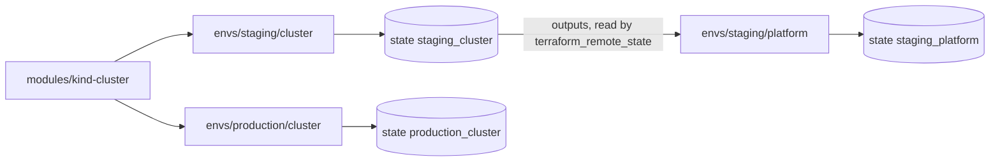

## Bạn cần biết trước

- [[devops.l3.tofu-modules]] — bạn biết một cấu hình gọi module `kind-cluster` với giá trị riêng của nó ra sao, và đọc output của module dưới dạng `module.<name>.<output>`.
- [[devops.l2.deployment-environments]] — bạn biết staging và production là hai đích riêng, một thay đổi đi tới lần lượt từng nơi.
- [[k8s.l1.namespaces]] — bạn biết các object của Đơn Hàng nằm trong namespace `donhang`, được khai báo trước khi deploy bất cứ thứ gì vào đó.
- [[k8s.l1.secrets]] — bạn biết Secret của Kubernetes là một object trong cluster, và phải có thứ gì đó tạo ra nó.

## Tình huống

Đơn Hàng giờ cần hai cluster lâu dài: staging, nơi thử thay đổi trước, và production, nơi phục vụ khách hàng. Mỗi cluster phải có sẵn namespace `donhang` trước khi deploy bất cứ thứ gì. Một đồng nghiệp đề xuất cách nhanh: thêm lời gọi `module "cluster"` thứ hai vào thư mục đang tạo cluster, mỗi môi trường một lời gọi. Một thư mục, một state, không bao giờ lệch nhau. Giờ hãy hình dung thay đổi tiếp theo chỉ dành cho staging, chẳng hạn đổi số node. Mọi lần plan trong thư mục đó cũng sẽ kiểm tra cluster production, và mọi thay đổi trên nó sẽ đi chung lần apply của staging, chỉ cách một câu trả lời sai. Làm sao để cả hai môi trường cùng sinh ra từ một đoạn code, trong khi một lần apply cho staging thậm chí không liệt kê được production?

## Khái niệm cốt lõi

- Thư mục môi trường — một thư mục như `deploy/tofu/envs/staging/cluster`, tự nó là một cấu hình, có state riêng. OpenTofu plan và apply từng thư mục một.
- Tầng cluster và tầng platform — mỗi môi trường được tách thành hai thư mục: `cluster` tạo cluster kind, `platform` tạo những thứ phải có bên trong cluster trước khi deploy bất cứ gì, ở đây là namespace `donhang`.
- `terraform_remote_state` — một khối `data`, chỉ đọc thứ đã tồn tại chứ không khai báo object cần tạo. Khối này đọc giá trị đầu ra của một cấu hình khác từ state của cấu hình đó.
- **workspace (OpenTofu)** (một trong nhiều state có tên mà OpenTofu giữ cho cùng một thư mục cấu hình) — một trong nhiều state có tên mà OpenTofu giữ cho cùng một thư mục cấu hình. `tofu workspace select <name>` chọn state mà lần plan và apply tiếp theo dùng.

## Cơ chế hoạt động



Cả hai môi trường vẫn sinh ra từ một đoạn code duy nhất: module `kind-cluster`. Thư mục của staging gọi nó với `workers = 0`, tức một node duy nhất giữ control plane. Thư mục của production gọi với `workers = 2`, thêm hai node gọi là worker bên cạnh control plane. Chỉ giá trị là khác nhau.

Mỗi thư mục là một cấu hình riêng với state riêng, như `staging_cluster` trong sơ đồ. Một lần plan chỉ làm việc với file của một thư mục và state của thư mục đó, và chỉ kiểm tra các object thật mà state ấy ghi lại. Cluster production không có trong file lẫn state của `envs/staging/cluster`, nên không lần plan hay apply nào chạy ở đó liệt kê được nó để thay đổi hay xóa.

Mỗi môi trường còn được tách làm đôi. Provider Kubernetes cần địa chỉ và thông tin xác thực của cluster để kết nối. Nếu gộp trong một thư mục, các giá trị đó chỉ biết được sau chính lần apply tạo ra cluster, mà tài liệu của OpenTofu yêu cầu cài đặt của provider chỉ dùng giá trị đã biết trước khi apply. Vì vậy thư mục `platform`, với state riêng, được apply sau và đọc giá trị đầu ra của tầng cluster, như `endpoint`, qua `terraform_remote_state`.

Workspace là cách còn lại: một thư mục giữ nhiều state có tên, và bạn chuyển qua lại giữa chúng. Mọi workspace dùng chung file, nên các môi trường chỉ khác nhau được qua giá trị chọn theo từng workspace, như giá trị của biến. Chúng cũng dùng chung `backend.tf` của thư mục, file cho biết state được giữ ở đâu. Thư mục riêng cho phép các môi trường khác nhau ở bất cứ điểm nào, kể cả điều đó: `backend.tf` của mỗi thư mục chỉ tới chỗ riêng của nó, là một schema như `staging_cluster`, trong một database PostgreSQL trình bày bên dưới. Đơn Hàng dùng thư mục và không dùng workspace.

## Trong hệ thống Đơn Hàng

Tầng cluster của production, toàn bộ cấu hình trừ phần output:

```hcl file=deploy/tofu/envs/production/cluster/main.tf tag=stage-3 lines=1-13
# lesson: devops.l3.one-state-per-environment
# Production's cluster: the same kind-cluster module as staging, with a
# control plane and two workers. scripts/devops/tofu-environments.sh only
# plans it: in the lab nothing runs production.
terraform {
  required_version = "~> 1.10.0"
}

module "cluster" {
  source  = "../../../modules/kind-cluster"
  name    = "donhang-production"
  workers = 2
}
```

`source` trỏ tới module dùng chung, chỉ `name` và `workers` là của riêng production. File `deploy/tofu/envs/staging/cluster/main.tf` của staging, không có trong đoạn trích này, có cùng `source` với `name = "donhang-staging"`, `workers = 0`. Thư mục không chứa bản sao nào của phần mô tả cluster: file `.tf` duy nhất khác nằm cạnh `main.tf` là `backend.tf`, file cho biết state của thư mục này được giữ ở đâu.

Tầng platform của staging, đọc từ tầng cluster:

```hcl file=deploy/tofu/envs/staging/platform/main.tf tag=stage-3 lines=9-24
# lesson: devops.l3.one-state-per-environment
# The cluster layer's outputs, read from its own state in donhang_tofu
# (the pg backend takes the connection string from PG_CONN_STR here too).
data "terraform_remote_state" "cluster" {
  backend = "pg"
  config = {
    schema_name = "staging_cluster"
  }
}

provider "kubernetes" {
  host                   = data.terraform_remote_state.cluster.outputs.endpoint
  cluster_ca_certificate = data.terraform_remote_state.cluster.outputs.cluster_ca_certificate
  client_certificate     = data.terraform_remote_state.cluster.outputs.client_certificate
  client_key             = data.terraform_remote_state.cluster.outputs.client_key
}
```

`schema_name = "staging_cluster"` cho biết state cần đọc: tầng cluster của staging, không phải của production. Mỗi state được giữ dưới một cái tên như vậy trong database `donhang_tofu`, thuộc PostgreSQL mà `scripts/up.sh` khởi động. Một bài sau sẽ giải thích cách làm. Mỗi cài đặt của provider lấy từ một output mà tầng cluster khai báo, đọc dưới dạng `data.terraform_remote_state.cluster.outputs.<name>`. Các certificate và key là thông tin xác thực mà kubeconfig giữ cho kubectl. Tầng platform đọc được các output đó nhưng không bao giờ ghi vào state ấy. Resource của chính nó, gồm namespace `donhang` và một Secret trong `kube-system` mà một module sau sẽ giải thích, được ghi trong state riêng của nó.

`scripts/devops/tofu-environments.sh` ghép mọi thứ lại. Script apply tầng cluster của staging, rồi tầng platform của staging, sau đó chỉ plan tầng cluster của production và chạy `kind get clusters`, lệnh liệt kê các cluster kind trên máy bạn. Thư mục platform của production, đọc `production_cluster`, không có trong sơ đồ vì script không bao giờ chạy nó.

## Senior hay nhầm rằng…

- **"Muốn staging và production giống nhau thì phải đặt cả hai vào một cấu hình với một state."** → Thực ra thứ giữ chúng giống nhau là module dùng chung, còn một state chỉ khiến mọi lần plan bao trùm cả hai. Các thư mục riêng gọi cùng `kind-cluster` và vẫn chỉ khác nhau ở chỗ lời gọi nói khác. Bạn sẽ nhận ra khi một lần plan dành cho staging lại hiện thay đổi trên cluster production.
- **"Mỗi môi trường một thư mục nghĩa là chép toàn bộ code `.tf` vào từng thư mục."** → Thực ra thư mục `cluster` của mỗi môi trường chỉ có một `main.tf` với lời gọi `module` ngắn và các output của nó, cộng một `backend.tf`. Phần mô tả cluster chỉ nằm một chỗ, trong `deploy/tofu/modules/kind-cluster`. Bạn sẽ nhận ra khi một thay đổi trong module hiện ra ở plan của cả hai môi trường, mà không phải sửa gì hai lần.
- **"Tách state chỉ làm plan nhanh hơn, không thu hẹp phạm vi mà một sai sót có thể làm hỏng."** → Thực ra một lần plan và apply chỉ chạm tới những gì file và state của chính thư mục đó mô tả. Một giá trị sai apply trong `envs/staging/cluster` có thể thay cả cluster staging, còn cluster production không bao giờ xuất hiện trong plan của nó. Bạn sẽ nhận ra khi đọc một lần plan chạy trong thư mục staging: resource của production hoàn toàn không có mặt.

## Thử ngay (3 phút)

Ở gốc thư mục Đơn Hàng tại stage-3, khi máy bạn đã có OpenTofu 1.10, kind và kubectl, và đã chạy `scripts/up.sh`, trong Git Bash:

1. Chạy `scripts/devops/tofu-environments.sh`. Nếu `donhang-staging` chưa có, lần apply đầu tiên sẽ chờ trong lúc kind tạo cluster.
2. Đọc phần sau `== production, cluster layer: plan only`, rồi đọc mấy dòng cuối.

Kết quả mong đợi: phần production hiện `module.cluster.kind_cluster.this will be created`, tên `"donhang-production"` và `Plan: 1 to add, 0 to change, 0 to destroy.`. `kind get clusters` liệt kê `donhang-staging` nhưng không có `donhang-production`.

Suy nghĩ: bạn chạy script lần thứ hai. Plan của production có còn báo `1 to add` không, và vì sao?

<details><summary>Gợi ý đáp án</summary>

Có. Script chỉ plan production, nên ở đó chưa từng có gì được tạo, và state của production không ghi cluster nào. Mỗi lần plan so file với state rỗng đó và đề xuất cùng một lần tạo. Trong khi đó, các lần apply của staging thấy object của mình đã được ghi lại nên không còn gì để tạo.

</details>

## Liên hệ

- [[devops.l3.tofu-modules]] — bài cần trước: module `kind-cluster` mà cả hai môi trường gọi với giá trị riêng.
- [[devops.l3.tofu-state]] — bản ghi mà mỗi thư mục môi trường giờ sở hữu, mỗi thư mục một bản thay vì một bản cho tất cả.
- [[devops.l3.remote-state-and-locking]] — bài tiếp theo: các state này được giữ ở đâu để cả nhóm dùng chung, và thứ gì ngăn hai lệnh cùng ghi một lúc.
- [[devops.l2.deployment-environments]] — cùng cách chia staging và production, ở đây là các cluster mô tả bằng code thay vì những cái tên trên GitHub.

## Tóm tắt 5 dòng

1. Mỗi môi trường có thư mục và state riêng, nên khi giá trị của staging trỏ tới staging, một lần apply staging thậm chí không plan được thay đổi nào cho production.
2. Staging và production gọi cùng module `kind-cluster`, chỉ giá trị truyền vào là khác, như `workers`.
3. Mỗi môi trường có tầng `cluster` và tầng `platform`, vì provider Kubernetes cần một cluster đã tồn tại.
4. Tầng platform đọc giá trị đầu ra của tầng cluster qua `terraform_remote_state` và giữ state riêng.
5. Workspace giữ nhiều state cho một thư mục, hợp với các bản sao chỉ khác nhau ở giá trị chọn theo từng workspace, còn thư mục cho phép các môi trường khác nhau ở bất cứ điểm nào.
