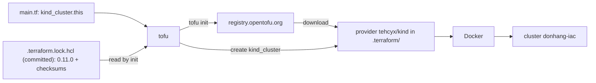

## Before you start

- [[devops.l3.infrastructure-as-code]] — you saw that `cluster-up.sh` never compares the cluster with `kind-config.yaml`, and that an infrastructure-as-code tool does. This lesson opens the files such a tool reads.
- [[devops.l2.quality-gate]] — you saw the checks every change must pass in `ci.yml`; one more job of that file checks the files this lesson reads.

## The situation

From stage-3, staging is meant to be a cluster that a tool creates from files. You open `deploy/tofu/lessons/first-cluster/main.tf` expecting something like `cluster-up.sh`, and find no command at all: no `kind create cluster`, no `docker`, no `if`. There are two blocks of text, one naming a practice cluster `donhang-iac`, a step before staging, with one control-plane node. Yet a teammate runs `scripts/devops/tofu-first-cluster.sh`, and `kind get clusters` then lists `donhang-iac` next to `donhang`. On your laptop the same script downloads the same helper code, down to the version. How does a file with no commands become a cluster, and what decides which code does the creating?

## Core concepts

- **OpenTofu** — an open-source infrastructure-as-code tool, run as the command `tofu`, that reads the `.tf` files of one folder as one configuration and makes the objects it declares exist.
- **resource (OpenTofu)** — a `resource` block in a `.tf` file: one object that should exist, given by a type such as `kind_cluster` and a local name such as `this`, which together name it as `kind_cluster.this`.
- **provider (OpenTofu)** — a separate program, downloaded apart from OpenTofu, that knows one system's API and supplies resource types; `tehcyx/kind` supplies `kind_cluster` and creates the cluster with kind, the tool `cluster-up.sh` uses to run Kubernetes in Docker, one container per node.

## How it works



In the situation above, `first-cluster` is one configuration: OpenTofu reads all the `.tf` files of that folder together, so splitting them changes nothing. The file says what should exist, never how to make it.

In `resource "kind_cluster" "this"`, the first quoted word is the type, the second the local name you choose. Arguments such as `name` and `node_image`, and what they mean, are defined by the provider for its type, not by OpenTofu.

OpenTofu's own program has no resource type for kind or for the other systems you manage with it. The `required_providers` block maps the provider's local name `kind`, a name separate from a resource's local name such as `this`, to the source `tehcyx/kind` (the part before the slash is the account that publishes it) and the versions it allows. OpenTofu takes the word before the first underscore of a type as a provider's local name, so `kind_cluster` belongs to `kind`. A registry, by default `registry.opentofu.org`, stores providers by source and version, as a container registry stores images. `tofu init` downloads a match from there into `.terraform`. When the configuration is applied (next lesson), that provider creates the cluster with kind.

The first `tofu init` also writes `.terraform.lock.hcl`: the exact provider version it picked and checksums of what it downloaded, like an image digest. The diagram shows a later run, with the file committed and `.terraform` kept out of Git: every `init`, on any machine, installs that version and rejects a download that does not match, until someone runs `tofu init -upgrade`, which picks again within the allowed versions and rewrites the file.

`tofu validate` checks syntax, references (a name such as `kind_cluster.this` used in another block) and argument types against what the provider's types accept, so it needs `init` first, but it never contacts Docker.

## In the Đơn Hàng system

The `terraform` block and the resource. `terraform` is only the fixed name OpenTofu gives the block of settings about itself, and the name it uses for `.terraform` and `.terraform.lock.hcl`; no other tool is involved.

```hcl file=deploy/tofu/lessons/first-cluster/main.tf tag=stage-3 lines=4-28
terraform {
  required_version = "~> 1.10.0"
  required_providers {
    # The provider that knows how to create kind clusters through Docker.
    kind = {
      source  = "tehcyx/kind"
      version = "0.11.0"
    }
  }
}

# lesson: devops.l3.plan-and-apply
# One resource: a cluster of type kind_cluster, named "this" inside this
# configuration. The node image is the one deploy/k8s/kind-config.yaml pins,
# by the same digest; changing it replaces the whole cluster.
resource "kind_cluster" "this" {
  name           = "donhang-iac"
  node_image     = "kindest/node:v1.34.11@sha256:44e222ee2132dab25ff87301682f89eb82c7880ea3a1bf543bfe9708fd08d67d"
  wait_for_ready = true

  kind_config {
    kind        = "Cluster"
    api_version = "kind.x-k8s.io/v1alpha4"
    node {
      role = "control-plane"
```

`required_version` constrains OpenTofu itself with a version range: `~> 1.10.0` allows 1.10.0 and later 1.10 releases, not 1.11.0. `version = "0.11.0"`, with no operator, allows exactly one provider version. `kind_config` takes the settings a kind config file such as `kind-config.yaml` holds, including its `kind = "Cluster"` line. The comment above the resource is a note for the next lesson; lines 29–31 only close the braces.

The script runs the checks first; `show` is a helper in the script that prints each command, prefixed with `$`, before running it:

```bash file=scripts/devops/tofu-first-cluster.sh tag=stage-3 lines=8-17
# lesson: devops.l3.opentofu-resources
# init downloads the provider into .terraform/; the version comes from the
# committed .terraform.lock.hcl. Start from the folder as Git has it.
rm -rf .terraform
show tofu init -input=false -no-color
echo
# Formatting and references are checked without contacting Docker.
show tofu fmt -check
show tofu validate -no-color
echo
```

```text output=true
$ tofu init -input=false -no-color

Initializing the backend...

Initializing provider plugins...
- Reusing previous version of tehcyx/kind from the dependency lock file
- Installing tehcyx/kind v0.11.0...
...
$ tofu fmt -check
$ tofu validate -no-color
Success! The configuration is valid.
...
```

`-input=false` and `-no-color` only stop `init` from asking questions and colouring its output. The first `Initializing` line is about a setting this folder leaves at its default, explained later in this module; ignore it here. `.terraform.lock.hcl` sits next to the `.terraform` directory, not inside it, so `rm -rf .terraform` leaves it in place. "Reusing previous version" is `init` taking the version from that file instead of choosing again. `tofu fmt -check` prints nothing because every file is formatted; otherwise it would list the file and fail.

CI's `iac` job in `.github/workflows/ci.yml` runs the same two checks: `tofu fmt -check -recursive deploy/tofu`, then `init` and `validate` in each folder under `deploy/tofu/lessons` and `deploy/tofu/envs`. No step of that job creates a cluster.

## Seniors often assume…

- **"OpenTofu has built-in knowledge of kind, Kubernetes and every other system it can manage."** → Actually OpenTofu's own program has no resource type for kind; `kind_cluster` exists in this folder because `required_providers` names `tehcyx/kind` and `init` downloaded it. You notice this when `tofu validate` in a fresh clone, before `tofu init`, fails because the provider that defines `kind_cluster` is not installed yet.
- **"A version range in `required_providers` is enough for every machine to get the same provider version."** → Actually a range allows several versions, and an `init` without `.terraform.lock.hcl` picks the newest one that matches on that day. Only the committed file fixes one version and its checksums. You notice this when two laptops running the same folder print different provider versions during `tofu init`.
- **"If `tofu validate` passes, the cluster can certainly be created."** → Actually `validate` checks the files against the provider's description of its types and never asks Docker anything, so a stopped Docker engine shows up only later, when OpenTofu asks the provider to create the cluster. You notice this when CI's `iac` job is green and `tofu-first-cluster.sh` still fails on a laptop where Docker Desktop is not running.

## Try it (3 minutes)

`STAGE.md` lists OpenTofu 1.10 among the tools the host scripts need; if `tofu version` fails, install it first.

1. From the repository root, run `cd deploy/tofu/lessons/first-cluster`, then `tofu init` and `tofu validate`.
2. In `main.tf`, change `"kind_cluster"` on line 19 to `"kind_clustr"`, run `tofu validate` again, then undo the change with `git checkout main.tf`.

Expected result: the first `tofu validate` prints `Success! The configuration is valid.`; the second fails because no provider of the folder supplies a type `kind_clustr`. Neither command creates a cluster: `kind get clusters` lists the same names before and after.

## Connections

- [[devops.l3.plan-and-apply]] — the next step: what the rest of `tofu-first-cluster.sh` printed, and agreed to, before the cluster existed.
- [[k8s.l1.cluster-nodes-and-control-plane]] — the control plane and nodes described there are what the `kind_cluster` block declares, here with one control-plane node.
- [[devops.l2.dependency-cache]] — the same pattern for NuGet packages: a committed `packages.lock.json` names exact versions, and CI's cache key follows it.
- [[devops.l3.pinning-by-content]] — the general rule behind `.terraform.lock.hcl`: fix every input of a build by its content, not only by a version name.

## Five-line summary

1. A `resource` block declares one object that should exist, and a provider, not OpenTofu itself, knows how to make it.
2. OpenTofu reads the `.tf` files of one folder as one configuration; each resource has a type and a local name, like `kind_cluster.this`.
3. `required_providers` names each provider's source and allowed versions, and `tofu init` downloads a matching provider into `.terraform`.
4. `.terraform.lock.hcl` records the exact version and checksums `init` chose; committed, it makes every later `init` install the same provider.
5. `tofu validate` checks syntax and references without contacting Docker, so passing it does not prove the cluster can be created.
