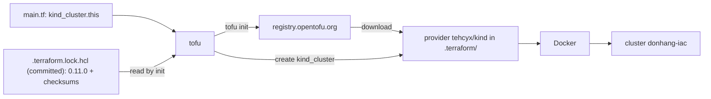

## Bạn cần biết trước

- [[devops.l3.infrastructure-as-code]] — bạn đã thấy `cluster-up.sh` không bao giờ so cluster với `kind-config.yaml`, còn một công cụ infrastructure as code thì có. Bài này mở các file mà công cụ như vậy đọc.
- [[devops.l2.quality-gate]] — bạn đã thấy các bước kiểm tra mà mọi thay đổi phải qua trong `ci.yml`. Thêm một job trong file đó kiểm tra các file bài này đọc.

## Tình huống

Từ stage-3, staging sẽ là một cluster do công cụ tạo ra từ file. Bạn mở `deploy/tofu/lessons/first-cluster/main.tf`, chờ thấy thứ gì đó giống `cluster-up.sh`, nhưng không có lệnh nào cả: không `kind create cluster`, không `docker`, không `if`. Chỉ có hai khối văn bản, một khối đặt tên `donhang-iac` cho một cluster tập dượt trước khi tới staging, với một node control plane. Vậy mà một đồng nghiệp chạy `scripts/devops/tofu-first-cluster.sh`, và sau đó `kind get clusters` liệt kê `donhang-iac` bên cạnh `donhang`. Trên laptop của bạn, cùng script đó tải về đúng phần code hỗ trợ ấy, trùng cả phiên bản. Làm sao một file không có lệnh nào lại thành ra cluster, và cái gì quyết định code nào đứng ra tạo nó?

## Khái niệm cốt lõi

- **OpenTofu** (Công cụ infrastructure as code mã nguồn mở: đọc file .tf, lập plan, rồi gọi API của từng hệ thống qua provider) — công cụ infrastructure as code mã nguồn mở, chạy bằng lệnh `tofu`. Nó đọc các file `.tf` của một thư mục như một configuration duy nhất và làm cho các object được khai báo trong đó tồn tại.
- **resource (OpenTofu)** (Khối `resource` trong file .tf: khai báo một object phải tồn tại, có kiểu và tên cục bộ) — một khối `resource` trong file `.tf`: một object phải tồn tại, gồm một kiểu như `kind_cluster` và một tên cục bộ như `this`, ghép lại thành tên `kind_cluster.this`.
- **provider (OpenTofu)** (Plugin của OpenTofu biết API của một hệ thống và cung cấp các kiểu resource, vd tehcyx/kind cho kind_cluster) — một chương trình riêng, tải về tách khỏi OpenTofu, biết API của một hệ thống và cung cấp các kiểu resource. `tehcyx/kind` cung cấp `kind_cluster` và tạo cluster bằng kind, công cụ mà `cluster-up.sh` dùng để chạy Kubernetes trong Docker, mỗi node một container.

## Cơ chế hoạt động



Trong tình huống trên, `first-cluster` là một configuration: OpenTofu đọc tất cả file `.tf` của thư mục đó cùng lúc, nên tách chúng ra nhiều file cũng không thay đổi gì. File nói cái gì phải tồn tại, không bao giờ nói cách tạo ra nó.

Trong `resource "kind_cluster" "this"`, từ đầu tiên trong ngoặc kép là kiểu, từ thứ hai là tên cục bộ do bạn chọn. Các argument như `name` và `node_image`, cùng ý nghĩa của chúng, do provider định nghĩa cho kiểu của nó, không phải do OpenTofu.

Bản thân chương trình OpenTofu không có kiểu resource nào cho kind hay cho các hệ thống khác mà bạn quản lý bằng nó. Khối `required_providers` gắn tên cục bộ `kind` của provider (khác với tên cục bộ của một resource như `this`) với nguồn `tehcyx/kind` (phần trước dấu gạch chéo là tài khoản phát hành nó) và các phiên bản được phép. OpenTofu lấy từ đứng trước dấu gạch dưới đầu tiên của một kiểu làm tên cục bộ của provider, nên `kind_cluster` thuộc về `kind`. Một registry, mặc định là `registry.opentofu.org`, lưu provider theo nguồn và phiên bản, giống như container registry lưu image. `tofu init` tải một bản khớp từ đó về `.terraform`. Khi configuration được apply (bài sau), provider đó tạo cluster bằng kind.

Lần `tofu init` đầu tiên còn ghi ra `.terraform.lock.hcl`: phiên bản provider chính xác nó đã chọn và checksum của những gì nó đã tải, giống digest của một image. Sơ đồ cho thấy một lần chạy sau đó, khi file này đã được commit còn `.terraform` thì để ngoài Git. Mỗi lần `init`, trên máy nào cũng vậy, đều cài đúng phiên bản đó và từ chối bản tải về không khớp, cho tới khi có người chạy `tofu init -upgrade`. Lệnh này chọn lại trong khoảng phiên bản được phép và ghi lại file.

`tofu validate` kiểm tra cú pháp, tham chiếu (một tên như `kind_cluster.this` được dùng trong khối khác) và kiểu của argument so với những gì kiểu của provider chấp nhận. Vì vậy nó cần `init` chạy trước, nhưng không bao giờ liên lạc với Docker.

## Trong hệ thống Đơn Hàng

Khối `terraform` và resource. `terraform` chỉ là cái tên cố định mà OpenTofu đặt cho khối thiết lập về chính nó, cũng là tên nó dùng cho `.terraform` và `.terraform.lock.hcl`. Không có công cụ nào khác tham gia.

```hcl file=deploy/tofu/lessons/first-cluster/main.tf tag=stage-3 lines=4-28
terraform {
  required_version = "~> 1.10.0"
  required_providers {
    # The provider that knows how to create kind clusters through Docker.
    kind = {
      source  = "tehcyx/kind"
      version = "0.11.0"
    }
  }
}

# lesson: devops.l3.plan-and-apply
# One resource: a cluster of type kind_cluster, named "this" inside this
# configuration. The node image is the one deploy/k8s/kind-config.yaml pins,
# by the same digest; changing it replaces the whole cluster.
resource "kind_cluster" "this" {
  name           = "donhang-iac"
  node_image     = "kindest/node:v1.34.11@sha256:44e222ee2132dab25ff87301682f89eb82c7880ea3a1bf543bfe9708fd08d67d"
  wait_for_ready = true

  kind_config {
    kind        = "Cluster"
    api_version = "kind.x-k8s.io/v1alpha4"
    node {
      role = "control-plane"
```

`required_version` giới hạn phiên bản của chính OpenTofu bằng một khoảng: `~> 1.10.0` cho phép 1.10.0 và các bản 1.10 sau đó, không cho phép 1.11.0. `version = "0.11.0"`, không có toán tử, chỉ cho phép đúng một phiên bản provider. `kind_config` nhận các thiết lập mà một file cấu hình kind như `kind-config.yaml` chứa, kể cả dòng `kind = "Cluster"` của nó. Comment phía trên resource là ghi chú cho bài sau. Dòng 29–31 chỉ đóng ngoặc nhọn.

Script chạy các bước kiểm tra trước. `show` là một hàm hỗ trợ trong script, in từng lệnh với tiền tố `$` trước khi chạy nó:

```bash file=scripts/devops/tofu-first-cluster.sh tag=stage-3 lines=8-17
# lesson: devops.l3.opentofu-resources
# init downloads the provider into .terraform/; the version comes from the
# committed .terraform.lock.hcl. Start from the folder as Git has it.
rm -rf .terraform
show tofu init -input=false -no-color
echo
# Formatting and references are checked without contacting Docker.
show tofu fmt -check
show tofu validate -no-color
echo
```

```text output=true
$ tofu init -input=false -no-color

Initializing the backend...

Initializing provider plugins...
- Reusing previous version of tehcyx/kind from the dependency lock file
- Installing tehcyx/kind v0.11.0...
...
$ tofu fmt -check
$ tofu validate -no-color
Success! The configuration is valid.
...
```

`-input=false` và `-no-color` chỉ để `init` không hỏi gì và không tô màu output. Dòng `Initializing` đầu tiên nói về một thiết lập mà thư mục này để mặc định, sẽ được giải thích ở phần sau của module. Ở đây bạn bỏ qua nó. `.terraform.lock.hcl` nằm cạnh thư mục `.terraform` chứ không nằm bên trong, nên `rm -rf .terraform` không đụng tới nó. "Reusing previous version" nghĩa là `init` lấy phiên bản từ file đó thay vì chọn lại. `tofu fmt -check` không in gì vì mọi file đều đã đúng định dạng. Nếu không, nó sẽ liệt kê file sai và thất bại.

Job `iac` của CI trong `.github/workflows/ci.yml` chạy đúng hai bước kiểm tra này: `tofu fmt -check -recursive deploy/tofu`, rồi `init` và `validate` trong từng thư mục dưới `deploy/tofu/lessons` và `deploy/tofu/envs`. Không bước nào của job đó tạo cluster.

## Senior hay nhầm rằng…

- **"OpenTofu có sẵn hiểu biết về kind, Kubernetes và mọi hệ thống khác mà nó quản lý được."** → Thực ra bản thân chương trình OpenTofu không có kiểu resource nào cho kind. `kind_cluster` tồn tại trong thư mục này vì `required_providers` ghi tên `tehcyx/kind` và `init` đã tải nó về. Bạn sẽ nhận ra khi `tofu validate` trong một bản clone mới, chạy trước `tofu init`, thất bại vì provider định nghĩa `kind_cluster` chưa được cài.
- **"Một khoảng phiên bản trong `required_providers` là đủ để mọi máy nhận cùng một phiên bản provider."** → Thực ra một khoảng cho phép nhiều phiên bản, và một lần `init` không có `.terraform.lock.hcl` sẽ chọn bản mới nhất khớp vào đúng ngày hôm đó. Chỉ file đã commit mới cố định một phiên bản cùng checksum của nó. Bạn sẽ nhận ra khi hai laptop chạy cùng thư mục in ra phiên bản provider khác nhau trong lúc `tofu init`.
- **"Nếu `tofu validate` qua thì chắc chắn tạo được cluster."** → Thực ra `validate` kiểm tra file theo mô tả của provider về các kiểu của nó và không bao giờ hỏi Docker điều gì. Vì vậy Docker engine đang dừng chỉ lộ ra sau đó, khi OpenTofu yêu cầu provider tạo cluster. Bạn sẽ nhận ra khi job `iac` của CI xanh mà `tofu-first-cluster.sh` vẫn thất bại trên một laptop chưa bật Docker Desktop.

## Thử ngay (3 phút)

`STAGE.md` liệt kê OpenTofu 1.10 trong số các công cụ mà script trên máy host cần. Nếu `tofu version` báo lỗi, hãy cài nó trước.

1. Từ thư mục gốc của repo, chạy `cd deploy/tofu/lessons/first-cluster`, rồi `tofu init` và `tofu validate`.
2. Trong `main.tf`, đổi `"kind_cluster"` ở dòng 19 thành `"kind_clustr"`, chạy lại `tofu validate`, rồi hoàn tác bằng `git checkout main.tf`.

Kết quả mong đợi: lần `tofu validate` đầu in `Success! The configuration is valid.`, lần thứ hai thất bại vì không provider nào của thư mục cung cấp kiểu `kind_clustr`. Cả hai lệnh đều không tạo cluster: `kind get clusters` liệt kê cùng các tên trước và sau.

## Liên hệ

- [[devops.l3.plan-and-apply]] — bước tiếp theo: phần còn lại của `tofu-first-cluster.sh` đã in ra gì, và đã đồng ý điều gì, trước khi cluster tồn tại.
- [[k8s.l1.cluster-nodes-and-control-plane]] — control plane và các node mô tả ở bài đó chính là thứ khối `kind_cluster` khai báo, ở đây với một node control plane.
- [[devops.l2.dependency-cache]] — cùng khuôn mẫu cho package NuGet: một file `packages.lock.json` được commit ghi đúng phiên bản, và cache key của CI đi theo nó.
- [[devops.l3.pinning-by-content]] — quy tắc chung đứng sau `.terraform.lock.hcl`: cố định mọi đầu vào của một bản build theo nội dung của nó, không chỉ theo tên phiên bản.

## Tóm tắt 5 dòng

1. Khối `resource` khai báo một object phải tồn tại, và provider, chứ không phải bản thân OpenTofu, biết cách tạo nó.
2. OpenTofu đọc các file `.tf` của một thư mục như một configuration. Mỗi resource có một kiểu và một tên cục bộ, như `kind_cluster.this`.
3. `required_providers` ghi nguồn và các phiên bản được phép của từng provider, và `tofu init` tải một provider khớp về `.terraform`.
4. `.terraform.lock.hcl` ghi lại phiên bản chính xác và checksum mà `init` đã chọn. Khi được commit, nó khiến mọi lần `init` sau cài đúng provider đó.
5. `tofu validate` kiểm tra cú pháp và tham chiếu mà không liên lạc với Docker, nên qua được nó không chứng minh cluster tạo được.
