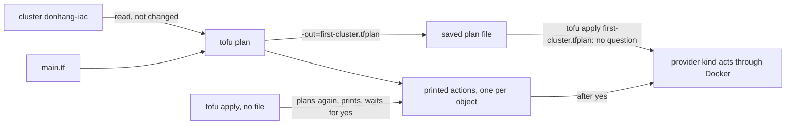

## Before you start

- [[devops.l3.opentofu-resources]] — you saw `kind_cluster.this` declared in `main.tf` and the provider that creates it; this lesson is what happens between editing that file and the cluster changing.
- [[k8s.l1.manifests-and-kubectl-apply]] — you saw that applying an unchanged manifest again changes nothing; OpenTofu does the same, and also tells you beforehand what it will do.

## The situation

To try Đơn Hàng on another Kubernetes version, someone proposes changing one line of `deploy/tofu/lessons/first-cluster/main.tf`: the node image of `donhang-iac`, from v1.34.11 to v1.33.7. With `cluster-up.sh`, the earlier script, changing the image in `deploy/k8s/kind-config.yaml` did nothing to a cluster that already existed; OpenTofu compares the file with what exists, so this edit will act. A teammate has been running test Pods in `donhang-iac` all afternoon. Will OpenTofu swap the image under the running node, or remove the cluster and build a new one? How do you see exactly what OpenTofu is going to do, and make sure it does only that?

## Core concepts

- **plan (OpenTofu)** — the list of actions OpenTofu would take to make the real objects match the configuration, each one an action such as a create, an update in place, a replacement or a destroy, worked out and printed before any of them is taken.
- Action header — the `#` line that opens each object in a plan and says what would happen to it, such as `will be created`, `will be updated in-place`, `must be replaced` or `will be destroyed`.
- Saved plan — a plan written to a file with `tofu plan -out=<file>`, so that a later `tofu apply <file>` takes those actions and no others.

## How it works



In the situation above, `tofu plan` answers the question without touching anything. It reads `main.tf`, compares it with the objects OpenTofu created earlier, here the cluster `donhang-iac`, and prints one action for each object that differs. How OpenTofu knows which real objects it created is the subject of the next lesson. The plan creates, changes and deletes nothing, so you can run it as often as you like.

Each object in the plan opens with its action header. `will be created`, marked `+`, makes an object the files declare and nothing real matches yet. `will be updated in-place`, marked `~`, changes some attributes of an existing object while it keeps running; an attribute is one `name = value` setting of a resource, such as `node_image` in `main.tf`. `must be replaced` destroys the object and then creates a new one, because the provider cannot change one of its attributes on an existing object. `will be destroyed` removes an object the files no longer declare. A summary line after the objects counts them, as in `Plan: 1 to add, 0 to change, 1 to destroy.`

`tofu apply` can start in two ways. Without a file, it makes a fresh plan from the files and the objects as they are at that moment, prints it, and asks; as its prompt says, only `yes` is accepted to approve, and nothing is done without it. With a file saved by `tofu plan -out=<file>`, it asks nothing and takes exactly the saved actions. Either way, the provider kind does the work through Docker.

## In the Đơn Hàng system

`scripts/devops/tofu-plan-apply.sh` runs after `tofu-first-cluster.sh`, so `donhang-iac` already exists. It first makes the proposed edit and plans:

```bash file=scripts/devops/tofu-plan-apply.sh tag=stage-3 lines=8-22
# lesson: devops.l3.plan-and-apply
# Edit the node image, as someone moving to another Kubernetes version
# would, and plan: the cluster cannot change its image in place, so the plan
# replaces it (-/+). The edit is undone when the script ends.
cp main.tf main.tf.orig
trap 'mv main.tf.orig main.tf' EXIT
perl -pi -e 's#kindest/node:v1\.34\.11\@sha256:[0-9a-f]+#kindest/node:v1.33.7\@sha256:d26ef333bdb2cbe9862a0f7c3803ecc7b4303d8cea8e814b481b09949d353040#' main.tf
diff main.tf.orig main.tf || true
echo
# (The plan lists every attribute, the cluster's credentials too; only the
# lines that say what would happen and why are kept here.)
echo '$ tofu plan'
tofu plan -no-color | grep -e '^  # ' -e 'forces replacement' -e '^Plan:'
mv main.tf.orig main.tf
trap - EXIT
```

```text output=true
21c21
<   node_image     = "kindest/node:v1.34.11@sha256:44e222ee2132dab25ff87301682f89eb82c7880ea3a1bf543bfe9708fd08d67d"
---
>   node_image     = "kindest/node:v1.33.7@sha256:d26ef333bdb2cbe9862a0f7c3803ecc7b4303d8cea8e814b481b09949d353040"

$ tofu plan
  # kind_cluster.this must be replaced
      ~ node_image             = "kindest/node:v1.34.11@sha256:44e222ee2132dab25ff87301682f89eb82c7880ea3a1bf543bfe9708fd08d67d" -> "kindest/node:v1.33.7@sha256:d26ef333bdb2cbe9862a0f7c3803ecc7b4303d8cea8e814b481b09949d353040" # forces replacement
Plan: 1 to add, 0 to change, 1 to destroy.
...
```

`perl` rewrites the image on line 21 of `main.tf`, `diff` shows that one changed line, and the original file is put back afterwards. The `grep` keeps three kinds of line because, as the comment says, the full plan prints every attribute, the cluster's credentials included.

The header `kind_cluster.this must be replaced` answers the situation. The attribute line starts with `~` only because that value changes, and `# forces replacement` names the attribute that makes the provider replace the whole cluster. Replacing means destroying `donhang-iac` and creating a new, empty cluster: every Pod your teammate ran in it is lost.

With the committed file back, the script saves a plan and applies it, then applies once more without a file:

```bash file=scripts/devops/tofu-plan-apply.sh tag=stage-3 lines=25-35
# lesson: devops.l3.plan-and-apply
# With the file as committed: save the plan, then apply that file. apply
# asks nothing and takes exactly the saved actions, here none.
show tofu plan -out=first-cluster.tfplan -no-color
echo
show tofu apply -no-color first-cluster.tfplan
rm -f first-cluster.tfplan
echo
# A second apply of unchanged files: the cluster already matches them.
echo '$ tofu apply   (answered: yes)'
echo yes | tofu apply -no-color
```

```text output=true
...
$ tofu plan -out=first-cluster.tfplan -no-color

No changes. Your infrastructure matches the configuration.

OpenTofu has compared your real infrastructure against your configuration and
found no differences, so no changes are needed.

$ tofu apply -no-color first-cluster.tfplan

Apply complete! Resources: 0 added, 0 changed, 0 destroyed.

$ tofu apply   (answered: yes)

No changes. Your infrastructure matches the configuration.

OpenTofu has compared your real infrastructure against your configuration and
found no differences, so no changes are needed.

Apply complete! Resources: 0 added, 0 changed, 0 destroyed.
```

`show` prints each command before running it. Applying the saved file prints no plan and no question. The last apply plans again, finds the cluster already matching, and finishes without the `Do you want to perform these actions?` prompt. When there is something to do, apply prints the plan, then that prompt followed by `Only 'yes' will be accepted to approve.`, and waits.

## Seniors often assume…

- **"`tofu plan` already makes the harmless part of the changes; `apply` only finishes the rest."** → Actually `plan` takes no action at all, not even a `+`; it reads what exists and prints what would change, and every change happens during `apply`. You notice this when a plan says `kind_cluster.this will be created` and `kind get clusters`, the kind tool's command that lists existing kind clusters, still does not list `donhang-iac` afterwards.
- **"A `~` in the plan means the object is deleted and created again."** → Actually `~` in front of an object means update in place, and the object keeps running; a replacement is headed `must be replaced`. Inside a replacement, a `~` attribute line only says that value changes, and `# forces replacement` says why the whole object goes. You notice this in the plan above: the `node_image` line starts with `~`, yet the summary says `1 to destroy`.
- **"The plan I read yesterday is exactly what `tofu apply` will do today."** → Actually yesterday's plan is printed text; `tofu apply` without a file plans again from today's files and today's objects, so a commit merged overnight changes the actions. When the files may have changed since you read a plan, read the one apply prints before typing `yes`, or save a plan with `-out`, read it, and apply that file. You notice this when the plan above the prompt shows `will be destroyed` for an object you did not see yesterday.

## Try it (3 minutes)

`donhang-iac` must exist: if `kind get clusters` does not list it, run `scripts/devops/tofu-first-cluster.sh` first. kind runs each node of a cluster as a Docker container, so `docker ps` lists the node of `donhang-iac`; a replaced cluster would be a new container with a fresh `Up` time.

1. Run `docker ps --filter name=donhang-iac` and note the `STATUS` column, such as `Up 20 minutes`.
2. Run `scripts/devops/tofu-plan-apply.sh`, then `docker ps --filter name=donhang-iac` again.

Expected result: the script prints the lines shown above, `must be replaced` and `1 to destroy` for the edited image, then `No changes.` twice. The `STATUS` column has only grown older: the plan that would destroy the cluster destroyed nothing, and the applies that followed had nothing to do.

## Connections

- [[devops.l3.tofu-state]] — the next step: how OpenTofu knows that the cluster `donhang-iac` is the object `kind_cluster.this`, the record every plan compares against.
- [[k8s.l1.rolling-updates]] — the opposite way to change what runs: a Deployment replaces its Pods a few at a time while the app keeps serving, where `must be replaced` on the cluster replaces everything at once.
- [[devops.l2.quality-gate]] — the same idea of checking a change before it goes further; a plan is that check for real infrastructure, and Đơn Hàng's CI `iac` job only checks the files' format and validity, without `tofu plan`, so you read the plan yourself.

## Five-line summary

1. `tofu plan` shows every action OpenTofu would take to match the configuration, and takes none of them.
2. Each object's header says its action, such as `will be created`, `will be updated in-place` or `must be replaced`.
3. `tofu apply` without a file plans again, prints the plan, and acts only after you type `yes`.
4. `tofu apply <file>` takes exactly the actions saved by `tofu plan -out=<file>`, without asking.
5. Changing the node image of `first-cluster` replaces the whole cluster; applying unchanged files changes nothing and asks nothing.
