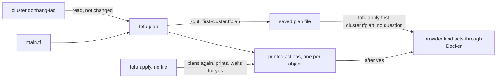

## Bạn cần biết trước

- [[devops.l3.opentofu-resources]] — bạn đã thấy `kind_cluster.this` được khai báo trong `main.tf` và provider tạo ra nó. Bài này nói về những gì xảy ra giữa lúc sửa file đó và lúc cluster thay đổi.
- [[k8s.l1.manifests-and-kubectl-apply]] — bạn đã thấy apply lại một manifest không đổi thì không có gì thay đổi. OpenTofu cũng vậy, và còn cho bạn biết trước nó sẽ làm gì.

## Tình huống

Để thử Đơn Hàng trên một phiên bản Kubernetes khác, có người đề xuất sửa một dòng trong `deploy/tofu/lessons/first-cluster/main.tf`: node image của `donhang-iac`, từ v1.34.11 xuống v1.33.7. Với `cluster-up.sh`, script cũ, sửa image trong `deploy/k8s/kind-config.yaml` không ảnh hưởng gì tới cluster đã tồn tại. OpenTofu thì so file với những gì đang có, nên lần sửa này sẽ có tác dụng. Một đồng nghiệp đã chạy các Pod thử nghiệm trong `donhang-iac` suốt buổi chiều. OpenTofu sẽ thay image ngay dưới node đang chạy, hay xóa cluster rồi dựng cái mới? Làm sao bạn thấy chính xác OpenTofu sắp làm gì, và chắc chắn nó chỉ làm đúng điều đó?

## Khái niệm cốt lõi

- **plan (OpenTofu)** (Danh sách hành động OpenTofu sẽ làm (tạo, sửa tại chỗ, thay thế, xóa) để thực tế khớp cấu hình, chưa làm gì) — danh sách các hành động OpenTofu sẽ làm để các object thật khớp với configuration. Mỗi hành động là một kiểu như tạo, sửa tại chỗ, thay thế hay xóa, được tính ra và in ra trước khi bất kỳ hành động nào diễn ra.
- Dòng tiêu đề hành động — dòng `#` mở đầu mỗi object trong plan, cho biết điều gì sẽ xảy ra với nó, như `will be created`, `will be updated in-place`, `must be replaced` hay `will be destroyed`.
- Plan đã lưu — plan được ghi ra file bằng `tofu plan -out=<file>`, để một lần `tofu apply <file>` sau đó làm đúng các hành động đó và không gì khác.

## Cơ chế hoạt động



Trong tình huống trên, `tofu plan` trả lời câu hỏi mà không đụng vào thứ gì. Nó đọc `main.tf`, so với các object OpenTofu đã tạo trước đó, ở đây là cluster `donhang-iac`, rồi in ra một hành động cho mỗi object có khác biệt. OpenTofu biết những object thật nào do nó tạo ra bằng cách nào là chủ đề của bài sau. Plan không tạo, không sửa, không xóa gì, nên bạn chạy bao nhiêu lần cũng được.

Mỗi object trong plan mở đầu bằng dòng tiêu đề hành động. `will be created`, đánh dấu `+`, tạo một object mà file khai báo nhưng chưa có gì thật tương ứng. `will be updated in-place`, đánh dấu `~`, đổi vài attribute của một object đang có trong khi nó vẫn chạy. Một attribute là một thiết lập `name = value` của resource, như `node_image` trong `main.tf`. `must be replaced` xóa object rồi tạo một object mới, vì provider không đổi được một trong các attribute của nó trên object đang có. `will be destroyed` xóa một object mà file không còn khai báo nữa. Sau các object là một dòng tóm tắt đếm chúng, như `Plan: 1 to add, 0 to change, 1 to destroy.`

`tofu apply` có hai cách bắt đầu. Không có file, nó lập một plan mới từ file và các object đúng tại thời điểm đó, in ra, rồi hỏi. Như lời nhắc của nó ghi, chỉ `yes` mới được chấp nhận là đồng ý, và không có nó thì không gì được làm. Có file do `tofu plan -out=<file>` lưu, nó không hỏi gì và làm đúng các hành động đã lưu. Cách nào thì provider kind cũng làm việc qua Docker.

## Trong hệ thống Đơn Hàng

`scripts/devops/tofu-plan-apply.sh` chạy sau `tofu-first-cluster.sh`, nên `donhang-iac` đã tồn tại. Đầu tiên nó thực hiện lần sửa được đề xuất và lập plan:

```bash file=scripts/devops/tofu-plan-apply.sh tag=stage-3 lines=8-22
# lesson: devops.l3.plan-and-apply
# Edit the node image, as someone moving to another Kubernetes version
# would, and plan: the cluster cannot change its image in place, so the plan
# replaces it (-/+). The edit is undone when the script ends.
cp main.tf main.tf.orig
trap 'mv main.tf.orig main.tf' EXIT
perl -pi -e 's#kindest/node:v1\.34\.11\@sha256:[0-9a-f]+#kindest/node:v1.33.7\@sha256:d26ef333bdb2cbe9862a0f7c3803ecc7b4303d8cea8e814b481b09949d353040#' main.tf
diff main.tf.orig main.tf || true
echo
# (The plan lists every attribute, the cluster's credentials too; only the
# lines that say what would happen and why are kept here.)
echo '$ tofu plan'
tofu plan -no-color | grep -e '^  # ' -e 'forces replacement' -e '^Plan:'
mv main.tf.orig main.tf
trap - EXIT
```

```text output=true
21c21
<   node_image     = "kindest/node:v1.34.11@sha256:44e222ee2132dab25ff87301682f89eb82c7880ea3a1bf543bfe9708fd08d67d"
---
>   node_image     = "kindest/node:v1.33.7@sha256:d26ef333bdb2cbe9862a0f7c3803ecc7b4303d8cea8e814b481b09949d353040"

$ tofu plan
  # kind_cluster.this must be replaced
      ~ node_image             = "kindest/node:v1.34.11@sha256:44e222ee2132dab25ff87301682f89eb82c7880ea3a1bf543bfe9708fd08d67d" -> "kindest/node:v1.33.7@sha256:d26ef333bdb2cbe9862a0f7c3803ecc7b4303d8cea8e814b481b09949d353040" # forces replacement
Plan: 1 to add, 0 to change, 1 to destroy.
...
```

`perl` viết lại image ở dòng 21 của `main.tf`, `diff` cho thấy đúng một dòng đã đổi, và file gốc được trả lại sau đó. `grep` giữ ba loại dòng vì, như comment ghi, plan đầy đủ in mọi attribute, kể cả thông tin đăng nhập của cluster.

Dòng tiêu đề `kind_cluster.this must be replaced` trả lời câu hỏi của tình huống. Dòng attribute bắt đầu bằng `~` chỉ vì giá trị đó thay đổi, còn `# forces replacement` chỉ ra attribute khiến provider phải thay cả cluster. Thay thế nghĩa là xóa `donhang-iac` và tạo một cluster mới, trống trơn: mọi Pod đồng nghiệp đã chạy trong đó đều mất.

Khi file đã commit được trả lại, script lưu một plan và apply nó, rồi apply thêm một lần nữa không kèm file:

```bash file=scripts/devops/tofu-plan-apply.sh tag=stage-3 lines=25-35
# lesson: devops.l3.plan-and-apply
# With the file as committed: save the plan, then apply that file. apply
# asks nothing and takes exactly the saved actions, here none.
show tofu plan -out=first-cluster.tfplan -no-color
echo
show tofu apply -no-color first-cluster.tfplan
rm -f first-cluster.tfplan
echo
# A second apply of unchanged files: the cluster already matches them.
echo '$ tofu apply   (answered: yes)'
echo yes | tofu apply -no-color
```

```text output=true
...
$ tofu plan -out=first-cluster.tfplan -no-color

No changes. Your infrastructure matches the configuration.

OpenTofu has compared your real infrastructure against your configuration and
found no differences, so no changes are needed.

$ tofu apply -no-color first-cluster.tfplan

Apply complete! Resources: 0 added, 0 changed, 0 destroyed.

$ tofu apply   (answered: yes)

No changes. Your infrastructure matches the configuration.

OpenTofu has compared your real infrastructure against your configuration and
found no differences, so no changes are needed.

Apply complete! Resources: 0 added, 0 changed, 0 destroyed.
```

`show` in từng lệnh trước khi chạy nó. Apply file đã lưu không in plan và không hỏi gì. Lần apply cuối lập plan lại, thấy cluster đã khớp, và kết thúc mà không hiện lời nhắc `Do you want to perform these actions?`. Khi có việc cần làm, apply in plan, rồi tới lời nhắc đó kèm `Only 'yes' will be accepted to approve.`, và chờ.

## Senior hay nhầm rằng…

- **"`tofu plan` đã làm sẵn phần vô hại của các thay đổi, `apply` chỉ làm nốt phần còn lại."** → Thực ra `plan` không làm hành động nào cả, kể cả một `+`. Nó đọc những gì đang có và in ra những gì sẽ đổi, còn mọi thay đổi đều diễn ra trong `apply`. Bạn sẽ nhận ra khi plan ghi `kind_cluster.this will be created` mà sau đó `kind get clusters`, lệnh của công cụ kind liệt kê các kind cluster đang có, vẫn không có `donhang-iac`.
- **"Dấu `~` trong plan nghĩa là object bị xóa rồi tạo lại."** → Thực ra `~` đứng trước một object nghĩa là sửa tại chỗ, và object vẫn chạy. Một lần thay thế có tiêu đề `must be replaced`. Bên trong một lần thay thế, dòng attribute có `~` chỉ nói giá trị đó thay đổi, còn `# forces replacement` nói vì sao cả object phải đi. Bạn sẽ nhận ra điều này ở plan phía trên: dòng `node_image` bắt đầu bằng `~`, vậy mà dòng tóm tắt ghi `1 to destroy`.
- **"Plan mình đọc hôm qua chính là những gì `tofu apply` sẽ làm hôm nay."** → Thực ra plan hôm qua chỉ là văn bản đã in. `tofu apply` không kèm file sẽ lập plan lại từ file và object của hôm nay, nên một commit được merge qua đêm sẽ làm thay đổi các hành động. Khi file có thể đã đổi kể từ lúc bạn đọc plan, hãy đọc plan mà apply in ra trước khi gõ `yes`, hoặc lưu plan bằng `-out`, đọc nó, rồi apply đúng file đó. Bạn sẽ nhận ra khi plan phía trên lời nhắc hiện `will be destroyed` cho một object mà hôm qua bạn không thấy.

## Thử ngay (3 phút)

`donhang-iac` phải đang tồn tại: nếu `kind get clusters` không liệt kê nó, hãy chạy `scripts/devops/tofu-first-cluster.sh` trước. kind chạy mỗi node của cluster thành một container Docker, nên `docker ps` liệt kê node của `donhang-iac`. Một cluster bị thay thế sẽ là container mới với thời gian `Up` tính lại từ đầu.

1. Chạy `docker ps --filter name=donhang-iac` và ghi lại cột `STATUS`, ví dụ `Up 20 minutes`.
2. Chạy `scripts/devops/tofu-plan-apply.sh`, rồi chạy lại `docker ps --filter name=donhang-iac`.

Kết quả mong đợi: script in các dòng như phía trên, `must be replaced` và `1 to destroy` cho image đã sửa, rồi `No changes.` hai lần. Cột `STATUS` chỉ tăng thêm thời gian: plan lẽ ra sẽ xóa cluster không xóa gì cả, và các lần apply sau đó không có gì để làm.

## Liên hệ

- [[devops.l3.tofu-state]] — bước tiếp theo: làm sao OpenTofu biết cluster `donhang-iac` chính là object `kind_cluster.this`, bản ghi mà mọi plan đem ra so.
- [[k8s.l1.rolling-updates]] — cách ngược lại để thay đổi thứ đang chạy: một Deployment thay Pod của nó vài cái một lúc trong khi app vẫn phục vụ, còn `must be replaced` trên cluster thì thay tất cả cùng lúc.
- [[devops.l2.quality-gate]] — cùng ý kiểm tra một thay đổi trước khi nó đi xa hơn. Plan là bước kiểm tra đó cho hạ tầng thật, và job `iac` trong CI của Đơn Hàng chỉ kiểm tra định dạng và tính hợp lệ của file, không chạy `tofu plan`, nên bạn phải tự đọc plan.

## Tóm tắt 5 dòng

1. `tofu plan` cho thấy mọi hành động OpenTofu sẽ làm để khớp configuration, và không làm hành động nào.
2. Dòng tiêu đề của mỗi object cho biết hành động của nó, như `will be created`, `will be updated in-place` hay `must be replaced`.
3. `tofu apply` không kèm file sẽ lập plan lại, in plan ra, và chỉ làm sau khi bạn gõ `yes`.
4. `tofu apply <file>` làm đúng các hành động mà `tofu plan -out=<file>` đã lưu, không hỏi gì.
5. Đổi node image của `first-cluster` sẽ thay cả cluster. Apply file không đổi thì không thay đổi gì và không hỏi gì.
