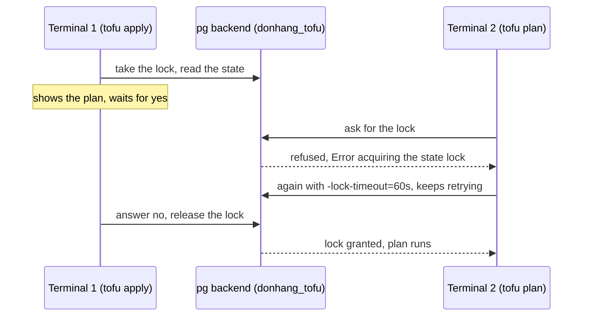

## Before you start

- [[devops.l3.one-state-per-environment]] — you know each environment and layer is a folder with its own state, and that its `backend.tf` names a schema such as `staging_cluster`; this lesson explains that file.
- [[devops.l3.tofu-state]] — you know the state is OpenTofu's only record of its objects, that without it a plan creates everything again, and that it holds `client_key` in plain text.
- [[backend.l2.skip-locked-claiming]] — you know a row lock keeps a second transaction from taking the same row; OpenTofu needs the same protection for its state.

## The situation

Picture staging's state kept the way `first-cluster` keeps its own: a `terraform.tfstate` file in `deploy/tofu/envs/staging/cluster` on your laptop. A teammate also applies to staging, from their own copy of the repository. `.gitignore` keeps state files out of Git, so their copy has no state, and their plan proposes creating `donhang-staging` from nothing. They suggest committing the file. Then a second risk appears: while your `tofu apply` waits for `yes`, nothing stops their apply from starting at the same time. Where can one copy of staging's state live for the whole team, and what stops two commands from changing it at once?

## Core concepts

- **backend (OpenTofu state)** — where OpenTofu keeps a configuration's state; with none configured it is the `local` backend, a `terraform.tfstate` file in the folder, while Đơn Hàng's environments use the `pg` backend, a table in PostgreSQL.
- **state locking** — OpenTofu holding a lock on the state for as long as a command such as `plan` or `apply` runs, so a second command on the same state is refused instead of working from a state about to change.
- Lock timeout — the `-lock-timeout=<duration>` option: how long a command keeps retrying a lock someone else holds before it fails; by default it does not retry at all.
- State encryption — OpenTofu encrypting the state with a key of yours before handing it to the backend, so the backend stores only data it cannot read.

## How it works



In the situation above, the trouble is the backend. With none configured, OpenTofu uses the `local` backend, so each copy of the repository has its own state file or none at all. Đơn Hàng's environment folders name the `pg` backend instead. It keeps each state as JSON text in a row of a table, `states`, inside a schema of the `donhang_tofu` database in Compose's PostgreSQL: `staging_cluster` for staging's cluster layer. Every copy of the repository that can reach that database plans from the same row. Here the database is on your own machine; for a team, the backend names a server every teammate's machine can reach.

One shared copy needs a lock. When a command that works on the state starts, OpenTofu asks the backend for a lock on that state and keeps it until the command ends. `tofu apply` holds it during the whole wait for `yes`, because the plan it shows was worked out from the state as it is now. Terminal 2's plan cannot get the lock and fails at once with `Error acquiring the state lock`; it does not queue. With `-lock-timeout=60s` it keeps retrying for up to 60 seconds and goes ahead once a retry gets the lock after terminal 1 answers `no` and releases it. This is the opposite default of the row lock you met with `FOR UPDATE`, where a second transaction waits.

Sharing the state also shares what is inside it: attributes in plain text, `client_key` included. A database stores whatever text it is given. So OpenTofu can encrypt the state itself before passing it on, and the backend then holds only data it cannot read.

## In the Đơn Hàng system

Staging's cluster layer names its backend and its encryption in one block:

```hcl file=deploy/tofu/envs/staging/cluster/backend.tf tag=stage-3 lines=7-28
terraform {
  backend "pg" {
    schema_name = "staging_cluster"
  }

  encryption {
    key_provider "pbkdf2" "passphrase" {
      passphrase = var.state_passphrase
    }
    method "aes_gcm" "state" {
      keys = key_provider.pbkdf2.passphrase
    }
    state {
      method   = method.aes_gcm.state
      enforced = true
    }
    plan {
      method   = method.aes_gcm.state
      enforced = true
    }
  }
}
```

`backend "pg"` sets only `schema_name`. The connection string, a `postgres://` URL holding the user, password, server address and database name, comes from the environment variable `PG_CONN_STR`. `scripts/devops/tofu-env.sh` builds it from `.env`, the file at the repository root that holds local secrets and is kept out of Git. The script is a wrapper: it sets these values, then runs `tofu` with the remaining arguments in `deploy/tofu/envs/<environment>/<layer>`.

Inside `encryption`, `key_provider "pbkdf2"` turns the passphrase in the input variable `state_passphrase` into an encryption key, `method "aes_gcm"` encrypts with that key, and the `state` and `plan` blocks apply it to the state and to plans saved with `-out`. `enforced = true` makes OpenTofu refuse to write either one unencrypted. `tofu-env.sh` fills the variable from `TOFU_STATE_PASSPHRASE`, a random value `scripts/dev-secrets.sh` adds to `.env`; a comment in `dev-secrets.sh` warns that a lost passphrase leaves every state written with it unreadable.

`scripts/devops/tofu-lock.sh` plays both terminals of the diagram on staging's platform layer:

```bash file=scripts/devops/tofu-lock.sh tag=stage-3 lines=11-28
# lesson: devops.l3.remote-state-and-locking
# Terminal 1: an apply that holds the lock while it waits for "yes"; here
# the answer, "no", comes 30 seconds after it starts.
echo "== terminal 1: tofu apply, waiting for an answer"
(sleep 30; echo no) | scripts/devops/tofu-env.sh staging platform apply -input=true -no-color >/dev/null 2>&1 &
apply=$!
sleep 15

# Terminal 2: a plan while the state is locked fails at once...
echo "== terminal 2: tofu plan"
scripts/devops/tofu-env.sh staging platform plan -no-color 2>&1 | grep -e '^Error' || true
echo

# ...unless it is told to wait for the lock.
echo "== terminal 2: tofu plan -lock-timeout=60s"
started=$SECONDS
scripts/devops/tofu-env.sh staging platform plan -lock-timeout=60s -no-color | grep -e '^No changes' -e '^Plan:'
echo "it waited about $(( SECONDS - started )) s, until terminal 1's apply ended"
```

```text output=true
== terminal 1: tofu apply, waiting for an answer
== terminal 2: tofu plan
Error: Error acquiring the state lock
Error message: Workspace is already locked: default

== terminal 2: tofu plan -lock-timeout=60s
Plan: 0 to add, 1 to change, 0 to destroy.
it waited about ... s, until terminal 1's apply ended
```

Terminal 1's apply runs in the background with its output thrown away, and its answer, `no`, arrives through a pipe 30 seconds after it starts. `grep` keeps only terminal 2's error lines or its plan summary. Fifteen seconds in, the plain plan fails at once; the message names the workspace `default`, the only one each Đơn Hàng folder has. The same plan with `-lock-timeout=60s` finishes once the apply ends; the seconds vary from run to run, so the capture shows `...`. Its `1 to change` comes from a label the script adds to the namespace `donhang` by hand before this excerpt, so that the apply has a change to ask `yes` about.

## Seniors often assume…

- **"Committing `terraform.tfstate` to Git is a fine way to share it with the team."** → Actually Git hands the state's credentials, `client_key` included, to everyone who can read the repository, in every past commit too. It also has no lock: two people can apply from their own copies at once and each commit a state the other's apply never saw. You notice this when a `git pull` reports a conflict inside `terraform.tfstate`.
- **"If two people apply at the same time, the second apply simply waits for the first one to finish."** → Actually the second command fails at once with `Error acquiring the state lock`. It waits only when given `-lock-timeout`, and only that long. You notice this when a plan in a second terminal fails while another terminal's apply sits at its `yes` prompt.
- **"Keeping the state in a database means it is encrypted."** → Actually the `pg` backend stores whatever OpenTofu hands it; without an `encryption` block, a row would hold the same plain text as `terraform.tfstate`, `client_key` included, for anyone who can read the table. Đơn Hàng's rows are unreadable only because OpenTofu encrypts first. You notice this when you list the keys of a row: the attributes are not there as readable keys; they sit inside `encrypted_data`.

## Try it (3 minutes)

At the root of your Đơn Hàng folder at stage-3, with `scripts/up.sh` and `scripts/devops/tofu-environments.sh` (it applies staging's two layers) already run, in Git Bash:

1. Run `scripts/devops/tofu-db.sh`.
2. Read the section `== what a row holds` and the lines after it.

Expected result: the schemas include `staging_cluster` and `staging_platform`, each with one state named `default`; the top-level keys of a row's JSON are `serial`, `lineage`, `meta`, `encrypted_data` and `encryption_version`; `0` rows contain a private key in plain text; and `== state files under deploy/tofu/envs` prints `none`.

Think: a teammate's copy of the repository reaches the same `donhang_tofu`, but their `.env` holds a different `TOFU_STATE_PASSPHRASE`. What happens when they plan staging?

<details><summary>Suggested answer</summary>

OpenTofu cannot read the encrypted row without the key derived from the team's passphrase, so their plan cannot use staging's state. Sharing the state means sharing the passphrase too.

</details>

## Connections

- [[devops.l3.tofu-state]] — the record this lesson moves out of the folder; its plain-text credentials are why the shared copy is encrypted.
- [[devops.l3.one-state-per-environment]] — prerequisite: the folders whose `backend.tf` names the schemas listed by `tofu-db.sh`.
- [[backend.l2.skip-locked-claiming]] — the same need for one writer at a time, solved with a row lock that waits or skips instead of failing.
- [[devops.l1.secrets-vs-config]] — the `.env` file that now also holds the passphrase, kept out of Git like any secret.
- [[devops.l3.configuration-drift]] — next: what a plan shows after a change made by hand, like the label `tofu-lock.sh` adds.

## Five-line summary

1. A backend keeps one copy of each state where the whole team reaches it, and OpenTofu locks that state while a command runs.
2. Đơn Hàng's environments use the `pg` backend: one schema per folder in the `donhang_tofu` database of Compose's PostgreSQL.
3. While `tofu apply` waits for `yes`, a `tofu plan` on the same state fails at once with `Error acquiring the state lock`.
4. `-lock-timeout=60s` makes a command retry the lock for up to 60 seconds instead of failing at once.
5. OpenTofu encrypts the state with a key derived from `TOFU_STATE_PASSPHRASE` before the backend stores it, so the rows hold no readable credentials.
