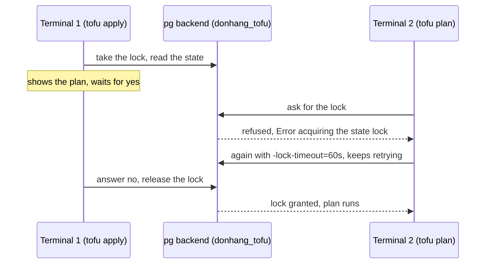

## Bạn cần biết trước

- [[devops.l3.one-state-per-environment]] — bạn đã biết mỗi môi trường và mỗi tầng là một thư mục có state riêng, và `backend.tf` của thư mục đó ghi tên một schema như `staging_cluster`. Bài này giải thích file đó.
- [[devops.l3.tofu-state]] — bạn đã biết state là bản ghi duy nhất của OpenTofu về các object nó quản lý, rằng thiếu state thì plan sẽ tạo lại mọi thứ, và rằng state chứa `client_key` ở dạng chữ rõ.
- [[backend.l2.skip-locked-claiming]] — bạn đã biết khóa dòng ngăn giao dịch thứ hai lấy cùng một dòng. OpenTofu cần đúng kiểu bảo vệ đó cho state của nó.

## Tình huống

Hãy hình dung state của staging được giữ giống cách `first-cluster` giữ state của nó: một file `terraform.tfstate` trong `deploy/tofu/envs/staging/cluster` trên laptop của bạn. Một đồng nghiệp cũng apply lên staging, từ bản sao repository của họ. `.gitignore` không cho file state vào Git, nên bản sao của họ không có state, và plan của họ đề xuất tạo `donhang-staging` từ đầu. Họ gợi ý commit luôn file đó. Rồi một rủi ro thứ hai xuất hiện: trong lúc `tofu apply` của bạn đang chờ `yes`, không gì ngăn apply của họ chạy cùng lúc. Một bản state duy nhất của staging có thể nằm ở đâu cho cả nhóm dùng, và điều gì ngăn hai lệnh cùng sửa nó một lúc?

## Khái niệm cốt lõi

- **backend (OpenTofu state)** (Nơi OpenTofu lưu state của một cấu hình, vd file cục bộ hay bảng trong PostgreSQL (backend pg)) — nơi OpenTofu giữ state của một configuration. Khi không cấu hình gì, đó là backend `local`, một file `terraform.tfstate` ngay trong thư mục. Các môi trường của Đơn Hàng thì dùng backend `pg`, một bảng trong PostgreSQL.
- **khóa state** (state locking) — OpenTofu giữ khóa trên state suốt thời gian một lệnh như `plan` hay `apply` chạy, để lệnh thứ hai trên cùng state bị từ chối, thay vì làm việc với một state sắp thay đổi.
- Thời gian chờ khóa — tùy chọn `-lock-timeout=<duration>`: một lệnh tiếp tục thử lấy khóa người khác đang giữ trong bao lâu trước khi báo lỗi. Mặc định nó không thử lại chút nào.
- Mã hóa state — OpenTofu mã hóa state bằng một khóa của bạn trước khi giao cho backend, nên backend chỉ lưu dữ liệu nó không đọc được.

## Cơ chế hoạt động



Trong tình huống trên, vấn đề nằm ở backend. Khi không cấu hình gì, OpenTofu dùng backend `local`, nên mỗi bản sao repository có file state riêng, hoặc không có gì. Các thư mục môi trường của Đơn Hàng thì ghi tên backend `pg`. Backend này giữ mỗi state dưới dạng văn bản JSON trong một dòng của bảng `states`, nằm trong một schema của database `donhang_tofu` trên PostgreSQL của Compose: `staging_cluster` cho tầng cluster của staging. Mọi bản sao repository kết nối được tới database đó đều lập plan từ cùng một dòng. Ở đây database nằm trên máy của bạn. Với một nhóm, backend sẽ trỏ tới một server mà máy của mọi thành viên đều kết nối được.

Một bản dùng chung thì cần khóa. Khi một lệnh làm việc với state bắt đầu, OpenTofu xin backend một khóa trên state đó và giữ tới khi lệnh kết thúc. `tofu apply` giữ khóa suốt lúc chờ `yes`, vì plan nó hiện ra được tính từ state đúng lúc này. Plan ở terminal 2 không lấy được khóa và báo lỗi ngay với `Error acquiring the state lock`, chứ không xếp hàng chờ. Với `-lock-timeout=60s`, nó thử lại liên tục trong tối đa 60 giây, và chạy tiếp khi một lần thử lấy được khóa, sau khi terminal 1 trả lời `no` và nhả khóa. Mặc định này ngược với khóa dòng bạn đã gặp ở `FOR UPDATE`, nơi giao dịch thứ hai chờ.

Dùng chung state cũng là dùng chung những gì bên trong nó: các attribute ở dạng chữ rõ, kể cả `client_key`. Database lưu bất cứ văn bản nào nó nhận. Vì vậy OpenTofu có thể tự mã hóa state trước khi chuyển đi, và backend khi đó chỉ giữ dữ liệu nó không đọc được.

## Trong hệ thống Đơn Hàng

Tầng cluster của staging khai báo backend và cách mã hóa trong cùng một khối:

```hcl file=deploy/tofu/envs/staging/cluster/backend.tf tag=stage-3 lines=7-28
terraform {
  backend "pg" {
    schema_name = "staging_cluster"
  }

  encryption {
    key_provider "pbkdf2" "passphrase" {
      passphrase = var.state_passphrase
    }
    method "aes_gcm" "state" {
      keys = key_provider.pbkdf2.passphrase
    }
    state {
      method   = method.aes_gcm.state
      enforced = true
    }
    plan {
      method   = method.aes_gcm.state
      enforced = true
    }
  }
}
```

`backend "pg"` chỉ đặt `schema_name`. Chuỗi kết nối, một URL `postgres://` chứa user, mật khẩu, địa chỉ server và tên database, lấy từ biến môi trường `PG_CONN_STR`. `scripts/devops/tofu-env.sh` dựng chuỗi này từ `.env`, file ở thư mục gốc repository chứa các secret cục bộ và không được đưa vào Git. Script này là một lớp bọc: nó đặt các giá trị đó, rồi chạy `tofu` với các tham số còn lại trong `deploy/tofu/envs/<environment>/<layer>`.

Bên trong `encryption`, `key_provider "pbkdf2"` biến passphrase trong biến đầu vào `state_passphrase` thành khóa mã hóa, `method "aes_gcm"` mã hóa bằng khóa đó, còn hai khối `state` và `plan` áp nó lên state và lên các plan lưu bằng `-out`. `enforced = true` khiến OpenTofu từ chối ghi một trong hai thứ đó mà không mã hóa. `tofu-env.sh` lấy giá trị cho biến từ `TOFU_STATE_PASSPHRASE`, một giá trị ngẫu nhiên mà `scripts/dev-secrets.sh` thêm vào `.env`. Một comment trong `dev-secrets.sh` cảnh báo rằng mất passphrase thì mọi state đã ghi bằng nó đều không đọc được nữa.

`scripts/devops/tofu-lock.sh` diễn lại cả hai terminal của sơ đồ trên tầng platform của staging:

```bash file=scripts/devops/tofu-lock.sh tag=stage-3 lines=11-28
# lesson: devops.l3.remote-state-and-locking
# Terminal 1: an apply that holds the lock while it waits for "yes"; here
# the answer, "no", comes 30 seconds after it starts.
echo "== terminal 1: tofu apply, waiting for an answer"
(sleep 30; echo no) | scripts/devops/tofu-env.sh staging platform apply -input=true -no-color >/dev/null 2>&1 &
apply=$!
sleep 15

# Terminal 2: a plan while the state is locked fails at once...
echo "== terminal 2: tofu plan"
scripts/devops/tofu-env.sh staging platform plan -no-color 2>&1 | grep -e '^Error' || true
echo

# ...unless it is told to wait for the lock.
echo "== terminal 2: tofu plan -lock-timeout=60s"
started=$SECONDS
scripts/devops/tofu-env.sh staging platform plan -lock-timeout=60s -no-color | grep -e '^No changes' -e '^Plan:'
echo "it waited about $(( SECONDS - started )) s, until terminal 1's apply ended"
```

```text output=true
== terminal 1: tofu apply, waiting for an answer
== terminal 2: tofu plan
Error: Error acquiring the state lock
Error message: Workspace is already locked: default

== terminal 2: tofu plan -lock-timeout=60s
Plan: 0 to add, 1 to change, 0 to destroy.
it waited about ... s, until terminal 1's apply ended
```

Apply của terminal 1 chạy nền và output bị bỏ đi. Câu trả lời `no` của nó tới qua một pipe, 30 giây sau khi bắt đầu. `grep` chỉ giữ các dòng lỗi hoặc dòng tóm tắt plan của terminal 2. Ở giây thứ 15, plan không kèm tùy chọn báo lỗi ngay. Thông báo nêu tên workspace `default`, workspace duy nhất mà mỗi thư mục của Đơn Hàng có. Cùng plan đó với `-lock-timeout=60s` thì chạy xong khi apply kết thúc. Số giây khác nhau giữa các lần chạy, nên bản ghi lại hiện `...`. Dòng `1 to change` của nó đến từ một label mà script gắn tay vào namespace `donhang` trước đoạn trích này, để apply có thay đổi mà hỏi `yes`.

## Senior hay nhầm rằng…

- **"Commit `terraform.tfstate` vào Git là cách ổn để chia sẻ nó với cả nhóm."** → Thực ra Git trao thông tin đăng nhập trong state, kể cả `client_key`, cho bất kỳ ai đọc được repository, và ở cả mọi commit cũ. Git cũng không có khóa: hai người có thể apply cùng lúc từ bản sao của mình, rồi mỗi người commit một state mà apply của người kia chưa từng thấy. Bạn sẽ nhận ra khi `git pull` báo conflict ngay trong `terraform.tfstate`.
- **"Nếu hai người apply cùng lúc, apply thứ hai chỉ việc chờ apply thứ nhất xong."** → Thực ra lệnh thứ hai báo lỗi ngay với `Error acquiring the state lock`. Nó chỉ chờ khi có `-lock-timeout`, và chỉ chờ trong khoảng đó. Bạn sẽ nhận ra khi một plan ở terminal thứ hai báo lỗi trong lúc apply ở terminal kia đang đứng ở lời nhắc `yes`.
- **"Giữ state trong database nghĩa là state đã được mã hóa."** → Thực ra backend `pg` lưu đúng những gì OpenTofu đưa cho nó. Không có khối `encryption`, một dòng sẽ chứa đúng chữ rõ như `terraform.tfstate`, kể cả `client_key`, cho bất kỳ ai đọc được bảng. Các dòng của Đơn Hàng không đọc được chỉ vì OpenTofu mã hóa trước. Bạn sẽ nhận ra khi liệt kê các key của một dòng: các attribute không nằm đó thành key đọc được, mà nằm bên trong `encrypted_data`.

## Thử ngay (3 phút)

Ở thư mục gốc Đơn Hàng tại stage-3, sau khi đã chạy `scripts/up.sh` và `scripts/devops/tofu-environments.sh` (script apply hai tầng của staging), trong Git Bash:

1. Chạy `scripts/devops/tofu-db.sh`.
2. Đọc phần `== what a row holds` và các dòng sau nó.

Kết quả mong đợi: danh sách schema có `staging_cluster` và `staging_platform`, mỗi schema có một state tên `default`. Các key cấp cao nhất trong JSON của một dòng là `serial`, `lineage`, `meta`, `encrypted_data` và `encryption_version`. Có `0` dòng chứa private key ở dạng chữ rõ. Và `== state files under deploy/tofu/envs` in ra `none`.

Suy nghĩ: bản sao repository của một đồng nghiệp kết nối tới cùng `donhang_tofu`, nhưng `.env` của họ có `TOFU_STATE_PASSPHRASE` khác. Chuyện gì xảy ra khi họ lập plan cho staging?

<details><summary>Gợi ý đáp án</summary>

OpenTofu không đọc được dòng đã mã hóa nếu thiếu khóa sinh ra từ passphrase của nhóm, nên plan của họ không dùng được state của staging. Dùng chung state nghĩa là phải dùng chung cả passphrase.

</details>

## Liên hệ

- [[devops.l3.tofu-state]] — bản ghi mà bài này chuyển ra khỏi thư mục. Thông tin đăng nhập ở dạng chữ rõ trong đó là lý do bản dùng chung được mã hóa.
- [[devops.l3.one-state-per-environment]] — bài cần trước: các thư mục có `backend.tf` ghi tên các schema mà `tofu-db.sh` liệt kê.
- [[backend.l2.skip-locked-claiming]] — cùng nhu cầu mỗi lúc chỉ một bên ghi, nhưng giải bằng khóa dòng chờ hoặc bỏ qua, thay vì báo lỗi.
- [[devops.l1.secrets-vs-config]] — file `.env` giờ chứa thêm passphrase, và được giữ ngoài Git như mọi secret.
- [[devops.l3.configuration-drift]] — bài tiếp theo: plan cho thấy gì sau một thay đổi làm bằng tay, như label mà `tofu-lock.sh` gắn vào.

## Tóm tắt 5 dòng

1. Backend giữ một bản duy nhất của mỗi state ở nơi cả nhóm truy cập được, và OpenTofu khóa state đó khi một lệnh đang chạy.
2. Các môi trường của Đơn Hàng dùng backend `pg`: mỗi thư mục một schema trong database `donhang_tofu` trên PostgreSQL của Compose.
3. Trong lúc `tofu apply` chờ `yes`, một `tofu plan` trên cùng state báo lỗi ngay với `Error acquiring the state lock`.
4. `-lock-timeout=60s` khiến một lệnh thử lấy lại khóa trong tối đa 60 giây thay vì báo lỗi ngay.
5. OpenTofu mã hóa state bằng khóa sinh từ `TOFU_STATE_PASSPHRASE` trước khi backend lưu, nên các dòng không chứa thông tin đăng nhập nào đọc được.
