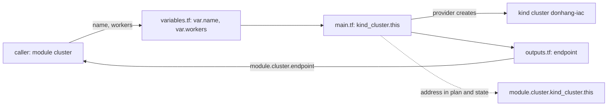

## Before you start

- [[devops.l3.tofu-state]] — you saw that the state links each resource address, such as `kind_cluster.this`, to one real object; this lesson changes that address.
- [[devops.l3.opentofu-resources]] — you saw that OpenTofu reads every `.tf` file in one folder as one configuration; this lesson has one configuration call another folder.

## The situation

`donhang-iac` runs from `deploy/tofu/lessons/first-cluster`, declared by one `resource` block. Your team now wants more kind clusters: a one-node cluster for staging, and one with two workers for production. Copying `main.tf` into each folder would work, but the node image would then be written three times, and the day someone edits one copy, the clusters run different Kubernetes versions with no warning. You would rather write the cluster once and give each folder only a name and a number of workers. Yet `donhang-iac` is already running, and you saw that an address missing from the files gets destroyed. How do you write the cluster once, call it with each cluster's own values, and keep `donhang-iac` running?

## Core concepts

- **module (OpenTofu)** — a folder of `.tf` files that another configuration calls with a `module` block; `deploy/tofu/modules/kind-cluster` is one, and it declares one kind cluster.
- **input variable** — a parameter of a module, declared with a `variable` block and read inside the module as `var.<name>`; the calling `module` block gives its value.
- **output value** — a value a module hands back, declared with an `output` block; the caller reads it as `module.<name>.<output>`.
- Module prefix — the `module.<name>.` placed in front of every resource address inside a called module, as in `module.cluster.kind_cluster.this`.
- `moved` block — a block naming an object's old address and its new one, so the plan keeps the object instead of replacing it.

## How it works



In the situation above, the cluster written once is the module `deploy/tofu/modules/kind-cluster`. `main.tf` holds its `resource` block, from which the kind provider creates the real cluster, here `donhang-iac`; `variables.tf` and `outputs.tf` hold the rest. Nothing inside the folder marks it as a module: any folder of `.tf` files is one, and it becomes a child module when another configuration calls it.

The caller is a `module` block. Its `source` is a local path that starts with `../` or `./`. Most of its other arguments set the module's input variables by name; this call gives `name` and `workers`. A variable declared without a `default` must be given. `kind-cluster` declares a third, `published_ports`, which has a default, so this caller leaves it out. Inside, `var.name` and `var.workers` replace the values a single cluster's folder wrote.

Values travel the other way through outputs. `outputs.tf` declares `output "endpoint"`, whose value is the cluster's `endpoint` attribute (an address, not an HTTP endpoint) and whose description calls it the address of the cluster's API server; the caller reads it as `module.cluster.endpoint`. It also hands back credentials, with `client_key` marked `sensitive = true`: plans and apply output hide its value, but the state still holds it in plain text. Outputs are the only way out: the caller cannot read `kind_cluster.this` inside the module directly.

Whatever the module does not take as a variable is the same for every caller. `kind-cluster` writes the node image into its `resource` block, so every cluster it makes runs the same Kubernetes version.

Last, the module's resources get new addresses. `kind_cluster.this` inside a module called `cluster` becomes `module.cluster.kind_cluster.this`, in plans and in the state. Unless you say the object moved, the plan destroys the old address and creates the new one.

## In the Đơn Hàng system

The module's `main.tf` starts with the design choice, then the cluster itself.

```hcl file=deploy/tofu/modules/kind-cluster/main.tf tag=stage-3 lines=1-17
# lesson: devops.l3.tofu-modules
# One kind cluster: one control-plane node and var.workers worker nodes. The
# node image is not a variable: every caller, so every environment, runs the
# same Kubernetes version, the one deploy/k8s/kind-config.yaml pins.
terraform {
  required_providers {
    kind = {
      source  = "tehcyx/kind"
      version = "0.11.0"
    }
  }
}

resource "kind_cluster" "this" {
  name           = var.name
  node_image     = "kindest/node:v1.34.11@sha256:44e222ee2132dab25ff87301682f89eb82c7880ea3a1bf543bfe9708fd08d67d"
  wait_for_ready = true
```

The module declares the `kind` provider it uses in its own `required_providers`. In the `resource` block, `name` comes from `var.name`, while `node_image` is written out: `kindest/node:v1.34.11`, whose tag is the Kubernetes version every node runs. No caller can change it. Further down, outside this excerpt, `main.tf` adds one worker node per `var.workers`; with `workers = 0` there is none.

```hcl file=deploy/tofu/lessons/moved-into-module/main.tf tag=stage-3 lines=1-20
# The cluster donhang-iac of lessons/first-cluster, now declared through the
# kind-cluster module. scripts/devops/tofu-moved.sh brings first-cluster's
# state here; the moved block keeps the plan from replacing the cluster.
terraform {
  required_version = "~> 1.10.0"
}

module "cluster" {
  source  = "../../modules/kind-cluster"
  name    = "donhang-iac"
  workers = 0
}

# lesson: devops.l3.tofu-modules
# The same cluster under its new address. Without this block the plan would
# destroy kind_cluster.this and create module.cluster.kind_cluster.this.
moved {
  from = kind_cluster.this
  to   = module.cluster.kind_cluster.this
}
```

`required_version` only limits which OpenTofu versions may run this folder. `module "cluster"` calls `deploy/tofu/modules/kind-cluster`: `../../` climbs from `lessons/moved-into-module` to `deploy/tofu`, then `modules/kind-cluster` goes down into the module. It gives `name = "donhang-iac"` and `workers = 0`, the values `first-cluster` wrote into its own block.

`scripts/devops/tofu-moved.sh` brings `first-cluster`'s state into this folder, plans twice, then applies with the `moved` block in place; the destroying plan is only shown, never applied. With the `moved` block cut out, the plan prints `kind_cluster.this will be destroyed`, `module.cluster.kind_cluster.this will be created` and `Plan: 1 to add, 0 to change, 1 to destroy.`: the same cluster, deleted and made again, losing everything that ran in it. With the block, it prints `kind_cluster.this has moved to module.cluster.kind_cluster.this` and `Plan: 0 to add, 0 to change, 0 to destroy.` After the apply, `tofu state list` prints `module.cluster.kind_cluster.this`.

## Seniors often assume…

- **"Putting resources into a module only tidies the files; the plan stays the same."** → Actually each resource moved into a module gains the `module.<name>.` prefix, while the state still holds its old address, so the plan destroys and recreates it unless a `moved` block names both addresses. You notice this when a refactoring commit that changed no setting plans `1 to add, 0 to change, 1 to destroy`.
- **"A good module turns every setting into a variable, so callers can change anything."** → Actually each setting kept out of the variables is something the module holds the same for every caller; `kind-cluster` keeps the node image out, so no two of its clusters can end up on different Kubernetes versions. Make a setting a variable when callers truly need to differ in it, for example if one environment must try a new node image before another; the module then stops promising that sameness. You notice this when two clusters built from "the same module" turn out to run different Kubernetes versions.
- **"The caller can read any attribute of a resource inside a module, like any other resource in its folder."** → Actually `module.cluster` exposes only the module's outputs: `module.cluster.endpoint` works because `outputs.tf` declares it, and to hand back one more value the module adds an `output` block. You notice this when `tofu validate` rejects a reference such as `module.cluster.kind_cluster.this.name`.

## Try it (3 minutes)

1. If `donhang-iac` is not running with its state in `first-cluster`, run `scripts/devops/tofu-state.sh` first.
2. Run `scripts/devops/tofu-moved.sh` from the repository root.
3. Run `kind get clusters`.

Expected result: under `== without the moved block` the plan ends with `Plan: 1 to add, 0 to change, 1 to destroy.`; under `== with it` you see the `has moved to` line and `Plan: 0 to add, 0 to change, 0 to destroy.`; the script ends with `tofu state list` printing `module.cluster.kind_cluster.this`. `kind get clusters` still lists `donhang-iac`: only its address changed. From now on the state of `donhang-iac` lives in `moved-into-module`, not in `first-cluster`.

## Connections

- [[design.l3.module-contracts]] — the same idea in application code: other code reaches a module only through what it chooses to expose, as a caller here reaches only the outputs.
- [[devops.l3.one-state-per-environment]] — the next lesson: staging and production call `kind-cluster` with their own values, each from its own folder.
- [[devops.l3.tofu-state]] — the record a `moved` block updates: the object stays, and only the address the state files it under changes.

## Five-line summary

1. A module is a folder of `.tf` files that a configuration calls with a `module` block, giving its own values.
2. `variable` blocks declare a module's inputs; a variable without a `default` must be given by the caller.
3. `output` blocks are the only values a caller can read from a module, as `module.<name>.<output>`.
4. Whatever a module does not take as a variable is the same for every caller, such as `kind-cluster`'s node image.
5. Inside a module, addresses gain a prefix like `module.cluster.`; a `moved` block keeps the plan from replacing objects moved there.
