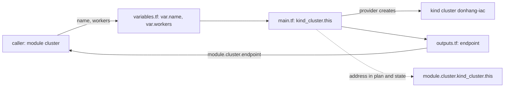

## Bạn cần biết trước

- [[devops.l3.tofu-state]] — bạn đã thấy state nối mỗi địa chỉ resource, như `kind_cluster.this`, với đúng một object thật. Bài này làm thay đổi địa chỉ đó.
- [[devops.l3.opentofu-resources]] — bạn đã thấy OpenTofu đọc mọi file `.tf` trong một thư mục như một configuration duy nhất. Bài này cho một configuration gọi sang thư mục khác.

## Tình huống

`donhang-iac` chạy từ `deploy/tofu/lessons/first-cluster`, khai báo bằng một khối `resource`. Giờ nhóm bạn muốn thêm cluster kind: một cluster một node cho staging, và một cluster có hai worker cho production. Chép `main.tf` sang từng thư mục thì vẫn chạy, nhưng khi đó node image bị viết ra ba lần. Đến ngày có người sửa một bản, các cluster chạy những phiên bản Kubernetes khác nhau mà không có cảnh báo nào. Bạn muốn viết cluster một lần, rồi mỗi thư mục chỉ cần cho một cái tên và số worker. Thế nhưng `donhang-iac` đang chạy, và bạn đã thấy một địa chỉ không còn trong file thì sẽ bị xóa. Làm sao viết cluster một lần, gọi nó với giá trị riêng của từng cluster, mà `donhang-iac` vẫn chạy tiếp?

## Khái niệm cốt lõi

- **module (OpenTofu)** (Một thư mục file .tf được cấu hình khác gọi bằng khối `module`, nhận biến đầu vào và trả output) — một thư mục file `.tf` mà configuration khác gọi bằng khối `module`. `deploy/tofu/modules/kind-cluster` là một module như vậy, và nó khai báo một cluster kind.
- **biến đầu vào** (input variable) — tham số của một module, khai bằng khối `variable` và đọc bên trong module dưới dạng `var.<name>`. Khối `module` ở bên gọi cho giá trị của nó.
- **giá trị đầu ra** (output value) — giá trị một module trả ra, khai bằng khối `output`. Bên gọi đọc nó dưới dạng `module.<name>.<output>`.
- Tiền tố module — phần `module.<name>.` gắn vào trước mọi địa chỉ resource bên trong một module được gọi, như trong `module.cluster.kind_cluster.this`.
- Khối `moved` — khối ghi địa chỉ cũ và địa chỉ mới của một object, để plan giữ object đó thay vì thay thế nó.

## Cơ chế hoạt động



Trong tình huống trên, cluster viết một lần chính là module `deploy/tofu/modules/kind-cluster`. `main.tf` chứa khối `resource` của nó, từ đó provider kind tạo ra cluster thật, ở đây là `donhang-iac`. `variables.tf` và `outputs.tf` chứa phần còn lại. Không có gì bên trong thư mục đánh dấu nó là module: thư mục `.tf` nào cũng là module, và nó thành module con khi một configuration khác gọi tới.

Bên gọi là một khối `module`. `source` của nó là đường dẫn cục bộ bắt đầu bằng `../` hoặc `./`. Phần lớn các argument còn lại đặt giá trị cho biến đầu vào của module theo tên. Lời gọi này cho `name` và `workers`. Biến khai báo không có `default` thì bắt buộc phải cho giá trị. `kind-cluster` khai báo thêm biến thứ ba, `published_ports`, có `default`, nên bên gọi này bỏ qua nó. Bên trong module, `var.name` và `var.workers` thay cho những giá trị mà thư mục của một cluster đơn lẻ từng viết thẳng ra.

Giá trị đi theo chiều ngược lại qua output. `outputs.tf` khai báo `output "endpoint"`, giá trị là thuộc tính `endpoint` của cluster (một địa chỉ, không phải endpoint HTTP), và phần mô tả của nó gọi đây là địa chỉ API server của cluster. Bên gọi đọc nó dưới dạng `module.cluster.endpoint`. Module còn trả ra thông tin đăng nhập, với `client_key` đánh dấu `sensitive = true`: plan và output của apply giấu giá trị này, nhưng state vẫn giữ nó ở dạng chữ rõ. Output là lối ra duy nhất: bên gọi không đọc thẳng được `kind_cluster.this` bên trong module.

Thứ gì module không nhận qua biến thì giống nhau với mọi bên gọi. `kind-cluster` viết thẳng node image vào khối `resource`, nên mọi cluster nó tạo ra đều chạy cùng một phiên bản Kubernetes.

Cuối cùng, các resource của module nhận địa chỉ mới. `kind_cluster.this` bên trong module được gọi với tên `cluster` trở thành `module.cluster.kind_cluster.this`, trong plan cũng như trong state. Nếu bạn không khai rằng object đã chuyển chỗ, plan sẽ xóa địa chỉ cũ và tạo địa chỉ mới.

## Trong hệ thống Đơn Hàng

`main.tf` của module mở đầu bằng quyết định thiết kế, rồi mới tới chính cluster.

```hcl file=deploy/tofu/modules/kind-cluster/main.tf tag=stage-3 lines=1-17
# lesson: devops.l3.tofu-modules
# One kind cluster: one control-plane node and var.workers worker nodes. The
# node image is not a variable: every caller, so every environment, runs the
# same Kubernetes version, the one deploy/k8s/kind-config.yaml pins.
terraform {
  required_providers {
    kind = {
      source  = "tehcyx/kind"
      version = "0.11.0"
    }
  }
}

resource "kind_cluster" "this" {
  name           = var.name
  node_image     = "kindest/node:v1.34.11@sha256:44e222ee2132dab25ff87301682f89eb82c7880ea3a1bf543bfe9708fd08d67d"
  wait_for_ready = true
```

Module tự khai provider `kind` mà nó dùng trong `required_providers` của riêng nó. Trong khối `resource`, `name` lấy từ `var.name`, còn `node_image` được viết thẳng ra: `kindest/node:v1.34.11`, với tag là phiên bản Kubernetes mà mọi node chạy. Không bên gọi nào đổi được nó. Phía dưới, ngoài đoạn trích này, `main.tf` thêm một worker node cho mỗi đơn vị của `var.workers`. Với `workers = 0` thì không có worker nào.

```hcl file=deploy/tofu/lessons/moved-into-module/main.tf tag=stage-3 lines=1-20
# The cluster donhang-iac of lessons/first-cluster, now declared through the
# kind-cluster module. scripts/devops/tofu-moved.sh brings first-cluster's
# state here; the moved block keeps the plan from replacing the cluster.
terraform {
  required_version = "~> 1.10.0"
}

module "cluster" {
  source  = "../../modules/kind-cluster"
  name    = "donhang-iac"
  workers = 0
}

# lesson: devops.l3.tofu-modules
# The same cluster under its new address. Without this block the plan would
# destroy kind_cluster.this and create module.cluster.kind_cluster.this.
moved {
  from = kind_cluster.this
  to   = module.cluster.kind_cluster.this
}
```

`required_version` chỉ giới hạn những phiên bản OpenTofu được phép chạy thư mục này. `module "cluster"` gọi `deploy/tofu/modules/kind-cluster`: `../../` đi lên từ `lessons/moved-into-module` tới `deploy/tofu`, rồi `modules/kind-cluster` đi xuống vào module. Nó cho `name = "donhang-iac"` và `workers = 0`, đúng những giá trị mà `first-cluster` từng viết trong khối của mình.

`scripts/devops/tofu-moved.sh` đưa state của `first-cluster` sang thư mục này, lập plan hai lần, rồi apply khi khối `moved` đang có mặt. Plan có xóa chỉ được in ra, không bao giờ được apply. Khi bỏ khối `moved` đi, plan in `kind_cluster.this will be destroyed`, `module.cluster.kind_cluster.this will be created` và `Plan: 1 to add, 0 to change, 1 to destroy.`: cùng một cluster bị xóa rồi tạo lại, mất hết mọi thứ đang chạy trong đó. Khi có khối này, plan in `kind_cluster.this has moved to module.cluster.kind_cluster.this` và `Plan: 0 to add, 0 to change, 0 to destroy.` Sau khi apply, `tofu state list` in ra `module.cluster.kind_cluster.this`.

## Senior hay nhầm rằng…

- **"Đưa resource vào module chỉ làm gọn file, plan vẫn y như cũ."** → Thực ra mỗi resource chuyển vào module đều nhận thêm tiền tố `module.<name>.`, trong khi state vẫn giữ địa chỉ cũ. Vì vậy plan sẽ xóa rồi tạo lại nó, trừ khi có khối `moved` ghi cả hai địa chỉ. Bạn sẽ nhận ra khi một commit refactor không đổi thiết lập nào lại lập plan `1 to add, 0 to change, 1 to destroy`.
- **"Module tốt thì biến mọi thiết lập thành biến đầu vào, để bên gọi đổi được mọi thứ."** → Thực ra mỗi thiết lập giữ ngoài biến là một điều module bảo đảm giống nhau cho mọi bên gọi. `kind-cluster` giữ node image ở ngoài, nên không có hai cluster nào của nó lệch phiên bản Kubernetes. Hãy biến một thiết lập thành biến đầu vào khi các bên gọi thật sự cần khác nhau ở điểm đó, ví dụ khi một môi trường phải thử node image mới trước môi trường khác. Khi đó module thôi hứa hẹn sự giống nhau ấy. Bạn sẽ nhận ra khi hai cluster dựng từ "cùng một module" hóa ra chạy hai phiên bản Kubernetes khác nhau.
- **"Bên gọi đọc được bất kỳ thuộc tính nào của resource bên trong module, như mọi resource khác trong thư mục của nó."** → Thực ra `module.cluster` chỉ để lộ các output của module: `module.cluster.endpoint` dùng được vì `outputs.tf` khai báo nó, và muốn trả thêm một giá trị thì module phải thêm một khối `output`. Bạn sẽ nhận ra khi `tofu validate` từ chối một tham chiếu như `module.cluster.kind_cluster.this.name`.

## Thử ngay (3 phút)

1. Nếu `donhang-iac` chưa chạy với state nằm trong `first-cluster`, hãy chạy `scripts/devops/tofu-state.sh` trước.
2. Chạy `scripts/devops/tofu-moved.sh` từ thư mục gốc của repo.
3. Chạy `kind get clusters`.

Kết quả mong đợi: dưới `== without the moved block`, plan kết thúc bằng `Plan: 1 to add, 0 to change, 1 to destroy.`. Dưới `== with it`, bạn thấy dòng `has moved to` và `Plan: 0 to add, 0 to change, 0 to destroy.`. Script kết thúc với `tofu state list` in ra `module.cluster.kind_cluster.this`. `kind get clusters` vẫn liệt kê `donhang-iac`: chỉ địa chỉ của nó thay đổi. Từ giờ state của `donhang-iac` nằm trong `moved-into-module`, không còn trong `first-cluster`.

## Liên hệ

- [[design.l3.module-contracts]] — cùng ý tưởng trong code ứng dụng: code khác chỉ chạm tới một module qua những gì nó chọn để lộ ra, như bên gọi ở đây chỉ chạm tới các output.
- [[devops.l3.one-state-per-environment]] — bài tiếp theo: staging và production gọi `kind-cluster` với giá trị riêng, mỗi môi trường từ thư mục riêng của mình.
- [[devops.l3.tofu-state]] — bản ghi mà khối `moved` cập nhật: object vẫn nguyên, chỉ địa chỉ mà state xếp nó vào là thay đổi.

## Tóm tắt 5 dòng

1. Module là một thư mục file `.tf` mà một configuration gọi bằng khối `module`, kèm giá trị của riêng nó.
2. Khối `variable` khai báo đầu vào của module. Biến không có `default` thì bên gọi bắt buộc phải cho giá trị.
3. Khối `output` là những giá trị duy nhất bên gọi đọc được từ module, dưới dạng `module.<name>.<output>`.
4. Thứ gì module không nhận qua biến thì giống nhau với mọi bên gọi, như node image của `kind-cluster`.
5. Bên trong module, địa chỉ nhận thêm tiền tố như `module.cluster.`. Khối `moved` giữ cho plan không thay thế các object đã chuyển vào đó.
