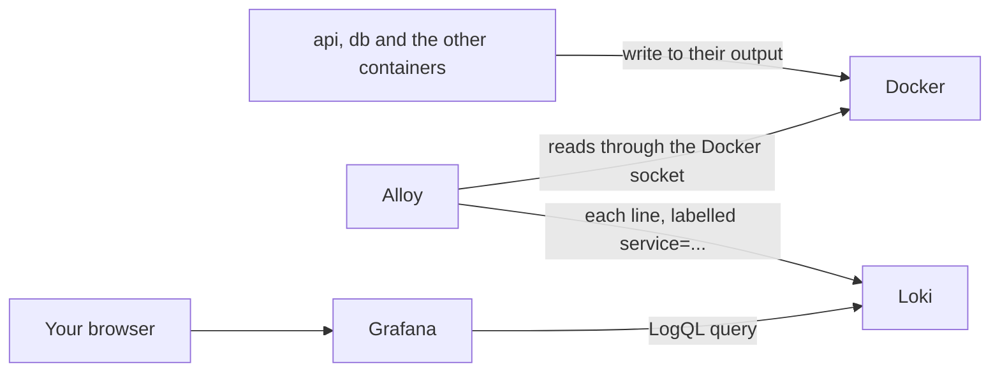

## Before you start

- [[devops.l2.json-logs]] — you know that the `api` container writes each log event as one JSON line, with fields such as `StatusCode` inside `State`.
- [[devops.l2.grafana-dashboards]] — you know that Grafana sends queries to data sources and that Đơn Hàng provisions them from files.

## The situation

The "5xx responses per second" panel on the Đơn Hàng API dashboard rose for a minute last night. The dashboard tells you that the API failed, not which request failed or why; that answer is in a log line. You could run `docker compose logs api` and search, but this morning someone rebuilt the `api` image and recreated its container. That command reads only the containers that exist now, and the old one, with last night's output, is gone. The line you need is also only one of many, spread over `api`, `db` and the others. Where can you search every container's logs at once, including lines from a container that no longer exists?

## Core concepts

- **log aggregation** — collecting the logs of every service into one store, so you search one place instead of each container, and the logs outlive the container that wrote them.
- Grafana Alloy — the program in Đơn Hàng that reads each container's output and sends every line to the store.
- Log stream — all the lines that share the same set of labels, such as every line with `service="api"`.
- **Loki** — a log store that indexes only the labels of each log stream, not the text of its lines.
- **LogQL** — Loki's query language: pick log streams by label, then filter and parse their lines.

## How it works



In the situation above, log aggregation is what keeps last night's line. Every container still writes to its own output, as the `api` did in the JSON logs lesson. Alloy asks Docker which containers belong to Đơn Hàng, reads what each one writes, and sends every line to Loki. It talks to Docker through the Docker socket, `/var/run/docker.sock`, the file through which a program talks to Docker; Compose mounts it into the `alloy` container. Each line gets a label naming its Compose service, such as `service="api"` or `service="db"`. Loki keeps the lines in its own volume, `loki-data`, so removing the `api` container no longer removes its past lines.

Loki indexes only those labels. It does not index the words inside a line. So a LogQL query has two parts. First a stream selector, such as `{service="api"}`, which Loki answers from its index. Then, after a `|`, steps that read through the lines of the selected streams and keep or change them.

One such step is `| json`. It parses each line as JSON and turns its fields into labels, for this query only. A field nested in `State` gets the name `State_` plus its own name, so `StatusCode` becomes `State_StatusCode` and `Path` becomes `State_Path`. A filter such as `State_StatusCode >= 500` then keeps only failed requests. This is where the JSON logs pay off: the query reads a field by name instead of guessing where a number sits in a sentence.

Loki has no page of its own in Đơn Hàng, and no port is published for it. You query it from Grafana, which you open in your browser, where it is a second data source next to Prometheus, `Loki` at `http://loki:3100`.

## In the Đơn Hàng system

The second half of `deploy/monitoring/alloy/config.alloy`. The part above it, `discovery.docker`, lists the containers of the Compose project `donhang` through the Docker socket every five seconds:

```alloy file=deploy/monitoring/alloy/config.alloy tag=stage-2 lines=12-34
// ...label each container's stream with its Compose service: {service="api"}...
discovery.relabel "compose_service" {
  targets = []
  rule {
    source_labels = ["__meta_docker_container_label_com_docker_compose_service"]
    target_label  = "service"
  }
}

// ...read what each one writes to its output, line by line...
loki.source.docker "donhang" {
  host          = "unix:///var/run/docker.sock"
  targets       = discovery.docker.donhang.targets
  relabel_rules = discovery.relabel.compose_service.rules
  forward_to    = [loki.write.loki.receiver]
}

// ...and send every line to Loki.
loki.write "loki" {
  endpoint {
    url = "http://loki:3100/loki/api/v1/push"
  }
}
```

Read it as a chain of three blocks. The `rule` copies the Compose service name, which Compose stores as a label on each container, into the stream label `service`; the long name in `source_labels` is that container label. This block's `targets` list is empty because it is used only for its `rule`, which `loki.source.docker` picks up through `relabel_rules`. `loki.source.docker` reads each container's output and applies that rule. `loki.write` sends the lines to Loki on the `donhang` network. In `docker-compose.yml`, the `alloy` service mounts the Docker socket read-only.

`scripts/devops/loki-query.sh` first places an order for product 999, which does not exist, so the API answers `500`. You start the script from the repository root, and it hands the rest of its work to the lab box, one of Đơn Hàng's containers on the `donhang` network, so its `logql` function reaches `http://loki:3100` without a published port. That function asks Loki's HTTP API for the newest line that matches this query:

```bash file=scripts/devops/loki-query.sh tag=stage-2 lines=27-38
# lesson: devops.l2.centralized-logs
# {service="api"} picks the api's stream by its label (the only part Loki
# indexes); `| json` then turns each line's JSON fields into labels, State
# nested ones as State_<name>, and the filter keeps the lines with a 5xx code.
query='{service="api"} | json | State_StatusCode >= 500'
echo "logql> $query"
for _ in $(seq 30); do # Alloy and Loki need a moment to take the line in
  line=$(logql "$query")
  [ -n "$line" ] && break
  sleep 1
done
echo "$line" | jq -c '{LogLevel, Category, Message}'
```

```text output=true
== POST /api/v1/orders for a product that does not exist
  -> 500

logql> {service="api"} | json | State_StatusCode >= 500
{"LogLevel":"Information","Category":"DonHang.Api.Middleware.RequestLoggingMiddleware","Message":"POST /api/v1/orders responded 500 in ...ms"}
```

The loop waits because a line takes a moment to travel from the container through Alloy into Loki. The last line uses `jq`, a command-line JSON tool, to print only the `LogLevel`, `Category` and `Message` fields of the line found. The line found is the one `RequestLoggingMiddleware` wrote, and it is found by its `StatusCode` field, not by searching for the text `500`.

## Beginners often think…

- **"Loki indexes every word of every line, so any text search is as fast as a lookup by label."** → Actually only the labels are indexed; filtering by text or by a JSON field reads through every line of the selected streams in the chosen time range. A narrow stream selector and a short time range keep that reading small. You notice this when `{service="api"} | json | State_StatusCode >= 500` over a week answers slower than the same query over the last hour.
- **"To find one order's logs quickly, I should put the order id in a Loki label."** → Actually every distinct set of label values is a separate stream, so an order id label creates a new stream for every order. Loki's index then grows with every order, and Loki's performance degrades. Keep labels to a few values, such as the service, and filter the lines instead: `{service="api"} | json | State_Path = "/api/v1/orders/42"`. You notice this when the list of values for such a label in Grafana grows with every order placed.
- **"`docker compose logs` already keeps every container's logs for good, so a log store adds nothing."** → Actually Docker keeps a container's output with that container, and `docker compose logs` reads only the containers that exist now. Recreating the container, for example with a new image, or `docker compose down` removes the old container, and its output goes with it. You notice this when, after `docker compose up -d` recreated `api`, `docker compose logs api` starts at the new container's first line.

## Try it (3 minutes)

With Đơn Hàng running at stage-2 and the monitoring services started (`docker compose --profile monitoring up -d`):

1. In a terminal at the repository root, run `scripts/devops/loki-query.sh`.
2. Open `http://localhost:3000/explore` and sign in to Grafana as in the dashboard lesson. Choose the data source `Loki` at the top, switch the query editor from `Builder` to `Code`, type `{service="api"} | json | State_StatusCode >= 500` and run the query.
3. Replace the query with `{service="db"}` and run it again.

Expected result: 1 — the output shown above, with a real number of milliseconds in place of `...`. 2 — at least that same line, `POST /api/v1/orders responded 500 in …ms`, as a JSON line. 3 — the `db` service's own lines, written by the database in plain text rather than JSON, from the same Loki and the same page.

## Connections

- [[devops.l2.json-logs]] — prerequisite: the JSON fields that `| json` turns into labels.
- [[devops.l2.grafana-dashboards]] — the same Grafana, with a second data source: the dashboard shows that the API failed, and Loki shows which request failed.
- [[devops.l2.why-monitoring]] — the problem this closes: log lines read with `docker compose logs`, one container at a time.
- [[backend.l1.structured-logging]] — the start of the chain: fields named in the log call are the fields you filter on here.

## Five-line summary

1. Log aggregation collects every container's logs into one store, so you search one place and the logs outlive their container.
2. In Đơn Hàng, Alloy reads each container's output through the Docker socket and sends every line to Loki with a `service` label.
3. Loki indexes only stream labels, so a LogQL query picks streams by label, such as `{service="api"}`, then reads their lines.
4. `| json` turns each JSON line's fields into labels for that query, so `State_StatusCode >= 500` keeps failed requests.
5. Loki has no page of its own in Đơn Hàng: you query it from Grafana, as a second data source.
