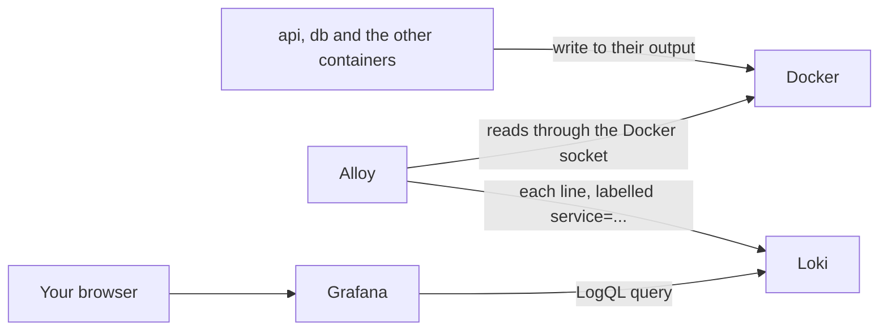

## Bạn cần biết trước

- [[devops.l2.json-logs]] — bạn biết container `api` ghi mỗi sự kiện log thành một dòng JSON, với các field như `StatusCode` nằm trong `State`.
- [[devops.l2.grafana-dashboards]] — bạn biết Grafana gửi truy vấn tới các data source và Đơn Hàng khai báo chúng bằng file.

## Tình huống

Đêm qua panel "5xx responses per second" trên dashboard Đơn Hàng API tăng lên trong một phút. Dashboard cho bạn biết API đã lỗi, nhưng không cho biết request nào lỗi hay vì sao, câu trả lời đó nằm trong một dòng log. Bạn có thể chạy `docker compose logs api` rồi tìm, nhưng sáng nay có người đã build lại image `api` và tạo lại container của nó. Lệnh đó chỉ đọc các container đang tồn tại, còn container cũ, cùng output của đêm qua, đã không còn. Dòng bạn cần cũng chỉ là một trong rất nhiều dòng, rải khắp `api`, `db` và các container khác. Bạn có thể tìm log của mọi container cùng lúc ở đâu, kể cả những dòng của một container không còn nữa?

## Khái niệm cốt lõi

- **gom log tập trung** (log aggregation) — gom log của mọi service về một kho chung, để bạn tìm ở một chỗ thay vì từng container, và log sống lâu hơn container đã ghi ra nó.
- Grafana Alloy — chương trình trong Đơn Hàng đọc output của từng container và gửi mọi dòng về kho đó.
- Luồng log (log stream) — tất cả các dòng có cùng một bộ label, ví dụ mọi dòng có `service="api"`.
- **Loki** (kho log chỉ đánh index label của từng luồng log, không đánh index nội dung từng dòng) — một kho log chỉ đánh index label của từng luồng log, không đánh index chữ trong các dòng của nó.
- **LogQL** (ngôn ngữ truy vấn của Loki: chọn luồng log theo label rồi lọc và tách field từng dòng) — ngôn ngữ truy vấn của Loki: chọn luồng log theo label, rồi lọc và phân tích các dòng của chúng.

## Cơ chế hoạt động



Trong tình huống trên, gom log tập trung là thứ giữ lại dòng log của đêm qua. Mỗi container vẫn ghi ra output của chính nó, như `api` trong bài log JSON. Alloy hỏi Docker những container nào thuộc Đơn Hàng, đọc những gì từng container ghi ra, rồi gửi mọi dòng tới Loki. Alloy nói chuyện với Docker qua Docker socket, `/var/run/docker.sock`, là file mà một chương trình dùng để nói chuyện với Docker. Compose mount file này vào container `alloy`. Mỗi dòng được gắn một label mang tên service Compose của nó, như `service="api"` hay `service="db"`. Loki giữ các dòng trong volume riêng, `loki-data`, nên xóa container `api` không còn xóa theo những dòng cũ của nó.

Loki chỉ đánh index các label đó. Nó không đánh index chữ bên trong một dòng. Vì vậy một truy vấn LogQL có hai phần. Đầu tiên là bộ chọn luồng, như `{service="api"}`, mà Loki trả lời bằng index. Sau dấu `|` là các bước đọc qua từng dòng của những luồng đã chọn, rồi giữ lại hoặc biến đổi chúng.

Một bước như vậy là `| json`. Nó phân tích mỗi dòng như JSON và biến các field thành label, chỉ trong truy vấn này. Field nằm trong `State` có tên là `State_` cộng với tên của nó, nên `StatusCode` thành `State_StatusCode` và `Path` thành `State_Path`. Sau đó một bộ lọc như `State_StatusCode >= 500` chỉ giữ lại các request lỗi. Đây là lúc log JSON phát huy tác dụng: truy vấn đọc field theo tên, thay vì đoán xem một con số nằm ở đâu trong câu.

Trong Đơn Hàng, Loki không có trang riêng và cũng không publish cổng nào. Bạn truy vấn nó từ Grafana, mở trong trình duyệt, nơi Loki là data source thứ hai bên cạnh Prometheus, tên `Loki`, địa chỉ `http://loki:3100`.

## Trong hệ thống Đơn Hàng

Đây là nửa sau của `deploy/monitoring/alloy/config.alloy`. Phần phía trên, `discovery.docker`, liệt kê các container của project Compose `donhang` qua Docker socket, cứ năm giây một lần:

```alloy file=deploy/monitoring/alloy/config.alloy tag=stage-2 lines=12-34
// ...label each container's stream with its Compose service: {service="api"}...
discovery.relabel "compose_service" {
  targets = []
  rule {
    source_labels = ["__meta_docker_container_label_com_docker_compose_service"]
    target_label  = "service"
  }
}

// ...read what each one writes to its output, line by line...
loki.source.docker "donhang" {
  host          = "unix:///var/run/docker.sock"
  targets       = discovery.docker.donhang.targets
  relabel_rules = discovery.relabel.compose_service.rules
  forward_to    = [loki.write.loki.receiver]
}

// ...and send every line to Loki.
loki.write "loki" {
  endpoint {
    url = "http://loki:3100/loki/api/v1/push"
  }
}
```

Hãy đọc nó như một chuỗi ba block. `rule` chép tên service Compose, thứ Compose lưu thành một label trên mỗi container, vào label `service` của luồng log. Cái tên dài trong `source_labels` chính là label đó của container. Danh sách `targets` của block này để trống vì block chỉ được dùng để lấy `rule`, và `loki.source.docker` nhận rule đó qua `relabel_rules`. `loki.source.docker` đọc output của từng container và áp dụng rule đó. `loki.write` gửi các dòng tới Loki trên network `donhang`. Trong `docker-compose.yml`, service `alloy` mount Docker socket ở chế độ chỉ đọc.

`scripts/devops/loki-query.sh` trước hết đặt một đơn cho product 999, một sản phẩm không tồn tại, nên API trả `500`. Bạn chạy script từ thư mục gốc của repository, và nó giao phần việc còn lại cho lab box, một container của Đơn Hàng nằm trên network `donhang`, nên hàm `logql` của nó tới được `http://loki:3100` mà không cần publish cổng. Hàm đó hỏi HTTP API của Loki dòng mới nhất khớp với truy vấn này:

```bash file=scripts/devops/loki-query.sh tag=stage-2 lines=27-38
# lesson: devops.l2.centralized-logs
# {service="api"} picks the api's stream by its label (the only part Loki
# indexes); `| json` then turns each line's JSON fields into labels, State
# nested ones as State_<name>, and the filter keeps the lines with a 5xx code.
query='{service="api"} | json | State_StatusCode >= 500'
echo "logql> $query"
for _ in $(seq 30); do # Alloy and Loki need a moment to take the line in
  line=$(logql "$query")
  [ -n "$line" ] && break
  sleep 1
done
echo "$line" | jq -c '{LogLevel, Category, Message}'
```

```text output=true
== POST /api/v1/orders for a product that does not exist
  -> 500

logql> {service="api"} | json | State_StatusCode >= 500
{"LogLevel":"Information","Category":"DonHang.Api.Middleware.RequestLoggingMiddleware","Message":"POST /api/v1/orders responded 500 in ...ms"}
```

Vòng lặp phải chờ vì một dòng cần chút thời gian để đi từ container qua Alloy vào Loki. Dòng cuối dùng `jq`, một công cụ JSON chạy trên dòng lệnh, để chỉ in ra các field `LogLevel`, `Category` và `Message` của dòng tìm được. Dòng tìm được là dòng do `RequestLoggingMiddleware` ghi, và nó được tìm theo field `StatusCode`, không phải bằng cách tìm chữ `500`.

## Người mới hay nghĩ rằng…

- **"Loki đánh index mọi từ của mọi dòng, nên tìm theo chữ nào cũng nhanh như tra theo label."** → Thực ra chỉ label được đánh index. Lọc theo chữ hay theo một field JSON đều phải đọc qua mọi dòng của các luồng đã chọn trong khoảng thời gian đã chọn. Bộ chọn luồng hẹp và khoảng thời gian ngắn giúp phần đọc đó nhỏ lại. Bạn sẽ nhận ra khi `{service="api"} | json | State_StatusCode >= 500` trong một tuần trả lời chậm hơn cùng truy vấn đó trong một giờ gần nhất.
- **"Muốn tìm nhanh log của một đơn hàng, tôi nên đưa mã đơn vào một label của Loki."** → Thực ra mỗi bộ giá trị label khác nhau là một luồng riêng, nên label mã đơn tạo ra một luồng mới cho mỗi đơn. Index của Loki khi đó phình ra theo từng đơn, và hiệu năng của Loki đi xuống. Hãy giữ label ở vài giá trị, như service, rồi lọc các dòng: `{service="api"} | json | State_Path = "/api/v1/orders/42"`. Bạn sẽ nhận ra khi danh sách giá trị của label như vậy trong Grafana dài thêm sau mỗi đơn được đặt.
- **"`docker compose logs` đã giữ log của mọi container mãi mãi, nên một kho log chẳng thêm được gì."** → Thực ra Docker giữ output của một container cùng với container đó, và `docker compose logs` chỉ đọc các container đang tồn tại. Tạo lại container, ví dụ với image mới, hoặc `docker compose down` sẽ xóa container cũ, và output của nó đi theo. Bạn sẽ nhận ra khi, sau lúc `docker compose up -d` tạo lại `api`, `docker compose logs api` bắt đầu từ dòng đầu tiên của container mới.

## Thử ngay (3 phút)

Với Đơn Hàng đang chạy ở stage-2 và các service monitoring đã bật (`docker compose --profile monitoring up -d`):

1. Trong terminal ở thư mục gốc của repository, chạy `scripts/devops/loki-query.sh`.
2. Mở `http://localhost:3000/explore` và đăng nhập Grafana như trong bài dashboard. Chọn data source `Loki` ở phía trên, chuyển trình soạn truy vấn từ `Builder` sang `Code`, gõ `{service="api"} | json | State_StatusCode >= 500` rồi chạy truy vấn.
3. Thay truy vấn bằng `{service="db"}` và chạy lại.

Kết quả mong đợi: 1 — output như ở trên, với số mili giây thật thay cho `...`. 2 — ít nhất chính dòng đó, `POST /api/v1/orders responded 500 in …ms`, dưới dạng một dòng JSON. 3 — các dòng của chính service `db`, do database ghi ở dạng văn bản thường chứ không phải JSON, từ cùng Loki và trên cùng trang.

## Liên hệ

- [[devops.l2.json-logs]] — kiến thức nền: các field JSON mà `| json` biến thành label.
- [[devops.l2.grafana-dashboards]] — cùng Grafana đó, thêm một data source thứ hai: dashboard cho thấy API đã lỗi, còn Loki cho thấy request nào lỗi.
- [[devops.l2.why-monitoring]] — vấn đề mà bài này khép lại: đọc dòng log bằng `docker compose logs`, từng container một.
- [[backend.l1.structured-logging]] — điểm khởi đầu của chuỗi: các field được đặt tên trong lời gọi log chính là các field bạn lọc ở đây.

## Tóm tắt 5 dòng

1. Gom log tập trung đưa log của mọi container về một kho, để bạn tìm ở một chỗ và log sống lâu hơn container của nó.
2. Trong Đơn Hàng, Alloy đọc output của từng container qua Docker socket và gửi mọi dòng tới Loki kèm label `service`.
3. Loki chỉ đánh index label của luồng log, nên truy vấn LogQL chọn luồng theo label, như `{service="api"}`, rồi mới đọc các dòng.
4. `| json` biến các field của mỗi dòng JSON thành label trong truy vấn đó, nên `State_StatusCode >= 500` giữ lại các request lỗi.
5. Trong Đơn Hàng, Loki không có trang riêng: bạn truy vấn nó từ Grafana, như một data source thứ hai.
