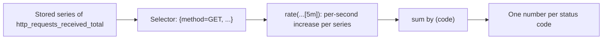

## Before you start

- [[devops.l2.prometheus-scraping]] — you know Prometheus scrapes `api:8080` every 5 seconds and keeps each line of `/metrics` as a time series of values with their times.

## The situation

A teammate reads `/metrics` and sees `http_requests_received_total{code="200",...}` at 48213. "Is the API busy right now?" she asks. You cannot tell: that number is every request since the API started, whether they came in the last minute or last week. Yesterday the API was restarted, and the same line fell to 12 before climbing again. Prometheus has kept every value with its time. How do you turn a number that only grows, and sometimes starts again from zero, into "requests per second right now", split by status code?

## Core concepts

- **counter** — a metric that only goes up, starting again from zero when the process restarts, such as `http_requests_received_total`.
- **gauge** — a metric that can go up and down, such as `http_requests_in_progress`, the number of requests being handled at this moment.
- **PromQL** — Prometheus's query language for selecting time series and computing over them.
- Selector — the part of a query that picks series: a metric name, then conditions on labels in braces.
- `rate(...[5m])` — a PromQL function that turns a counter's values over the last five minutes into an average increase per second.

## How it works



In the situation above, `http_requests_received_total` is a counter: prometheus-net only ever adds to it. Its value is a total since the process started, so it says nothing about now. A gauge is different: `http_requests_in_progress` goes up when a request starts and down when it ends, so its current value is already the answer.

To ask Prometheus about the stored series you write PromQL. A query starts with a selector. `http_requests_received_total` alone selects every series of that metric; conditions in braces narrow it. `method="GET"` keeps series whose label equals `GET`, and `code=~"5.."` keeps series whose `code` matches the pattern `5..`, a `5` and any two characters, so every `5xx` status.

What you want from a counter is how fast it grows. `rate(http_requests_received_total[5m])` looks at each selected series over the last five minutes and returns its average increase per second. When a value drops, as after yesterday's restart, `rate` treats the drop as the counter starting again from zero, not as negative traffic, and keeps counting the increase after it.

`rate` returns one result per series, and there is one series per combination of `code`, `method`, `controller`, `action` and `endpoint`. `sum by (code) (...)` adds those results together, keeping only the `code` label. The answer is one number per status code: how many requests per second end in `200`, how many in `404`.

## In the Đơn Hàng system

Next to the metrics prometheus-net provides, Đơn Hàng defines one counter of its own:

```csharp file=DonHang.Api/Monitoring/OrderMetrics.cs tag=stage-2 lines=5-14
// lesson: devops.l2.counters-and-rate
// Đơn Hàng's own metric, next to the http_* ones prometheus-net provides.
// A counter only goes up (and starts again from 0 when the api restarts);
// /metrics shows its current value as donhang_orders_placed_total.
public static class OrderMetrics
{
    public static readonly Counter OrdersPlaced = Metrics.CreateCounter(
        "donhang_orders_placed_total",
        "Orders created through POST /api/v1/orders or /api/v2/orders; a repeated Idempotency-Key does not count.");
}
```

`Metrics.CreateCounter` registers the counter with its name and help text. That happens the first time the code uses `OrderMetrics`, at the first new order; until then `/metrics` has no such line. In `OrdersController.Create`, and the same in the v2 controller, `if (created) OrderMetrics.OrdersPlaced.Inc();` adds one only when `PlaceOrderAsync` really created an order. A retry with the same `Idempotency-Key` gets the earlier order back and adds nothing.

The lesson's script checks that, then asks Prometheus three queries. Its helpers are defined above the block. `place_order` sends `POST /api/v1/orders` with `key`, a random value read from `/proc/sys/kernel/random/uuid`. `orders_placed` reads the counter from `/metrics`. `promql` sends a query to `prometheus:9090` and prints each result's labels, `=>`, and its value.

The first `place_order` creates an order with its output hidden, only so that the counter exists. Then the script takes a new key, places that order twice, and the `awk` line prints how much the counter grew:

```bash file=scripts/devops/promql-rate.sh tag=stage-2 lines=26-41
place_order >/dev/null # makes sure the counter exists before reading it
before=$(orders_placed)
key=$(cat /proc/sys/kernel/random/uuid)
echo "== POST /api/v1/orders twice, with one new Idempotency-Key"
place_order
place_order
echo "donhang_orders_placed_total went up by: $(awk "BEGIN { print $(orders_placed) - $before }")"
echo

for _ in $(seq 10); do curl -sS -o /dev/null http://localhost:8080/api/v1/products/1; done
for _ in $(seq 3); do curl -sS -o /dev/null http://localhost:8080/api/v1/products/999; done
sleep 11 # two more scrapes (every 5 s), so rate() has two new samples to compare
echo "== PromQL, sent to prometheus:9090"
promql 'http_requests_received_total{code=~"4..", method="GET", endpoint="api/v1/products/{id:int}"}'
promql 'sum by (code) (rate(http_requests_received_total{method="GET", endpoint="api/v1/products/{id:int}"}[5m]))'
promql 'rate(donhang_orders_placed_total[5m])'
```

```text output=true
== POST /api/v1/orders twice, with one new Idempotency-Key
  -> 201
  -> 201
donhang_orders_placed_total went up by: 1

== PromQL, sent to prometheus:9090
promql> http_requests_received_total{code=~"4..", method="GET", endpoint="api/v1/products/{id:int}"}
  {"action":"Get","code":"404","controller":"Products","endpoint":"api/v1/products/{id:int}","instance":"api:8080","job":"api","method":"GET"} => ...
promql> sum by (code) (rate(http_requests_received_total{method="GET", endpoint="api/v1/products/{id:int}"}[5m]))
  {"code":"200"} => ...
  {"code":"404"} => ...
promql> rate(donhang_orders_placed_total[5m])
  {"instance":"api:8080","job":"api"} => ...
```

Two `201` answers, but the counter went up by one: the second request repeated the key. Then ten requests for product 1 end in `200`, and three for product 999, which does not exist, in `404`. Both share the `endpoint` label `api/v1/products/{id:int}`, the route with its path parameter, so they differ only in `code`. `sleep 11` waits for two scrapes, because `rate` needs at least two stored values in its window.

The first query uses `4..` instead of `5..` and keeps only the `404` series. Prometheus added `job`, the job name `api`, and `instance`, the target's address `api:8080`. The second query has lost every label but `code`. The values are `...` because they depend on when you run it.

## Beginners often think…

- **"The current value of `http_requests_received_total` tells me how busy the API is right now."** → Actually it is the total since the API started, so a large value may come from last week. How busy the API is now is how fast the value grows, which is what `rate` returns. You notice this when the value is in the tens of thousands at a quiet hour, while `rate(...)` is close to `0`.
- **"After the API restarts, the chart of a counter shows a huge negative dip in traffic."** → Actually the raw value does fall to near zero, but that is the counter starting again, not negative traffic. `rate` treats the drop as a restart and counts only increases. You notice this when the API has just been restarted: `http_requests_received_total` shows small numbers again, while `rate(...)` stays at zero or above.
- **"A counter and a gauge are the same kind of number; only the naming convention differs."** → Actually a counter only goes up and is read through its growth, while a gauge's current value is the answer. `rate` is meant for counters only: a gauge's drops are real, and `rate` would read each one as a restart. You notice this when `http_requests_in_progress` shows `0` between requests, while `http_requests_received_total` never goes back down on its own.

## Try it (3 minutes)

With Đơn Hàng running at stage-2 and the monitoring services started (`docker compose --profile monitoring up -d`), in a terminal at the repository root:

1. Run `scripts/devops/promql-rate.sh`. It places two test orders (three `POST` requests: one so the counter exists, then two with one new key), sends thirteen product requests, and waits about 11 seconds for two scrapes.

Expected result: two `-> 201` lines and `donhang_orders_placed_total went up by: 1`, then three queries: the first returns one series with `"code":"404"`, the second returns exactly two results, `{"code":"200"}` and `{"code":"404"}`, and the third one result with only `instance` and `job`.

## Connections

- [[devops.l2.prometheus-scraping]] — prerequisite: the stored series that PromQL reads.
- [[devops.l2.metrics-endpoint]] — the same metric seen from the other side: one value per line at `/metrics`, now read over time.
- [[backend.l2.idempotent-endpoints]] — why a repeated `Idempotency-Key` returns the earlier order, and so does not count as a new one here.
- [[devops.l2.histograms-and-percentiles]] — the next step: counters in buckets, for how long requests take.

## Five-line summary

1. A counter only goes up and restarts from zero, so its value is read through its growth, not as it stands.
2. A gauge such as `http_requests_in_progress` goes up and down, and its current value is the answer.
3. Đơn Hàng's own counter, `donhang_orders_placed_total`, grows only when a `POST` really creates a new order, not on a repeated key.
4. PromQL selectors pick series by label, as in `{code=~"5.."}`, and `rate(...[5m])` gives the per-second increase.
5. `sum by (code) (...)` adds the per-series rates into one requests-per-second number for each status code.
