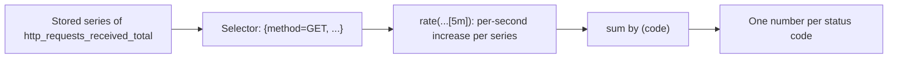

## Bạn cần biết trước

- [[devops.l2.prometheus-scraping]] — bạn biết Prometheus scrape `api:8080` mỗi 5 giây và giữ mỗi dòng của `/metrics` thành một time series gồm các giá trị kèm thời điểm.

## Tình huống

Một đồng nghiệp đọc `/metrics` và thấy `http_requests_received_total{code="200",...}` là 48213. Chị ấy hỏi: "Lúc này API có đang bận không?" Bạn không trả lời được, vì con số đó là mọi request từ khi API khởi động, dù chúng đến trong phút vừa rồi hay tuần trước. Hôm qua API được khởi động lại, và chính dòng đó rơi xuống 12 rồi mới tăng dần lên. Prometheus đã giữ mọi giá trị kèm thời điểm. Làm sao biến một con số chỉ tăng, thỉnh thoảng lại bắt đầu từ 0, thành "số request mỗi giây ngay lúc này", tách theo status code?

## Khái niệm cốt lõi

- **counter** (metric chỉ tăng, về 0 khi process khởi động lại) — một metric chỉ tăng lên, bắt đầu lại từ 0 khi process khởi động lại, như `http_requests_received_total`.
- **gauge** (metric có thể tăng hoặc giảm, vd. số request đang xử lý) — một metric có thể tăng và giảm, như `http_requests_in_progress`, số request đang được xử lý ngay lúc này.
- **PromQL** (ngôn ngữ truy vấn của Prometheus để chọn và tính toán trên time series) — ngôn ngữ truy vấn của Prometheus, dùng để chọn time series và tính toán trên chúng.
- Selector — phần của truy vấn dùng để chọn series: một tên metric, rồi các điều kiện trên label đặt trong dấu ngoặc nhọn.
- `rate(...[5m])` — một hàm PromQL biến các giá trị của counter trong năm phút gần nhất thành mức tăng trung bình mỗi giây.

## Cơ chế hoạt động



Trong tình huống trên, `http_requests_received_total` là một counter: prometheus-net chỉ cộng thêm vào nó. Giá trị của nó là tổng từ khi process khởi động, nên không nói gì về hiện tại. Gauge thì khác: `http_requests_in_progress` tăng khi một request bắt đầu và giảm khi request kết thúc, nên giá trị hiện tại của nó đã là câu trả lời.

Để hỏi Prometheus về các series đã lưu, bạn viết PromQL. Một truy vấn bắt đầu bằng selector. Chỉ riêng `http_requests_received_total` sẽ chọn mọi series của metric đó, còn các điều kiện trong ngoặc nhọn thu hẹp lại. `method="GET"` giữ các series có label bằng `GET`, còn `code=~"5.."` giữ các series có `code` khớp mẫu `5..`, tức một chữ `5` và hai ký tự bất kỳ, nghĩa là mọi status `5xx`.

Điều bạn cần ở một counter là nó tăng nhanh cỡ nào. `rate(http_requests_received_total[5m])` xem từng series được chọn trong năm phút gần nhất và trả về mức tăng trung bình mỗi giây. Khi một giá trị giảm, như sau lần khởi động lại hôm qua, `rate` coi đó là counter bắt đầu lại từ 0, không phải traffic âm, và tiếp tục tính phần tăng sau đó.

`rate` trả về một kết quả cho mỗi series, và có một series cho mỗi tổ hợp `code`, `method`, `controller`, `action` và `endpoint`. `sum by (code) (...)` cộng các kết quả đó lại, chỉ giữ label `code`. Câu trả lời là một con số cho mỗi status code: bao nhiêu request mỗi giây kết thúc bằng `200`, bao nhiêu bằng `404`.

## Trong hệ thống Đơn Hàng

Bên cạnh các metric mà prometheus-net cung cấp, Đơn Hàng định nghĩa một counter của riêng mình:

```csharp file=DonHang.Api/Monitoring/OrderMetrics.cs tag=stage-2 lines=5-14
// lesson: devops.l2.counters-and-rate
// Đơn Hàng's own metric, next to the http_* ones prometheus-net provides.
// A counter only goes up (and starts again from 0 when the api restarts);
// /metrics shows its current value as donhang_orders_placed_total.
public static class OrderMetrics
{
    public static readonly Counter OrdersPlaced = Metrics.CreateCounter(
        "donhang_orders_placed_total",
        "Orders created through POST /api/v1/orders or /api/v2/orders; a repeated Idempotency-Key does not count.");
}
```

`Metrics.CreateCounter` đăng ký counter kèm tên và đoạn mô tả. Việc này xảy ra lần đầu code dùng tới `OrderMetrics`, tức ở đơn hàng mới đầu tiên. Trước đó `/metrics` chưa có dòng nào như vậy. Trong `OrdersController.Create`, và tương tự trong controller v2, `if (created) OrderMetrics.OrdersPlaced.Inc();` chỉ cộng một khi `PlaceOrderAsync` thật sự tạo đơn. Một lần thử lại với cùng `Idempotency-Key` nhận lại đơn cũ và không cộng gì.

Script của bài kiểm tra điều đó, rồi gửi ba truy vấn tới Prometheus. Các hàm trợ giúp của nó được định nghĩa phía trên khối này. `place_order` gửi `POST /api/v1/orders` kèm `key`, một giá trị ngẫu nhiên đọc từ `/proc/sys/kernel/random/uuid`. `orders_placed` đọc counter từ `/metrics`. `promql` gửi một truy vấn tới `prometheus:9090` và in từng kết quả dưới dạng các label, `=>`, rồi giá trị.

Lời gọi `place_order` đầu tiên tạo một đơn với output bị ẩn, chỉ để counter tồn tại. Sau đó script lấy một key mới, đặt đơn đó hai lần, và dòng `awk` in ra counter đã tăng bao nhiêu:

```bash file=scripts/devops/promql-rate.sh tag=stage-2 lines=26-41
place_order >/dev/null # makes sure the counter exists before reading it
before=$(orders_placed)
key=$(cat /proc/sys/kernel/random/uuid)
echo "== POST /api/v1/orders twice, with one new Idempotency-Key"
place_order
place_order
echo "donhang_orders_placed_total went up by: $(awk "BEGIN { print $(orders_placed) - $before }")"
echo

for _ in $(seq 10); do curl -sS -o /dev/null http://localhost:8080/api/v1/products/1; done
for _ in $(seq 3); do curl -sS -o /dev/null http://localhost:8080/api/v1/products/999; done
sleep 11 # two more scrapes (every 5 s), so rate() has two new samples to compare
echo "== PromQL, sent to prometheus:9090"
promql 'http_requests_received_total{code=~"4..", method="GET", endpoint="api/v1/products/{id:int}"}'
promql 'sum by (code) (rate(http_requests_received_total{method="GET", endpoint="api/v1/products/{id:int}"}[5m]))'
promql 'rate(donhang_orders_placed_total[5m])'
```

```text output=true
== POST /api/v1/orders twice, with one new Idempotency-Key
  -> 201
  -> 201
donhang_orders_placed_total went up by: 1

== PromQL, sent to prometheus:9090
promql> http_requests_received_total{code=~"4..", method="GET", endpoint="api/v1/products/{id:int}"}
  {"action":"Get","code":"404","controller":"Products","endpoint":"api/v1/products/{id:int}","instance":"api:8080","job":"api","method":"GET"} => ...
promql> sum by (code) (rate(http_requests_received_total{method="GET", endpoint="api/v1/products/{id:int}"}[5m]))
  {"code":"200"} => ...
  {"code":"404"} => ...
promql> rate(donhang_orders_placed_total[5m])
  {"instance":"api:8080","job":"api"} => ...
```

Hai câu trả lời `201`, nhưng counter chỉ tăng một, vì request thứ hai lặp lại key. Tiếp theo, mười request cho product 1 kết thúc bằng `200`, còn ba request cho product 999, một sản phẩm không tồn tại, kết thúc bằng `404`. Cả hai chung label `endpoint` là `api/v1/products/{id:int}`, tức route kèm path parameter, nên chúng chỉ khác nhau ở `code`. `sleep 11` chờ hai lần scrape, vì `rate` cần ít nhất hai giá trị đã lưu trong khoảng của nó.

Truy vấn đầu dùng `4..` thay cho `5..` và chỉ giữ series `404`. Prometheus đã thêm `job`, là tên job `api`, và `instance`, là địa chỉ target `api:8080`. Truy vấn thứ hai mất mọi label, chỉ còn `code`. Các giá trị là `...` vì chúng tùy vào lúc bạn chạy.

## Người mới hay nghĩ rằng…

- **"Giá trị hiện tại của `http_requests_received_total` cho biết lúc này API bận cỡ nào."** → Thực ra đó là tổng từ khi API khởi động, nên một giá trị lớn có thể đến từ tuần trước. API bận cỡ nào lúc này là giá trị đó tăng nhanh ra sao, chính là thứ `rate` trả về. Bạn sẽ nhận ra khi giá trị lên tới hàng chục nghìn vào một giờ vắng, trong khi `rate(...)` gần bằng `0`.
- **"Sau khi API khởi động lại, biểu đồ của counter cho thấy traffic tụt âm rất sâu."** → Thực ra giá trị thô đúng là rơi xuống gần 0, nhưng đó là counter bắt đầu lại, không phải traffic âm. `rate` coi lần rơi đó là một lần khởi động lại và chỉ tính phần tăng. Bạn sẽ nhận ra khi API vừa khởi động lại: `http_requests_received_total` lại hiện những con số nhỏ, còn `rate(...)` vẫn bằng 0 hoặc lớn hơn.
- **"Counter và gauge là cùng một loại số, chỉ khác quy ước đặt tên."** → Thực ra counter chỉ tăng và được đọc qua mức tăng của nó, còn giá trị hiện tại của gauge đã là câu trả lời. `rate` chỉ dành cho counter, vì các lần giảm của gauge là thật, còn `rate` sẽ đọc mỗi lần giảm thành một lần khởi động lại. Bạn sẽ nhận ra khi `http_requests_in_progress` hiện `0` giữa các request, trong khi `http_requests_received_total` không bao giờ tự giảm.

## Thử ngay (3 phút)

Với Đơn Hàng đang chạy ở stage-2 và các service monitoring đã bật (`docker compose --profile monitoring up -d`), trong terminal ở thư mục gốc của repository:

1. Chạy `scripts/devops/promql-rate.sh`. Script đặt hai đơn thử (ba request `POST`: một để counter tồn tại, rồi hai cái với cùng một key mới), gửi mười ba request sản phẩm, và chờ khoảng 11 giây cho hai lần scrape.

Kết quả mong đợi: hai dòng `-> 201` và `donhang_orders_placed_total went up by: 1`, rồi ba truy vấn: truy vấn đầu trả về một series có `"code":"404"`, truy vấn thứ hai trả về đúng hai kết quả `{"code":"200"}` và `{"code":"404"}`, truy vấn thứ ba trả về một kết quả chỉ có `instance` và `job`.

## Liên hệ

- [[devops.l2.prometheus-scraping]] — kiến thức nền: các series đã lưu mà PromQL đọc.
- [[devops.l2.metrics-endpoint]] — cùng metric đó nhìn từ phía bên kia: mỗi dòng một giá trị ở `/metrics`, giờ được đọc theo thời gian.
- [[backend.l2.idempotent-endpoints]] — lý do một `Idempotency-Key` lặp lại trả về đơn cũ, nên ở đây không được đếm là đơn mới.
- [[devops.l2.histograms-and-percentiles]] — bước tiếp theo: các counter xếp theo bucket, để đo request mất bao lâu.

## Tóm tắt 5 dòng

1. Counter chỉ tăng và bắt đầu lại từ 0, nên giá trị của nó được đọc qua mức tăng, không đọc nguyên con số.
2. Gauge như `http_requests_in_progress` tăng và giảm, và giá trị hiện tại của nó chính là câu trả lời.
3. Counter riêng của Đơn Hàng, `donhang_orders_placed_total`, chỉ tăng khi một `POST` thật sự tạo đơn mới, không tăng khi key lặp lại.
4. Selector của PromQL chọn series theo label, như `{code=~"5.."}`, còn `rate(...[5m])` cho mức tăng mỗi giây.
5. `sum by (code) (...)` cộng tốc độ của từng series thành một con số request mỗi giây cho mỗi status code.
