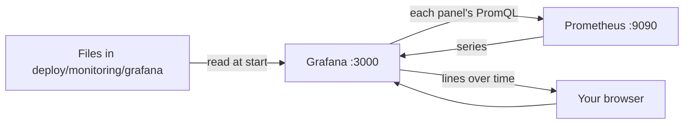

## Before you start

- [[devops.l2.histograms-and-percentiles]] — you know how to ask Prometheus for requests per second by status code, for `5xx` responses, and for p95 from a histogram.

## The situation

You now know the queries that say whether the API is used, failing or slow. But each time someone asks "is the API all right?", you type three PromQL queries by hand and read numbers, one moment at a time. The teammate who must answer if something breaks tonight wants to see all of it at a glance, as lines over time. A new teammate who starts Đơn Hàng's containers, the lab, on her own machine tomorrow should see exactly the same view without setting anything up. Where should those queries live, and what draws them?

## Core concepts

- **Grafana** — a web tool that queries data sources such as Prometheus and draws the results as dashboards.
- Data source — a place Grafana sends queries to, with its address; in Đơn Hàng, Prometheus at `prometheus:9090`.
- Panel — one chart on a page: a title, its query and a way to draw the result; in Đơn Hàng each panel has one query.
- **dashboard** — a page of panels, each drawing the results of its saved queries.
- Provisioning — files Grafana reads when it starts, which create data sources and dashboards without anyone clicking.

## How it works



In the situation above, the thing that keeps the queries and draws them is Grafana. When the `grafana` container starts, it reads provisioning files under `deploy/monitoring/grafana/`, which `docker-compose.yml` makes visible inside the container, read-only. One file says where Prometheus is, another says which folder of dashboard files to load. So when Đơn Hàng's containers start on a new machine, they get the same data source and the same dashboard, with nothing to click.

Grafana stores no metrics of its own. When you open a dashboard, each panel sends its query to a data source, here Prometheus, gets the series back and draws them. Prometheus still does the scraping and the storing; Grafana only asks and draws.

The dashboard itself is a JSON file in the repository, `donhang-api.json`, titled "Đơn Hàng API". Its four panels are four PromQL queries you already know: requests per second by status code, `5xx` responses per second, p95 response time, and orders placed per second. Changing a panel means changing that file, so the change goes through a commit and a review like code. Every machine that pulls the commit gets it, at the latest the next time Grafana starts. A dashboard built only by clicking lives only in that one Grafana's own storage.

The first three panels answer three questions: is the API used, is it failing, is it slow. When you start monitoring an API, those three are a common first set, because together they give a rough picture of what its users experience.

## In the Đơn Hàng system

The data source file, up to the entry this lesson needs:

```yaml file=deploy/monitoring/grafana/provisioning/datasources/datasources.yml tag=stage-2 lines=1-12
# lesson: devops.l2.grafana-dashboards
# Grafana reads this file when it starts: the places its panels send queries
# to. It stores no metrics or logs of its own.
apiVersion: 1

datasources:
  - name: Prometheus
    uid: prometheus
    type: prometheus
    access: proxy
    url: http://prometheus:9090
    isDefault: true
```

`url: http://prometheus:9090` works because `grafana` and `prometheus` are both on the `donhang` network. `access: proxy` means the Grafana server sends the query, not your browser, which runs outside the `donhang` network and cannot resolve the name `prometheus`. `uid: prometheus` is the name panels use to point at this data source. The same file lists a second data source for a later lesson.

The second provisioning file, `dashboards.yml`, loads every dashboard file from `/var/lib/grafana/dashboards` into a folder called `Đơn Hàng`. Compose makes the repository's `deploy/monitoring/grafana/dashboards` visible at that path, read-only. The file also sets `allowUiUpdates: false`, so a change made in the web page cannot be saved over the dashboard; the file stays its source.

In the dashboard file, a panel's queries sit under `targets`, which is not the same as a Prometheus scrape target. Here is that part of the first panel, titled "Requests per second, by status code":

```json file=deploy/monitoring/grafana/dashboards/donhang-api.json tag=stage-2 lines=49-59
      "targets": [
        {
          "refId": "A",
          "datasource": {
            "type": "prometheus",
            "uid": "prometheus"
          },
          "expr": "sum by (code) (rate(http_requests_received_total[5m]))",
          "legendFormat": "{{code}}"
        }
      ]
```

`"uid": "prometheus"` points at the data source above. `expr` is the PromQL from the counters lesson, without the `method` and `endpoint` filters this time, so it counts every request. `legendFormat` names each drawn line after its `code` label, so the chart shows one line per status code. The other lines, such as `refId`, can be left as they are for this lesson. The other three panels are built the same way, each with its own title, `expr` and legend, such as `histogram_quantile(0.95, sum by (le) (rate(http_request_duration_seconds_bucket[5m])))` for p95.

## Beginners often think…

- **"Grafana collects the metrics, and Prometheus is only where they get stored."** → Actually Prometheus scrapes and stores; Grafana only sends queries to it and draws the answers. You notice this when you stop the `prometheus` container: Grafana still opens the dashboard, but every panel's query returns an error instead of data, so no panel draws any line.
- **"A dashboard can only be built by clicking in the web page, so it cannot be kept in Git."** → Actually a dashboard is a JSON document, and Grafana can load it from a file when it starts. In Đơn Hàng the whole dashboard is `donhang-api.json` in the repository. You notice this when you delete the lab's containers, start them again, and the dashboard is back, unchanged.
- **"The more panels a dashboard has, the better it shows what is wrong."** → Actually each extra panel is one more thing to read before you find the one that matters. A few panels that answer clear questions, such as used, failing, slow, are read faster when something breaks. You notice this when, under pressure, you scroll past many charts looking for the one that answers your question.

## Try it (3 minutes)

With Đơn Hàng running at stage-2 and the monitoring services started (`docker compose --profile monitoring up -d`):

1. Open `http://localhost:3000` in your browser and sign in as `admin`, with the value of `GRAFANA_ADMIN_PASSWORD` in the repository's `.env` file as the password.
2. Open the folder `Đơn Hàng`, then the dashboard `Đơn Hàng API`.
3. In a terminal at the repository root, run `scripts/devops/metrics-endpoint.sh` three times. Each run requests product 999, which does not exist, so the API answers `404`. The dashboard refreshes itself every 10 seconds.

Expected result: 2 — four panels titled "Requests per second, by status code", "5xx responses per second", "p95 response time" and "Orders placed per second". 3 — within about half a minute, the first panel shows a line labelled `404` that was not there, or rises if it was.

## Connections

- [[devops.l2.histograms-and-percentiles]] — prerequisite: the p95 query that one panel draws.
- [[devops.l2.counters-and-rate]] — the requests-per-second and `5xx` queries behind two other panels.
- [[devops.l2.prometheus-scraping]] — the part Grafana relies on: Prometheus keeps the series that every panel asks for.
- [[devops.l2.centralized-logs]] — the next step: a second data source in the same Grafana, for log lines.

## Five-line summary

1. Grafana stores no metrics: each panel sends a query to a data source, here Prometheus, and draws the result.
2. Đơn Hàng's `donhang-api.json` has four panels, requests by status code, `5xx` per second, p95 and orders placed, each one PromQL query.
3. Grafana loads its data sources and dashboards from provisioning files under `deploy/monitoring/grafana/` when it starts.
4. Because the dashboard is a file in the repository, changing it goes through a commit and a review like code.
5. When you start monitoring an API, request rate, error rate and response time are a common first set of panels.
