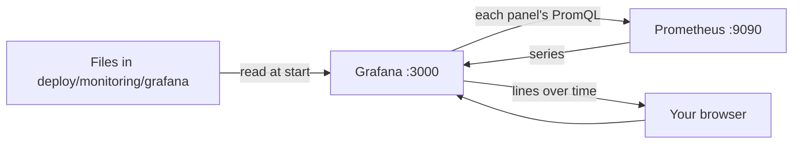

## Bạn cần biết trước

- [[devops.l2.histograms-and-percentiles]] — bạn biết cách hỏi Prometheus số request mỗi giây theo status code, số response `5xx`, và p95 từ một histogram.

## Tình huống

Giờ bạn đã biết những truy vấn cho thấy API có đang được dùng, có đang lỗi hay có đang chậm. Nhưng mỗi lần có người hỏi "API có ổn không?", bạn lại gõ tay ba truy vấn PromQL và đọc từng con số, mỗi lần một thời điểm. Người đồng đội phải xử lý nếu đêm nay có sự cố muốn nhìn tất cả trong một cái liếc, thành các đường theo thời gian. Một đồng đội mới, ngày mai chạy các container của Đơn Hàng, tức lab, trên máy của mình, cũng phải thấy đúng góc nhìn đó mà không cần thiết lập gì. Các truy vấn đó nên nằm ở đâu, và thứ gì vẽ chúng?

## Khái niệm cốt lõi

- **Grafana** (công cụ web truy vấn nguồn dữ liệu như Prometheus, Loki và vẽ kết quả thành dashboard) — một công cụ web gửi truy vấn tới các nguồn dữ liệu như Prometheus và vẽ kết quả thành dashboard.
- Data source — nơi Grafana gửi truy vấn tới, kèm địa chỉ của nó. Trong Đơn Hàng đó là Prometheus ở `prometheus:9090`.
- Panel — một biểu đồ trên trang: một tiêu đề, truy vấn của nó và kiểu vẽ kết quả. Trong Đơn Hàng mỗi panel có một truy vấn.
- **dashboard** (một trang gồm nhiều panel, mỗi panel vẽ kết quả của một truy vấn đã lưu) — một trang gồm nhiều panel, mỗi panel vẽ kết quả các truy vấn đã lưu của nó.
- Provisioning — các file Grafana đọc khi khởi động, tạo ra data source và dashboard mà không cần ai bấm chuột.

## Cơ chế hoạt động



Trong tình huống trên, thứ giữ các truy vấn và vẽ chúng là Grafana. Khi container `grafana` khởi động, nó đọc các file provisioning trong `deploy/monitoring/grafana/`, được `docker-compose.yml` làm cho hiện ra bên trong container, ở chế độ chỉ đọc. Một file cho biết Prometheus ở đâu, file kia cho biết nạp dashboard từ thư mục nào. Vì vậy khi các container của Đơn Hàng chạy trên một máy mới, chúng có cùng data source và cùng dashboard, không phải bấm gì.

Grafana không tự lưu metric nào. Khi bạn mở một dashboard, mỗi panel gửi truy vấn tới một data source, ở đây là Prometheus, nhận các series về rồi vẽ. Prometheus vẫn lo việc scrape và lưu trữ, Grafana chỉ hỏi và vẽ.

Bản thân dashboard là một file JSON trong repository, `donhang-api.json`, có tiêu đề "Đơn Hàng API". Bốn panel của nó là bốn truy vấn PromQL bạn đã biết: số request mỗi giây theo status code, số response `5xx` mỗi giây, thời gian phản hồi p95, và số đơn được đặt mỗi giây. Sửa một panel nghĩa là sửa file đó, nên thay đổi đi qua commit và review như code. Máy nào pull commit đó cũng có thay đổi, muộn nhất là ở lần Grafana khởi động tiếp theo. Một dashboard chỉ dựng bằng cách bấm chuột thì chỉ nằm trong kho riêng của đúng một Grafana đó.

Ba panel đầu trả lời ba câu hỏi: API có được dùng không, có đang lỗi không, có chậm không. Khi bạn bắt đầu monitoring một API, ba panel này là bộ khởi đầu phổ biến, vì gộp lại chúng cho một bức tranh sơ bộ về trải nghiệm của người dùng.

## Trong hệ thống Đơn Hàng

File data source, tới hết mục mà bài này cần:

```yaml file=deploy/monitoring/grafana/provisioning/datasources/datasources.yml tag=stage-2 lines=1-12
# lesson: devops.l2.grafana-dashboards
# Grafana reads this file when it starts: the places its panels send queries
# to. It stores no metrics or logs of its own.
apiVersion: 1

datasources:
  - name: Prometheus
    uid: prometheus
    type: prometheus
    access: proxy
    url: http://prometheus:9090
    isDefault: true
```

`url: http://prometheus:9090` chạy được vì `grafana` và `prometheus` cùng ở trên network `donhang`. `access: proxy` nghĩa là server Grafana gửi truy vấn, không phải trình duyệt của bạn, vì trình duyệt chạy bên ngoài network `donhang` và không phân giải được tên `prometheus`. `uid: prometheus` là tên mà các panel dùng để trỏ tới data source này. Cùng file đó còn khai báo một data source thứ hai cho một bài sau.

File provisioning thứ hai, `dashboards.yml`, nạp mọi file dashboard trong `/var/lib/grafana/dashboards` vào một thư mục tên `Đơn Hàng`. Compose làm cho `deploy/monitoring/grafana/dashboards` của repository hiện ra ở đường dẫn đó, chỉ đọc. File này còn đặt `allowUiUpdates: false`, nên thay đổi làm trên trang web không lưu đè được lên dashboard, file vẫn là nguồn gốc của nó.

Trong file dashboard, các truy vấn của một panel nằm dưới `targets`, không giống target mà Prometheus scrape. Đây là phần đó của panel đầu tiên, có tiêu đề "Requests per second, by status code":

```json file=deploy/monitoring/grafana/dashboards/donhang-api.json tag=stage-2 lines=49-59
      "targets": [
        {
          "refId": "A",
          "datasource": {
            "type": "prometheus",
            "uid": "prometheus"
          },
          "expr": "sum by (code) (rate(http_requests_received_total[5m]))",
          "legendFormat": "{{code}}"
        }
      ]
```

`"uid": "prometheus"` trỏ tới data source ở trên. `expr` là PromQL từ bài counter, lần này bỏ bộ lọc `method` và `endpoint`, nên nó đếm mọi request. `legendFormat` đặt tên cho mỗi đường được vẽ theo label `code` của nó, nên biểu đồ có mỗi status code một đường. Các dòng khác, như `refId`, cứ để nguyên trong bài này. Ba panel còn lại được dựng theo cùng cách, mỗi panel có tiêu đề, `expr` và chú thích riêng, như `histogram_quantile(0.95, sum by (le) (rate(http_request_duration_seconds_bucket[5m])))` cho p95.

## Người mới hay nghĩ rằng…

- **"Grafana thu thập metric, còn Prometheus chỉ là nơi lưu chúng."** → Thực ra Prometheus scrape và lưu trữ, Grafana chỉ gửi truy vấn tới nó rồi vẽ câu trả lời. Bạn sẽ nhận ra khi dừng container `prometheus`: Grafana vẫn mở được dashboard, nhưng truy vấn của mọi panel trả về lỗi thay vì dữ liệu, nên không panel nào vẽ được đường nào.
- **"Dashboard chỉ dựng được bằng cách bấm chuột trên trang web, nên không giữ trong Git được."** → Thực ra dashboard là một tài liệu JSON, và Grafana có thể nạp nó từ file khi khởi động. Trong Đơn Hàng, toàn bộ dashboard là `donhang-api.json` trong repository. Bạn sẽ nhận ra khi xóa các container của lab, khởi động lại, và dashboard vẫn còn nguyên.
- **"Dashboard càng nhiều panel thì càng cho thấy rõ chỗ hỏng."** → Thực ra mỗi panel thêm vào là thêm một thứ phải đọc trước khi tìm ra cái quan trọng. Vài panel trả lời những câu hỏi rõ ràng, như có dùng không, có lỗi không, có chậm không, sẽ được đọc nhanh hơn khi có sự cố. Bạn sẽ nhận ra khi đang căng thẳng mà phải cuộn qua rất nhiều biểu đồ để tìm cái trả lời câu hỏi của mình.

## Thử ngay (3 phút)

Với Đơn Hàng đang chạy ở stage-2 và các service monitoring đã bật (`docker compose --profile monitoring up -d`):

1. Mở `http://localhost:3000` trong trình duyệt và đăng nhập bằng `admin`, mật khẩu là giá trị của `GRAFANA_ADMIN_PASSWORD` trong file `.env` của repository.
2. Mở thư mục `Đơn Hàng`, rồi mở dashboard `Đơn Hàng API`.
3. Trong terminal ở thư mục gốc của repository, chạy `scripts/devops/metrics-endpoint.sh` ba lần. Mỗi lần chạy đều gọi product 999, một sản phẩm không tồn tại, nên API trả `404`. Dashboard tự làm mới mỗi 10 giây.

Kết quả mong đợi: 2 — bốn panel có tiêu đề "Requests per second, by status code", "5xx responses per second", "p95 response time" và "Orders placed per second". 3 — trong khoảng nửa phút, panel đầu tiên có một đường mang nhãn `404` trước đó chưa có, hoặc đường đó đi lên nếu đã có.

## Liên hệ

- [[devops.l2.histograms-and-percentiles]] — kiến thức nền: truy vấn p95 mà một panel vẽ.
- [[devops.l2.counters-and-rate]] — các truy vấn số request mỗi giây và `5xx` đứng sau hai panel khác.
- [[devops.l2.prometheus-scraping]] — phần mà Grafana dựa vào: Prometheus giữ các series mà mọi panel hỏi tới.
- [[devops.l2.centralized-logs]] — bước tiếp theo: một data source thứ hai trong cùng Grafana, dành cho dòng log.

## Tóm tắt 5 dòng

1. Grafana không lưu metric: mỗi panel gửi một truy vấn tới một data source, ở đây là Prometheus, rồi vẽ kết quả.
2. `donhang-api.json` của Đơn Hàng có bốn panel, request theo status code, `5xx` mỗi giây, p95 và số đơn được đặt, mỗi panel một truy vấn PromQL.
3. Grafana nạp data source và dashboard từ các file provisioning trong `deploy/monitoring/grafana/` khi khởi động.
4. Vì dashboard là một file trong repository, sửa nó phải đi qua commit và review như code.
5. Khi bắt đầu monitoring một API, tốc độ request, tỷ lệ lỗi và thời gian phản hồi là bộ panel khởi đầu phổ biến.
