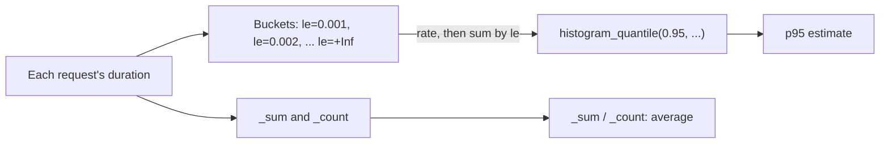

## Before you start

- [[devops.l2.counters-and-rate]] — you know a counter only goes up, that `rate(...[5m])` turns it into an increase per second, and that `sum by (...)` adds series together.

## The situation

A customer writes that the product page of Đơn Hàng "sometimes hangs for half a second". You check: over the last hour, the API's average response time for `GET /api/v1/products/{id}` is about 50 ms. That sounds fast, so the team is ready to tell her it must be her connection. But an average is one number made from many different waits. How can the average be low while some customers really wait ten times longer, and what number would show how slow the slow requests are?

## Core concepts

- Average response time — the total time of all requests divided by how many there were.
- **percentile** — the value a given share of observations is at or below; p95 is the time 95% of requests took at most.
- **histogram** — a metric that counts observations into buckets by upper bound, plus their sum and count.
- Bucket — one line of a histogram, labelled `le` ("less or equal"), counting the requests that took at most that many seconds.
- `histogram_quantile` — a PromQL function that estimates a percentile from a histogram's buckets.

## How it works



In the situation above, imagine 100 requests: 90 take 5 ms and 10 take 500 ms. The average is (90 × 5 + 10 × 500) / 100, about 55 ms, yet no request took 55 ms. The many fast requests pull the average down and hide the slow ones.

A percentile answers a different question. The 95th percentile, p95, is the time that 95% of requests took at most. Sort the 100 requests by time: the 95th is one of the slow ones, so p95 is 500 ms.

Instead of keeping every duration, the API keeps a histogram. `http_request_duration_seconds` has one `_bucket` line per upper bound `le`, and each counts every request that took at most `le` seconds. A 5 ms request adds one to `le="0.008"`, to `le="0.016"` and to every larger bucket, up to `le="+Inf"`, which counts all requests. Each bucket is a counter.

`histogram_quantile(0.95, sum by (le) (rate(http_request_duration_seconds_bucket[5m])))` turns the buckets of the last five minutes into rates and adds them per `le`. Its target is 95% of the `+Inf` rate, the same share as of the counts; the first bucket, from the smallest `le`, that reaches it holds p95. It knows only that bucket's bounds, not the durations inside, so the result is an estimate, as precise as the buckets are narrow.

The histogram also has `_sum`, the total seconds, and `_count`, the number of requests. Dividing their rates gives the average over the last five minutes, next to p95; dividing the raw values would give the average since the API started.

## In the Đơn Hàng system

`UseHttpMetrics()` fills the histogram for the requests it measures, one set of buckets per combination of labels. The lesson's script first sends twenty requests for product 1, then prints the histogram lines for that endpoint's `200` answers, and asks Prometheus for p95 and the average. `promql` is the same helper as in the previous lesson. As there, `sleep 11` waits for two scrapes, so `rate` has two new stored values, which the comment calls samples. The `endpoint` label holds the route template the controller declares, `api/v1/products` on the class plus `{id:int}` on the method that answers the `GET`, not the address you type, so the selectors use that text:

```bash file=scripts/devops/promql-latency.sh tag=stage-2 lines=14-28
for _ in $(seq 20); do curl -sS -o /dev/null http://localhost:8080/api/v1/products/1; done

# lesson: devops.l2.histograms-and-percentiles
# Each bucket counts the requests that took at most `le` seconds, so every
# bucket includes the smaller ones; +Inf counts them all, like _count.
echo "== the histogram of GET /api/v1/products/{id} answered 200, from api:8080/metrics"
curl -sS http://api:8080/metrics \
  | grep -E '^http_request_duration_seconds_(bucket|sum|count)\{code="200",method="GET",.*endpoint="api/v1/products/\{id:int\}"' \
  | sed -E 's/\{code="200".*endpoint="api\/v1\/products\/\{id:int\}",?/{.../'
echo

sleep 11 # two more scrapes (every 5 s), so rate() has two new samples to compare
echo "== PromQL, sent to prometheus:9090"
promql 'histogram_quantile(0.95, sum by (le) (rate(http_request_duration_seconds_bucket{endpoint="api/v1/products/{id:int}"}[5m])))'
promql 'sum(rate(http_request_duration_seconds_sum{endpoint="api/v1/products/{id:int}"}[5m])) / sum(rate(http_request_duration_seconds_count{endpoint="api/v1/products/{id:int}"}[5m]))'
```

```text output=true
== the histogram of GET /api/v1/products/{id} answered 200, from api:8080/metrics
http_request_duration_seconds_sum{...} ...
http_request_duration_seconds_count{...} ...
http_request_duration_seconds_bucket{...le="0.001"} ...
http_request_duration_seconds_bucket{...le="0.002"} ...
http_request_duration_seconds_bucket{...le="0.004"} ...
http_request_duration_seconds_bucket{...le="0.008"} ...
http_request_duration_seconds_bucket{...le="0.016"} ...
http_request_duration_seconds_bucket{...le="0.032"} ...
http_request_duration_seconds_bucket{...le="0.064"} ...
http_request_duration_seconds_bucket{...le="0.128"} ...
http_request_duration_seconds_bucket{...le="0.256"} ...
http_request_duration_seconds_bucket{...le="0.512"} ...
http_request_duration_seconds_bucket{...le="1.024"} ...
http_request_duration_seconds_bucket{...le="2.048"} ...
http_request_duration_seconds_bucket{...le="4.096"} ...
http_request_duration_seconds_bucket{...le="8.192"} ...
http_request_duration_seconds_bucket{...le="16.384"} ...
http_request_duration_seconds_bucket{...le="32.768"} ...
http_request_duration_seconds_bucket{...le="+Inf"} ...

== PromQL, sent to prometheus:9090
promql> histogram_quantile(0.95, sum by (le) (rate(http_request_duration_seconds_bucket{endpoint="api/v1/products/{id:int}"}[5m])))
  {} => ...
promql> sum(rate(http_request_duration_seconds_sum{endpoint="api/v1/products/{id:int}"}[5m])) / sum(rate(http_request_duration_seconds_count{endpoint="api/v1/products/{id:int}"}[5m]))
  {} => ...
```

`{...` stands for the labels the script cuts out to keep lines short. The bounds start at 1 ms and double each time up to about 33 seconds, then `+Inf`. Between 8 ms and 16 ms, the histogram cannot tell 9 ms from 15 ms, which is why p95 is an estimate.

Both queries return one result, `{}`. In the second, `sum` without `by` adds every series into one result with no labels, and total seconds per second divided by requests per second is seconds per request, the average. In the first, `sum by (le)` keeps only `le`, and `histogram_quantile` uses `le` up to pick the bucket, so no label is left.

## Beginners often think…

- **"If the average response time is 50 ms, almost every user waits about 50 ms."** → Actually an average of about 50 ms can come from most requests taking 5 ms and one in ten taking half a second. Nobody waited anywhere near 50 ms. You notice this when the average looks fine while customers still report slow pages, and p95 of the same requests is about ten times higher.
- **"A p95 of 200 ms means 5% of the requests failed."** → Actually p95 is about time, not errors: 95% of requests took at most 200 ms, and the other 5% took longer, whether they succeeded or not. Failures are counted by status code, as in the previous lesson. You notice this when p95 rises while the `5xx` rate stays at zero.
- **"Prometheus keeps the duration of every single request, so the percentile it returns is exact."** → Actually the API keeps only counts per bucket, and Prometheus stores those counts. `histogram_quantile` estimates where inside a bucket the percentile falls. You notice this when the `/metrics` lines show only `le` bounds and counts, and no single request's duration anywhere.

## Try it (3 minutes)

With Đơn Hàng running at stage-2 and the monitoring services started (`docker compose --profile monitoring up -d`), in a terminal at the repository root:

1. Run `scripts/devops/promql-latency.sh` and read the numbers at the end of the `_bucket` lines from top to bottom.

Expected result: the bucket numbers never go down from one line to the next, because each bucket includes the smaller ones, and the `le="+Inf"` number equals the `_count` number. Both queries print one result, `{}`, followed by a number of seconds.

## Connections

- [[devops.l2.counters-and-rate]] — prerequisite: each bucket is a counter, read with `rate` and added with `sum by`.
- [[devops.l2.why-monitoring]] — the other way to see durations: one `ElapsedMs` per log line, which a histogram summarises into counts.
- [[devops.l2.grafana-dashboards]] — the next step: drawing p95 next to request and error rates.

## Five-line summary

1. An average response time can stay low while a small share of requests is very slow.
2. p95 is the time 95% of requests took at most, so it shows how slow the slower requests are.
3. A histogram counts requests into buckets by upper bound `le`, and each bucket includes all smaller ones.
4. `histogram_quantile(0.95, sum by (le) (rate(..._bucket[5m])))` estimates p95, only as precisely as the bucket bounds allow.
5. The `_sum` and `_count` series give the average from the same histogram, to compare with p95.
