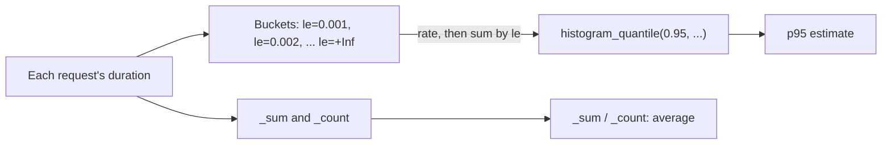

## Bạn cần biết trước

- [[devops.l2.counters-and-rate]] — bạn biết counter chỉ tăng, `rate(...[5m])` biến nó thành mức tăng mỗi giây, và `sum by (...)` cộng các series lại với nhau.

## Tình huống

Một khách viết rằng trang sản phẩm của Đơn Hàng "thỉnh thoảng đứng hình nửa giây". Bạn kiểm tra: trong một giờ qua, thời gian phản hồi trung bình của API cho `GET /api/v1/products/{id}` là khoảng 50 ms. Nghe thì nhanh, nên team định trả lời chị ấy rằng chắc do mạng nhà chị. Nhưng trung bình là một con số gộp từ rất nhiều lần chờ khác nhau. Làm sao trung bình thấp mà vẫn có khách thật sự chờ lâu gấp mười lần, và con số nào cho thấy request chậm chậm tới đâu?

## Khái niệm cốt lõi

- Thời gian phản hồi trung bình — tổng thời gian của mọi request chia cho số request.
- **percentile** (giá trị mà một tỷ lệ số lần đo không vượt quá; p95 là thời gian 95% request không vượt quá) — giá trị mà một tỷ lệ số lần đo nằm ở mức đó hoặc thấp hơn. p95 là thời gian mà 95% request mất tối đa.
- **histogram** (metric đếm các lần đo vào từng bucket theo cận trên, kèm tổng và số lần đo) — một metric đếm các lần đo vào từng bucket theo cận trên, kèm theo tổng và số lần đo.
- Bucket — một dòng của histogram, mang label `le` ("less or equal", nhỏ hơn hoặc bằng), đếm các request mất tối đa chừng đó giây.
- `histogram_quantile` — một hàm PromQL ước lượng percentile từ các bucket của histogram.

## Cơ chế hoạt động



Trong tình huống trên, hãy hình dung 100 request: 90 cái mất 5 ms và 10 cái mất 500 ms. Trung bình là (90 × 5 + 10 × 500) / 100, khoảng 55 ms, vậy mà không request nào mất 55 ms. Rất nhiều request nhanh kéo trung bình xuống và che mất những request chậm.

Percentile trả lời một câu hỏi khác. Percentile thứ 95, tức p95, là thời gian mà 95% request mất tối đa. Xếp 100 request theo thời gian: request thứ 95 là một trong những cái chậm, nên p95 là 500 ms.

Thay vì giữ từng thời gian một, API giữ một histogram. `http_request_duration_seconds` có một dòng `_bucket` cho mỗi cận trên `le`, và mỗi dòng đếm mọi request mất tối đa `le` giây. Một request 5 ms cộng một vào `le="0.008"`, vào `le="0.016"` và vào mọi bucket lớn hơn, cho tới `le="+Inf"`, bucket đếm tất cả request. Mỗi bucket là một counter.

`histogram_quantile(0.95, sum by (le) (rate(http_request_duration_seconds_bucket[5m])))` biến các bucket của năm phút gần nhất thành tốc độ rồi cộng theo từng `le`. Mục tiêu của nó là 95% tốc độ của `+Inf`, cùng tỷ lệ như với số đếm. Bucket đầu tiên, tính từ `le` nhỏ nhất, đạt mục tiêu đó là bucket chứa p95. Hàm chỉ biết hai cận của bucket đó, không biết thời gian của từng request bên trong, nên kết quả là một ước lượng, chính xác tới đâu tùy bucket hẹp tới đâu.

Histogram còn có `_sum`, tổng số giây, và `_count`, số request. Chia tốc độ của hai series này cho ra trung bình trong năm phút gần nhất, để đặt cạnh p95. Chia thẳng hai giá trị thô thì ra trung bình tính từ lúc API khởi động.

## Trong hệ thống Đơn Hàng

`UseHttpMetrics()` ghi vào histogram cho các request nó đo, mỗi tổ hợp label một bộ bucket. Script của bài gửi hai mươi request cho product 1, rồi in các dòng histogram của những câu trả lời `200` của endpoint đó, và hỏi Prometheus p95 cùng trung bình. `promql` là hàm trợ giúp giống bài trước. Cũng như ở đó, `sleep 11` chờ hai lần scrape để `rate` có hai giá trị mới được lưu, mà comment gọi là samples. Label `endpoint` giữ route template mà controller khai báo, gồm `api/v1/products` trên class và `{id:int}` trên method trả lời `GET`, chứ không phải địa chỉ bạn gõ, nên các selector dùng đúng chuỗi đó:

```bash file=scripts/devops/promql-latency.sh tag=stage-2 lines=14-28
for _ in $(seq 20); do curl -sS -o /dev/null http://localhost:8080/api/v1/products/1; done

# lesson: devops.l2.histograms-and-percentiles
# Each bucket counts the requests that took at most `le` seconds, so every
# bucket includes the smaller ones; +Inf counts them all, like _count.
echo "== the histogram of GET /api/v1/products/{id} answered 200, from api:8080/metrics"
curl -sS http://api:8080/metrics \
  | grep -E '^http_request_duration_seconds_(bucket|sum|count)\{code="200",method="GET",.*endpoint="api/v1/products/\{id:int\}"' \
  | sed -E 's/\{code="200".*endpoint="api\/v1\/products\/\{id:int\}",?/{.../'
echo

sleep 11 # two more scrapes (every 5 s), so rate() has two new samples to compare
echo "== PromQL, sent to prometheus:9090"
promql 'histogram_quantile(0.95, sum by (le) (rate(http_request_duration_seconds_bucket{endpoint="api/v1/products/{id:int}"}[5m])))'
promql 'sum(rate(http_request_duration_seconds_sum{endpoint="api/v1/products/{id:int}"}[5m])) / sum(rate(http_request_duration_seconds_count{endpoint="api/v1/products/{id:int}"}[5m]))'
```

```text output=true
== the histogram of GET /api/v1/products/{id} answered 200, from api:8080/metrics
http_request_duration_seconds_sum{...} ...
http_request_duration_seconds_count{...} ...
http_request_duration_seconds_bucket{...le="0.001"} ...
http_request_duration_seconds_bucket{...le="0.002"} ...
http_request_duration_seconds_bucket{...le="0.004"} ...
http_request_duration_seconds_bucket{...le="0.008"} ...
http_request_duration_seconds_bucket{...le="0.016"} ...
http_request_duration_seconds_bucket{...le="0.032"} ...
http_request_duration_seconds_bucket{...le="0.064"} ...
http_request_duration_seconds_bucket{...le="0.128"} ...
http_request_duration_seconds_bucket{...le="0.256"} ...
http_request_duration_seconds_bucket{...le="0.512"} ...
http_request_duration_seconds_bucket{...le="1.024"} ...
http_request_duration_seconds_bucket{...le="2.048"} ...
http_request_duration_seconds_bucket{...le="4.096"} ...
http_request_duration_seconds_bucket{...le="8.192"} ...
http_request_duration_seconds_bucket{...le="16.384"} ...
http_request_duration_seconds_bucket{...le="32.768"} ...
http_request_duration_seconds_bucket{...le="+Inf"} ...

== PromQL, sent to prometheus:9090
promql> histogram_quantile(0.95, sum by (le) (rate(http_request_duration_seconds_bucket{endpoint="api/v1/products/{id:int}"}[5m])))
  {} => ...
promql> sum(rate(http_request_duration_seconds_sum{endpoint="api/v1/products/{id:int}"}[5m])) / sum(rate(http_request_duration_seconds_count{endpoint="api/v1/products/{id:int}"}[5m]))
  {} => ...
```

`{...` là chỗ các label bị script cắt bớt cho dòng ngắn lại. Các cận bắt đầu từ 1 ms và gấp đôi mỗi bậc cho tới khoảng 33 giây, rồi tới `+Inf`. Giữa 8 ms và 16 ms, histogram không phân biệt được 9 ms với 15 ms, vì thế p95 chỉ là ước lượng.

Cả hai truy vấn đều trả về một kết quả, `{}`. Ở truy vấn thứ hai, `sum` không có `by` cộng mọi series thành một kết quả không còn label, và số giây mỗi giây chia cho số request mỗi giây là số giây cho mỗi request, tức trung bình. Ở truy vấn thứ nhất, `sum by (le)` chỉ giữ `le`, rồi `histogram_quantile` dùng hết `le` để chọn bucket, nên không còn label nào.

## Người mới hay nghĩ rằng…

- **"Nếu thời gian phản hồi trung bình là 50 ms, hầu như người dùng nào cũng chờ khoảng 50 ms."** → Thực ra trung bình khoảng 50 ms có thể đến từ việc phần lớn request mất 5 ms và cứ mười request có một cái mất nửa giây. Không ai chờ gần 50 ms cả. Bạn sẽ nhận ra khi trung bình trông ổn mà khách vẫn báo trang chậm, và p95 của cùng các request đó cao gấp khoảng mười lần.
- **"p95 bằng 200 ms nghĩa là 5% request bị lỗi."** → Thực ra p95 nói về thời gian, không nói về lỗi: 95% request mất tối đa 200 ms, còn 5% kia mất lâu hơn, dù thành công hay không. Lỗi được đếm theo status code, như ở bài trước. Bạn sẽ nhận ra khi p95 tăng trong khi tốc độ `5xx` vẫn bằng 0.
- **"Prometheus giữ thời gian của từng request, nên percentile nó trả về là chính xác."** → Thực ra API chỉ giữ số đếm theo bucket, và Prometheus lưu các số đếm đó. `histogram_quantile` ước lượng percentile nằm ở đâu bên trong một bucket. Bạn sẽ nhận ra khi các dòng của `/metrics` chỉ có cận `le` và số đếm, không có thời gian của request nào.

## Thử ngay (3 phút)

Với Đơn Hàng đang chạy ở stage-2 và các service monitoring đã bật (`docker compose --profile monitoring up -d`), trong terminal ở thư mục gốc của repository:

1. Chạy `scripts/devops/promql-latency.sh` và đọc các con số ở cuối những dòng `_bucket` từ trên xuống.

Kết quả mong đợi: con số của các bucket không bao giờ giảm từ dòng này sang dòng sau, vì mỗi bucket bao gồm các bucket nhỏ hơn, và con số của `le="+Inf"` bằng con số của `_count`. Cả hai truy vấn đều in một kết quả `{}`, kèm một số giây.

## Liên hệ

- [[devops.l2.counters-and-rate]] — kiến thức nền: mỗi bucket là một counter, được đọc bằng `rate` và cộng bằng `sum by`.
- [[devops.l2.why-monitoring]] — cách khác để xem thời gian: mỗi dòng log một `ElapsedMs`, thứ mà histogram gom lại thành số đếm.
- [[devops.l2.grafana-dashboards]] — bước tiếp theo: vẽ p95 cạnh tốc độ request và tốc độ lỗi.

## Tóm tắt 5 dòng

1. Thời gian phản hồi trung bình có thể vẫn thấp trong khi một phần nhỏ request rất chậm.
2. p95 là thời gian mà 95% request mất tối đa, nên nó cho thấy các request chậm hơn chậm cỡ nào.
3. Histogram đếm request vào các bucket theo cận trên `le`, và mỗi bucket bao gồm mọi bucket nhỏ hơn.
4. `histogram_quantile(0.95, sum by (le) (rate(..._bucket[5m])))` ước lượng p95, chính xác chỉ tới mức các cận bucket cho phép.
5. Hai series `_sum` và `_count` cho ra trung bình từ cùng histogram đó, để so với p95.
