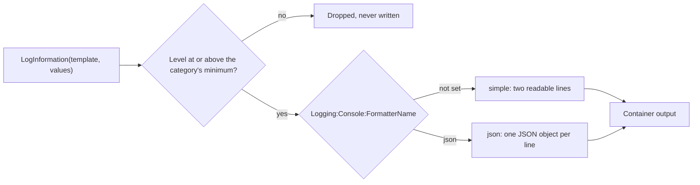

## Before you start

- [[backend.l1.structured-logging]] — you know `RequestLoggingMiddleware` passes `Method`, `Path`, `StatusCode` and `ElapsedMs` as named fields, and that the console still prints them as a sentence.
- [[devops.l1.config-and-env]] — you know an environment variable overrides the same key from `appsettings.json`, and that `__` in its name stands for `:`.
- [[devops.l2.why-monitoring]] — you know that at stage-1 the API's container output is its only per-request signal, read by a person with `docker compose logs api`.

## The situation

A customer says her orders were slow yesterday afternoon. You want every request from that afternoon that took longer than one second, and `RequestLoggingMiddleware` did record `ElapsedMs` for each one, as its own field. But the console printed it inside a sentence, `POST /api/v1/orders responded 201 in 1340ms`, on a line under a separate header line. To find the slow ones you would write a pattern that cuts the number out of the text and hope no path ever contains the word "responded". The fields existed in the code and were lost on the way out. How can the API write each field so that a program reads it by name?

## Core concepts

- Category — the name a logger writes under; for `ILogger<RequestLoggingMiddleware>` it is the class's full name, `DonHang.Api.Middleware.RequestLoggingMiddleware`.
- **log level** — how severe a log event is, from `Trace` and `Debug` through `Information` and `Warning` to `Error` and `Critical`; configuration sets, for each category, the lowest level that gets written.
- Console formatter — the part of the console logger that turns a log event into text; the `simple` formatter prints readable lines, the `json` formatter prints one JSON object per line.

## How it works



In the situation above, the log call is `LogInformation` in `RequestLoggingMiddleware`, with its template and four values. The call itself says nothing about text or JSON; it hands the logger an event.

First the event meets a filter. `Logging:LogLevel` in `appsettings.json` gives each category its lowest written level: `Default` is `Information`, and `Microsoft.AspNetCore` is `Warning`. A category uses the longest listed name it starts with, so `Microsoft.AspNetCore.Hosting.Diagnostics` counts as `Microsoft.AspNetCore`, while `DonHang.Api.Middleware.RequestLoggingMiddleware` starts with no listed name and falls back to `Default`. An event below its category's minimum is dropped here and never reaches the output. That is why the API's own `Information` events appear while `Information` events from categories starting with `Microsoft.AspNetCore` do not.

Then an event that passed is turned into text by the console formatter. Which formatter runs is itself configuration: the key `Logging:Console:FormatterName`. Without it, the console logger uses `simple`, the header line plus indented sentence you have seen since stage-1. With `json`, each event becomes one line holding a JSON object. That object carries the level as `LogLevel`, the category as `Category`, the finished sentence as `Message`, and every template field under its own name inside `State`.

The same build can produce either output. Nothing in the diagram before the formatter changes when you switch.

## In the Đơn Hàng system

At stage-2 the `api` service in `docker-compose.yml` also sets this environment variable:

```yaml file=docker-compose.yml tag=stage-2 lines=128-132
      # lesson: devops.l2.json-logs
      # The console logger writes each log event as one JSON object per line.
      # Only this setting changed, no log call in the code; without it the
      # same build prints the usual readable lines (as `dotnet run` does).
      Logging__Console__FormatterName: "json"
```

`Logging__Console__FormatterName` sets the key `Logging:Console:FormatterName`, so every event the API writes in the container is a JSON line. The `Logging` section of `appsettings.json` and the log call in `RequestLoggingMiddleware` are the same as at stage-1; no log call was changed to get JSON. Running the API with `dotnet run` outside Compose does not set this variable, so it prints the readable lines.

`scripts/devops/json-logs.sh` sends one request with `curl`, a command-line HTTP client, and reads back the line the middleware wrote for it; `jq` is a command-line tool that prints JSON with indentation, and an earlier line of the script runs it inside one of Đơn Hàng's containers, so you do not install it:

```bash file=scripts/devops/json-logs.sh tag=stage-2 lines=10-24
echo "== GET /api/v1/products/2"
curl -sS -o /dev/null -w '  -> %{http_code}\n' http://localhost:8080/api/v1/products/2
sleep 1 # let the api's logger write the entry out first

# lesson: devops.l2.json-logs
# The api service sets Logging__Console__FormatterName=json, so each log event
# is one line of JSON; the message template's fields keep their names in State.
line=$(docker compose logs --no-log-prefix --since 1m api \
  | grep '"Category":"DonHang.Api.Middleware.RequestLoggingMiddleware"' \
  | grep '"Path":"/api/v1/products/2"' | tail -n 1)
echo "== the line the api wrote for it, as it is:"
echo "$line"
echo
echo "== the same line, pretty-printed:"
echo "$line" | jq .
```

```text output=true
== GET /api/v1/products/2
  -> 200
== the line the api wrote for it, as it is:
{"EventId":0,"LogLevel":"Information","Category":"DonHang.Api.Middleware.RequestLoggingMiddleware",...}

== the same line, pretty-printed:
{
  "EventId": 0,
  "LogLevel": "Information",
  "Category": "DonHang.Api.Middleware.RequestLoggingMiddleware",
  "Message": "GET /api/v1/products/2 responded 200 in ...ms",
  "State": {
    "Method": "GET",
    "Path": "/api/v1/products/2",
    "StatusCode": 200,
    "ElapsedMs": ...,
    "{OriginalFormat}": "{Method} {Path} responded {StatusCode} in {ElapsedMs}ms"
  }
}
```

Look at `State`. `StatusCode` is the number `200`, not the text inside a sentence, and `ElapsedMs` is a number too. The script already relies on this: it finds the line by matching `"Path":"/api/v1/products/2"`, a field and its value, instead of guessing where the path sits in a sentence. `Message` still holds the readable sentence for a person, and `{OriginalFormat}` is the template itself, added by the logger.

## Beginners often think…

- **"Switching to JSON logs means rewriting every log call in the code."** → Actually the log call hands over a template and values, and the formatter chosen by configuration decides the shape at the very end. To get JSON, Đơn Hàng changed one environment variable and no log call. You notice this when `dotnet run` on your machine prints readable lines while the container prints JSON, from the same code.
- **"Setting `Microsoft.AspNetCore` to `Warning` hides its errors too."** → Actually the setting is a minimum, not a single level: `Warning`, `Error` and `Critical` are all at or above it, so they are still written. Only `Trace`, `Debug` and `Information` are dropped for that category. You notice this when an ASP.NET Core `Warning` line shows up in the output while none of its `Information` lines ever do.
- **"A log level is only a label for people; it does not change what gets written."** → Actually the level decides whether an event is written at all: the filter compares it with the category's minimum before any formatter runs. A dropped event cannot be found later in any tool. You notice this when you search the output for an `Information` event from a `Microsoft.AspNetCore` category and find nothing, because it was never written.

## Try it (3 minutes)

With Đơn Hàng running (`scripts/up.sh`), in a terminal at the repository root:

1. Run `scripts/devops/json-logs.sh` and read the pretty-printed line.
2. Run `docker compose logs --no-log-prefix api | grep -c '"LogLevel":"Information","Category":"Microsoft.AspNetCore'`; `grep -c` prints how many lines contain the text.
3. Run the same command with `"LogLevel":"Warning"` in place of `"LogLevel":"Information"`.

Expected result: 1 — one JSON object whose `State` holds `Method`, `Path`, `StatusCode` and `ElapsedMs` by name, and whose `LogLevel` is `Information`. 2 — `0`: the API has written no `Information` event from a `Microsoft.AspNetCore` category. The pattern relies on `LogLevel` coming right before `Category`, as in step 1; with `DonHang` in place of `Microsoft.AspNetCore`, step 2 prints a number above `0`. 3 — a number that may be `0` or more, depending on what ASP.NET Core had to warn about since the API started.

Why does step 2 print `0` even though the API has handled many requests?

<details><summary>Suggested answer</summary>

`appsettings.json` sets `Microsoft.AspNetCore` to `Warning`. Categories starting with `Microsoft.AspNetCore` use that entry, so their `Information` events are below the minimum and are dropped before the formatter runs. The API's own middleware falls back to `Default`, which is `Information`, so its lines are written.

</details>

## Connections

- [[backend.l1.structured-logging]] — the same fields one step earlier: named in the log call, and now also named in the output.
- [[devops.l1.config-and-env]] — the mechanism used here: an environment variable with `__` sets a settings key without changing code or image.
- [[devops.l2.why-monitoring]] — the problem this starts to fix: log lines a person has to scroll through and count by hand.
- [[devops.l2.centralized-logs]] — the next step: collecting these JSON lines from every container in one place and searching them by field.

## Five-line summary

1. JSON logs write each log event as one JSON object per line, so a program reads every field by name.
2. In Đơn Hàng, `Logging__Console__FormatterName: "json"` on the `api` service switches the format; no log call changed.
3. Template fields such as `Method`, `StatusCode` and `ElapsedMs` keep their names inside `State`, next to `LogLevel` and `Category`.
4. A log level runs from `Trace` to `Critical`; `Logging:LogLevel` sets each category's lowest written level.
5. Events below that minimum are dropped before formatting, so `Microsoft.AspNetCore` shows only `Warning` and above.
