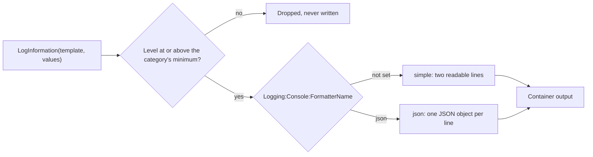

## Bạn cần biết trước

- [[backend.l1.structured-logging]] — bạn biết `RequestLoggingMiddleware` truyền `Method`, `Path`, `StatusCode` và `ElapsedMs` thành các field có tên, và console vẫn in chúng ra thành một câu.
- [[devops.l1.config-and-env]] — bạn biết biến môi trường ghi đè cùng khóa trong `appsettings.json`, và `__` trong tên biến thay cho `:`.
- [[devops.l2.why-monitoring]] — bạn biết ở stage-1 output của container API là tín hiệu duy nhất cho từng request, và phải có người đọc bằng `docker compose logs api`.

## Tình huống

Một khách báo chiều qua đặt đơn rất chậm. Bạn muốn lấy mọi request chiều qua mất hơn một giây, và `RequestLoggingMiddleware` quả thật đã ghi `ElapsedMs` cho từng request, thành một field riêng. Nhưng console lại in nó nằm trong một câu, `POST /api/v1/orders responded 201 in 1340ms`, trên một dòng nằm dưới một dòng tiêu đề riêng. Muốn tìm các request chậm, bạn phải viết một mẫu cắt con số ra khỏi câu chữ và cầu mong không path nào chứa chữ "responded". Các field có tồn tại trong code nhưng rơi mất trên đường ra. Làm sao để API ghi từng field sao cho một chương trình đọc được nó theo tên?

## Khái niệm cốt lõi

- Category — cái tên mà một logger ghi log dưới đó; với `ILogger<RequestLoggingMiddleware>`, đó là tên đầy đủ của class, `DonHang.Api.Middleware.RequestLoggingMiddleware`.
- **log level** (mức nghiêm trọng của một sự kiện log, từ Trace tới Critical; cấu hình đặt mức thấp nhất được ghi) — một log event nghiêm trọng tới đâu, từ `Trace` và `Debug`, qua `Information` và `Warning`, tới `Error` và `Critical`. Cấu hình đặt, cho từng category, mức thấp nhất được ghi ra.
- Console formatter — phần của console logger biến một log event thành văn bản. Formatter `simple` in ra các dòng dễ đọc, formatter `json` in mỗi event thành một object JSON trên một dòng.

## Cơ chế hoạt động



Trong tình huống trên, lời gọi log là `LogInformation` trong `RequestLoggingMiddleware`, với template và bốn giá trị. Bản thân lời gọi không nói gì về văn bản hay JSON. Nó chỉ trao cho logger một event.

Trước hết, event đi qua một bộ lọc. `Logging:LogLevel` trong `appsettings.json` cho mỗi category một mức thấp nhất được ghi: `Default` là `Information`, còn `Microsoft.AspNetCore` là `Warning`. Một category dùng tên dài nhất trong danh sách mà nó bắt đầu bằng, nên `Microsoft.AspNetCore.Hosting.Diagnostics` được tính theo `Microsoft.AspNetCore`. Còn `DonHang.Api.Middleware.RequestLoggingMiddleware` không bắt đầu bằng tên nào trong danh sách, nên dùng `Default`. Event thấp hơn mức tối thiểu của category bị bỏ ngay ở đây và không bao giờ tới output. Vì vậy các event `Information` của chính API có mặt, còn event `Information` từ các category bắt đầu bằng `Microsoft.AspNetCore` thì không.

Sau đó, event đã qua bộ lọc được console formatter biến thành văn bản. Formatter nào chạy cũng là chuyện cấu hình: khóa `Logging:Console:FormatterName`. Không có khóa này, console logger dùng `simple`, tức dòng tiêu đề cộng câu thụt lề bạn đã thấy từ stage-1. Với `json`, mỗi event thành một dòng chứa một object JSON. Object đó mang level trong `LogLevel`, category trong `Category`, câu đã điền đủ trong `Message`, và mọi field của template dưới tên riêng bên trong `State`.

Cùng một bản build cho ra được cả hai kiểu output. Khi bạn chuyển kiểu, mọi thứ đứng trước formatter trong sơ đồ đều giữ nguyên.

## Trong hệ thống Đơn Hàng

Ở stage-2, service `api` trong `docker-compose.yml` đặt thêm biến môi trường này:

```yaml file=docker-compose.yml tag=stage-2 lines=128-132
      # lesson: devops.l2.json-logs
      # The console logger writes each log event as one JSON object per line.
      # Only this setting changed, no log call in the code; without it the
      # same build prints the usual readable lines (as `dotnet run` does).
      Logging__Console__FormatterName: "json"
```

`Logging__Console__FormatterName` đặt khóa `Logging:Console:FormatterName`, nên mọi event API ghi ra trong container đều là một dòng JSON. Mục `Logging` của `appsettings.json` và lời gọi log trong `RequestLoggingMiddleware` vẫn y như ở stage-1. Không lời gọi log nào phải sửa để có JSON. Chạy API bằng `dotnet run` ngoài Compose thì không có biến này, nên nó in ra các dòng dễ đọc.

`scripts/devops/json-logs.sh` gửi một request bằng `curl`, một HTTP client chạy trên dòng lệnh, rồi đọc lại dòng mà middleware đã ghi cho request đó. `jq` là công cụ dòng lệnh in JSON có thụt lề, và một dòng phía trên trong script cho nó chạy bên trong một container của Đơn Hàng, nên bạn không phải cài:

```bash file=scripts/devops/json-logs.sh tag=stage-2 lines=10-24
echo "== GET /api/v1/products/2"
curl -sS -o /dev/null -w '  -> %{http_code}\n' http://localhost:8080/api/v1/products/2
sleep 1 # let the api's logger write the entry out first

# lesson: devops.l2.json-logs
# The api service sets Logging__Console__FormatterName=json, so each log event
# is one line of JSON; the message template's fields keep their names in State.
line=$(docker compose logs --no-log-prefix --since 1m api \
  | grep '"Category":"DonHang.Api.Middleware.RequestLoggingMiddleware"' \
  | grep '"Path":"/api/v1/products/2"' | tail -n 1)
echo "== the line the api wrote for it, as it is:"
echo "$line"
echo
echo "== the same line, pretty-printed:"
echo "$line" | jq .
```

```text output=true
== GET /api/v1/products/2
  -> 200
== the line the api wrote for it, as it is:
{"EventId":0,"LogLevel":"Information","Category":"DonHang.Api.Middleware.RequestLoggingMiddleware",...}

== the same line, pretty-printed:
{
  "EventId": 0,
  "LogLevel": "Information",
  "Category": "DonHang.Api.Middleware.RequestLoggingMiddleware",
  "Message": "GET /api/v1/products/2 responded 200 in ...ms",
  "State": {
    "Method": "GET",
    "Path": "/api/v1/products/2",
    "StatusCode": 200,
    "ElapsedMs": ...,
    "{OriginalFormat}": "{Method} {Path} responded {StatusCode} in {ElapsedMs}ms"
  }
}
```

Hãy nhìn `State`. `StatusCode` là con số `200`, không phải mẩu chữ nằm trong một câu, và `ElapsedMs` cũng là một con số. Chính script đã dựa vào điều này: nó tìm dòng bằng cách khớp `"Path":"/api/v1/products/2"`, tức một field và giá trị của nó, thay vì đoán path nằm ở đâu trong câu. `Message` vẫn giữ câu dễ đọc cho người xem, còn `{OriginalFormat}` là chính template, do logger thêm vào.

## Người mới hay nghĩ rằng…

- **"Chuyển sang log JSON nghĩa là phải viết lại mọi lời gọi log trong code."** → Thực ra lời gọi log chỉ trao template và các giá trị, còn formatter do cấu hình chọn mới quyết định hình dạng ở bước cuối cùng. Để có JSON, Đơn Hàng đổi một biến môi trường và không sửa lời gọi log nào. Bạn sẽ nhận ra khi `dotnet run` trên máy bạn in dòng dễ đọc trong lúc container in JSON, từ cùng một code.
- **"Đặt `Microsoft.AspNetCore` thành `Warning` thì lỗi của nó cũng bị giấu luôn."** → Thực ra thiết lập này là mức tối thiểu, không phải một mức duy nhất: `Warning`, `Error` và `Critical` đều bằng hoặc cao hơn nó, nên vẫn được ghi. Với category đó, chỉ `Trace`, `Debug` và `Information` bị bỏ. Bạn sẽ nhận ra khi một dòng `Warning` của ASP.NET Core hiện trong output, còn dòng `Information` nào của nó cũng không bao giờ xuất hiện.
- **"Log level chỉ là cái nhãn cho người đọc, nó không làm thay đổi thứ được ghi ra."** → Thực ra level quyết định event có được ghi hay không: bộ lọc so nó với mức tối thiểu của category trước khi formatter nào chạy. Event đã bị bỏ thì không công cụ nào tìm lại được về sau. Bạn sẽ nhận ra khi tìm trong output một event `Information` từ một category `Microsoft.AspNetCore` và không thấy gì, vì nó chưa từng được ghi.

## Thử ngay (3 phút)

Khi Đơn Hàng đang chạy (`scripts/up.sh`), mở terminal ở thư mục gốc của repo:

1. Chạy `scripts/devops/json-logs.sh` và đọc dòng đã in có thụt lề.
2. Chạy `docker compose logs --no-log-prefix api | grep -c '"LogLevel":"Information","Category":"Microsoft.AspNetCore'`. `grep -c` in ra số dòng có chứa đoạn chữ đó.
3. Chạy lại lệnh trên, thay `"LogLevel":"Information"` bằng `"LogLevel":"Warning"`.

Kết quả mong đợi: 1 — một object JSON có `State` chứa `Method`, `Path`, `StatusCode` và `ElapsedMs` theo tên, và `LogLevel` là `Information`. 2 — `0`: API chưa ghi event `Information` nào từ một category `Microsoft.AspNetCore`. Mẫu tìm kiếm dựa vào việc `LogLevel` đứng ngay trước `Category`, như ở bước 1. Thay `Microsoft.AspNetCore` bằng `DonHang` thì bước 2 in ra một số lớn hơn `0`. 3 — một con số có thể là `0` hoặc lớn hơn, tùy những gì ASP.NET Core đã phải cảnh báo từ lúc API khởi động.

Vì sao bước 2 in ra `0` dù API đã xử lý rất nhiều request?

<details><summary>Gợi ý đáp án</summary>

`appsettings.json` đặt `Microsoft.AspNetCore` là `Warning`. Các category bắt đầu bằng `Microsoft.AspNetCore` dùng mục này, nên event `Information` của chúng thấp hơn mức tối thiểu và bị bỏ trước khi formatter chạy. Middleware của chính API dùng `Default`, tức `Information`, nên các dòng của nó được ghi.

</details>

## Liên hệ

- [[backend.l1.structured-logging]] — cùng các field đó, ở bước trước: có tên trong lời gọi log, giờ có tên cả trong output.
- [[devops.l1.config-and-env]] — cơ chế được dùng ở đây: một biến môi trường có `__` đặt một khóa cấu hình mà không đổi code hay image.
- [[devops.l2.why-monitoring]] — vấn đề mà bài này bắt đầu giải quyết: những dòng log người ta phải cuộn qua và đếm bằng tay.
- [[devops.l2.centralized-logs]] — bước tiếp theo: gom các dòng JSON này từ mọi container về một chỗ và tìm theo field.

## Tóm tắt 5 dòng

1. Log JSON ghi mỗi log event thành một object JSON trên một dòng, nên chương trình đọc được từng field theo tên.
2. Trong Đơn Hàng, `Logging__Console__FormatterName: "json"` trên service `api` chuyển định dạng, không lời gọi log nào phải đổi.
3. Các field của template như `Method`, `StatusCode` và `ElapsedMs` giữ tên bên trong `State`, cạnh `LogLevel` và `Category`.
4. Log level đi từ `Trace` tới `Critical`, và `Logging:LogLevel` đặt mức thấp nhất được ghi cho từng category.
5. Event dưới mức tối thiểu bị bỏ trước khi định dạng, nên `Microsoft.AspNetCore` chỉ hiện `Warning` trở lên.
