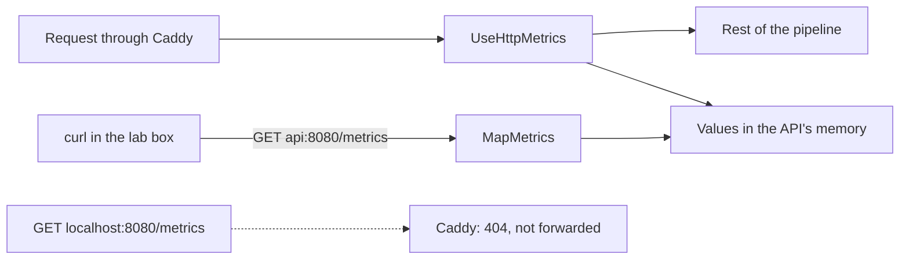

## Before you start

- [[devops.l2.why-monitoring]] — you know a metric is one number measured again and again, and that at stage-1 the API left only log lines.
- [[backend.l1.middleware-pipeline]] — you know middleware runs in the order of the `app.Use...` calls in `Program.cs`, and can act before and after the rest of the pipeline.

## The situation

The team has moved Đơn Hàng to stage-2, and a teammate tells you the API now has a `/metrics` endpoint. She asks you how many requests for a single product ended in `404` since the API started. You open `http://localhost:8080/metrics` in your browser, the same address that serves `/api/v1/products`, and get a `404` yourself. So where are those numbers, what do they look like when you do reach them, and who is supposed to read them?

## Core concepts

- **Prometheus** — a monitoring system that reads applications' metrics over HTTP, in a plain-text format where each metric value sits on its own line.
- prometheus-net — the .NET library that `DonHang.Api` uses from stage-2 to measure requests and publish its metrics in that text format.
- `/metrics` — the endpoint where the API answers with the current value of every metric it keeps.
- **metric label** — a name–value pair on a metric, such as `code="404"`, that splits one metric into separate numbers, one per combination of values.

## How it works



In the situation above, the numbers exist, but not where you looked. Requests that pass through the API's pipeline are measured by `app.UseHttpMetrics()`, a middleware from prometheus-net; requests to `/metrics` itself are left out. It notes how the request ended, with which status code and method, and adds to a value the API keeps in its own memory. Nothing else happens to those values on their own: the API sends them nowhere.

`app.MapMetrics()` adds one endpoint at `/metrics`. When some program asks with `GET /metrics`, it answers with the value of every metric at that moment, as text. It does not answer with a history: ask twice, a minute apart, and you get two snapshots, the second with bigger numbers if requests arrived in between. Keeping the values over time is the job of whoever asks, which in Đơn Hàng is Prometheus, in the next lesson.

Each value line of the answer holds a metric name, its labels in braces, and a number. `http_requests_received_total` counts requests the pipeline processed; it has one line for each combination of label values it has seen, such as `code="200",method="GET"` and `code="404",method="GET"`. A line starting with `# HELP` describes the metric in words, and one starting with `# TYPE` names its kind, here a value that only goes up; the kinds come in a later lesson.

Your browser got `404` because of Caddy, not the API. Caddy forwards only the API's own paths, `/api/v1/*`, `/api/v2/*` and `/openapi/*`, to `api:8080`. A path it has no rule for, such as `/metrics`, falls through to serving files from Caddy's own folder; there is no such file, so Caddy answers `404` itself. The endpoint is reachable only from inside the `donhang` Docker network, for example from the lab box at `api:8080`.

## In the Đơn Hàng system

The two calls sit in `Program.cs`, one at each end of the pipeline:

```csharp file=DonHang.Api/Program.cs tag=stage-2 lines=95-118
// lesson: devops.l2.metrics-endpoint
// Measures every request: how many, with which status code, how long. First
// in the pipeline, so a request that throws is still counted, with the 500
// that ExceptionHandlingMiddleware below turns it into.
app.UseHttpMetrics();

// lesson: backend.l1.middleware-pipeline
// Order matters: every request logged, then exceptions caught, then the
// terminal middleware (auth, routing) that decides how to answer it. From
// stage-2 the logging comes first, so that a request that threw is logged
// too, with the 500 that ExceptionHandlingMiddleware turned it into.
app.UseMiddleware<RequestLoggingMiddleware>();
app.UseMiddleware<ExceptionHandlingMiddleware>();
app.UseCors();
app.UseAuthentication();
app.UseAuthorization();
app.MapControllers();
app.MapOpenApi();

// lesson: devops.l2.metrics-endpoint
// GET /metrics answers with the current value of every metric, as text,
// whenever something asks; the api sends its metrics nowhere by itself.
// Caddy does not forward /metrics: only the donhang network reaches it, at api:8080.
app.MapMetrics();
```

`UseHttpMetrics()` comes first, before `ExceptionHandlingMiddleware`. As the middleware lesson showed, the first middleware acts again after everything later has returned, so it sees the status code that `ExceptionHandlingMiddleware` wrote, including a `500` for a request whose code threw. The comment's "logging comes first" compares the two `UseMiddleware` lines; `UseHttpMetrics()` sits before both.

The lesson's script asks both ways. You start it from the repository root, and its line `[ -f /.dockerenv ] || exec ...` hands the rest over to the lab box:

```bash file=scripts/devops/metrics-endpoint.sh tag=stage-2 lines=4-22
# Everything below runs inside the lab box; this line puts it there.
[ -f /.dockerenv ] || exec "$(dirname "$0")/../lab-run.sh" "$0" "$@"

echo "== GET /api/v1/products/1 and /api/v1/products/999, through Caddy"
curl -sS -o /dev/null -w '  -> %{http_code}\n' http://localhost:8080/api/v1/products/1
curl -sS -o /dev/null -w '  -> %{http_code}\n' http://localhost:8080/api/v1/products/999
echo

# lesson: devops.l2.metrics-endpoint
# One line per combination of label values: a metric name, the labels in
# braces, the current value. The api answers with every metric it has;
# these are only the lines about GET /api/v1/products/{id}.
echo "== GET http://api:8080/metrics (on the donhang network), a few of its lines"
curl -sS http://api:8080/metrics \
  | grep -E '^# (HELP|TYPE) http_requests_received_total |^http_requests_received_total\{.*method="GET".*endpoint="api/v1/products/\{id:int\}"'
echo

echo "== GET http://localhost:8080/metrics, through Caddy"
curl -sS -o /dev/null -w '  -> %{http_code}\n' http://localhost:8080/metrics
```

```text output=true
== GET /api/v1/products/1 and /api/v1/products/999, through Caddy
  -> 200
  -> 404

== GET http://api:8080/metrics (on the donhang network), a few of its lines
# HELP http_requests_received_total Provides the count of HTTP requests that have been processed by the ASP.NET Core pipeline.
# TYPE http_requests_received_total counter
http_requests_received_total{code="200",method="GET",controller="Products",action="Get",endpoint="api/v1/products/{id:int}"} ...
http_requests_received_total{code="404",method="GET",controller="Products",action="Get",endpoint="api/v1/products/{id:int}"} ...

== GET http://localhost:8080/metrics, through Caddy
  -> 404
```

In the lab box, `localhost:8080` is Caddy, and `api:8080` is the API itself. The two request lines share the metric name and differ only in the `code` label, so one metric holds both numbers. Their `controller`, `action` and `endpoint` labels name the route that handled the request, here the one for a single product. The values are shown as `...` because they depend on how many requests the API has received since it started. The last line is your browser's `404` again.

## Beginners often think…

- **"The API pushes its metrics to a monitoring server every few seconds."** → Actually the API only answers when asked: `MapMetrics()` adds an endpoint, and nothing in `Program.cs` sends anything anywhere. You notice this when the API runs for hours with no monitoring program started, and the values at `/metrics` are all there, never sent to anyone.
- **"`/metrics` returns the history of each value, like a small database."** → Actually it returns one number per line, the value at the moment of the request. Two calls a minute apart are two snapshots; the earlier one is gone unless something kept it. You notice this when you look for last night's numbers at `/metrics` and see only one value per line, for now.
- **"Counting `GET` and `POST` requests separately needs two differently named metrics."** → Actually one metric name with a `method` label keeps a separate number for each method, as the `code` label does for each status code. You notice this when you create an order and a line with `method="POST"` appears under the same `http_requests_received_total` name.

## Try it (3 minutes)

With Đơn Hàng running at stage-2 (`scripts/up.sh`), in a terminal at the repository root:

1. Run `scripts/devops/metrics-endpoint.sh` and note the two numbers at the end of the `http_requests_received_total` lines.
2. Run it again and compare.

Expected result: both runs print `-> 200`, `-> 404` for the two product requests and `-> 404` for `/metrics` through Caddy. In the second run, each of the two numbers is one higher than in the first (more, if something else requested those products in between): the endpoint reports the value now, and the value grew.

## Connections

- [[devops.l2.why-monitoring]] — the problem this lesson starts to solve: a number of `5xx` responses you can read without counting log lines.
- [[backend.l1.middleware-pipeline]] — the same rule applied: `UseHttpMetrics()` runs first so it sees the status code later middleware wrote.
- [[devops.l1.docker-networks]] — why `api:8080` works from the lab box and not from your laptop.
- [[devops.l2.prometheus-scraping]] — the next step: the program that asks `/metrics` on a schedule and keeps the answers.

## Five-line summary

1. The API keeps its metrics in memory and publishes them as text at `/metrics`, answering only when another program asks.
2. From stage-2, `app.UseHttpMetrics()` from prometheus-net measures requests in the pipeline, and `app.MapMetrics()` answers `GET /metrics`.
3. Each value line holds a metric name, labels in braces and the current value, never a history.
4. Labels such as `code` and `method` give one metric a separate line for each combination of values.
5. Caddy forwards only the API's own paths, so `/metrics` is reached inside the `donhang` network at `api:8080`.
