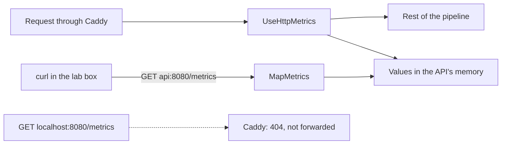

## Bạn cần biết trước

- [[devops.l2.why-monitoring]] — bạn biết metric là một con số được đo đi đo lại, và ở stage-1 API chỉ để lại dòng log.
- [[backend.l1.middleware-pipeline]] — bạn biết middleware chạy theo đúng thứ tự các lời gọi `app.Use...` trong `Program.cs`, và có thể làm việc trước lẫn sau phần còn lại của pipeline.

## Tình huống

Team đã đưa Đơn Hàng lên stage-2, và một đồng nghiệp bảo bạn rằng API giờ có endpoint `/metrics`. Chị ấy hỏi: từ lúc API khởi động tới giờ, có bao nhiêu request lấy một sản phẩm kết thúc bằng `404`? Bạn mở `http://localhost:8080/metrics` trong trình duyệt, đúng địa chỉ vẫn trả `/api/v1/products`, và chính bạn nhận về `404`. Vậy các con số đó nằm ở đâu, khi tới được thì chúng trông ra sao, và ai là người phải đọc chúng?

## Khái niệm cốt lõi

- **Prometheus** (hệ thống monitoring đọc metric của ứng dụng qua HTTP và lưu thành time series) — một hệ thống monitoring đọc metric của ứng dụng qua HTTP, ở dạng văn bản thuần trong đó mỗi giá trị metric nằm trên một dòng riêng.
- prometheus-net — thư viện .NET mà `DonHang.Api` dùng từ stage-2 để đo request và công bố metric theo đúng dạng văn bản đó.
- `/metrics` — endpoint nơi API trả lời bằng giá trị hiện tại của mọi metric nó đang giữ.
- **metric label** (cặp tên–giá trị gắn vào metric, vd. code="200", để tách nó thành các số riêng) — label của metric, tức một cặp tên–giá trị gắn vào metric, chẳng hạn `code="404"`, tách một metric thành các con số riêng, mỗi tổ hợp giá trị một số.

## Cơ chế hoạt động



Trong tình huống trên, các con số có tồn tại, chỉ là không ở chỗ bạn tìm. Request đi qua pipeline của API được `app.UseHttpMetrics()` đo, đây là một middleware của prometheus-net. Request tới chính `/metrics` thì không được tính. Middleware này ghi nhận request kết thúc thế nào, với status code và method nào, rồi cộng vào một giá trị mà API giữ trong bộ nhớ của chính nó. Ngoài ra không có gì tự xảy ra với các giá trị đó: API không gửi chúng đi đâu cả.

`app.MapMetrics()` thêm một endpoint ở `/metrics`. Khi có chương trình nào hỏi bằng `GET /metrics`, endpoint trả lời bằng giá trị của mọi metric tại đúng lúc đó, dạng văn bản. Câu trả lời không có lịch sử: hỏi hai lần cách nhau một phút, bạn nhận hai ảnh chụp, ảnh sau có số lớn hơn nếu trong lúc đó có request đến. Giữ các giá trị theo thời gian là trách nhiệm của bên hỏi, mà trong Đơn Hàng là Prometheus, ở bài tiếp theo.

Mỗi dòng giá trị trong câu trả lời có tên metric, các label trong dấu ngoặc nhọn, và một con số. `http_requests_received_total` đếm các request mà pipeline đã xử lý. Nó có một dòng cho mỗi tổ hợp giá trị label đã gặp, chẳng hạn `code="200",method="GET"` và `code="404",method="GET"`. Dòng bắt đầu bằng `# HELP` mô tả metric bằng lời, còn dòng bắt đầu bằng `# TYPE` gọi tên loại của nó, ở đây là một giá trị chỉ tăng. Các loại metric sẽ có ở một bài sau.

Trình duyệt nhận `404` là do Caddy, không phải do API. Caddy chỉ chuyển các path riêng của API, gồm `/api/v1/*`, `/api/v2/*` và `/openapi/*`, tới `api:8080`. Path nào không có quy tắc riêng, như `/metrics`, sẽ rơi xuống phần phục vụ file từ thư mục của chính Caddy. Không có file nào như vậy, nên Caddy tự trả `404`. Endpoint này chỉ tới được từ bên trong Docker network `donhang`, chẳng hạn từ lab box ở `api:8080`.

## Trong hệ thống Đơn Hàng

Hai lời gọi nằm trong `Program.cs`, mỗi cái ở một đầu của pipeline:

```csharp file=DonHang.Api/Program.cs tag=stage-2 lines=95-118
// lesson: devops.l2.metrics-endpoint
// Measures every request: how many, with which status code, how long. First
// in the pipeline, so a request that throws is still counted, with the 500
// that ExceptionHandlingMiddleware below turns it into.
app.UseHttpMetrics();

// lesson: backend.l1.middleware-pipeline
// Order matters: every request logged, then exceptions caught, then the
// terminal middleware (auth, routing) that decides how to answer it. From
// stage-2 the logging comes first, so that a request that threw is logged
// too, with the 500 that ExceptionHandlingMiddleware turned it into.
app.UseMiddleware<RequestLoggingMiddleware>();
app.UseMiddleware<ExceptionHandlingMiddleware>();
app.UseCors();
app.UseAuthentication();
app.UseAuthorization();
app.MapControllers();
app.MapOpenApi();

// lesson: devops.l2.metrics-endpoint
// GET /metrics answers with the current value of every metric, as text,
// whenever something asks; the api sends its metrics nowhere by itself.
// Caddy does not forward /metrics: only the donhang network reaches it, at api:8080.
app.MapMetrics();
```

`UseHttpMetrics()` đứng đầu, trước `ExceptionHandlingMiddleware`. Như bài middleware đã cho thấy, middleware đứng đầu còn làm việc thêm một lần sau khi mọi thứ phía sau đã trả về. Vì vậy nó thấy status code mà `ExceptionHandlingMiddleware` đã ghi, kể cả `500` của một request có code ném exception. Câu "logging comes first" trong comment là so giữa hai dòng `UseMiddleware`, còn `UseHttpMetrics()` đứng trước cả hai.

Script của bài hỏi theo cả hai đường. Bạn chạy nó từ thư mục gốc của repository, và dòng `[ -f /.dockerenv ] || exec ...` của nó chuyển phần còn lại sang chạy trong lab box:

```bash file=scripts/devops/metrics-endpoint.sh tag=stage-2 lines=4-22
# Everything below runs inside the lab box; this line puts it there.
[ -f /.dockerenv ] || exec "$(dirname "$0")/../lab-run.sh" "$0" "$@"

echo "== GET /api/v1/products/1 and /api/v1/products/999, through Caddy"
curl -sS -o /dev/null -w '  -> %{http_code}\n' http://localhost:8080/api/v1/products/1
curl -sS -o /dev/null -w '  -> %{http_code}\n' http://localhost:8080/api/v1/products/999
echo

# lesson: devops.l2.metrics-endpoint
# One line per combination of label values: a metric name, the labels in
# braces, the current value. The api answers with every metric it has;
# these are only the lines about GET /api/v1/products/{id}.
echo "== GET http://api:8080/metrics (on the donhang network), a few of its lines"
curl -sS http://api:8080/metrics \
  | grep -E '^# (HELP|TYPE) http_requests_received_total |^http_requests_received_total\{.*method="GET".*endpoint="api/v1/products/\{id:int\}"'
echo

echo "== GET http://localhost:8080/metrics, through Caddy"
curl -sS -o /dev/null -w '  -> %{http_code}\n' http://localhost:8080/metrics
```

```text output=true
== GET /api/v1/products/1 and /api/v1/products/999, through Caddy
  -> 200
  -> 404

== GET http://api:8080/metrics (on the donhang network), a few of its lines
# HELP http_requests_received_total Provides the count of HTTP requests that have been processed by the ASP.NET Core pipeline.
# TYPE http_requests_received_total counter
http_requests_received_total{code="200",method="GET",controller="Products",action="Get",endpoint="api/v1/products/{id:int}"} ...
http_requests_received_total{code="404",method="GET",controller="Products",action="Get",endpoint="api/v1/products/{id:int}"} ...

== GET http://localhost:8080/metrics, through Caddy
  -> 404
```

Trong lab box, `localhost:8080` là Caddy, còn `api:8080` là chính API. Hai dòng về request có chung tên metric và chỉ khác nhau ở label `code`, nên một metric giữ cả hai con số. Các label `controller`, `action` và `endpoint` của chúng gọi tên route đã xử lý request, ở đây là route lấy một sản phẩm. Giá trị được hiện là `...` vì chúng tùy vào số request API đã nhận từ lúc khởi động. Dòng cuối lại chính là `404` mà trình duyệt của bạn đã gặp.

## Người mới hay nghĩ rằng…

- **"API tự đẩy metric của nó tới một server monitoring vài giây một lần."** → Thực ra API chỉ trả lời khi được hỏi, vì `MapMetrics()` chỉ thêm một endpoint và không dòng nào trong `Program.cs` gửi gì đi đâu. Bạn sẽ nhận ra khi API chạy hàng giờ mà chưa có chương trình monitoring nào khởi động, các giá trị ở `/metrics` vẫn đủ cả, chưa từng được gửi cho ai.
- **"`/metrics` trả về lịch sử của từng giá trị, như một database nhỏ."** → Thực ra nó trả về mỗi dòng một con số, là giá trị tại lúc request đến. Hai lần gọi cách nhau một phút là hai ảnh chụp, ảnh trước mất luôn nếu không có gì giữ lại. Bạn sẽ nhận ra khi tìm số liệu của đêm qua ở `/metrics` và chỉ thấy mỗi dòng một giá trị, của hiện tại.
- **"Muốn đếm riêng request `GET` và `POST` thì cần hai metric có tên khác nhau."** → Thực ra một tên metric với label `method` đã giữ một con số riêng cho mỗi method, giống như label `code` làm với mỗi status code. Bạn sẽ nhận ra khi tạo một đơn hàng và thấy một dòng có `method="POST"` xuất hiện dưới cùng tên `http_requests_received_total`.

## Thử ngay (3 phút)

Với Đơn Hàng đang chạy ở stage-2 (`scripts/up.sh`), trong terminal ở thư mục gốc của repository:

1. Chạy `scripts/devops/metrics-endpoint.sh` và ghi lại hai con số ở cuối các dòng `http_requests_received_total`.
2. Chạy lại lần nữa và so sánh.

Kết quả mong đợi: cả hai lần đều in `-> 200`, `-> 404` cho hai request sản phẩm và `-> 404` cho `/metrics` qua Caddy. Ở lần chạy thứ hai, mỗi con số lớn hơn lần đầu đúng 1 (hoặc hơn, nếu trong lúc đó có gì khác cũng gọi các sản phẩm này): endpoint báo giá trị hiện tại, và giá trị đó đã tăng.

## Liên hệ

- [[devops.l2.why-monitoring]] — vấn đề mà bài này bắt đầu giải quyết: một con số response `5xx` đọc được mà không phải đếm dòng log.
- [[backend.l1.middleware-pipeline]] — cùng quy tắc đó được áp dụng: `UseHttpMetrics()` chạy đầu tiên nên thấy status code mà middleware phía sau đã ghi.
- [[devops.l1.docker-networks]] — lý do `api:8080` gọi được từ lab box mà không gọi được từ laptop của bạn.
- [[devops.l2.prometheus-scraping]] — bước tiếp theo: chương trình hỏi `/metrics` theo nhịp và giữ lại các câu trả lời.

## Tóm tắt 5 dòng

1. API giữ metric trong bộ nhớ và công bố chúng dạng văn bản ở `/metrics`, chỉ trả lời khi có chương trình khác hỏi.
2. Từ stage-2, `app.UseHttpMetrics()` của prometheus-net đo các request trong pipeline, còn `app.MapMetrics()` trả lời `GET /metrics`.
3. Mỗi dòng giá trị có tên metric, các label trong ngoặc nhọn và giá trị hiện tại, không bao giờ có lịch sử.
4. Label như `code` và `method` cho một metric một dòng riêng với mỗi tổ hợp giá trị.
5. Caddy chỉ chuyển các path riêng của API, nên `/metrics` được gọi từ bên trong network `donhang` ở `api:8080`.
