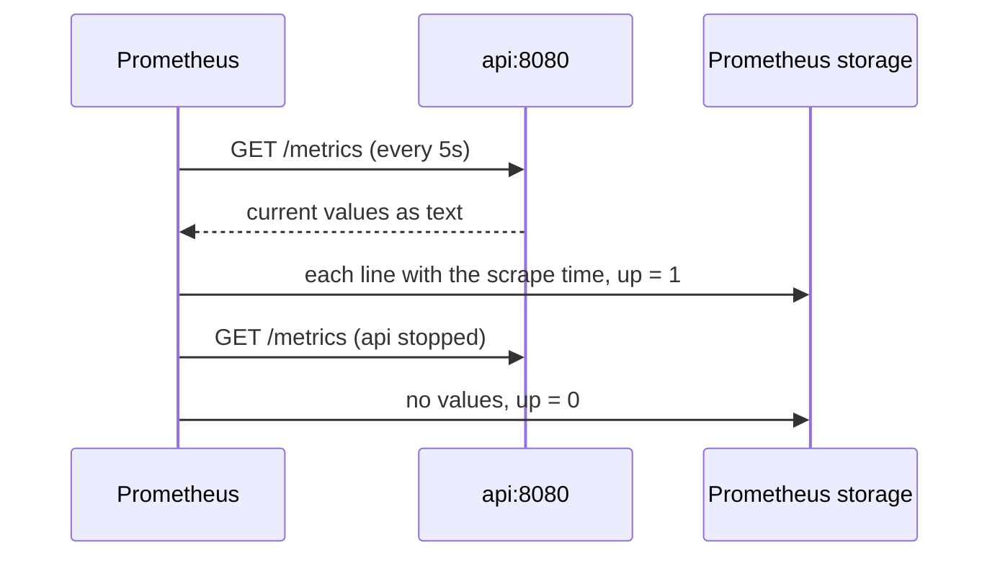

## Before you start

- [[devops.l2.metrics-endpoint]] — you know the API answers `GET /metrics` with the current value of every metric, one line per combination of label values, and never with a history.
- [[devops.l1.docker-networks]] — you know containers on the `donhang` network reach each other by service name, such as `api`, and your machine reaches them only through published ports.

## The situation

The monitoring services have been running since yesterday. Last night the API was stopped for ten minutes, and this morning the team wants to know exactly when. `/metrics` cannot tell you: it only gives the values of now, and while the API was stopped there was nothing to ask at all. The numbers are only useful if something asks for them again and again, writes each answer down with its time, and also writes down when nobody answered. What in Đơn Hàng does that, how often, and how does it record an API that does not answer?

## Core concepts

- **scrape** — Prometheus fetching a target's `/metrics` on a fixed schedule and storing the numbers it gets back with the time of the fetch.
- Target — an address Prometheus scrapes, such as `api:8080`, listed under a job name in its configuration file.
- `up` — a metric Prometheus records itself for every target: `1` when the last scrape succeeded, `0` when it failed.
- **time series** — the values of one metric with one set of label values, each stored with the time it was measured.
- **Compose profile** — a name on Compose services that leaves them out of a plain `docker compose up` unless that profile is requested.

## How it works



In the situation above, the thing that asks again and again is the Prometheus server. It scrapes: every `scrape_interval`, 5 seconds in Đơn Hàng, it sends `GET /metrics` to each target in its configuration and stores what comes back with the time of that scrape. The API does nothing new; it answers the request exactly as it answers `curl`. Prometheus pulls, the API never pushes.

Prometheus also writes down whether each scrape worked. For every target it records `up`: `1` when the last scrape got an answer it could read, `0` when it did not. When the API is stopped, the request fails, no numbers arrive, and `up` becomes `0`. A stopped API is not silence here; it is a `0` with a time.

Each value line of `/metrics` becomes its own time series. The `code="200"` and the `code="404"` lines from the previous lesson are two series of one metric, and each scrape adds one value with its scrape time to each. So every new combination of label values is one more series to store. A label whose values have no limit, such as an order id, creates a new series for every order.

Prometheus runs in Đơn Hàng only when you ask for it. Its service, like the other monitoring services in `docker-compose.yml`, carries `profiles: [monitoring]`, so a plain `docker compose up`, which `scripts/up.sh` runs, leaves it out; `docker compose --profile monitoring up -d` starts it too.

## In the Đơn Hàng system

Prometheus reads this file when it starts; `docker-compose.yml` mounts it into the `prometheus` container:

```yaml file=deploy/monitoring/prometheus.yml tag=stage-2 lines=1-11
# lesson: devops.l2.prometheus-scraping
# Every scrape_interval, Prometheus sends GET /metrics to each target below
# and stores the numbers it gets back with the time of the scrape. One job,
# api: the api's name and port on the donhang network.
global:
  scrape_interval: 5s

scrape_configs:
  - job_name: api
    static_configs:
      - targets: ["api:8080"]
```

`job_name: api` names the group of targets, and Prometheus puts that name on everything it scrapes from them as the label `job="api"`. The target is written without a path because `/metrics` is the path Prometheus asks for unless told otherwise. `api:8080` works because the `prometheus` container is on the `donhang` network, like the `api` container itself; Caddy is not involved.

The lesson's script runs on your machine. Its helpers are defined above this block.

They talk to Prometheus's own HTTP interface on `localhost:9090`, the port Compose publishes. `prometheus targets` sends `GET /api/v1/targets` there and gets back JSON about every target. `up_value` asks for the `up` value of job `api`. `wait_for_up` asks once a second until the value it wants appears. `jq` picks fields out of the JSON answers; the script runs it inside the `lab` container, so your machine needs no `jq` of its own:

```bash file=scripts/devops/prometheus-targets.sh tag=stage-2 lines=19-36
wait_for_up 1

# lesson: devops.l2.prometheus-scraping
echo "== GET /api/v1/targets: what Prometheus scrapes, and how the last scrape went"
prometheus targets | jq -r '.data.activeTargets[] | "  job=\(.labels.job) url=\(.scrapeUrl) interval=\(.scrapeInterval) health=\(.health)"'
echo
echo "== the query up{job=\"api\"}"
echo "  $(up_value)"
echo

echo "== the same query after docker compose stop api (and one more scrape)"
docker compose stop api 2>/dev/null
# Started again, and waited for until Prometheus scrapes it: the next
# script may send it requests at once.
trap 'docker compose start api 2>/dev/null && wait_for_up 1' EXIT
wait_for_up 0
echo "  $(up_value)"
prometheus targets | jq -r '.data.activeTargets[] | "  health=\(.health)"'
```

```text output=true
== GET /api/v1/targets: what Prometheus scrapes, and how the last scrape went
  job=api url=http://api:8080/metrics interval=5s health=up

== the query up{job="api"}
  1

== the same query after docker compose stop api (and one more scrape)
  0
  health=down
```

The first line is `prometheus.yml` as Prometheus understood it: one target, its full URL with `/metrics`, every 5 seconds, last scrape healthy. After `docker compose stop api`, the next scrape fails, `up` becomes `0` and the target is `down`. The `trap` line starts the API again when the script ends, and waits until `up` is `1` again.

## Beginners often think…

- **"Prometheus reads the API's log output to build its numbers."** → Actually it sends `GET /metrics` over the `donhang` network and reads the text that comes back; it never sees the container's output. You notice this when the targets list shows `url=http://api:8080/metrics`, an HTTP address, and nothing about containers or logs.
- **"If the API stops, its metrics just stop changing and Prometheus cannot tell that anything is wrong."** → Actually the failed scrape is itself recorded: `up` for that target becomes `0`, with the time. You notice this when you stop the API and `up{job="api"}` answers `0` within a few seconds, while the target shows `health=down`.
- **"Adding a label is free, so putting the customer id on a metric is a good way to get per-customer numbers."** → Actually each new label value is a new time series that Prometheus stores and scrapes from then on. A label with one value per customer or per order grows with your data, not with the number of things you want to watch. You notice this when the `/metrics` answer and Prometheus's storage keep growing as new customers arrive.

## Try it (3 minutes)

With Đơn Hàng running at stage-2, in a terminal at the repository root:

1. Run `docker compose --profile monitoring up -d` to start the monitoring services.
2. Run `scripts/devops/prometheus-targets.sh`. It stops the API for a few seconds and starts it again.

Expected result: the output matches the block above: one target `job=api` with `url=http://api:8080/metrics`, `interval=5s` and `health=up`, then `1`, then, after the API stops, `0` and `health=down`. At the end the script has started the API again.

## Connections

- [[devops.l2.metrics-endpoint]] — prerequisite: the endpoint Prometheus asks; this lesson adds the program that asks it on a schedule.
- [[devops.l1.docker-networks]] — why `api:8080` in `prometheus.yml` reaches the API: both containers are on the `donhang` network.
- [[devops.l2.why-monitoring]] — the problem from the start of the module, now solved for a stopped API: a `0` with a time instead of silence.
- [[devops.l2.counters-and-rate]] — the next step: querying the stored series to get requests per second.

## Five-line summary

1. Prometheus scrapes: every `scrape_interval` it sends `GET /metrics` to each target and stores the answer with the scrape time.
2. Đơn Hàng's `prometheus.yml` has one job, `api`, with one target, `api:8080` on the `donhang` network.
3. Prometheus records `up` per target, `1` after a successful scrape and `0` after a failed one, so a stopped API shows.
4. Each combination of metric name and label values is one time series, so a label like an order id adds one per order.
5. The monitoring services carry `profiles: [monitoring]`, so a plain `docker compose up` leaves them out and `docker compose --profile monitoring up -d` starts them too.
