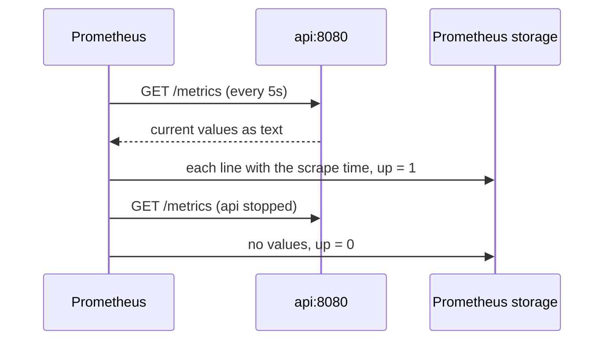

## Bạn cần biết trước

- [[devops.l2.metrics-endpoint]] — bạn biết API trả lời `GET /metrics` bằng giá trị hiện tại của mọi metric, mỗi tổ hợp giá trị label một dòng, và không bao giờ kèm lịch sử.
- [[devops.l1.docker-networks]] — bạn biết các container trên network `donhang` gọi nhau bằng tên service, như `api`, còn máy của bạn chỉ tới được chúng qua các cổng được publish.

## Tình huống

Các service monitoring đã chạy từ hôm qua. Đêm qua API bị dừng mười phút, và sáng nay team muốn biết chính xác lúc nào. `/metrics` không trả lời được: nó chỉ cho giá trị của hiện tại, và trong lúc API dừng thì chẳng có gì để hỏi cả. Các con số chỉ có ích nếu có thứ gì đó hỏi chúng hết lần này đến lần khác, ghi lại mỗi câu trả lời kèm thời điểm, và ghi lại cả những lúc không ai trả lời. Trong Đơn Hàng, thứ gì làm việc đó, bao lâu một lần, và nó ghi nhận một API không trả lời ra sao?

## Khái niệm cốt lõi

- **scrape** (việc Prometheus gọi /metrics của một target theo nhịp cố định để lấy số liệu) — Prometheus lấy `/metrics` của một target theo lịch cố định và lưu các con số nhận về kèm thời điểm lấy.
- Target — một địa chỉ mà Prometheus scrape, như `api:8080`, được ghi dưới một tên job trong file cấu hình của nó.
- `up` — một metric Prometheus tự ghi cho mỗi target: `1` khi lần scrape gần nhất thành công, `0` khi thất bại.
- **time series** (chuỗi giá trị của một metric với một bộ giá trị label, mỗi giá trị kèm thời điểm đo) — các giá trị của một metric với một bộ giá trị label, mỗi giá trị được lưu kèm thời điểm đo.
- **Compose profile** (tên gắn vào service trong Compose; service đó chỉ chạy khi profile được gọi tên) — một cái tên gắn vào các service Compose, khiến chúng bị bỏ qua khi chạy `docker compose up` thông thường, trừ khi profile đó được gọi.

## Cơ chế hoạt động



Trong tình huống trên, thứ hỏi đi hỏi lại chính là Prometheus server. Nó scrape: cứ mỗi `scrape_interval`, trong Đơn Hàng là 5 giây, nó gửi `GET /metrics` tới từng target trong cấu hình và lưu những gì nhận về kèm thời điểm của lần scrape đó. API không làm gì mới, nó trả lời request y như khi trả lời `curl`. Prometheus kéo về, API không bao giờ đẩy đi.

Prometheus còn ghi lại mỗi lần scrape có thành công không. Với mỗi target, nó ghi `up`: `1` khi lần scrape gần nhất nhận được câu trả lời đọc được, `0` khi không. Khi API dừng, request thất bại, không có con số nào về, và `up` thành `0`. Ở đây, API dừng không phải là sự im lặng, mà là một số `0` kèm thời điểm.

Mỗi dòng giá trị của `/metrics` trở thành một time series riêng. Dòng `code="200"` và dòng `code="404"` ở bài trước là hai series của cùng một metric, và mỗi lần scrape thêm vào mỗi series một giá trị kèm thời điểm scrape. Vậy nên mỗi tổ hợp giá trị label mới là thêm một series phải lưu. Một label có giá trị không giới hạn, như mã đơn hàng, sẽ tạo ra một series mới cho mỗi đơn.

Trong Đơn Hàng, Prometheus chỉ chạy khi bạn yêu cầu. Service của nó, cũng như các service monitoring khác trong `docker-compose.yml`, mang `profiles: [monitoring]`. Vì vậy lệnh `docker compose up` thông thường, lệnh mà `scripts/up.sh` chạy, bỏ qua nó, còn `docker compose --profile monitoring up -d` thì chạy cả nó.

## Trong hệ thống Đơn Hàng

Prometheus đọc file này khi khởi động, và `docker-compose.yml` mount nó vào container `prometheus`:

```yaml file=deploy/monitoring/prometheus.yml tag=stage-2 lines=1-11
# lesson: devops.l2.prometheus-scraping
# Every scrape_interval, Prometheus sends GET /metrics to each target below
# and stores the numbers it gets back with the time of the scrape. One job,
# api: the api's name and port on the donhang network.
global:
  scrape_interval: 5s

scrape_configs:
  - job_name: api
    static_configs:
      - targets: ["api:8080"]
```

`job_name: api` đặt tên cho nhóm target, và Prometheus gắn tên đó lên mọi thứ nó scrape từ các target này dưới dạng label `job="api"`. Target được viết không kèm path vì `/metrics` là path Prometheus hỏi khi không được chỉ định khác. `api:8080` gọi được vì container `prometheus` nằm trên network `donhang`, giống chính container `api`. Caddy không tham gia vào đây.

Script của bài chạy trên máy của bạn. Các hàm trợ giúp của nó được định nghĩa phía trên khối này.

Chúng nói chuyện với giao diện HTTP riêng của Prometheus ở `localhost:9090`, cổng mà Compose publish. `prometheus targets` gửi `GET /api/v1/targets` tới đó và nhận về JSON mô tả mọi target. `up_value` hỏi giá trị `up` của job `api`. `wait_for_up` hỏi mỗi giây một lần cho tới khi thấy giá trị nó chờ. `jq` lấy các field ra khỏi các câu trả lời JSON, và script chạy nó bên trong container `lab`, nên máy bạn không cần cài `jq`:

```bash file=scripts/devops/prometheus-targets.sh tag=stage-2 lines=19-36
wait_for_up 1

# lesson: devops.l2.prometheus-scraping
echo "== GET /api/v1/targets: what Prometheus scrapes, and how the last scrape went"
prometheus targets | jq -r '.data.activeTargets[] | "  job=\(.labels.job) url=\(.scrapeUrl) interval=\(.scrapeInterval) health=\(.health)"'
echo
echo "== the query up{job=\"api\"}"
echo "  $(up_value)"
echo

echo "== the same query after docker compose stop api (and one more scrape)"
docker compose stop api 2>/dev/null
# Started again, and waited for until Prometheus scrapes it: the next
# script may send it requests at once.
trap 'docker compose start api 2>/dev/null && wait_for_up 1' EXIT
wait_for_up 0
echo "  $(up_value)"
prometheus targets | jq -r '.data.activeTargets[] | "  health=\(.health)"'
```

```text output=true
== GET /api/v1/targets: what Prometheus scrapes, and how the last scrape went
  job=api url=http://api:8080/metrics interval=5s health=up

== the query up{job="api"}
  1

== the same query after docker compose stop api (and one more scrape)
  0
  health=down
```

Dòng đầu là `prometheus.yml` theo cách Prometheus hiểu: một target, URL đầy đủ có `/metrics`, 5 giây một lần, lần scrape gần nhất khỏe. Sau `docker compose stop api`, lần scrape kế tiếp thất bại, `up` thành `0` và target là `down`. Dòng `trap` khởi động lại API khi script kết thúc, rồi chờ tới khi `up` về lại `1`.

## Người mới hay nghĩ rằng…

- **"Prometheus đọc output log của API để dựng các con số."** → Thực ra nó gửi `GET /metrics` qua network `donhang` và đọc đoạn văn bản trả về, không bao giờ nhìn thấy output của container. Bạn sẽ nhận ra khi danh sách target hiện `url=http://api:8080/metrics`, một địa chỉ HTTP, không có gì về container hay log.
- **"Nếu API dừng, metric của nó chỉ đứng yên và Prometheus không biết có chuyện gì."** → Thực ra chính lần scrape thất bại được ghi lại, vì `up` của target đó thành `0`, kèm thời điểm. Bạn sẽ nhận ra khi dừng API và `up{job="api"}` trả `0` chỉ sau vài giây, còn target hiện `health=down`.
- **"Thêm label thì chẳng tốn gì, nên gắn mã khách hàng vào metric là cách hay để có số liệu theo từng khách."** → Thực ra mỗi giá trị label mới là một time series mới mà Prometheus phải lưu và scrape từ đó về sau. Một label có một giá trị cho mỗi khách hay mỗi đơn sẽ lớn dần theo dữ liệu, không theo số thứ bạn muốn theo dõi. Bạn sẽ nhận ra khi câu trả lời của `/metrics` và bộ lưu trữ của Prometheus cứ phình ra mỗi khi có khách mới.

## Thử ngay (3 phút)

Với Đơn Hàng đang chạy ở stage-2, trong terminal ở thư mục gốc của repository:

1. Chạy `docker compose --profile monitoring up -d` để bật các service monitoring.
2. Chạy `scripts/devops/prometheus-targets.sh`. Script dừng API vài giây rồi khởi động lại.

Kết quả mong đợi: output khớp với khối ở trên: một target `job=api` với `url=http://api:8080/metrics`, `interval=5s` và `health=up`, rồi `1`, rồi sau khi API dừng là `0` và `health=down`. Lúc kết thúc, script đã khởi động lại API.

## Liên hệ

- [[devops.l2.metrics-endpoint]] — kiến thức nền: endpoint mà Prometheus hỏi. Bài này thêm chương trình hỏi nó theo nhịp.
- [[devops.l1.docker-networks]] — lý do `api:8080` trong `prometheus.yml` tới được API: cả hai container đều ở trên network `donhang`.
- [[devops.l2.why-monitoring]] — vấn đề từ đầu module, giờ đã giải được cho trường hợp API dừng: một số `0` kèm thời điểm thay cho sự im lặng.
- [[devops.l2.counters-and-rate]] — bước tiếp theo: truy vấn các series đã lưu để ra số request mỗi giây.

## Tóm tắt 5 dòng

1. Prometheus scrape: mỗi `scrape_interval` nó gửi `GET /metrics` tới từng target và lưu câu trả lời kèm thời điểm scrape.
2. `prometheus.yml` của Đơn Hàng có một job là `api`, với một target là `api:8080` trên network `donhang`.
3. Prometheus ghi `up` cho từng target, `1` sau lần scrape thành công và `0` sau lần thất bại, nên API dừng là thấy ngay.
4. Mỗi tổ hợp tên metric và giá trị label là một time series, nên label như mã đơn hàng thêm một series cho mỗi đơn.
5. Các service monitoring mang `profiles: [monitoring]`, nên `docker compose up` thông thường bỏ qua chúng, còn `docker compose --profile monitoring up -d` chạy cả chúng.
