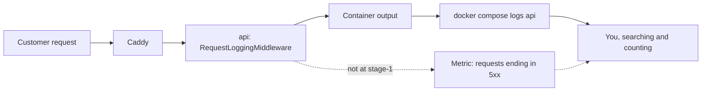

## Before you start

- [[backend.l1.structured-logging]] — you know `RequestLoggingMiddleware` logs `Method`, `Path`, `StatusCode` and `ElapsedMs` as named fields for each request, and that the console prints them as a sentence.
- [[devops.l1.compose-for-the-api]] — you know the `api` service in `docker-compose.yml` runs the API in a container named `donhang-api`, behind Caddy.

## The situation

On Saturday morning a customer writes to the shop: last night, every time she pressed "Place order", she got an error, so she gave up and bought elsewhere. Nobody on the team knew. You open a terminal, run `docker compose logs api`, and scroll through thousands of lines looking for last night. Even if you find the failed requests, you learn about them many hours late, and only because one customer bothered to write. Other customers who hit the same error may simply have left. How could the team have known that orders were failing while it was happening, without waiting for a customer to report it?

## Core concepts

- **monitoring** — collecting signals from a running system all the time, so that a problem becomes visible without a user having to report it.
- Container output — what the program inside a container writes to its console; Docker keeps it, and `docker compose logs api` prints what the `api` service wrote.
- Log line — the record of one event with its details; in Đơn Hàng, the line `RequestLoggingMiddleware` writes after each request.
- **metric** — one number measured again and again over time, such as how many requests so far ended with a `5xx` status.

## How it works



In the situation above, the only record of last night is the API's container output. Each request goes through Caddy, the reverse proxy in front of the API, to the `api` container; when the pipeline returns, `RequestLoggingMiddleware` writes one log line, Docker keeps it, and `docker compose logs api` prints it back. Nothing reads those lines until a person runs that command. Monitoring changes that: signals are collected all the time, so a problem is visible before anyone reports it. The dashed part of the diagram does not exist at stage-1.

A log line records one event with its details: method, path, status code, duration. A metric is one number measured again and again, for example how many requests so far ended with a `5xx` status.

How many requests failed in the last five minutes? From logs, you find every line in that window and count the matching ones, for example with `docker compose logs api --since 5m | grep -c "responded 5"`; `grep -c` counts the lines that contain the given text, so it matches `responded 500` and `responded 503` alike. That reads every line and counts only what was written. A metric already holds the count: as long as the API has not restarted in between (a restart starts the count again from zero), the answer is its value now minus its value five minutes ago.

The two also grow differently. The log gets one more event per request, so twice the traffic means twice the lines. A metric can be split by something it counts, such as status code; it then keeps one number for each value it has seen. A busier API changes those numbers, not how many there are: a metric's size depends on how many different things it counts, not on traffic.

## In the Đơn Hàng system

This is everything Đơn Hàng measures about its requests at stage-1:

```csharp file=DonHang.Api/Middleware/RequestLoggingMiddleware.cs tag=stage-1 lines=11-23
    public async Task InvokeAsync(HttpContext context)
    {
        var stopwatch = Stopwatch.StartNew();
        await next(context);
        stopwatch.Stop();

        logger.LogInformation(
            "{Method} {Path} responded {StatusCode} in {ElapsedMs}ms",
            context.Request.Method,
            context.Request.Path,
            context.Response.StatusCode,
            stopwatch.ElapsedMilliseconds);
    }
```

`await next(context)` runs the rest of the pipeline, and only when it returns does `LogInformation` write one event with four fields. So the API's only per-request signal is one `responded` event for each request that came back normally. If `next(context)` throws, the call is never reached and that request has no `responded` line; `ExceptionHandlingMiddleware`, registered before this middleware in `Program.cs`, catches and logs the exception instead. A request that never reaches the API leaves nothing here at all.

The name you give `docker compose logs` comes from `docker-compose.yml`:

```yaml file=docker-compose.yml tag=stage-1 lines=82-88
  api:
    build:
      context: .
      dockerfile: DonHang.Api/Dockerfile
    image: donhang-api:stage-1
    container_name: donhang-api
    hostname: api
```

`api` is the service name, and `donhang-api` is its container. Each request that comes back normally adds two lines to that container's output, because the console splits one event over them: `info: DonHang.Api.Middleware.RequestLoggingMiddleware[0]`, then, indented, a sentence such as `GET /api/v1/products responded 200 in 4ms`. Nothing in the `api` service sends that output anywhere else, and no other service in `docker-compose.yml` reads it on its own. Every question about last night starts with a person scrolling.

## Beginners often think…

- **"If the logs show no errors, the API is working fine."** → Actually the API can only log what reaches it. When the API is stopped, Caddy answers the request itself with an error, and the API's output says nothing about it, which looks exactly like a quiet night. You notice this when a customer reports errors at a time when `docker compose logs api` shows nothing at all.
- **"Metrics and logs are the same data; a metric is just a log drawn as a chart."** → Actually a metric keeps a number and drops the details, while a log line keeps the details of one event. The number tells you that failures went up; only the log lines tell you which path failed and with which request. You notice this when a count of `5xx` responses jumps and you still open the logs to find out why.
- **"Monitoring means somebody watches a screen all day."** → Actually the collecting is done by programs, all the time, whether anyone is looking or not. The value is that the numbers exist when you need them, including for a night nobody watched. You notice this when you ask what happened at two in the morning and the answer is already recorded.

## Try it (3 minutes)

With Đơn Hàng running (start it with `scripts/up.sh`), in a terminal at the repository root:

1. Run `docker compose stop api`.
2. Run `curl -s -o /dev/null -w "%{http_code}\n" http://localhost:8080/api/v1/products` twice; `curl` sends a `GET` request, and these options make it print only the response's status code.
3. Run `docker compose logs api --since 2m`, then `docker compose start api`.

Expected result: 2 — both requests print an error status from Caddy (a `5xx`, such as `502`): Caddy could not reach the API and answered for it. 3 — no line mentions your two requests.

If this had happened at night, which part of Đơn Hàng would have noticed, and what would a monitoring system do differently?

<details><summary>Suggested answer</summary>

Nothing in Đơn Hàng would have noticed. The API was stopped, so it wrote nothing, and a silent log looks the same as a night without customers. A monitoring system collects signals on its own schedule: when it cannot get an answer from the API, that failure is itself a signal, and a number of `5xx` responses can be read without scrolling through lines. The next lessons make the API publish its numbers and add the program that collects them.

</details>

## Connections

- [[backend.l1.structured-logging]] — the log side of the same request: fields that a later tool can read, here counted by hand.
- [[devops.l1.compose-for-the-api]] — prerequisite: the `api` service whose container output is the only signal at stage-1.
- [[devops.l2.metrics-endpoint]] — the next step: the API publishes its own numbers instead of leaving only log lines.
- [[devops.l2.json-logs]] — the other half: making the same log lines easy for a program to read.

## Five-line summary

1. Monitoring collects signals from a running system all the time, so a problem is visible before a user reports it.
2. At stage-1, the only per-request signal is one `RequestLoggingMiddleware` event per normally finished request, read with `docker compose logs api`.
3. A log line records one event with its details; a metric is one number measured again and again.
4. Counting failures from logs means finding and counting lines; a metric already holds the count.
5. Logs grow with every request, while a metric's size depends on how many different things it counts.
