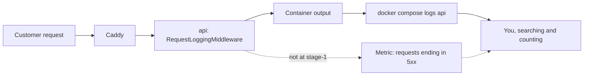

## Bạn cần biết trước

- [[backend.l1.structured-logging]] — bạn biết `RequestLoggingMiddleware` ghi `Method`, `Path`, `StatusCode` và `ElapsedMs` thành các field có tên cho mỗi request, và console in chúng ra thành một câu.
- [[devops.l1.compose-for-the-api]] — bạn biết service `api` trong `docker-compose.yml` chạy API trong một container tên `donhang-api`, đứng sau Caddy.

## Tình huống

Sáng thứ Bảy, một khách viết thư cho cửa hàng: tối qua, lần nào bấm "Đặt hàng" chị cũng gặp lỗi, nên chị bỏ cuộc và mua chỗ khác. Không ai trong team biết chuyện này. Bạn mở terminal, chạy `docker compose logs api` và cuộn qua hàng nghìn dòng để tìm tối qua. Dù có tìm ra các request lỗi, bạn cũng biết muộn nhiều giờ, và chỉ vì một khách chịu khó viết thư. Những khách khác gặp cùng lỗi có thể đã lặng lẽ bỏ đi. Làm sao team biết được đơn hàng đang lỗi ngay lúc nó xảy ra, mà không phải chờ khách báo?

## Khái niệm cốt lõi

- **monitoring** (liên tục thu tín hiệu từ hệ thống đang chạy để thấy sự cố mà không cần ai báo) — thu thập tín hiệu từ một hệ thống đang chạy mọi lúc, để sự cố lộ ra mà không cần người dùng phải báo.
- Output của container — những gì chương trình bên trong container ghi ra console; Docker giữ lại, và `docker compose logs api` in ra những gì service `api` đã ghi.
- Dòng log — bản ghi của một sự kiện kèm chi tiết; trong Đơn Hàng, đó là dòng `RequestLoggingMiddleware` ghi sau mỗi request.
- **metric** (một con số được đo lặp lại theo thời gian, vd. số request lỗi) — một con số được đo đi đo lại theo thời gian, chẳng hạn tính đến giờ có bao nhiêu request kết thúc với status `5xx`.

## Cơ chế hoạt động



Trong tình huống trên, thứ duy nhất ghi lại chuyện tối qua là output của container API. Mỗi request đi qua Caddy, reverse proxy đứng trước API, tới container `api`. Khi pipeline trả về, `RequestLoggingMiddleware` ghi một dòng log, Docker giữ dòng đó, và `docker compose logs api` in nó ra lại. Không gì đọc các dòng này cho tới khi có người chạy lệnh đó. Monitoring thay đổi điều ấy: tín hiệu được thu mọi lúc, nên sự cố lộ ra trước khi có ai báo. Phần nét đứt trong sơ đồ chưa có ở stage-1.

Dòng log ghi một sự kiện kèm chi tiết: method, path, status code, thời gian xử lý. Metric là một con số được đo đi đo lại, ví dụ tính đến giờ có bao nhiêu request kết thúc với status `5xx`.

Trong năm phút vừa qua có bao nhiêu request lỗi? Với log, bạn tìm mọi dòng trong khoảng đó rồi đếm những dòng khớp, chẳng hạn bằng `docker compose logs api --since 5m | grep -c "responded 5"`. `grep -c` đếm các dòng có chứa đoạn chữ đã cho, nên nó khớp cả `responded 500` lẫn `responded 503`. Cách này đọc mọi dòng và chỉ đếm được những gì đã được ghi. Metric thì đã giữ sẵn con số: miễn là API không khởi động lại ở giữa (khởi động lại thì con số đếm lại từ 0), câu trả lời là giá trị bây giờ trừ giá trị năm phút trước.

Hai loại tín hiệu này cũng lớn lên theo cách khác nhau. Log thêm một sự kiện cho mỗi request, nên traffic gấp đôi thì số dòng gấp đôi. Một metric có thể được tách theo thứ nó đếm, chẳng hạn status code, khi đó nó giữ một con số cho mỗi giá trị đã gặp. API bận hơn chỉ làm các con số đó đổi, không làm số lượng con số tăng lên: kích thước của metric phụ thuộc vào số thứ khác nhau mà nó đếm, không phụ thuộc vào traffic.

## Trong hệ thống Đơn Hàng

Đây là toàn bộ những gì Đơn Hàng đo về các request của mình ở stage-1:

```csharp file=DonHang.Api/Middleware/RequestLoggingMiddleware.cs tag=stage-1 lines=11-23
    public async Task InvokeAsync(HttpContext context)
    {
        var stopwatch = Stopwatch.StartNew();
        await next(context);
        stopwatch.Stop();

        logger.LogInformation(
            "{Method} {Path} responded {StatusCode} in {ElapsedMs}ms",
            context.Request.Method,
            context.Request.Path,
            context.Response.StatusCode,
            stopwatch.ElapsedMilliseconds);
    }
```

`await next(context)` chạy phần còn lại của pipeline, và chỉ khi nó trả về thì `LogInformation` mới ghi một sự kiện với bốn field. Vậy tín hiệu duy nhất theo từng request của API là một sự kiện `responded` cho mỗi request quay về bình thường. Nếu `next(context)` ném exception, lời gọi log không bao giờ chạy tới và request đó không có dòng `responded`. Thay vào đó, `ExceptionHandlingMiddleware`, được đăng ký trước middleware này trong `Program.cs`, bắt và ghi log exception. Request không bao giờ tới được API thì không để lại gì ở đây cả.

Cái tên bạn đưa cho `docker compose logs` đến từ `docker-compose.yml`:

```yaml file=docker-compose.yml tag=stage-1 lines=82-88
  api:
    build:
      context: .
      dockerfile: DonHang.Api/Dockerfile
    image: donhang-api:stage-1
    container_name: donhang-api
    hostname: api
```

`api` là tên service, còn `donhang-api` là container của nó. Mỗi request quay về bình thường thêm hai dòng vào output của container đó, vì console tách một sự kiện ra hai dòng: `info: DonHang.Api.Middleware.RequestLoggingMiddleware[0]`, rồi một câu thụt lề như `GET /api/v1/products responded 200 in 4ms`. Không có gì trong service `api` gửi output đó đi nơi khác, và không service nào khác trong `docker-compose.yml` tự đọc nó. Mọi câu hỏi về tối qua đều bắt đầu bằng một người ngồi cuộn log.

## Người mới hay nghĩ rằng…

- **"Nếu log không có lỗi thì API đang chạy ổn."** → Thực ra API chỉ ghi log được những gì tới được nó. Khi API bị dừng, Caddy tự trả lời request bằng một lỗi, còn output của API không có gì về request đó, trông y hệt một đêm vắng khách. Bạn sẽ nhận ra khi khách báo lỗi vào một lúc mà `docker compose logs api` không có dòng nào.
- **"Metric và log là cùng một dữ liệu; metric chỉ là log vẽ thành biểu đồ."** → Thực ra metric giữ một con số và bỏ đi chi tiết, còn dòng log giữ chi tiết của một sự kiện. Con số cho bạn biết lỗi đang tăng, chỉ các dòng log mới cho biết path nào lỗi và với request nào. Bạn sẽ nhận ra khi số response `5xx` vọt lên mà bạn vẫn phải mở log để tìm lý do.
- **"Monitoring nghĩa là có người ngồi nhìn màn hình cả ngày."** → Thực ra chương trình mới là thứ thu thập, mọi lúc, dù có ai nhìn hay không. Giá trị nằm ở chỗ các con số có sẵn khi bạn cần, kể cả cho một đêm không ai canh. Bạn sẽ nhận ra khi hỏi chuyện gì xảy ra lúc hai giờ sáng và câu trả lời đã được ghi lại từ trước.

## Thử ngay (3 phút)

Với Đơn Hàng đang chạy (khởi động bằng `scripts/up.sh`), trong terminal ở thư mục gốc của repository:

1. Chạy `docker compose stop api`.
2. Chạy `curl -s -o /dev/null -w "%{http_code}\n" http://localhost:8080/api/v1/products` hai lần. `curl` gửi một request `GET`, và các tùy chọn này khiến nó chỉ in ra status code của response.
3. Chạy `docker compose logs api --since 2m`, rồi `docker compose start api`.

Kết quả mong đợi: 2 — cả hai request đều in ra một status lỗi từ Caddy (một mã `5xx`, chẳng hạn `502`): Caddy không tới được API nên tự trả lời thay. 3 — không dòng nào nhắc tới hai request của bạn.

Nếu chuyện này xảy ra ban đêm, phần nào của Đơn Hàng sẽ nhận ra, và một hệ thống monitoring sẽ làm gì khác?

<details><summary>Gợi ý đáp án</summary>

Không phần nào của Đơn Hàng nhận ra cả. API đã dừng nên không ghi gì, và một log im lặng trông giống hệt một đêm không có khách. Hệ thống monitoring tự thu tín hiệu theo lịch của nó: khi không nhận được câu trả lời từ API, chính sự thất bại đó đã là một tín hiệu, và số response `5xx` đọc được ngay mà không phải cuộn qua từng dòng. Các bài tiếp theo cho API công bố các con số của mình và thêm chương trình thu thập chúng.

</details>

## Liên hệ

- [[backend.l1.structured-logging]] — mặt log của cùng một request: các field mà công cụ sau này đọc được, ở đây được đếm bằng tay.
- [[devops.l1.compose-for-the-api]] — kiến thức nền: service `api` có output container là tín hiệu duy nhất ở stage-1.
- [[devops.l2.metrics-endpoint]] — bước tiếp theo: API tự công bố các con số của mình thay vì chỉ để lại dòng log.
- [[devops.l2.json-logs]] — nửa còn lại: làm cho chính các dòng log đó dễ đọc với một chương trình.

## Tóm tắt 5 dòng

1. Monitoring thu tín hiệu từ hệ thống đang chạy mọi lúc, nên sự cố lộ ra trước khi người dùng báo.
2. Ở stage-1, tín hiệu duy nhất theo từng request là một sự kiện `RequestLoggingMiddleware` cho mỗi request kết thúc bình thường, đọc bằng `docker compose logs api`.
3. Dòng log ghi một sự kiện kèm chi tiết; metric là một con số được đo đi đo lại.
4. Đếm lỗi từ log nghĩa là tìm và đếm từng dòng; metric đã giữ sẵn con số đó.
5. Log lớn lên theo mỗi request, còn kích thước của metric phụ thuộc vào số thứ khác nhau mà nó đếm.
