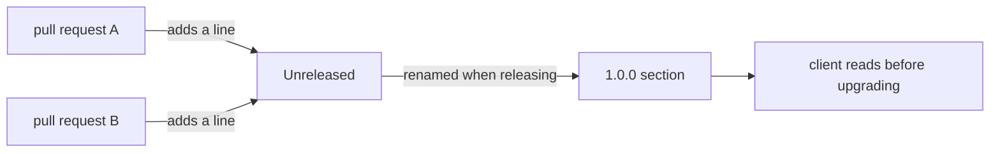

## Before you start

- [[devops.l2.semantic-versioning]] — you know a MAJOR version warns clients that something they use has broken.
- [[foundation.l2.good-commits]] — you know a commit message explains one change and why, for the developers reading the history.

## The situation

The app team sees that Đơn Hàng's API went from version 0.1.0 to 1.0.0. The jump to 1.0.0 tells them the API is now declared, but not what changed on the way. One of them reads the commits between stage-1 and stage-2: 35 subjects, about tests, scripts, Keycloak, captured script outputs and more. None of them says that `POST /api/v1/auth/login` no longer exists, yet that endpoint is how their app signs in. They ask you where, before upgrading, they could have read what changed for them, in words about the API rather than about the code. Where does that list live, and who writes it?

## Core concepts

- **changelog** — a file listing, for each released version, the changes that matter to the people who use the software.
- Keep a Changelog — a common format for that file: newest version first, an Unreleased section on top, and entries grouped by type of change.
- Unreleased section — the part at the top where changes merged since the last release wait for the next version number.
- Change types — headings that group entries, such as Added, Changed, Removed and Fixed.

## How it works



In the situation above, the list the app team needed is Đơn Hàng's changelog, the file `CHANGELOG.md` at the root of the repository. For each released version, newest first, it lists the changes that matter to the people who call the API or use the app.

It follows the Keep a Changelog format. Each version is a `##` heading with its number. Under it, entries are grouped by type: Added for new features, Changed for changes to existing behaviour, Removed for things that are gone, Fixed for bug fixes. Above all versions sits `## [Unreleased]`.

The file states its own rule: each pull request that changes behaviour adds its line under Unreleased. So the line is written while the author still knows exactly what changed for clients. Whoever prepares a release renames that section to the new version number, by hand, before the release. Nobody has to rebuild months of work from memory on release day.

A changelog is not the commit log. Commit messages explain each change to developers: what was done in the code and why. A changelog entry sums up what a user of the version notices, often across many commits. The removal of the login endpoint happened inside a commit about Keycloak; its subject never mentions login, but the changelog does.

Some teams generate the file from commit messages written in a fixed format, with tools made for that. Đơn Hàng writes it by hand, which costs a line per pull request and keeps each entry in the reader's words.

## In the Đơn Hàng system

The top of `CHANGELOG.md`:

```markdown file=CHANGELOG.md tag=stage-2 lines=1-9
# Changelog

What changed in each version of Đơn Hàng, for the people who call its API or
use its app. Newest version first. The format follows Keep a Changelog, and
version numbers follow Semantic Versioning 2.0.0.

Each pull request that changes behaviour adds a line under Unreleased. A
release renames that section to the new version (see
`.github/workflows/release.yml`).
```

The opening paragraph names its readers, the order and the two conventions. After the rule paragraph come the heading `## [Unreleased]`, empty because nothing has been merged since 1.0.0, and then `## [1.0.0] - 2026-09-27`. The `(see .github/workflows/release.yml)` is loose: that workflow reads the version's section to publish it with the release, as the next lesson shows, while the renaming is done by hand.

Further down, the end of the 1.0.0 entry:

```markdown file=CHANGELOG.md tag=stage-2 lines=58-66
### Removed

- `POST /api/v1/auth/login`. Get an access token from Keycloak instead and
  send it as before, in `Authorization: Bearer`.

### Fixed

- Cancelling an order that has already shipped answers `409`
  (`already-shipped`) instead of cancelling it.
```

Removed is exactly what the app team needed: the endpoint is gone, and the line says what to do instead. Fixed is listed too, because a client that used to cancel shipped orders will now see `409`. The next heading in the file, `## [0.1.0] - 2026-09-26`, is the older version, below the newer one.

## Beginners often think…

- **"The changelog is just `git log` pasted into a file at release time."** → Actually commits describe code steps for developers, while a changelog entry says what a user of the version notices, often across many commits. You notice this when a pasted log lists test and script commits, and the fact a client needed sits only in commit bodies, in developer terms.
- **"Only new features belong in a changelog; fixes and removals are too small to mention."** → Actually removals are what break clients, and fixes change behaviour someone may have relied on. You notice this when an app stops signing in after an upgrade whose notes listed only new features.

## Try it (3 minutes)

In your Đơn Hàng folder at stage-2, in Git Bash:

1. Run `git log --oneline stage-1..stage-2 | wc -l`. The range means the commits after stage-1 up to stage-2, one per line, and `wc -l` counts the lines.
2. Run `git log --oneline stage-1..stage-2 | grep -ci login`; `-c` counts matching lines and `-i` ignores case.
3. Run `grep -n "auth/login" CHANGELOG.md`; `-n` prints each match's line number.
4. Think: which of the two places would have warned the app team faster?

Expected result: step 1 prints `35`, the commits between the two stages. Step 2 prints `0`: no commit subject mentions login. Step 3 prints two lines: line 60, under Removed in 1.0.0, and line 72, where 0.1.0 added the endpoint.

<details><summary>Suggested answer</summary>

The commit subjects describe the work, so the removal hides inside a commit about Keycloak. The changelog states it for the reader who calls the API, and its version heading says when it happened.

</details>

## Connections

- [[devops.l2.semantic-versioning]] — prerequisite: the number says how risky an upgrade is, the changelog says what changed.
- [[foundation.l2.good-commits]] — the other kind of message: commits explain code to developers, entries explain versions to users.
- [[backend.l2.breaking-changes]] — the changes a Removed or Changed entry must never leave out.
- [[devops.l2.cutting-a-release]] — next: the release that copies a version's entry into its release notes.

## Five-line summary

1. A changelog lists, per released version and newest first, the changes that matter to the people using the software.
2. Đơn Hàng's `CHANGELOG.md` follows Keep a Changelog: Added, Changed, Removed and Fixed under each version, Unreleased on top.
3. Each pull request that changes behaviour adds its line under Unreleased, so preparing a release means renaming that section.
4. The 1.0.0 entry lists `POST /api/v1/auth/login` under Removed and says what clients should use instead.
5. A commit explains a code step to developers; a changelog entry says what a user of the version notices.
