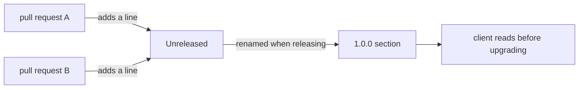

## Bạn cần biết trước

- [[devops.l2.semantic-versioning]] — bạn biết một phiên bản MAJOR báo cho client rằng thứ họ đang dùng đã bị phá vỡ.
- [[foundation.l2.good-commits]] — bạn biết thông điệp commit giải thích một thay đổi và lý do, cho các lập trình viên đọc lịch sử.

## Tình huống

Nhóm app thấy API của Đơn Hàng đã đi từ phiên bản 0.1.0 lên 1.0.0. Bước nhảy lên 1.0.0 cho họ biết API giờ đã được khai báo, nhưng không cho biết những gì đã đổi trên đường đi. Một bạn trong nhóm đọc các commit giữa stage-1 và stage-2: 35 tiêu đề, về test, script, Keycloak, output đã chụp của script và nhiều thứ khác. Không tiêu đề nào nói rằng `POST /api/v1/auth/login` không còn nữa, trong khi app của họ đăng nhập bằng chính endpoint đó. Họ hỏi bạn: trước khi nâng cấp, họ có thể đọc ở đâu những gì đã đổi với họ, bằng lời về API chứ không phải về code? Danh sách đó nằm ở đâu, và ai viết nó?

## Khái niệm cốt lõi

- **changelog** (file liệt kê, theo từng phiên bản đã phát hành, những thay đổi người dùng cần biết) — một file liệt kê, cho mỗi phiên bản đã phát hành, những thay đổi quan trọng với người dùng phần mềm.
- Keep a Changelog — một định dạng phổ biến cho file đó: phiên bản mới nhất ở trên, một mục Unreleased trên cùng, và các dòng được nhóm theo loại thay đổi.
- Mục Unreleased — phần trên cùng, nơi các thay đổi đã merge từ lần phát hành trước chờ số phiên bản kế tiếp.
- Loại thay đổi — các tiêu đề dùng để nhóm các dòng, như Added, Changed, Removed và Fixed.

## Cơ chế hoạt động



Trong tình huống trên, danh sách mà nhóm app cần chính là changelog của Đơn Hàng, file `CHANGELOG.md` ở thư mục gốc của repository. Với mỗi phiên bản đã phát hành, mới nhất trước, nó liệt kê những thay đổi quan trọng với người gọi API hoặc người dùng app.

File theo định dạng Keep a Changelog. Mỗi phiên bản là một tiêu đề `##` kèm số phiên bản. Bên dưới, các dòng được nhóm theo loại: Added cho tính năng mới, Changed cho thay đổi hành vi hiện có, Removed cho thứ đã bị bỏ, Fixed cho các bản sửa lỗi. Trên mọi phiên bản là `## [Unreleased]`.

File tự nêu quy tắc của nó: mỗi pull request đổi hành vi thêm dòng của mình dưới Unreleased. Nhờ vậy dòng đó được viết khi người viết còn biết rõ điều gì đã đổi với client. Người chuẩn bị bản phát hành đổi tên mục đó thành số phiên bản mới, bằng tay, trước khi phát hành. Không ai phải lục trí nhớ dựng lại công việc của nhiều tháng vào ngày phát hành.

Changelog không phải commit log. Thông điệp commit giải thích từng thay đổi cho lập trình viên: đã làm gì trong code và vì sao. Một dòng changelog tóm tắt điều người dùng phiên bản đó nhận thấy, thường gộp nhiều commit. Việc xóa endpoint đăng nhập nằm trong một commit về Keycloak; tiêu đề commit không hề nhắc tới login, nhưng changelog thì có.

Có nhóm sinh file này từ thông điệp commit viết theo một định dạng cố định, bằng các công cụ làm riêng cho việc đó. Đơn Hàng viết tay, tốn một dòng cho mỗi pull request và giữ mỗi dòng bằng ngôn ngữ của người đọc.

## Trong hệ thống Đơn Hàng

Phần đầu của `CHANGELOG.md`:

```markdown file=CHANGELOG.md tag=stage-2 lines=1-9
# Changelog

What changed in each version of Đơn Hàng, for the people who call its API or
use its app. Newest version first. The format follows Keep a Changelog, and
version numbers follow Semantic Versioning 2.0.0.

Each pull request that changes behaviour adds a line under Unreleased. A
release renames that section to the new version (see
`.github/workflows/release.yml`).
```

Đoạn mở đầu nêu người đọc, thứ tự và hai quy ước. Sau đoạn quy tắc là tiêu đề `## [Unreleased]`, đang trống vì chưa có gì được merge từ 1.0.0, rồi tới `## [1.0.0] - 2026-09-27`. Chỗ `(see .github/workflows/release.yml)` viết hơi lỏng: workflow đó đọc mục của phiên bản để đăng kèm bản phát hành, như bài sau sẽ cho thấy, còn việc đổi tên thì làm bằng tay.

Xuống dưới, phần cuối của mục 1.0.0:

```markdown file=CHANGELOG.md tag=stage-2 lines=58-66
### Removed

- `POST /api/v1/auth/login`. Get an access token from Keycloak instead and
  send it as before, in `Authorization: Bearer`.

### Fixed

- Cancelling an order that has already shipped answers `409`
  (`already-shipped`) instead of cancelling it.
```

Removed đúng là thứ nhóm app cần: endpoint đã mất, và dòng đó nói phải làm gì thay thế. Fixed cũng được ghi, vì client nào trước đây hủy được đơn đã giao giờ sẽ nhận `409`. Tiêu đề kế tiếp trong file, `## [0.1.0] - 2026-09-26`, là phiên bản cũ hơn, nằm dưới phiên bản mới hơn.

## Người mới hay nghĩ rằng…

- **"Changelog chỉ là `git log` dán vào một file lúc phát hành."** → Thực ra commit mô tả các bước code cho lập trình viên, còn một dòng changelog nói điều người dùng phiên bản đó nhận thấy, thường gộp nhiều commit. Bạn sẽ nhận ra khi log được dán vào toàn commit về test và script, còn điều client cần biết chỉ nằm trong phần thân commit, bằng ngôn ngữ của lập trình viên.
- **"Chỉ tính năng mới mới đáng ghi vào changelog; sửa lỗi và xóa bỏ thì quá nhỏ để nhắc."** → Thực ra việc xóa bỏ mới là thứ làm hỏng client, và bản sửa lỗi đổi hành vi mà có người có thể đã dựa vào. Bạn sẽ nhận ra khi app không đăng nhập được nữa sau một lần nâng cấp mà ghi chú chỉ liệt kê tính năng mới.

## Thử ngay (3 phút)

Trong thư mục Đơn Hàng ở stage-2, mở Git Bash:

1. Chạy `git log --oneline stage-1..stage-2 | wc -l`. Khoảng này nghĩa là các commit sau stage-1 cho tới stage-2, mỗi commit một dòng, và `wc -l` đếm số dòng.
2. Chạy `git log --oneline stage-1..stage-2 | grep -ci login`; `-c` đếm số dòng khớp và `-i` bỏ qua hoa thường.
3. Chạy `grep -n "auth/login" CHANGELOG.md`; `-n` in số dòng của mỗi chỗ khớp.
4. Nghĩ xem: chỗ nào trong hai chỗ trên sẽ báo cho nhóm app sớm hơn?

Kết quả mong đợi: bước 1 in `35`, số commit giữa hai stage. Bước 2 in `0`: không tiêu đề commit nào nhắc tới login. Bước 3 in hai dòng: dòng 60, dưới Removed của 1.0.0, và dòng 72, nơi 0.1.0 thêm endpoint này.

<details><summary>Gợi ý đáp án</summary>

Tiêu đề commit mô tả công việc, nên việc xóa bị giấu trong một commit về Keycloak. Changelog nói rõ điều đó cho người gọi API, và tiêu đề phiên bản cho biết nó xảy ra khi nào.

</details>

## Liên hệ

- [[devops.l2.semantic-versioning]] — điều kiện tiên quyết: con số cho biết lần nâng cấp rủi ro ra sao, changelog cho biết cái gì đã đổi.
- [[foundation.l2.good-commits]] — loại thông điệp còn lại: commit giải thích code cho lập trình viên, dòng changelog giải thích phiên bản cho người dùng.
- [[backend.l2.breaking-changes]] — những thay đổi mà một dòng Removed hay Changed không bao giờ được bỏ sót.
- [[devops.l2.cutting-a-release]] — bài kế: bản phát hành chép mục của một phiên bản vào ghi chú phát hành của nó.

## Tóm tắt 5 dòng

1. Changelog liệt kê, theo từng phiên bản đã phát hành và mới nhất trước, những thay đổi quan trọng với người dùng phần mềm.
2. `CHANGELOG.md` của Đơn Hàng theo Keep a Changelog: Added, Changed, Removed và Fixed dưới mỗi phiên bản, Unreleased trên cùng.
3. Mỗi pull request đổi hành vi thêm dòng của nó dưới Unreleased, nên chuẩn bị phát hành chỉ là đổi tên mục đó.
4. Mục 1.0.0 ghi `POST /api/v1/auth/login` dưới Removed và nói client nên dùng gì thay thế.
5. Commit giải thích một bước code cho lập trình viên; dòng changelog nói điều người dùng phiên bản đó nhận thấy.
