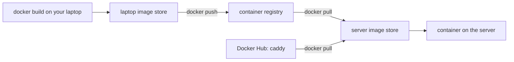

## Before you start

- [[devops.l2.building-images-in-ci]] — you know CI builds the API image once per run, and that other machines need it from a server.
- [[devops.l1.image-vs-container]] — you know an image is the template a container runs from, and that `caddy:2.10.0` is a name followed by a tag.

## The situation

A teammate wants to try Đơn Hàng's API on a spare server, without cloning the repository. You tell her the image name from your laptop, `donhang-api:stage-1`, and she runs `docker pull donhang-api:stage-1`. It fails: "pull access denied for donhang-api, repository does not exist or may require 'docker login'". Yet on the same server, `docker pull caddy:2.10.0` works at once, and she never built Caddy either. On your laptop both names run fine. Where does an image come from when a machine did not build it, and why can her server find one image but not the other?

## Core concepts

- **container registry** — a server that stores images by name and tag, so any machine that can reach it can download them.
- Pull — `docker pull` downloads an image from a registry into the machine's own image store.
- Push — `docker push` uploads an image from the machine's image store to a registry.
- Local image store — the images Docker keeps on one machine's disk; with Docker Desktop's default builder, the part of Docker that runs builds, `docker build` puts its result here and uploads it nowhere.
- Docker Hub — the public registry at `docker.io`; Docker asks it whenever an image name has no registry host.
- Registry host — the first part of an image name when it is a host name, such as `mcr.microsoft.com`; it says which registry holds the image.

## How it works



Read the diagram's top path first: you build on your laptop and push, then the server pulls and runs. The bottom arrow is the same kind of pull, from Docker Hub, which is a container registry too.

In the situation above, Caddy reached the server because someone had pushed it to Docker Hub. The name `caddy:2.10.0` has no host in front, so Docker reads it as `docker.io/library/caddy:2.10.0`, where `library` is the part of Docker Hub that holds its official images. `docker pull` downloaded the image into the server's local image store, and `docker run` starts containers from there.

When the first part of a name is a host name, that part names the registry instead. `mcr.microsoft.com/dotnet/sdk:10.0` comes from Microsoft's registry, and `lscr.io/linuxserver/openssh-server`, the base of the lab box, from the registry at `lscr.io`.

`donhang-api:stage-1` has no host either, so the server asked Docker Hub, which has no such image. In that error, "repository" means an image name on a registry, not a Git repository. The image exists only in your laptop's store: building and pushing are separate commands, and the lab at stage-1 never pushes.

A registry stores images; it runs nothing. Containers run on the machine whose Docker started them, and `docker run` pulls only when that machine's store lacks the image.

So, short of copying an image file by hand with `docker save` and `docker load`, a machine can run an image it did not build only after someone pushes it to a registry the machine can reach. That includes CI: a GitHub-hosted runner is a fresh machine, thrown away when its job ends, so a job's image goes with it unless a step saves it as an artifact or pushes it.

## In the Đơn Hàng system

The first lines of the API's Dockerfile:

```dockerfile file=DonHang.Api/Dockerfile tag=stage-1 lines=1-5
# lesson: devops.l1.dockerfile-for-dotnet
# lesson: devops.l1.multi-stage-builds
# Stage 1 has the SDK and builds the app; stage 2 only copies the result into
# a smaller runtime image. The final image never contains the SDK or source.
FROM mcr.microsoft.com/dotnet/sdk:10.0 AS build
```

The `FROM` line names the image this build starts from, with a registry host, `mcr.microsoft.com`. The SDK image holds the tools that compile the API; the runtime image in a later `FROM` only runs it. On a machine that lacks the SDK image, Docker pulls it from Microsoft's registry before building. Every image the lab uses but does not build arrives this way: `caddy:2.10.0` and `postgres:17.6-alpine` from Docker Hub, the SDK and runtime images from `mcr.microsoft.com`, the lab box's base from `lscr.io`.

The API's own image is different:

```yaml file=docker-compose.yml tag=stage-1 lines=81-86
  # lesson: devops.l1.compose-for-the-api
  api:
    build:
      context: .
      dockerfile: DonHang.Api/Dockerfile
    image: donhang-api:stage-1
```

Compose, the tool that reads `docker-compose.yml`, builds `api` from `DonHang.Api/Dockerfile` and names the result `donhang-api:stage-1`. The name has no registry host, and no file at stage-1 pushes it anywhere. So each learner's machine builds its own copy when `scripts/up.sh` starts Compose with `--build`, and the name means "the copy on this machine". To run it on the teammate's server without a build there, it has to be pushed to a registry the team can write to, under a name that points there, then pulled; the next lessons use a name that starts with the registry's host. The lessons after this one do that from CI.

## Beginners often think…

- **"`docker run` always downloads the image from the internet before starting it."** → Actually `docker run` uses the image already in the machine's local image store and pulls only when the image is missing there. You notice this when `docker run caddy:2.10.0` on a machine that already has the image starts at once, with no download lines.
- **"An image I build with `docker build` is uploaded to Docker Hub automatically."** → Actually `docker build` writes only to the local image store; uploading takes a separate `docker push`, to a registry you are allowed to write to. You notice this when a teammate's `docker pull` of your image fails with "pull access denied".
- **"A registry is where Docker keeps the containers it is running."** → Actually a registry stores images and runs nothing; containers run on the machine whose Docker started them. You notice this when `docker ps`, which lists the containers running on your laptop, shows `donhang-api` although no registry has ever heard of that image.

## Try it (3 minutes)

With Docker running, as for the lab, and the stage-1 lab built once, in a terminal:

1. Run `docker pull caddy:2.10.0` and read its last line.
2. Run `docker pull donhang-api:stage-1`.
3. Run `docker image ls donhang-api`.

Expected result: step 1 ends with `docker.io/library/caddy:2.10.0`, the full name with Docker Hub's host. Step 2 fails with "pull access denied for donhang-api, repository does not exist or may require 'docker login'". Step 3 still lists `donhang-api` with tag `stage-1`: the image exists, but only in your local image store.

<details><summary>Suggested answer</summary>

Step 2 fails because the name has no registry host, so Docker asks Docker Hub, and nobody pushed `donhang-api` there. Your build put the image in your own store only. The teammate's server could run it after a push to a registry it can reach, followed by a pull.

</details>

## Connections

- [[devops.l2.building-images-in-ci]] — the image CI builds once per run; a registry is the server that lets machines outside the run use it.
- [[devops.l1.image-vs-container]] — the same image and container split, now seen across machines: images travel through a registry, containers stay where they run.
- [[devops.l2.image-tags-and-digests]] — next: what the tag after the colon promises, and what it does not.
- [[devops.l2.pushing-images-from-ci]] — where Đơn Hàng starts pushing its API image to a registry from CI.

## Five-line summary

1. A container registry stores images by name and tag; machines pull images from it and push images to it.
2. The first part of an image name, when it is a host such as `mcr.microsoft.com`, names the registry.
3. A name with no host, such as `caddy:2.10.0`, comes from Docker Hub.
4. `docker build` keeps its image on the building machine; `donhang-api:stage-1` was never pushed, so no registry has it.
5. Short of copying an image file by hand, another machine runs an image it did not build only after a push to a reachable registry.
