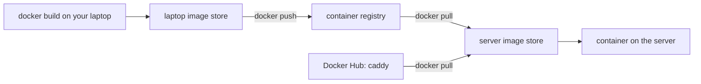

## Bạn cần biết trước

- [[devops.l2.building-images-in-ci]] — bạn biết CI build image API một lần mỗi lần chạy, và các máy khác cần lấy nó từ một server.
- [[devops.l1.image-vs-container]] — bạn biết image là khuôn mẫu để container chạy, và `caddy:2.10.0` là một cái tên theo sau là một tag.

## Tình huống

Một đồng nghiệp muốn thử API của Đơn Hàng trên một server dự phòng, không clone repository. Bạn đưa cô ấy tên image trên laptop của mình, `donhang-api:stage-1`, và cô chạy `docker pull donhang-api:stage-1`. Lệnh báo lỗi: "pull access denied for donhang-api, repository does not exist or may require 'docker login'". Thế nhưng trên cùng server đó, `docker pull caddy:2.10.0` chạy được ngay, dù cô cũng chưa từng build Caddy. Trên laptop của bạn, cả hai tên đều chạy tốt. Khi một máy không tự build image, image đến từ đâu, và vì sao server của cô tìm được image này mà không tìm được image kia?

## Khái niệm cốt lõi

- **container registry** (server lưu image theo tên và tag; máy khác pull image từ đó, CI push image lên đó) — một server lưu image theo tên và tag, để bất kỳ máy nào kết nối tới được đều tải chúng về được.
- Pull — `docker pull` tải một image từ registry về kho image của chính máy đó.
- Push — `docker push` tải một image từ kho image của máy lên một registry.
- Kho image cục bộ — các image mà Docker giữ trên đĩa của một máy. Với builder mặc định của Docker Desktop, tức phần của Docker chạy các lần build, `docker build` đặt kết quả vào đây và không tải lên đâu cả.
- Docker Hub — registry công khai ở `docker.io`. Docker hỏi nó mỗi khi tên image không có host của registry.
- Host của registry — phần đầu của tên image khi phần đó là một tên host, như `mcr.microsoft.com`. Nó cho biết registry nào giữ image.

## Cơ chế hoạt động



Hãy đọc đường phía trên của sơ đồ trước: bạn build trên laptop rồi push, sau đó server pull về và chạy. Mũi tên phía dưới cũng là một lần pull như vậy, từ Docker Hub, vốn cũng là một container registry.

Trong tình huống trên, Caddy tới được server vì đã có người push nó lên Docker Hub. Tên `caddy:2.10.0` không có host phía trước, nên Docker hiểu nó là `docker.io/library/caddy:2.10.0`, trong đó `library` là phần của Docker Hub chứa các image chính thức. `docker pull` tải image về kho image cục bộ của server, và `docker run` khởi động container từ đó.

Khi phần đầu của tên là một tên host, phần đó cho biết registry. `mcr.microsoft.com/dotnet/sdk:10.0` đến từ registry của Microsoft, còn `lscr.io/linuxserver/openssh-server`, image nền của lab box, đến từ registry ở `lscr.io`.

`donhang-api:stage-1` cũng không có host, nên server hỏi Docker Hub, nơi không có image nào như vậy. Trong thông báo lỗi đó, "repository" là tên một image trên registry, không phải repository Git. Image này chỉ có trong kho của laptop bạn: build và push là hai lệnh riêng, và lab ở stage-1 không bao giờ push.

Registry lưu image, nó không chạy gì cả. Container chạy trên máy có Docker đã khởi động chúng, và `docker run` chỉ pull khi kho của máy đó thiếu image.

Vậy, trừ cách chép tay một file image bằng `docker save` và `docker load`, một máy chỉ chạy được image nó không tự build sau khi có người push image đó lên một registry mà máy kết nối tới được. CI cũng vậy: runner do GitHub cấp là một máy mới, bị bỏ đi khi job kết thúc, nên image của job mất theo, trừ khi có bước lưu nó thành artifact hoặc push nó lên.

## Trong hệ thống Đơn Hàng

Những dòng đầu trong Dockerfile của API:

```dockerfile file=DonHang.Api/Dockerfile tag=stage-1 lines=1-5
# lesson: devops.l1.dockerfile-for-dotnet
# lesson: devops.l1.multi-stage-builds
# Stage 1 has the SDK and builds the app; stage 2 only copies the result into
# a smaller runtime image. The final image never contains the SDK or source.
FROM mcr.microsoft.com/dotnet/sdk:10.0 AS build
```

Dòng `FROM` nêu image mà lần build này bắt đầu từ đó, kèm host của registry là `mcr.microsoft.com`. Image SDK chứa công cụ để biên dịch API, còn image runtime ở một dòng `FROM` phía sau chỉ để chạy nó. Trên máy chưa có image SDK, Docker pull nó từ registry của Microsoft trước khi build. Mọi image mà lab dùng nhưng không tự build đều đến theo cách này: `caddy:2.10.0` và `postgres:17.6-alpine` từ Docker Hub, image SDK và runtime từ `mcr.microsoft.com`, image nền của lab box từ `lscr.io`.

Image của chính API thì khác:

```yaml file=docker-compose.yml tag=stage-1 lines=81-86
  # lesson: devops.l1.compose-for-the-api
  api:
    build:
      context: .
      dockerfile: DonHang.Api/Dockerfile
    image: donhang-api:stage-1
```

Compose, công cụ đọc `docker-compose.yml`, build `api` từ `DonHang.Api/Dockerfile` và đặt tên kết quả là `donhang-api:stage-1`. Tên này không có host của registry, và ở stage-1 không file nào push nó đi đâu. Vì vậy máy của mỗi học viên tự build bản riêng khi `scripts/up.sh` khởi động Compose với `--build`, và cái tên này mang nghĩa "bản trên máy này". Muốn chạy nó trên server của đồng nghiệp mà không build ở đó, phải push nó lên một registry nhóm được ghi vào, dưới một cái tên trỏ tới registry đó, rồi pull về. Các bài sau dùng tên bắt đầu bằng host của registry, và làm đúng việc này từ CI.

## Người mới hay nghĩ rằng…

- **"`docker run` luôn tải image từ internet trước khi khởi động."** → Thực ra `docker run` dùng image đã có trong kho image cục bộ của máy và chỉ pull khi image không có ở đó. Bạn sẽ nhận ra khi `docker run caddy:2.10.0` trên một máy đã có image khởi động ngay, không có dòng tải về nào.
- **"Image tôi build bằng `docker build` được tự động tải lên Docker Hub."** → Thực ra `docker build` chỉ ghi vào kho image cục bộ; tải lên cần một lệnh `docker push` riêng, tới một registry mà bạn được phép ghi. Bạn sẽ nhận ra khi đồng nghiệp `docker pull` image của bạn và gặp lỗi "pull access denied".
- **"Registry là nơi Docker giữ các container đang chạy."** → Thực ra registry lưu image và không chạy gì; container chạy trên máy có Docker đã khởi động chúng. Bạn sẽ nhận ra khi `docker ps`, lệnh liệt kê các container đang chạy trên laptop, hiện `donhang-api` dù chưa registry nào biết tới image đó.

## Thử ngay (3 phút)

Khi Docker đang chạy như lúc dùng lab, và lab stage-1 đã được build một lần, mở terminal:

1. Chạy `docker pull caddy:2.10.0` và đọc dòng cuối.
2. Chạy `docker pull donhang-api:stage-1`.
3. Chạy `docker image ls donhang-api`.

Kết quả mong đợi: bước 1 kết thúc bằng `docker.io/library/caddy:2.10.0`, tên đầy đủ có host của Docker Hub. Bước 2 báo lỗi "pull access denied for donhang-api, repository does not exist or may require 'docker login'". Bước 3 vẫn liệt kê `donhang-api` với tag `stage-1`: image có tồn tại, nhưng chỉ trong kho image cục bộ của bạn.

<details><summary>Gợi ý đáp án</summary>

Bước 2 lỗi vì tên không có host của registry, nên Docker hỏi Docker Hub, và chưa ai push `donhang-api` lên đó. Lần build của bạn chỉ đặt image vào kho của riêng bạn. Server của đồng nghiệp chạy được nó sau khi image được push lên một registry mà server kết nối tới được, rồi pull về.

</details>

## Liên hệ

- [[devops.l2.building-images-in-ci]] — image mà CI build một lần mỗi lần chạy; registry là server giúp các máy nằm ngoài lần chạy dùng được nó.
- [[devops.l1.image-vs-container]] — cùng cách tách image và container, giờ nhìn qua nhiều máy: image đi qua registry, container ở lại nơi nó chạy.
- [[devops.l2.image-tags-and-digests]] — bài kế: tag sau dấu hai chấm hứa hẹn điều gì, và không hứa điều gì.
- [[devops.l2.pushing-images-from-ci]] — nơi Đơn Hàng bắt đầu push image API lên registry từ CI.

## Tóm tắt 5 dòng

1. Container registry lưu image theo tên và tag; các máy pull image từ đó và push image lên đó.
2. Phần đầu của tên image, khi là một host như `mcr.microsoft.com`, cho biết registry.
3. Tên không có host, như `caddy:2.10.0`, đến từ Docker Hub.
4. `docker build` giữ image trên máy đã build; `donhang-api:stage-1` chưa từng được push, nên không registry nào có nó.
5. Trừ cách chép tay một file image, máy khác chỉ chạy được image nó không tự build sau khi image được push lên một registry kết nối tới được.
